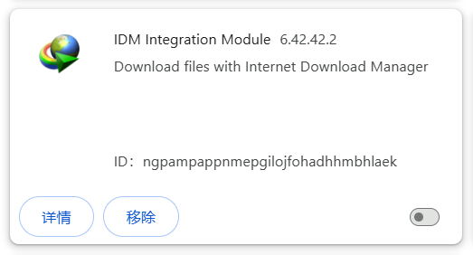
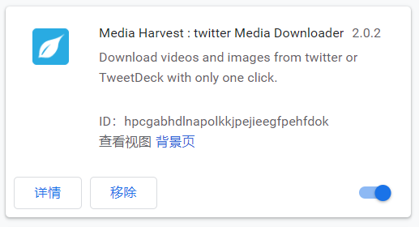
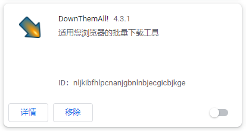
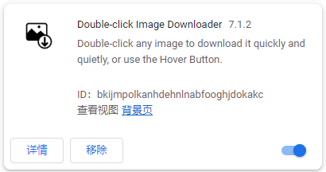
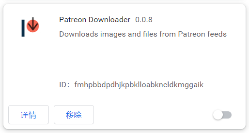

# After Installation

## Log in to Your Pixiv Account

You need to be logged in to Pixiv to use the downloader properly.

Without logging in to a Pixiv account, most of the downloader's features will not be available.

## Check Your Browser's Download Settings

Open the download settings:

In your browser's download settings, you can confirm:

1. The file storage location. Files downloaded by the downloader will be saved in this directory.

2. **Turn off** "Ask where to save each file before downloading." Otherwise, a "Save As" dialog box will pop up for every file downloaded.

!> If you have already turned off the second option but still see a "Save As" dialog during downloads, it may be due to duplicate file names. Please refer to the "Download triggers Save As dialog" entry on the "Common Issues" page.

## Issues with Abnormal File Names After Download

This extension allows you to set custom file names for downloaded files, but some **download management** extensions may modify file names, resulting in abnormal file names.

There are many such extensions (even if they are not running on Pixiv or Fanbox, they can cause this issue). Recent feedback indicates that extensions like Patreon Downloader and IDM Integration Module often cause this problem.

If the downloaded file names are a string of random letters and numbers or do not follow the naming rules set in the downloader, this issue has occurred.

### Solutions

If you encounter this issue, consider the following solutions:

**Solution 1:**

You can create a new local browser profile to use this downloader. Click the profile icon in the top-right corner of your browser to create a new profile or configuration (no need to log in to the browser vendor's account). Each browser profile's settings are independent, so you can install only this extension in the new profile's window. When you need to download files from Pixiv, use this profile to avoid interference from other extensions.

**Solution 2:**

You can identify the extension causing the issue and temporarily disable it while using this downloader. These extensions typically have download management features, such as IDM Integration Module, Chrono Download Manager, Image Downloader, etc. If you're unsure which extension is causing the issue, you can disable all extensions first, then enable them one by one and test the downloader to identify the problematic extension.

### Technical Details

Certain extensions listen to the `chrome.downloads.onDeterminingFilename` event, which can easily cause the preset file name to be lost.

Suppose this downloader sets a custom file name for a file: `user/image.jpg`.

If another extension listens to the `onDeterminingFilename` event, the browser will ask for its suggestion on the file name (giving it a chance to modify it). The issue is that the file name passed by the browser at this point is the default one (i.e., the last segment of the URL path) rather than the file name set by the downloader.

As a result, the file name set by the downloader is lost, and the file name becomes the last segment of the URL path.

### Known Conflicting Extensions

Below is a list of extensions known to cause conflicts:

- IDM Integration Module

- Chrono Download Manager

- BitComet Extension

- Free Download Manager

- Media Harvest: Twitter Multimedia Downloader

- Image Downloader

- DownThemAll!

- Double-click Image Downloader

- Patreon Downloader

## Do Not Block Pixiv Images

In Chrome, users can set the browser to block images on webpages, preventing Chrome from downloading and displaying images on those pages.

Please do not block Pixiv images, as this will prevent the program from downloading images.