# After Installation

## Check Browser Download Settings

Open the browser's download settings:

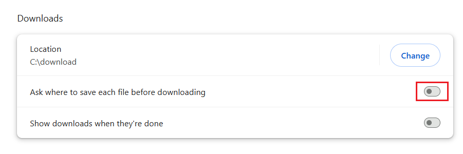

In the browser's download settings, you can confirm:

1. The file save location. Files downloaded by the downloader will be saved in this directory.
2. **Disable** "Ask where to save each file before downloading," otherwise a "Save As" dialog will appear for each file downloaded.

!> If you have disabled the second option but still see a "Save As" dialog during downloads, it may be due to duplicate file names. Refer to the ["Save As" Dialog Pops Up During Downloading](/en/FAQ?id=quotsave-asquot-dialog-pops-up-during-downloading) section on the "Frequently Asked Questions" page.

## How to Use

This extension can only be used on pixiv.net web pages. It will not function on other websites.

After installing the extension, open a Pixiv web page, and you should see a blue button on the right:

Click the button to open the settings panel and start crawling and downloading.

## Log in to Your Pixiv Account

You need to log in to your pixiv.net account, as many pages and works are not accessible without logging in, preventing the downloader from functioning.

## Handling Large-Scale Downloads

The downloader typically crawls work data first, then downloads files. Both steps involve requesting data from Pixiv's servers. Too many requests or overly frequent requests may trigger a warning.

### Pixiv's approach

If you frequently download large numbers of files, such as thousands or tens of thousands of works daily, you may receive a warning from Pixiv. The first time you trigger a warning, you will receive an in-site message, which may look like this:

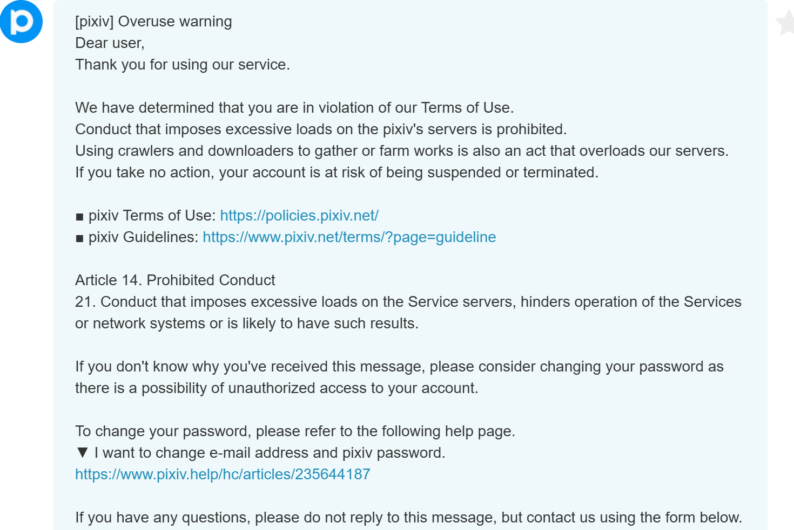

The downloader checks every 100 files downloaded to see if you have received such a message. If detected, it will pause downloading to prevent the situation from worsening.

?> If you receive such an in-site message, you can send me a screenshot and its content. This helps improve the downloader's ability to detect such messages accurately. Refer to the [Contact Me](/en/Contact-Me) page to send me a message via Discord or GitHub.

If you trigger a warning a second time, your account may be banned. Your Pixiv account will be deleted, preventing login, and other users will be unable to view your profile, bookmarks, or other data.

?> Based on current experience, downloading a few hundred works daily typically does not trigger a warning.

!> I am not responsible if your account is banned.

### Best Practices

Specific instructions: [Best Practices](/en/Using-Secondary-Account-for-Downloading?id=best-practices).

## Issues with Abnormal File Names After Download

This extension allows custom file naming for downloaded files, but some extensions with file-saving functions may cause abnormal file names.

Many such extensions exist (even if they don't run on Pixiv or Fanbox, they may still cause issues). Recent feedback indicates that extensions like Patreon Downloader and IDM Integration Module often cause this problem.

If the downloaded file names are random strings of letters and numbers or do not follow the naming rules set in the downloader, this issue has occurred.

### Solutions

If you encounter this issue, consider the following solutions:

**Solution 1:**

Create a new local browser user profile to use this downloader. Click the profile icon in the top-right corner of the browser to create a new profile or configuration (no need to log in to the browser vendor's account). Each browser user profile has independent settings, so you can install only this extension in the new profile's window. When downloading from Pixiv, use this profile to avoid interference from other extensions.

?> My Pixiv downloader and Fanbox downloader do not cause file name issues. If needed, you can install both extensions in the new profile's window.

**Solution 2:**

Identify the extension causing the issue and **temporarily disable it** when using this downloader.

These extensions typically have file download or download management functions, such as IDM Integration Module, Chrono Download Manager, or Image Downloader. If unsure which extension is causing the issue, disable all extensions, then enable them one by one and test the downloader to identify the problematic extension.

I have listed some known extensions that can cause this issue in the [Known Conflicting Extensions](/en/AfterInstallation?id=known-conflicting-extensions) below.

------------

To disable an extension, do so in the browser's extension management page. For example, to disable IDM Integration Module, click the button in its bottom-right corner to stop it from running:

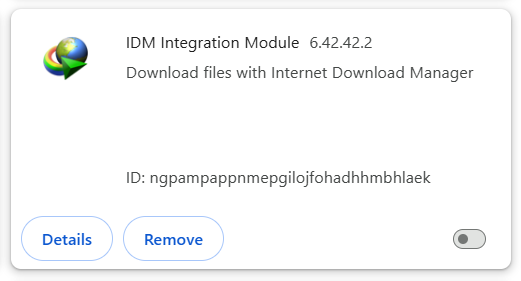

The following methods are **incorrect** and will not help resolve the issue:
- Excluding pixiv.net in IDM's program settings.
- Clicking the IDM Integration Module icon on pixiv.net to disable it for that site:

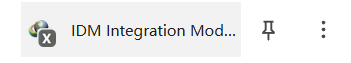

Using the above methods, IDM Integration Module will still be running, so the issue persists.

### Technical Details

Certain extensions listen to the `chrome.downloads.onDeterminingFilename` event, which can easily cause the preset file name to be lost.

Suppose the downloader sets a custom file name for a file: `user/image.jpg`.

If another extension listens to the `onDeterminingFilename` event, the browser will ask for its suggested file name (giving it a chance to modify the name). The issue is that the file name passed by the browser at this point is the default (the last segment of the URL), not the downloader's set file name.

As a result, the downloader's file name is lost, and the file name becomes the last segment of the URL.

?> This downloader does not use this event, so it does not affect the file names of other extensions.

### Known Conflicting Extensions

Below are some known extensions that cause conflicts:

- IDM Integration Module

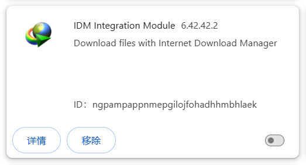

- Chrono Download Manager

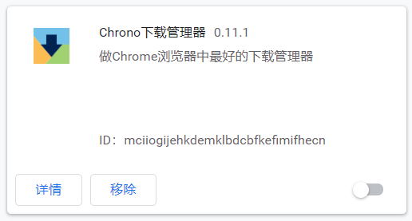

- Video DownloadHelper

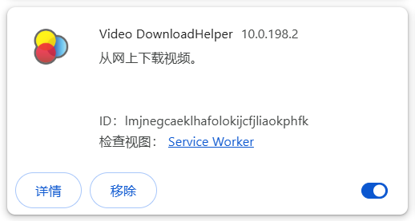

- Image downloader - Imageye

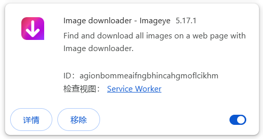

- BitComet Extension

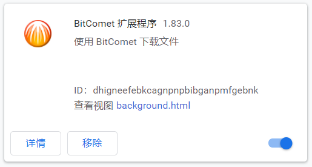

- Free Download Manager

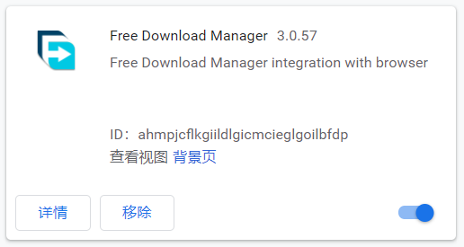

- Media Harvest: Twitter Multimedia Downloader

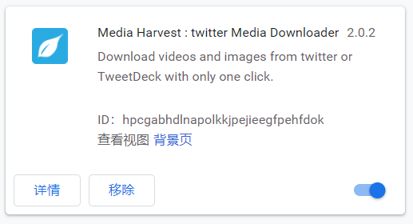

- Image Downloader

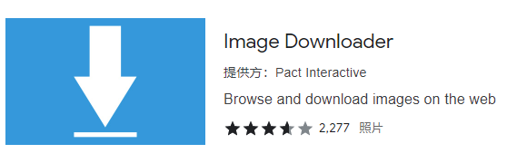

- DownThemAll!

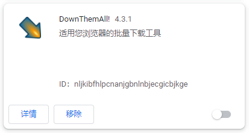

- Double-click Image Downloader

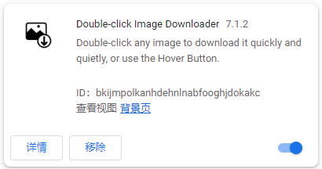

- Patreon Downloader

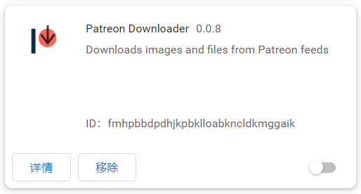

## Do Not Block Pixiv Images

In Chrome, users can block images on web pages, preventing Chrome from downloading and displaying them.

When Chrome blocks Pixiv images, an intercept icon appears on the right side of the address bar, for example:

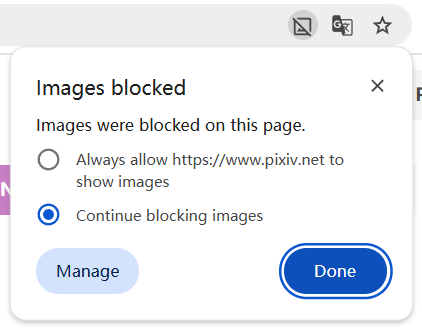

Do not block Pixiv images, as this will prevent the downloader from downloading images.