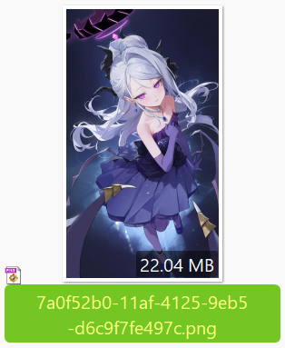
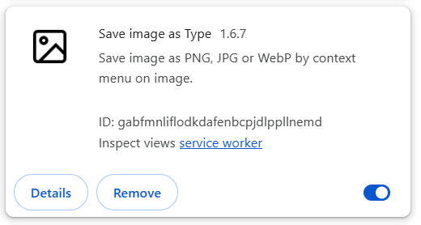

# After Installation

## Check Browser Download Settings

Open the browser's download settings:

In the browser's download settings, you can confirm:

1. The file save location. Files downloaded by the downloader will be saved in this directory.
2. **Disable** "Ask where to save each file before downloading," otherwise a "Save As" dialog will appear for each file downloaded.

!> If you have disabled the second option but still see a "Save As" dialog during downloads, it may be due to duplicate file names. Refer to the ["Save As" Dialog Pops Up During Downloading](/en/FAQ?id=quotsave-asquot-dialog-pops-up-during-downloading) section on the "Frequently Asked Questions" page.

## How to Use

This extension can only be used on pixiv.net web pages. It will not function on other websites.

After installing the extension, open a Pixiv web page, and you should see a blue button on the right:

Click the button to open the settings panel and start crawling and downloading.

## Log in to Your Pixiv Account

You need to log in to your pixiv.net account, as many pages and works are not accessible without logging in, preventing the downloader from functioning.

## Large Downloads May Lead to Your Account Being Banned

The downloader usually first crawls work data, then downloads files; both steps request data from Pixiv's servers. If the number of requests is too many, or the frequency is too dense, it may cause Pixiv to issue a warning to your account. If your account is warned multiple times, it may be banned.

?> Based on current experience, downloading a few hundred works per day usually won't trigger a warning.

### Pixiv's Handling Method

If you frequently download large amounts of files, such as thousands or tens of thousands of works per day, you may be warned by Pixiv. When the first warning is triggered, you will receive an in-site message, which may look like this:

During large downloads, the downloader checks every 100 files saved whether you have received such an in-site message. If you have received such an in-site message within the last 1 hour, the downloader will pause the download to avoid making the situation worse.

If your account receives a second warning, there may be different situations:
1. If the first warning was several years ago, the second warning may just be a reminder with no actual effect. For example, if you were warned once in 2022 and warned a second time in 2025, the account functions may not be restricted at all. But if the time between the two warnings is relatively short (I don't know the specific threshold), your account may face the following two situations:
2. Milder disposition: Your account is frozen, you cannot follow users or bookmark works, but other functions are normal (you can browse, crawl, and download normally). If you encounter this, you can try emailing customer service to request unban, and it may be restored.
3. Severe disposition: Your account will be deleted, you cannot log in, and cannot request unban. Since your account no longer exists, other users also cannot view your profile, bookmarks, etc.

In the past few years, it was often the milder disposition, but recently accounts are often deleted, indicating that Pixiv has strengthened its handling of violations. This will lead to account ban.

!> If your account is banned, I am not responsible for it. However, the downloader also has some settings to slow down the crawling and download speed, which can reduce the possibility of being banned.

### How to Reduce Risk

Many people often ask me: How many works can I download per day without getting a warning? In fact, there is no fixed value, because the conditions for triggering a warning depend not only on the number of works, but also on an important factor: the request frequency.

If the request frequency is very high, downloading a few hundred works may trigger a warning. Conversely, if the request frequency is lowered, downloading a few thousand works may not trigger a warning.

When you need to crawl and download more than a few thousand works, there are some methods to reduce risk:

**Slow Down:**

The downloader has settings to reduce the likelihood of warnings:
- By default, the downloader [Slow down crawl](/en/Settings-More-Crawl?id=slow-down-crawl). When crawling many works, it sends requests at intervals. This feature is enabled by default.
- When downloading many files, you can set the [Download interval](/en/Settings-More-Download?id=download-interval) to reduce download frequency.

The above two settings both allow custom interval times. If you only crawl and download a few hundred works per day, the default interval time is usually safe.

The more files you need to crawl and download, the larger the interval time you should set. In extreme cases, you can consider setting an interval of about 4 seconds (of course, this will increase the time to complete the task).

**Batch Downloading:**

If you want to download all your bookmarks, which may span hundreds of pages or more, you can split the task into multiple sessions, crawling 50 or 100 pages at a time.

See details: [Tip: Split Tasks](/en/Settings-Crawl?id=tip-split-tasks).

**Using a Secondary Account:**

If you frequently download large amounts of files, the above settings cannot completely guarantee safety. You can use an alt account to download. The main account is only used for downloading small amounts of files during daily browsing, while the alt account is specifically used for large downloads, and needs to be used in conjunction with the methods above.

Detailed instructions: [Using Secondary Account for Downloading](/en/Using-Secondary-Account-for-Downloading).

## Issues with Abnormal File Names After Download

This extension allows custom file naming for downloaded files, but some extensions with file-saving functions may cause abnormal file names.

Many such extensions exist (even if they don't run on Pixiv or Fanbox, they may still cause issues). Recent feedback indicates that extensions like Patreon Downloader and IDM Integration Module often cause this problem.

If the downloaded filename is a string of random letters and numbers, or does not use the naming rule set in the downloader, it indicates that this issue has occurred. For example:

### Solutions

If you encounter this issue, consider the following solutions:

**Solution 1:**

Create a new local browser user profile to use this downloader. Click the profile icon in the top-right corner of the browser to create a new profile or configuration (no need to log in to the browser vendor's account). Each browser user profile has independent settings, so you can install only this extension in the new profile's window. When downloading from Pixiv, use this profile to avoid interference from other extensions.

?> My Pixiv downloader and Fanbox downloader do not cause file name issues. If needed, you can install both extensions in the new profile's window.

**Solution 2:**

Identify the extension causing the issue and **temporarily disable it** when using this downloader.

These extensions typically have file download or download management functions, such as IDM Integration Module, Chrono Download Manager, or Image Downloader. If unsure which extension is causing the issue, disable all extensions, then enable them one by one and test the downloader to identify the problematic extension.

I have listed some known extensions that can cause this issue in the [Known Conflicting Extensions](/en/AfterInstallation?id=known-conflicting-extensions) below.

------------

To disable an extension, do so in the browser's extension management page. For example, to disable IDM Integration Module, click the button in its bottom-right corner to stop it from running:

The following methods are **incorrect** and will not help resolve the issue:
- Excluding pixiv.net in IDM's program settings.
- Clicking the IDM Integration Module icon on pixiv.net to disable it for that site:

Using the above methods, IDM Integration Module will still be running, so the issue persists.

### Technical Details

Certain extensions listen to the `chrome.downloads.onDeterminingFilename` event, which can easily cause the preset file name to be lost.

Suppose the downloader sets a custom file name for a file: `user/image.jpg`.

If another extension listens to the `onDeterminingFilename` event, the browser will ask for its suggested file name (giving it a chance to modify the name). The issue is that the file name passed by the browser at this point is the default (the last segment of the URL), not the downloader's set file name.

As a result, the downloader's file name is lost, and the file name becomes the last segment of the URL.

?> This downloader does not use this event, so it does not affect the file names of other extensions.

### Known Conflicting Extensions

Below are some known extensions that cause conflicts:

- IDM Integration Module

- Chrono Download Manager

- [Save image as Type](https://chromewebstore.google.com/detail/save-image-as-type/gabfmnliflodkdafenbcpjdlppllnemd)

- [Video DownloadHelper](https://chromewebstore.google.com/detail/video-downloadhelper/lmjnegcaeklhafolokijcfjliaokphfk)

- [Image downloader - Imageye](https://chromewebstore.google.com/detail/image-downloader-imageye/agionbommeaifngbhincahgmoflcikhm)

- [BitComet Extension](https://chromewebstore.google.com/detail/bitcomet-download-extensi/dhigneefebkcagnpnpbibganpmfgebnk)

- [Free Download Manager](https://chromewebstore.google.com/detail/free-download-manager/ahmpjcflkgiildlgicmcieglgoilbfdp)

- [Media Harvest: Twitter Multimedia Downloader](https://chromewebstore.google.com/detail/media-harvest-x%EF%BC%88twitter%EF%BC%89%E5%A4%9A/hpcgabhdlnapolkkjpejieegfpehfdok)

- [Image Downloader](https://chromewebstore.google.com/detail/image-downloader/cnpniohnfphhjihaiiggeabnkjhpaldj)

- [DownThemAll!](https://chromewebstore.google.com/detail/downthemall/nljkibfhlpcnanjgbnlnbjecgicbjkge)

- Double-click Image Downloader

- Patreon Downloader

## Do Not Block Pixiv Images

In Chrome, users can block images on web pages, preventing Chrome from downloading and displaying them.

When Chrome blocks Pixiv images, an intercept icon appears on the right side of the address bar, for example:

Do not block Pixiv images, as this will prevent the downloader from downloading images.