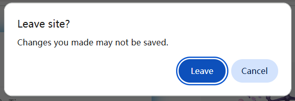
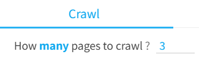

# Crawl Buttons

The "Crawl" tab of the downloader contains several buttons primarily used to initiate crawling.

?> Different page types may have different buttons.

## Common Buttons

Some buttons appear across multiple page types.

### Start crawl

<button type="button" class="xzbtns hasRippleAnimation" data-xztitle="_Default Download Multiple Pages" style="background-color: rgb(14, 168, 239);" title="Start crawling; if there are multiple pages, it will download all by default."><span data-xztext="_Start Crawling">Start crawl</span><span class="ripple"></span></button>

Starts crawling works based on the user-defined crawl conditions (filters).

Depending on the page type, the downloader may display settings for [How Many Works to Crawl](/en/Settings-Crawl?id=how-many-works-to-crawl) or [How Many Pages to Crawl](/en/Settings-Crawl?id=how-many-pages-to-crawl) in the "Crawl" tab. Click the links for detailed explanations.

### Stop Crawling

<button type="button" class="xzbtns hasRippleAnimation" style="background-color: rgb(243, 57, 57); display: flex;"><span data-xztext="_Stop Crawling">Stop Crawling</span><span class="ripple"></span></button>

After clicking the `Start crawl` button, the downloader displays the `Stop Crawling` button, which you can click to stop the crawling process.

When stopping, if the downloader has already crawled some works, it will retain them and prepare to start downloading.

### Manually select

<button type="button" class="xzbtns hasRippleAnimation" style="background-color: rgb(20, 173, 39);" title="Alt + S"><span data-xztext="_Manually Select Works">Manually select</span><span class="ripple"></span></button>

Use this button to manually select any works on the page and crawl them.

?> The shortcut for this function is `Alt` + `S`. Press it to enter/exit manual selection mode.

Clicking this button enters selection mode. A blue circle with crosshair guidelines appears under the mouse cursor, as shown below:


You can then click the left mouse button on any work to select it. The downloader adds a checkmark to indicate selection, as shown below:


You can later crawl the selected works.

?> If the current page has pagination (e.g., on a user profile), you can select works across multiple pages. For example, select 2 works on page 1, then go to page 2 and select 3 works, resulting in 5 selected works that can be crawled at once.

?> When in manual selection mode, clicking a work does not open its link to prevent page content changes. To view a work's page, use one of these methods: 1. Hold `Ctrl` and click the work. 2. Right-click the work's thumbnail and select "Open link in new tab." 3. Exit manual selection mode (shortcut: `Esc`).

---------

After clicking the `Manually select` button, the downloader displays these three buttons:

<p class="btnsWrap"><button type="button" class="xzbtns hasRippleAnimation" style="background-color: rgb(20, 173, 39);" title="Alt + S"><span data-xztext="_Pause Selection">Pause select</span><span class="ripple"></span></button><button type="button" class="xzbtns hasRippleAnimation" style="background-color: rgb(243, 57, 57);"><span data-xztext="_Clear Selected Works">Clear selected works</span><span class="ripple"></span></button><button type="button" class="xzbtns hasRippleAnimation" style="background-color: rgb(14, 168, 239);"><span data-xztext="_Crawl Selected Works">crawl selected works</span><span class="ripple"></span></button></p>

- `Pause select`: Exits manual selection mode while retaining selected works. After clicking, it changes to a `Continue select` button, allowing you to resume selecting works. You can also use the shortcut `Alt` + `S`, which has the same effect.
- `Clear selected works`: Exits manual selection mode and clears all selected works. Click this if you no longer need the previously selected works.
- `crawl selected works`: Crawls the selected works. The downloader retains the selected works.

After selecting the works you want to crawl, click the `crawl selected works` button to crawl and download them.

-----------

**Tips:**

- If needed, you can click `Pause select` and `Continue select` to make multiple selections. The downloader does not clear previously selected works, so selections accumulate.
- Press the `Esc` key to exit manual selection mode.
- If works are selected, the downloader displays the number of selected works on the `crawl selected works` button.
- The downloader's filter conditions also apply to manually selected works, so some works may be excluded during crawling.
- The downloader does not automatically clear selected works unless you click the `Clear selected works` button.

-------

When navigating to other pages, the selected works list **may** be lost, depending on whether the current page's content is discarded.

For example, navigating from a user profile to a work page without refreshing retains the selected works.

However, navigating to certain pages (e.g., rankings) or refreshing the page discards the current page content. In such cases, the downloader prompts the browser to display a confirmation dialog, as shown below:



If you choose to leave the page, the selected works are lost. If you cancel the navigation, the selected works are retained.

In short, you don't need to worry about accidentally losing selected works, as you'll have the opportunity to choose.

### Timed crawl

<button type="button" class="xzbtns hasRippleAnimation" data-xztitle="_Scheduled Crawling Info" style="background-color: rgb(14, 168, 239);" title="Automatically start crawling and downloading at regular intervals."><span data-xztext="_Scheduled Crawling">Timed crawl</span><span class="ripple"></span></button>

On some pages, new works may appear over time, such as:

- User profile
- New works by followed users
- Everyone's new works
- Your bookmark page
- Search page

On these pages, if you want to crawl new works periodically and download them automatically, you can use the timed crawl function.

**Example:**

To schedule crawling of new works by followed users, follow these steps:

1. Open the [Works by Followed Users](https://www.pixiv.net/bookmark_new_illust.php) page.

2. Set the number of pages to crawl each time:



This page count should consider the "interval time." For example, if you want to crawl every 120 minutes and the page's new works in 120 minutes do not exceed 3 pages, set it to `3`.

3. Click the `Timed crawl` button, and the downloader displays an input box to set the interval time:

<div class="XZInputWrap" id="input1757240375255" style="width: 684px; opacity: 1;"><p class="XZInputInstruction">Interval time for timed crawl (minutes)</p><div class="XZInputContainer"><input class="XZInput" placeholder="" type="text" value="120" style="flex-basis: 500px;"><button class="XZInputButton hasRippleAnimation">
      <span>Submit</span>
      <span class="ripple"></span>
    </button><button class="XZInputButton cancel hasRippleAnimation">
      <span>Cancel</span>
      <span class="ripple"></span>
    </button></div></div>

The default value is 120 minutes, which you can adjust as needed.

Click the `Submit` button, and the downloader starts the timed crawl task, displaying a prompt in the log:

<span class="log" style="color: rgb(0, 189, 23);">Timed crawl started, interval: 120 minutes.<br>To modify the interval, adjust the setting in the "More" tab: Timed crawl interval.<br></span>

**Tips:**

- The downloader does not start crawling immediately; it waits until the set interval before the first crawl.
- It's recommended to enable the [Don't download duplicate files](/en/Settings-More-Download?id=don39t-download-duplicate-files) function in the "More" tab to avoid unnecessary duplicate downloads.
- The interval should not be too short, as crawling and downloading take time.

-----------

After starting timed crawl, the downloader displays a `Cancel timed crawl` button:

<button type="button" class="xzbtns hasRippleAnimation" style="background-color: rgb(228, 157, 0); display: flex;"><span data-xztext="_Cancel Timed crawl">Cancel timed crawl</span><span class="ripple"></span></button>

To cancel timed crawl, click this button or close the page running the timed crawl task.

-----------

When using timed crawl, note the following:

1. Do not close the current tab. You can switch to other tabs and continue using the browser.
2. Do not change the URL of the current tab. For example, if you're on a user profile performing timed crawl and click a work to enter its page, the task will be canceled.
3. Enable the [Don't download duplicate files](/en/Settings-More-Download?id=don39t-download-duplicate-files) function to avoid downloading duplicates.
4. If the extension updates automatically, the page may not download files correctly (refresh the page to restore functionality). For long-term timed crawl, consider installing the extension offline to avoid interruptions from updates. See the [Offline Installation](/en/OfflineInstallation) page.
5. Set a lower page count to avoid crawling too many duplicate works. For example, on a search page, you can crawl up to 1000 pages, but it's unnecessary to crawl all of them. Setting 10 pages or fewer is fine if new content within the interval doesn't exceed 10 pages.
6. On search pages, crawled works are not displayed on the page (i.e., no preview of search results).
7. Timed crawl always starts downloading automatically.
8. When clicking the `Timed crawl` button, the downloader prompts for the interval time, which syncs with the [Timed crawl Interval](/en/Settings-More-Crawl?id=the-interval-time-of-timed-crawl) setting.
9. The downloader uses the interval set at the task's start. Changing the interval later does not affect the ongoing task. To apply a new interval, click `Cancel timed crawl`, then click `Timed crawl` to start a new task with the updated interval.

## Homepage

Pixiv's homepage has complex content, so I didn't add a `Start crawl` button, meaning you cannot download all works on the homepage with one click.

On the homepage, I added the common `Manually select` button, along with three crawling buttons:

### Type ID to crawl

<button type="button" class="xzbtns hasRippleAnimation" style="background-color: rgb(14, 168, 239);"><span data-xztext="_Crawl by Entering IDs">Type ID to crawl</span><span class="ripple"></span></button>

Clicking this button displays an input box where you can enter or paste a list of work IDs:

<div class="XZInputWrap" id="input1757090876229" style="width: 584px; opacity: 1;"><p class="XZInputInstruction">Enter work IDs. For multiple IDs, separate them with newlines (one ID per line).<br><br>Since this tab displays images, the entered IDs will be treated as image work IDs.</p><div class="XZInputContainer"><textarea class="XZInput" placeholder="10000
10001
10002
10003" rows="10" style="flex-basis: 400px;"></textarea><button class="XZInputButton hasRippleAnimation">
      <span>Submit</span>
      <span class="ripple"></span>
    </button><button class="XZInputButton cancel hasRippleAnimation">
      <span>Cancel</span>
      <span class="ripple"></span>
    </button></div></div>

For multiple IDs, separate them with newlines (one ID per line).

Click the "Submit" button, and the downloader will crawl these works.

?> You cannot specify the work type; the downloader determines it based on the current page. On the novel homepage [https://www.pixiv.net/novel/](https://www.pixiv.net/novel), entered IDs are treated as novel work IDs. On other homepages, they are treated as image work IDs.

### Crawl ID range

<button type="button" class="xzbtns hasRippleAnimation" style="background-color: rgb(14, 168, 239);"><span data-xztext="_Crawl ID Range">Crawl ID range</span><span class="ripple"></span></button>

Clicking this button displays two input boxes sequentially. You can set an ID range for the downloader to crawl, e.g., `10000` to `20000`.

First, enter the starting ID:

<div class="XZInputWrap" id="input1757091219116" style="width: 584px; opacity: 1;"><p class="XZInputInstruction">You can set a work ID range to crawl all works within it (including start and end IDs).<br>Note: If a single task produces too many crawl results, it may cause the page to crash.<br>If you need to crawl many IDs, consider splitting them into multiple tasks. I recommend crawling no more than 100,000 IDs per batch.<br><br>Since this tab displays images, entered IDs will be treated as image work IDs.<br><br>Enter the starting ID: </p><div class="XZInputContainer"><input class="XZInput" placeholder="10000" type="text" value="" style="flex-basis: 400px;"><button class="XZInputButton hasRippleAnimation">
      <span>Submit</span>
      <span class="ripple"></span>
    </button><button class="XZInputButton cancel hasRippleAnimation">
      <span>Cancel</span>
      <span class="ripple"></span>
    </button></div></div>

Then, enter the ending ID:

<div class="XZInputWrap" id="input1757091349171" style="width: 584px; opacity: 1;"><p class="XZInputInstruction">Enter the ending ID: </p><div class="XZInputContainer"><input class="XZInput" placeholder="20000" type="text" value="" style="flex-basis: 400px;"><button class="XZInputButton hasRippleAnimation">
      <span>Submit</span>
      <span class="ripple"></span>
    </button><button class="XZInputButton cancel hasRippleAnimation">
      <span>Cancel</span>
      <span class="ripple"></span>
    </button></div></div>

Click the "Submit" button, and the downloader will crawl these works (including start and end IDs). You can check the crawling progress in the top log.

?> You cannot specify the work type; the downloader determines it based on the current page. On the novel homepage [https://www.pixiv.net/novel/](https://www.pixiv.net/novel/), entered IDs are treated as novel work IDs. On other homepages, they are treated as image work IDs.

**Tip for Large-Scale Crawling:**

As the number of crawled works increases, memory usage grows, and browser network request handling slows down. Avoid crawling too many works in one task.

If you need to crawl many works, split them into multiple tasks and crawl sequentially.

### Import ID list

<button type="button" class="xzbtns hasRippleAnimation" style="background-color: rgb(20, 173, 39);"><span data-xztext="_Import ID List">Import ID list</span><span class="ripple"></span></button>

Clicking this button allows you to select a JSON file containing a list of work IDs for the downloader to crawl.

The JSON file format is as follows:

```json
[
  { "id": "130827095", "type": "illusts" },
  { "id": "130816057", "type": "illusts" },
  { "id": "130811075", "type": "novel" },
  { "id": "130808918", "type": "novel" }
]
```

`id` is the work ID, and `type` is the work type, which can be `"illusts"` or `"novel"`.

?> This JSON file can be generated by the [After obtaining the work ID list, export the ID list and stop the task](/en/Settings-More-Crawl?id=after-obtaining-the-work-id-list-export-the-id-list-and-stop-the-task) function. These two functions are designed to work together. However, you can also create your own ID list as long as the format meets the requirements.

## Work Page

When on a work page (e.g., [99904686](https://www.pixiv.net/artworks/99904686 ':target=_blank')), in addition to the common `Manually select` button, there are three crawling buttons:

### Crawl the new works from this page

<button type="button" class="xzbtns hasRippleAnimation" style="background-color: rgb(14, 168, 239);"><span data-xztext="_Crawl the new works from this page">Crawl the new works from this page</span><span class="ripple"></span></button>

Clicking this button makes the downloader crawl the current work and works newer than it.

You can set how many works to crawl (including the current work) in the first crawl condition, `How Many Works to Crawl`. The default value `-1` crawls the current work and all newer works.

--------

"Newer works" are works with a posting time later than the current work. On a work page, they are located to the left of the current work.

Diagram:


Newer works are on the left, older works on the right.

### Crawl the old works from this page

<button type="button" class="xzbtns hasRippleAnimation" style="background-color: rgb(14, 168, 239);"><span data-xztext="_Crawl the old works from this page">Crawl the old works from this page</span><span class="ripple"></span></button>

Clicking this button makes the downloader crawl the current work and works older than it.

You can set how many works to crawl (including the current work) in the first crawl condition, `How Many Works to Crawl`. The default value `-1` crawls the current work and all older works.

"Older works" are works with a posting time earlier than the current work. On a work page, they are located to the right of the current work.

### Crawl the related works

<button type="button" class="xzbtns hasRippleAnimation" style="background-color: rgb(14, 168, 239);"><span data-xztext="_Crawl the related works">Crawl the related works</span><span class="ripple"></span></button>

Related works refer to the "Related Works" section at the bottom of the work page.

You can set how many related works to crawl (including the current work) in the first crawl condition, `How Many Works to Crawl`. The default value `-1` crawls all related works.

?> Related works are limited to a maximum of 180.

### download recommended works

<button class="blueTextBtn">download recommended works</button>

After clicking the bookmark button, Pixiv displays recommended works, and the downloader shows this button, as illustrated below:


Click this button to crawl recommended works.

You can set how many recommended works to crawl in the first crawl condition, `How Many Works to Crawl`. The default value `-1` crawls all recommended works.

?> Recommended works are limited to a maximum of 20.

?> When downloading recommended works, the downloader always starts downloading automatically.

## Novel Series Page

A novel series page is a table of contents for a novel series, e.g., [https://www.pixiv.net/novel/series/1090654](https://www.pixiv.net/novel/series/1090654).

### Crawl series of novels

<button type="button" class="xzbtns hasRippleAnimation" style="background-color: rgb(14, 168, 239);"><span data-xztext="_Crawl series of novels">Crawl series of novels</span><span class="ripple"></span></button>

Crawls all novels in the series.

?> You cannot set the crawl quantity; the downloader always crawls all novels.

### Merge series of novels

<button type="button" class="xzbtns hasRippleAnimation" style="background-color: rgb(14, 168, 239);"><span data-xztext="_Merge series of novels">Merge series of novels</span><span class="ripple"></span></button>

Crawls all novels in the series and merges them into a single file.

**Tips:**

- Based on the [Novel Save Format](/en/Settings-More-Download?id=save-the-novel-as) setting, the downloader generates a TXT or EPUB file.
- The generated file name follows a **fixed format**: `Series Name + Username + Series ID + Tags of the First Novel`, and it is saved directly to the browser's download directory. This is because the file contains multiple novels, so it cannot use naming rules designed for single files. I plan to add a naming rule for this file in the future.
- When merging a novel series, the downloader panel does not display a progress bar, but you can check some progress information in the log.

## Search Page

A search page is for searching a specific tag, e.g., [バーチャルYouTuber](https://www.pixiv.net/tags/%E3%83%90%E3%83%BC%E3%83%81%E3%83%A3%E3%83%ABYouTuber/artworks?s_mode=s_tag).

**Reminders:**

- On search pages, you can use `{page_tag}` (the searched tag) as the folder name.
- By default, the downloader sorts works by bookmark count in descending order, prioritizing works with higher bookmark counts.
- You can set [How Many Pages to Crawl](/en/Settings-Crawl?id=how-many-pages-to-crawl). For non-Pixiv premium users, search pages are limited to 1000 pages; premium users can view up to 5000 pages. The downloader's crawl limit matches the pages you can view.

In addition to common crawling buttons, search pages have two additional crawling buttons:

### Crawl tag list

<button type="button" class="xzbtns hasRippleAnimation" style="background-color: rgb(14, 168, 239);"><span data-xztext="_Crawl tag list">Crawl tag list</span><span class="ripple"></span></button>

Clicking this button displays an input area at the top of the page. You can enter multiple tags, and the downloader will crawl works for each tag sequentially and download them automatically.

Example:


**Tips:**

- Separate multiple tags with newlines (one tag per line).
- The downloader crawls and downloads each tag's works sequentially (always starting downloads automatically). It moves to the next tag after finishing the current one.
- To save each tag's works to corresponding folders, use the `{page_tag}` tag to capture the current tag for folder creation. Refer to the naming rule: `{page_tag}/{id}`.
- Current crawl conditions apply when crawling each tag's works.
- Do not navigate to other pages while crawling a tag list (avoid clicking links on the page).
- During tag list crawling, the downloader does not display crawled works on the page, so you cannot preview results.
- The downloader saves the task state. If the page or browser is closed before completion, reopening the page allows the downloader to resume crawling the remaining tags.

### Buttons for Filtering Crawl Results

If you enable the [Preview filter results on search page](/en/Settings-More-Enhance?id=preview-filter-results-on-search-page) function, the downloader sorts crawled image works by bookmark count and displays them on the page. It does not start downloading automatically, allowing you to preview and filter crawl results before downloading.

Four buttons are available for filtering crawl results, usable only after crawling is complete:

<p class="btnsWrap"><button type="button" class="xzbtns hasRippleAnimation" data-xztitle="_Filter Results Info" style="background-color: rgb(20, 173, 39);" title="You can change settings and filter results again."><span data-xztext="_Filter Results">Screen in results</span><span class="ripple"></span></button><button type="button" class="xzbtns hasRippleAnimation" style="background-color: rgb(243, 57, 57);"><span data-xztext="_Clear Multi-Image Works">Remove multi-image works</span><span class="ripple"></span></button><button type="button" class="xzbtns hasRippleAnimation" style="background-color: rgb(243, 57, 57);"><span data-xztext="_Clear Ugoira Works">Remove ugoira works</span><span class="ripple"></span></button><button type="button" class="xzbtns hasRippleAnimation" data-xztitle="_Manually Delete Works Title" style="background-color: rgb(243, 57, 57);" title="Manually delete unwanted works before downloading"><span data-xztext="_Manually Delete Works">Manually delete the work</span><span class="ripple"></span></button></p>

- `Screen in results`: If needed, modify crawl conditions (filters) and click this button to recheck crawl results, removing works that don't meet the conditions. For example, you can increase the bookmark count requirement after crawling and filter again.
- `Remove multi-image works`: Removes all multi-image works from the crawl results.
- `Remove ugoira works`: Removes all Ugoira works from the crawl results.
- `Manually delete the work`: Manually remove unwanted works. Clicking this button enters manual deletion mode, showing a red circle under the mouse cursor. Click works to remove them from the crawl results. Click the button again to exit this mode.

?> These filter buttons only appear on illustration and manga search pages, not on novel search pages, as the downloader cannot preview novel crawl results.

## Rankings

Example page: [Daily Comprehensive Rankings](https://www.pixiv.net/ranking.php)

On ranking pages, in addition to the common `Manually select` button, there are two crawling buttons.

### Crawl this ranking's works

<button type="button" class="xzbtns hasRippleAnimation" data-xztitle="_Crawl This Ranking's Works Title" style="background-color: rgb(14, 168, 239);" title="Crawl all works in this ranking, including those not yet loaded."><span data-xztext="_Crawl This Ranking's Works">Crawl this ranking's works</span><span class="ripple"></span></button>

Crawls works in this ranking.

You can set "How Many Works to Crawl," and the downloader will crawl the specified number of works in ranking order. For example, setting `50` crawls works ranked 1 to 50.

?> You can use the `{rank}` tag in the naming rule to save the work's ranking.

### Crawl the debut works

<button type="button" class="xzbtns hasRippleAnimation" data-xztitle="_Crawl the debut works Title" style="background-color: rgb(14, 168, 239);" title="Only download debut works"><span data-xztext="_Crawl the debut works">Crawl the debut works</span><span class="ripple"></span></button>

Downloads only the debut works in this ranking.

?> Some works have a `Debut` mark. Depending on Pixiv's display language, it may appear as `首次登场`, `首次登場`, `初登場`, `Debut`, or `첫 등장`.

?> If a ranking page has no `Debut` mark, this button should not appear.

**Tip:**

If you downloaded all works from a ranking on one day, when downloading the next day's ranking, you only need to download `Debut` works, as these are the new works added to the ranking that day.

## Discovery Page

On the discovery page, Pixiv recommends works you might like.

[Go to Discovery Page](https://www.pixiv.net/discovery)

### Crawl current works

<button type="button" class="xzbtns hasRippleAnimation" data-xztitle="_Crawl Current Works Title" style="background-color: rgb(14, 168, 239);" title="Crawl all works in the current list"><span data-xztext="_Crawl Current Works">Crawl current works</span><span class="ripple"></span></button>

Downloads all works currently on the page.

?> Works on the discovery page are not fixed; refreshing the page shows different works. To ensure downloaded works match what you see, the program only downloads works currently visible on the page.

## Following Page

The following page displays users you follow, friends, and fans.

Example: [雪见仙尊's Following](https://www.pixiv.net/users/9460149/following)

?> You can view your own following page or others' by replacing the user ID in the URL.

### Start crawl

<button type="button" class="xzbtns hasRippleAnimation" data-xztitle="_Default Download Multiple Pages" style="background-color: rgb(14, 168, 239);" title="Start crawling; if there are multiple pages, it will download all by default."><span data-xztext="_Start Crawling">Start crawl</span><span class="ripple"></span></button>

Clicking this button makes the downloader crawl all works of users in the current subpage (followed users, friends, or fans).

?> The number of users crawled depends on the "How Many Pages to Crawl" setting. Each page has up to 24 users.

**Note:**

If you follow many users, their total works may be numerous.

For example, if each user has 50 works and you follow 4,730 users, the total number of works could be 236,500 or more.

You can set "How Many Pages to Crawl," e.g., crawl 10 pages at a time and split into multiple tasks. See [Tip: Split Tasks](/en/Settings-Crawl?id=tip-split-tasks).

### Export followed users list (CSV)

<button type="button" class="xzbtns hasRippleAnimation" style="background-color: rgb(20, 173, 39);"><span data-xztext="_Export Followed Users List CSV">Export followed users list (CSV)</span><span class="ripple"></span></button>

Clicking this button makes the downloader crawl user data from the current subpage (followed users, friends, or fans) and generate a CSV file, saved to the browser's download directory.

?> Although the button says "followed users," it can also export friends and fans lists.

?> The number of users crawled depends on the "How Many Pages to Crawl" setting. Each page has up to 24 users.

?> This function only crawls user lists, not works.

The CSV file contains the following data for each user:

- User ID
- Username
- User profile URL
- User description
- User avatar image URL

### Export followed users list (JSON)

<button type="button" class="xzbtns hasRippleAnimation" style="background-color: rgb(20, 173, 39);"><span data-xztext="_Export Followed Users List">Export followed users list (JSON)</span><span class="ripple"></span></button>

This button functions similarly to the previous one but exports a JSON file.

An important difference is that the exported JSON file can be used for importing (batch following users), while the CSV file cannot.

The JSON file contains only a list of user IDs, e.g.:

```json
[
  "107901226",
  "89923302",
  "108815429",
  "9013106"
]
```

### Follow users in batches (JSON)

<button type="button" class="xzbtns hasRippleAnimation" style="background-color: rgb(20, 173, 39);"><span data-xztext="_Batch Follow Users">Follow users in batches (JSON)</span><span class="ripple"></span></button>

Clicking this button allows you to select a previously exported followed users list (JSON file) to batch follow all users in it (automatically executed by the downloader).

Possible use cases:
- Export another user's followed users list and import it to your account to follow those users.
- Export your followed users list as a backup.
- Export your followed users list and import it to a secondary account to replicate the follow list. However, this is not recommended as it's unnecessary: a secondary account can download works from the primary account's followed users by accessing the corresponding URL.

!>**Risk Warning:** Pixiv has strict limits on batch following users. For example, following over 1,000 users per day may trigger a warning from Pixiv. A second warning may lead to account suspension or deletion. I am not responsible for any account bans.

To reduce risk, the downloader adds intervals during batch following and pauses automatically every 1,000 users. If this happens, close the following page and reopen it the next day to resume the batch follow task. The downloader skips already followed users and continues from the previous progress.

For safer importing of many users, split the task into batches, e.g., crawl 20 pages at a time (exporting 480 user IDs). If there are many users, this results in multiple JSON files. Import one file per day.

## Post-Bookmark Page

Example URL: [✿❀✿❀](https://www.pixiv.net/bookmark_detail.php?illust_id=63148723)

?> You may enter this page after bookmarking a work and editing its tags. This page was common years ago but is rarely used now.

### Crawl similar works

<button type="button" class="xzbtns hasRippleAnimation" data-xztitle="_Crawl Similar Images" style="background-color: rgb(14, 168, 239);" title="Crawl similar images"><span data-xztext="_Crawl Similar Images">Crawl similar works</span><span class="ripple"></span></button>

Click this button to crawl similar works.

You can set "How Many Works to Crawl," and the downloader will crawl only the specified number of works from the top.

?> Similar works refer to the work list at the bottom of this page, i.e., the "Works also bookmarked by users who bookmarked this work" section.

?> Similar works can include up to 1,000 works, unlike related works on a work page, which are limited to 180.

## pixivision

pixivision.net is a separate website. This program can download illustrations, manga, and cosplay pages from pixivision.

Example page: [Drawings of Hem Ties](https://www.pixivision.net/en/a/4537)

**Note:** On pixivision, only `{page_title}` and `{id}` tags are effective in naming rules. Before the first download, modify the naming rule, e.g., to `pixivision/{page_title}/{id}`.

?> Since pixivision.net is a separate website, many settings are unavailable, so the downloader hides many setting options on this site.

### Crawl images on this page

<button type="button" class="xzbtns hasRippleAnimation" style="background-color: rgb(14, 168, 239);"><span data-xztext="_Crawl Images on This Page">Crawl images on this page</span><span class="ripple"></span></button>

Downloads the main images on this page.