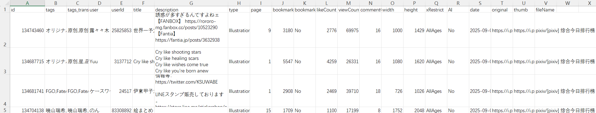
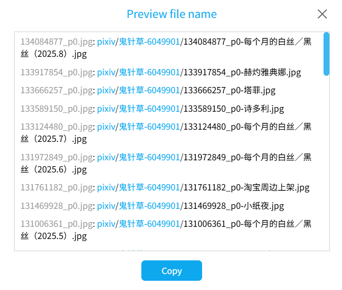
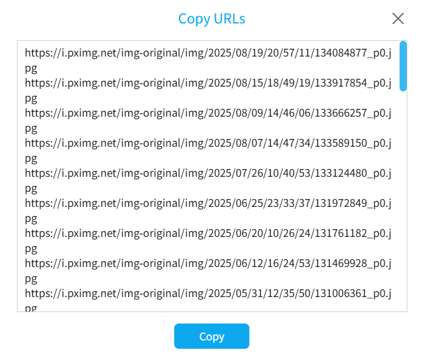

# Download Buttons

The "Download" tab of the downloader contains several buttons for processing crawl results and managing downloads, as shown below:


## Import results

<button type="button" class="xzbtns hasRippleAnimation" style="background-color: rgb(20, 173, 39);"><span data-xztext="_Import Crawl Results">Import results</span><span class="ripple"></span></button>

You can use this button to import crawl results, designed to work with the "Export results" button.

If you import crawl results, the downloader skips the crawling phase and directly downloads the files within.

?> This button is always displayed. Other buttons are not shown by default and appear only after the downloader completes crawling.

When importing crawl results, the downloader applies most filter conditions, removing results that do not meet the requirements. However, the following settings are not applied:
- How Many Works to Crawl/How Many Pages to Crawl
- Image Color: Color Images/Black-and-White Images
- File Size Limit

?> If the imported crawl results are numerous (e.g., hundreds of thousands), importing may take a long time. Please be patient. Upon successful import, the downloader displays an "Import Successful" message box.

## Export results

<button type="button" class="xzbtns hasRippleAnimation" style="background-color: rgb(20, 173, 39); display: flex;"><span data-xztext="_Export Crawl Results">Export results</span><span class="ripple"></span></button>

Clicking this button exports the current crawl results as a JSON file, saved to the browser's download directory.

?> The crawl results exported by this button can be imported using the "Import results" button to resume downloading. However, CSV files exported by the "Export CSV File" button cannot be used to resume downloading.

**Tips**:
- Crawl results are not the raw data of works. They are generated by the downloader based on the works' raw data, retaining only a portion of the data with different attribute names.
- Crawl results do not include progress information, so the downloader will re-download all files after importing. You can enable the [Don't download duplicate files](/en/Settings-More-Download?id=don39t-download-duplicate-files) function to skip duplicates and avoid redundant downloads.
- Data in crawl results is not updated. Some works may change after exporting (e.g., the author modifies content, tags, or bookmark counts increase). The downloader does not update this data.
- Crawl results do not include data for these naming rules: `{page_title}`, `{page_tag}`, `{task_date}`. After importing, the downloader generates these tags based on the current page's information, which may differ from the content at the time of export. If you do not use these naming rules, this is not an issue. If you do, it's best to export and import crawl results on the same URL.
- If there are many crawl results (e.g., hundreds of thousands), exporting may cause the page to lag temporarily, during which operations are unavailable.
- To make the downloader automatically export crawl results after crawling, use the [Automatically Export results](/en/Settings-More-Crawl?id=automatically-export-crawl-results) function.

**Possible Use Cases**:
- If you have a large number of crawl results, export them as a backup. If an issue occurs during downloading and recovery is not possible, you can import the crawl results to restart downloading.
- If you want to modify filter conditions after crawling (e.g., you didn't set a bookmark count filter initially but now want works with over 1,000 bookmarks), export the crawl results, adjust settings, and import the results. The downloader will remove non-compliant results. You can repeat this process as needed.
- Export crawl results to share with others, allowing them to download without crawling. You could also share downloaded files, but sharing crawl results is smaller in file size and doesn't require downloading the files.
- Use analysis tools to extract data from crawl results.

## Export CSV File

<button type="button" class="xzbtns hasRippleAnimation" style="background-color: rgb(20, 173, 39); display: flex;"><span data-xztext="_Export CSV">Export CSV file</span><span class="ripple"></span></button>

Clicking this button exports the current crawl results as a CSV file, saved to the browser's download directory.

The file content may look like this:



**Tips**:
- The purpose of exporting a CSV file is to allow users to view key data for each work and manipulate the data.
- A multi-image work may generate multiple files during download but is represented by a single record in the CSV file (using the first image's data) to avoid redundant data.
- The exported CSV file **cannot** be used to import crawl results. To import crawl results, use the JSON file exported by the "Export results" button.
- If you only have a CSV file and want to download the works, copy the work IDs from the `id` column and use the [Type ID to crawl](/en/Buttons-Crawl?id=type-id-to-crawl) function on the Pixiv homepage to re-crawl those works.
- To make the downloader automatically export crawl results after crawling, use the [Automatically export crawl results](/en/Settings-More-Crawl?id=automatically-export-crawl-results) function.

## Preview file name

<button type="button" class="xzbtns hasRippleAnimation" style="background-color: rgb(20, 173, 39); display: flex;"><span data-xztext="_Preview File Names">Preview file name</span><span class="ripple"></span></button>

Previews the file names for each crawl result. It looks like this:



The downloader generates a line of text for each crawl result in the format: `Default file name: File name generated by naming rule`, for example:

<p class="result"><span class="color999">134084877_p0.jpg</span>: <span class="colorFolder">pixiv</span>/<span class="colorFolder">鬼针草-6049901</span>/<span class="color000">134084877_p0-Monthly White Silk/Black Silk (2025.8).jpg</span></p>

?> Blue text in the file name indicates a folder.

You can click the "Copy" button, and the downloader will copy the content to the clipboard.

?> If there are too many crawl results, for performance reasons, the downloader saves the output to a TXT file in the browser's download directory.

This function is useful for previewing file names and creating renaming scripts.

If you previously downloaded files and want to rename them to match the downloader's naming rules, crawl them first and copy the content from "Preview file name". Modify the left side to the old file names and the right side to the new file names (possibly removing the folder part) to create renaming commands.

For example, on Windows, copy a preview result like this:

<p class="result"><span class="color999">134084877_p0.jpg</span>: <span class="colorFolder">pixiv</span>/<span class="colorFolder">鬼针草-6049901</span>/<span class="color000">134084877_p0-Monthly White Silk/Black Silk (2025.8).jpg</span></p>

Modify it to:

```
ren old_name.jpg 134084877_p0-Monthly White Silk/Black Silk (2025.8).jpg
```

Execute this command in the file's directory to rename the file.

?> For batch editing, use an editor with multi-line editing mode (e.g., VS Code) to improve efficiency.

## Start download

<button class="xzbtns startDownload hasRippleAnimation" type="button" style="background:#0ea8ef;"><span data-xztext="_Start Download">Start download</span><span class="ripple"></span></button>

After crawling is complete, click this button to start downloading.

?> The downloader enables the [Download starts automatically](/en/Settings-Download?id=download-starts-automatically) function by default, so you don't need to manually click this button.

## Pause download

<button class="xzbtns pauseDownload hasRippleAnimation" type="button" style="background:#e49d00;"><span data-xztext="_Pause Download">Pause download</span><span class="ripple"></span></button>

During downloading, click this button to pause the download.

Pausing saves the download progress, meaning:
- You can later click the "Start download" button to resume downloading.
- Refreshing or re-entering the page restores the download progress.

## Stop download

<button class="xzbtns stopDownload hasRippleAnimation" type="button" style="background:#f33939;"><span data-xztext="_Stop Download">Stop download</span><span class="ripple"></span></button>

Clicking this button stops the download.

This button works regardless of the download state, whether downloading has started or all files are downloaded.

**Note:** Stopping the download resets the download progress and clears the task's resumable data, meaning:
- Clicking "Start download" afterward restarts the download from the first file.
- Refreshing or re-entering the page loses the previous crawl results, preventing continuation of the download.

?> To temporarily pause and later resume downloading, use the "Pause download" button instead of "Stop download".

Use the "Stop download" button only when files are not fully downloaded, and you're sure you no longer need to download them.

## Copy URLs

<button class="xzbtns copyUrl hasRippleAnimation" type="button" style="background:#14ad27;"><span data-xztext="_Copy URL">Copy URLs</span><span class="ripple"></span></button>

Clicking this button outputs the URLs from the crawl results. It looks like this:



Click the "Copy" button to copy the content to the clipboard.

If needed, copy the URLs and use other download software to download them.

**Note:**

The downloader only outputs URLs for images in the crawl results. Other cases are explained below:
- For Ugoira works, the output URLs are for their original files (Zip files). Although the downloader can convert Ugoira to other formats (e.g., WebM video), converted files are dynamically generated and lack URLs for other software to download.
- Novels have no URLs, so the downloader does not output novel URLs. Pixiv's servers do not store TXT files for each novel. The downloader generates novel files dynamically based on content, so no URLs are available for other software.
- Some files are not in the crawl results, so their URLs are not output. This includes two cases: 1. Some functions generate additional files, e.g., saving work descriptions or metadata, created dynamically during downloading. 2. Novel cover images or embedded images are not independent crawl results but auxiliary data for novels.

?> If there are too many crawl results, for performance reasons, the downloader saves the output to a TXT file in the browser's download directory.