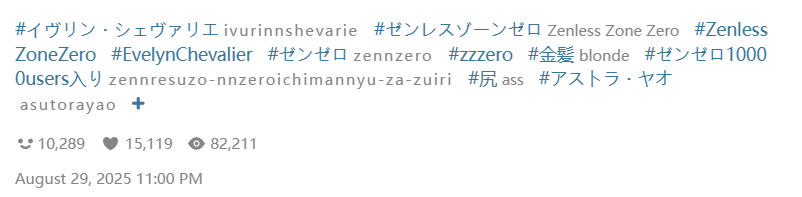
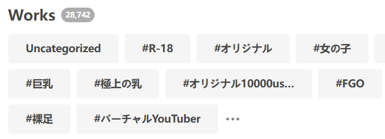
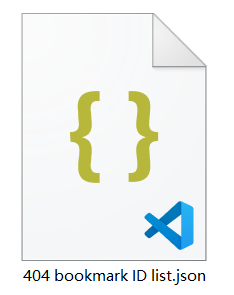

## Add tag to uncategorized work

<button id="addTagToUnmarkedWork" type="button" class="hasRippleAnimation settingsPanelActionBtn" data-btn-emphasis="secondary" data-btn-intent="brand">Add tag to uncategorized work</button>

Click this button, and the downloader will crawl all uncategorized works in your bookmarks and add tags to them.

When using this feature, the button displays progress information, for example:

<button type="button" class="xzbtns hasRippleAnimation" style="background-color: rgb(20, 173, 39);" disabled="disabled">3 / 912</button>

?> To stop this task after it starts, you need to close the current page.

**Additional Notes:**

- This feature crawls **all** uncategorized works; you cannot set a limit on the number to crawl.
- The downloader adds **the work's own tags** to uncategorized works, i.e., the tags visible on their work page, for example:

**What are uncategorized works?**

When adding bookmarks, you can optionally add tags (custom or otherwise). However, clicking Pixiv's bookmark button does not add tags by default.

"Uncategorized works" are bookmarks without any tags.

?> Tags in your bookmarks are independent of the work's own tags. If a work has 10 tags but you didn't add any when bookmarking it, it's considered an "uncategorized work."

**Trivia:** On your bookmark page, Pixiv displays a list of tags, such as:

These are the tags associated with bookmarked works, sorted by frequency.

A special tag, `未分類`, includes all uncategorized works (this tag name is fixed).

## Remove tags from all works on this page

<button id="removeTagsFromAllWorksOnPage" type="button" class="hasRippleAnimation settingsPanelActionBtn" data-btn-emphasis="secondary" data-btn-intent="warning">Remove tags from all works on this page</button>

This button does the opposite of the previous one. Clicking it crawls all works on the **current page** (one page only) and removes their tags, making them uncategorized.

?> This does not unbookmark the works; it only removes their associated tags.

?> When using this feature, the downloader displays progress information in the log at the top of the page.

## Unbookmark all works on this page

<button id="unBookmarkAllWorksOnPage" type="button" class="hasRippleAnimation settingsPanelActionBtn" data-btn-emphasis="secondary" data-btn-intent="danger">Unbookmark all works on this page</button>

Click this button, and the downloader crawls all works on the **current page** (one page only) and removes them from your bookmarks.

?> To prevent accidental operations, this button processes only one page at a time.

?> When using this feature, the downloader displays progress information in the log at the top of the page.

## Find all deleted works

<button id="findBookmark404Works" type="button" class="hasRippleAnimation settingsPanelActionBtn" data-btn-emphasis="secondary" data-btn-intent="brand">Find all deleted works</button>

## Unbookmark all deleted works

<button id="unBookmarkAll404Works" type="button" class="hasRippleAnimation settingsPanelActionBtn" data-btn-emphasis="secondary" data-btn-intent="danger">Unbookmark all deleted works</button>

Your bookmarks may include works that are no longer available, which you cannot view or download. For example:

Click this button, and the downloader crawls your bookmark list (without fetching detailed data for each work, so it's relatively quick). It then identifies **all** deleted works and removes them from your bookmarks.

?> When using this feature, the downloader displays progress information in the log at the top of the page. The work count in the log, e.g., "Currently 1585 works," refers to the number of deleted works detected.

#### Export IDs of Deleted Works

After identifying all deleted works, the downloader exports their ID list to the download directory, for example:

This feature is useful for some users, as work IDs can help locate archived versions of these works on other illustration websites.

?> The downloader exports only work IDs, as other data (e.g., user IDs) for deleted works is invalid and set to meaningless values by Pixiv.

## Export bookmark list（JSON）

<button id="exportBookmarkList" type="button" class="hasRippleAnimation settingsPanelActionBtn" data-btn-emphasis="secondary" data-btn-intent="brand">Export bookmark list（JSON）</button>

You can export your own or another user's bookmark list (depending on whose bookmark page you're on). The downloader generates a JSON file saved to the browser's download directory.

You can export your bookmark list as a backup or export another user's list to add to your own bookmarks.

--------

When using this feature, the downloader performs these steps:
1. Crawls the bookmark list page (without fetching detailed data for each work).
2. Applies **some** filter conditions (since list page data is limited, not all filters can be used).
3. Exports data for works that meet the conditions (including only essential information).

## Import bookmark list (add bookmarks in batches)

<button id="importBookmarkList" type="button" class="hasRippleAnimation settingsPanelActionBtn" data-btn-emphasis="secondary" data-btn-intent="brand">Import bookmark list (add bookmarks in batches)</button>

Click this button to select a previously exported bookmark list (JSON file) and add its works to your bookmarks.

**Tips:**
- You can export another user's bookmark list and import it into your own.
- When on another user's bookmark page, you can still use this feature. The downloader always adds imported works to your bookmarks.
- When importing bookmarks, the downloader will decide whether to add tags and whether to make the bookmarks public according to the settings of [Downloader's bookmark feature (✩)](/en/Settings-More-Enhance?flag=34). The default values of these settings are to add tags and make bookmarks public. If you want to use different settings, you can modify them before importing.
- If the imported list includes works you've already bookmarked, the final bookmark count may be lower than expected, which is normal. For example, if you import 48 works and 20 are already bookmarked, your bookmark count will increase by only 28.

?> When using this feature, the downloader displays progress information in the log at the top of the page, e.g., "Bookmarking works 5/48".

