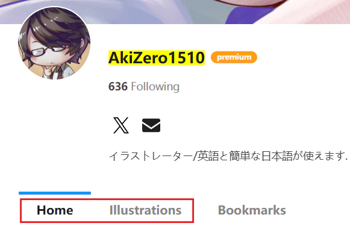
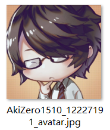
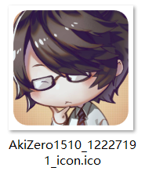
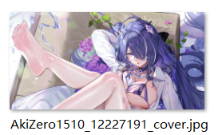
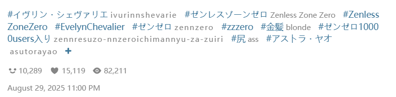
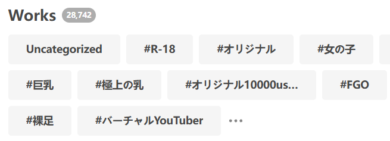
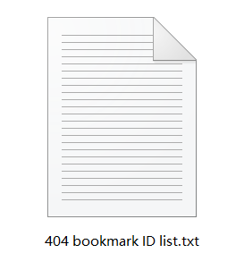

# More Buttons

The "More" tab of the downloader usually contains no buttons, but in a few page types, it displays some functional buttons.

## Homepage

### Clear saved crawl results

<button type="button" class="xzbtns hasRippleAnimation" style="background-color: rgb(20, 173, 39);">Clear saved crawl results</button>

Click this button to clear the data saved by the downloader for resuming interrupted downloads.

?> After crawling, the downloader saves crawl results for resuming downloads. This allows you to reopen the page and continue downloading if you accidentally close it. When the download is complete or you click the "Stop Download" button, the downloader clears the data for that task.

If you don't need to resume any incomplete download tasks, you can click this button to clear the resume data for **all pages**. However, this is usually not necessary.

## User Page

A user page refers to a user's homepage and their illustration, manga, or novel pages (but not their "bookmark" page).

For example: [AkiZero1510](https://www.pixiv.net/users/12227191)

On these pages, the "More" tab contains four buttons:

<button type="button" class="xzbtns hasRippleAnimation" style="background-color: rgb(20, 173, 39);">Save user avatar</button><button type="button" class="xzbtns hasRippleAnimation" data-xztitle="_Save User Avatar as Icon Description" style="background-color: rgb(20, 173, 39);" title="Save the user avatar as an ico file, which can be manually set as a folder icon.">Save user avatar as icon</button><button type="button" class="xzbtns hasRippleAnimation" style="background-color: rgb(20, 173, 39);">Save user cover</button><button type="button" class="xzbtns hasRippleAnimation" style="background-color: rgb(20, 173, 39);">Bookmark all works on this page</button>

### Save user avatar

The downloader saves the user's avatar (full-size image) to the download directory.

### Save user avatar as icon

The downloader generates a 256x256 pixel ico file from the user's avatar and saves it to the download directory.

?> The ico file can be set as a folder icon, so you can use the user's avatar as the icon for their folder.

### Save user cover

The downloader saves the cover image from the user's homepage to the download directory.

?> Some users may not have set a cover image, in which case this button has no effect.

### Bookmark all works on this page

The downloader crawls all works on the current page and automatically adds them to your bookmarks.

**Notes:**
- This feature works on both image and novel category pages.
- The downloader only crawls the current page (one page only), not subsequent pages.
- When using this feature to add bookmarks, whether they are public or tagged follows the settings in [Downloader' bookmark function (✩)](/en/Settings-More-Enhance?id=downloader39-bookmark-function-✩).
- This feature does not apply filter conditions. Even if you set a bookmark count filter, works below the threshold will still be bookmarked. If you want to apply filters, use the regular crawl and download process with the [Bookmark works after downloading](/en/Settings-Download?id=Bookmark-Works-After-Downloading) feature instead.

When using this feature, the button displays progress information. The downloader first shows the progress of crawling works, then the progress of adding bookmarks. For example:

<button type="button" class="xzbtns hasRippleAnimation" style="background-color: rgb(20, 173, 39);" disabled="disabled">Get data 30 / 48</button>

<button type="button" class="xzbtns hasRippleAnimation" style="background-color: rgb(20, 173, 39);" disabled="disabled">Add bookmark 4 / 48</button>

## Search Page

### Bookmark all works on this page

<button type="button" class="xzbtns hasRippleAnimation" style="background-color: rgb(20, 173, 39);">Bookmark all works on this page</button>

This button appears on search tag pages, for example: [バーチャルYouTuber](https://www.pixiv.net/tags/%E3%83%90%E3%83%BC%E3%83%81%E3%83%A3%E3%83%ABYouTuber/artworks?s_mode=s_tag)

This button is also available on user pages, and its function is the same, so refer to the explanation above.

## Bookmark Page

On the bookmark page, the following buttons are available:

<button type="button" class="xzbtns hasRippleAnimation" style="background-color: rgb(20, 173, 39);">Add tag to uncategorized work</button><button type="button" class="xzbtns hasRippleAnimation" style="background-color: rgb(228, 157, 0);">Remove tags from all works on this page</button><button type="button" class="xzbtns hasRippleAnimation" style="background-color: rgb(243, 57, 57);">Unbookmark all works on this page</button><button type="button" class="xzbtns hasRippleAnimation" style="background-color: rgb(243, 57, 57);">Unbookmark all deleted works</button><button type="button" class="xzbtns hasRippleAnimation" style="background-color: rgb(20, 173, 39);">Export bookmark list（JSON）</button><button type="button" class="xzbtns hasRippleAnimation" style="background-color: rgb(20, 173, 39);">Import bookmark list (add bookmarks in batches)</button>

Bookmark pages have two scenarios:
- Your own bookmark page: All buttons are visible.
- Someone else's bookmark page: Only the last two buttons are visible, as you don't have permission to edit others' bookmarks.

### Add tag to uncategorized work

Click this button, and the downloader will crawl all uncategorized works in your bookmarks and add tags to them.

When using this feature, the button displays progress information, for example:

<button type="button" class="xzbtns hasRippleAnimation" style="background-color: rgb(20, 173, 39);" disabled="disabled">3 / 912</button>

?> To stop this task after it starts, you need to close the current page.

**Additional Notes:**

- This feature crawls **all** uncategorized works; you cannot set a limit on the number to crawl.
- The downloader adds **the work's own tags** to uncategorized works, i.e., the tags visible on their work page, for example:

**What are uncategorized works?**

When adding bookmarks, you can optionally add tags (custom or otherwise). However, clicking Pixiv's bookmark button does not add tags by default.

"Uncategorized works" are bookmarks without any tags.

?> Tags in your bookmarks are independent of the work's own tags. If a work has 10 tags but you didn't add any when bookmarking it, it's considered an "uncategorized work."

**Trivia:** On your bookmark page, Pixiv displays a list of tags, such as:

These are the tags associated with bookmarked works, sorted by frequency.

A special tag, `未分類`, includes all uncategorized works (this tag name is fixed).

### Remove tags from all works on this page

This button does the opposite of the previous one. Clicking it crawls all works on the **current page** (one page only) and removes their tags, making them uncategorized.

?> This does not unbookmark the works; it only removes their associated tags.

?> When using this feature, the downloader displays progress information in the log at the top of the page.

### Unbookmark all works on this page

Click this button, and the downloader crawls all works on the **current page** (one page only) and removes them from your bookmarks.

?> To prevent accidental operations, this button processes only one page at a time.

?> When using this feature, the downloader displays progress information in the log at the top of the page.

### Unbookmark all deleted works

Your bookmarks may include works that are no longer available, which you cannot view or download. For example:

Click this button, and the downloader crawls your bookmark list (without fetching detailed data for each work, so it's relatively quick). It then identifies **all** deleted works and removes them from your bookmarks.

?> When using this feature, the downloader displays progress information in the log at the top of the page. The work count in the log, e.g., "Currently 1585 works," refers to the number of deleted works detected.

**Export IDs of Deleted Works:**

After identifying all deleted works, the downloader exports their ID list to the download directory, for example:

This feature is useful for some users, as work IDs can help locate archived versions of these works on other illustration websites.

?> The downloader exports only work IDs, as other data (e.g., user IDs) for deleted works is invalid and set to meaningless values by Pixiv.

### Export bookmark list（JSON）

You can export your own or another user's bookmark list (depending on whose bookmark page you're on). The downloader generates a JSON file saved to the browser's download directory.

You can export your bookmark list as a backup or export another user's list to add to your own bookmarks.

--------

When using this feature, the downloader performs these steps:
1. Crawls the bookmark list page (without fetching detailed data for each work).
2. Applies **some** filter conditions (since list page data is limited, not all filters can be used).
3. Exports data for works that meet the conditions (including only essential information).

The following filter conditions apply to this feature:
- [How many pages to crawl](/en/Settings-Crawl?id=how-many-pages-to-crawl)
- [Age restriction](/en/Settings-Crawl?id=age-restriction)
- [AI works](/en/Settings-Crawl?id=ai-works)
- [Bookmark status](/en/Settings-Crawl?id=bookmark-status)
- [ID range](/en/Settings-Crawl?id=id-range)
- [Posting time](/en/Settings-Crawl?id=posting-time)
- [Include tag](/en/Settings-Crawl?id=include-tag)
- [Excluded Tag](/en/Settings-Crawl?id=excluded-tag)
- [User block list](/en/Settings-More-Crawl?id=user-block-list)

### Import bookmark list (add bookmarks in batches)

Click this button to select a previously exported bookmark list (JSON file) and add its works to your bookmarks.

**Tips:**
- You can export another user's bookmark list and import it into your own.
- When on another user's bookmark page, you can still use this feature. The downloader always adds imported works to your bookmarks.
- If the imported list includes works you've already bookmarked, the final bookmark count may be lower than expected, which is normal. For example, if you import 48 works and 20 are already bookmarked, your bookmark count will increase by only 28.

?> When using this feature, the downloader displays progress information in the log at the top of the page, e.g., "Bookmarking works 5/48".