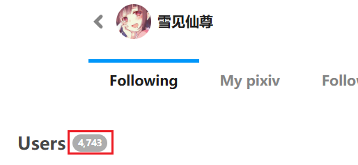
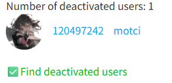

## Start crawl

<button id="startCrawlingInFollowingPage" type="button" class="hasRippleAnimation settingsPanelActionBtn" data-btn-emphasis="primary" data-btn-intent="brand" data-xztitle="_默认下载多页" title="Start crawl, if there are multiple pages, the default will be downloaded."><span data-xztext="_开始抓取">Start crawl</span><span class="ripple"></span></button>

Clicking this button makes the downloader crawl all works of users in the current subpage (followed users, friends, or fans).

?> The number of users crawled depends on the "How Many Pages to Crawl" setting. Each page has up to 24 users.

**Note:**

If you follow many users, their total works may be numerous.

For example, if each user has 50 works and you follow 4,730 users, the total number of works could be 236,500 or more.

You can set "How Many Pages to Crawl," e.g., crawl 10 pages at a time and split into multiple tasks. See [Tip: Split Tasks](/en/Settings-Crawl?id=tip-split-tasks).

## Export followed users list (CSV)

<button id="exportFollowingListCSV" type="button" class="hasRippleAnimation settingsPanelActionBtn" data-btn-emphasis="secondary" data-btn-intent="brand"><span data-xztext="_导出关注列表CSV">Export followed users list (CSV)</span><span class="ripple"></span></button>


Clicking this button makes the downloader crawl user data from the current subpage (followed users, friends, or fans) and generate a CSV file, saved to the browser's download directory.

You can export your own following list as a backup for future needs.

?> Although the button says "followed users," it can also export friends and fans lists.

?> The number of users crawled depends on the "How Many Pages to Crawl" setting. Each page has up to 24 users.

?> This function only crawls user lists, not works.

The CSV file contains the following data for each user:

- User ID
- Username
- User profile URL
- User description
- User avatar image URL

**Note:** The number of users exported by the downloader may be less than the number displayed on the webpage. This is not a bug, but because some users have already deactivated their accounts, so the downloader cannot retrieve their data.

For example, my following page shows 4,743 users:



Some users have already deactivated, but Pixiv does not subtract them from the total count, which can be somewhat misleading. However, you might notice clues: usually, 24 users are displayed per page, but some pages may have only 23 or fewer users, which is because some users no longer exist.

The downloader is more likely to observe this situation when crawling data: the downloader requests 100 users' data each time, but Pixiv often returns more than 90 users. After crawling is complete, the downloader only obtained data for 4,668 users, which is 75 less than the number displayed by Pixiv. As for the deactivated users, I cannot retrieve their data.

## Export followed users list (JSON)

<button id="exportFollowingListJSON" type="button" class="hasRippleAnimation settingsPanelActionBtn" data-btn-emphasis="secondary" data-btn-intent="brand"><span data-xztext="_导出关注列表JSON">Export followed users list (JSON)</span><span class="ripple"></span></button>


This button functions similarly to the previous one but exports a JSON file.

An important difference is that the exported JSON file can be used for importing (batch following users), while the CSV file cannot.

The JSON file saves the list of users you are following. Previous versions only contained user IDs, for example:

```json
[
  "107901226",
  "89923302",
  "108815429",
  "9013106"
]
```

Starting from version 18.6.0, the JSON file will save detailed data for each user, for example:

```json
[
  {
    "userId": "56604890",
    "userName": "micho",
    "profileImageUrl": "https://i.pximg.net/user-profile/img/2025/08/06/00/00/15/27711443_3167190746034c5bb05001829981a29d_170.jpg",
    "profileImageSmallUrl": "https://i.pximg.net/user-profile/img/2025/08/06/00/00/15/27711443_3167190746034c5bb05001829981a29d_50.jpg",
    "userComment": "短髪と可愛いものが好きです！\nＸ：komehina_micho",
    "premium": false,
    "following": true,
    "followed": false,
    "isBlocking": false,
    "isMypixiv": false,
    "illusts": [],
    "novels": [],
    "commission": null
  }
]
```

Both types of data can be used to batch follow users.

**Difference between exporting CSV and JSON formats:**

The exported JSON file can be used for importing (batch following users), while the CSV file cannot. But if you only have a CSV file, you can also copy the user ID list from the CSV file and create a JSON file that conforms to the format.

**Note:** The number of users exported by the downloader may be less than the number displayed on the webpage. The reason has already been explained in the previous entry.

## Follow users in batches (JSON)

<button id="batchFollowUser" type="button" class="hasRippleAnimation settingsPanelActionBtn" data-btn-emphasis="secondary" data-btn-intent="brand"><span data-xztext="_批量关注用户">Follow users in batches (JSON)</span><span class="ripple"></span></button>


**Some Details:**
- The downloader will first crawl the users you are currently following. If a user is already followed, the downloader will skip it when adding follows, to avoid duplicate follows. However, this step is adjustable: since the downloader starts crawling from the current page, if you want to skip this step to save time, you can navigate to the last page of the following list and then execute this function. At that point, the downloader will only crawl the users on the last page, which is approximately equivalent to skipping this step.
- When following users, you can decide to add them as **public** follows or **private** follows. This depends on the page you are on: if you are on the public follows page, the downloader will add users as public follows. If you are on the private follows page, the downloader will add users as private follows.

**Possible Use Cases:**
- You can export another user's public following list and then import it to your own account to follow those users as well.
- You can export your own following list and then batch import it to a secondary account, so the secondary account has the same following list as the main account. However, I don't recommend doing this because it's not necessary: the secondary account can directly download works from the users that the main account publicly follows, just by opening the corresponding URL. But if your main account is banned, you might not be able to view the following list. So you can periodically export your following list for backup purposes.
- You can batch convert public followed users to private follows, or vice versa. It's simple: you can first export the public followed users, then go to the private follows page and perform batch following, so these users will be re-added as private follows. Of course, you can do the opposite as well.

**Tip:**

You can access another user's public following list page and use the downloader to crawl and export the users they follow.

You can first open a user's homepage, URL for example:

https://www.pixiv.net/users/1113943

Then append `/following` to the end and press Enter to view their public following list:

https://www.pixiv.net/users/1113943/following

!>**Risk Warning:** Pixiv has strict limits on batch following users. For example, following over 1,000 users per day may trigger a warning from Pixiv. A second warning may lead to account suspension or deletion. I am not responsible for any account bans.

To reduce risk, the downloader adds intervals during batch following and pauses automatically every 1,000 users. If this happens, close the following page and reopen it the next day to resume the batch follow task. The downloader skips already followed users and continues from the previous progress.

For safer importing of many users, split the task into batches, e.g., crawl 20 pages at a time (exporting 480 user IDs). If there are many users, this results in multiple JSON files. Import one file per day.

## Find deactivated users

<button id="findDeactivatedUsers" type="button" class="hasRippleAnimation settingsPanelActionBtn" data-btn-emphasis="secondary" data-btn-intent="brand"><span data-xztext="_查找已注销的用户">Find deactivated users</span><span class="ripple"></span></button>


You can find deactivated users in your following list.

**How it works:**
- Since the launch of this feature (March 2026), when you use the downloader, it will retrieve your following list once and save data for all users, including ID, username, and avatar. This data is saved locally and will be automatically cleared by the browser when you remove the downloader.
- Later, when you click this button, the downloader will retrieve your following list again and compare it with the previously saved historical data to find which users are now missing compared to before.
- The downloader retrieves data for these users one by one and checks if they have been deactivated. The downloader will display progress information in the top log.
- After the check is complete, it displays the results. If there are deactivated users, the downloader will output their list, which might look like this:



**Note:**
This feature cannot find users who deactivated before; it can only find users who deactivated after the downloader saved the historical following data.

