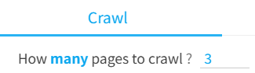
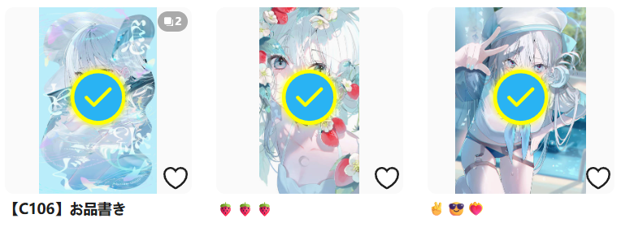
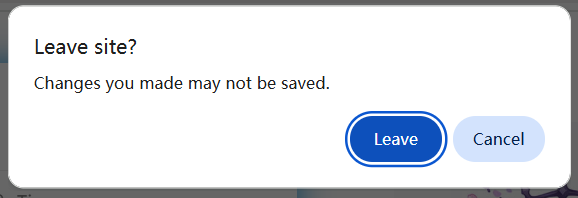

## Start crawl

<button id="startCrawling" type="button" class="hasRippleAnimation settingsPanelActionBtn" data-btn-emphasis="primary" data-btn-intent="brand" data-xztitle="_默认下载多页" title="Start crawl, if there are multiple pages, the default will be downloaded.">Start crawl</button>

## Stop crawling

<button id="stopCrawling" type="button" class="hasRippleAnimation settingsPanelActionBtn" data-btn-emphasis="secondary" data-btn-intent="danger">Stop crawling</button>

After clicking the `Start crawl` button, the downloader displays the `Stop Crawling` button, which you can click to stop the crawling process.

When stopping, if the downloader has already crawled some works, it will retain them and prepare to start downloading.

**Note:**

When clicking the `Stop Crawling` button, if the downloader has not yet generated crawl results, it will simply stop crawling and will not prepare to start downloading.

This is because the downloader's crawling is usually divided into two stages:
1. The downloader first retrieves the list of work IDs. In this stage, the downloader only saves the work IDs and does not have detailed data. So if you click the `Stop Crawling` button in this stage, there are no crawl results in the downloader, and thus it cannot start downloading.
2. After the downloader retrieves the list of work IDs, it retrieves detailed data for each work and generates crawl results. The top log will display "Starting to retrieve work information". If you click the `Stop Crawling` button in this stage, the downloader will retain the crawl results (if any) and prepare to start downloading.

## Timed crawl

<button id="scheduleCrawling" type="button" class="hasRippleAnimation settingsPanelActionBtn" data-btn-emphasis="secondary" data-btn-intent="brand" data-xztitle="_定时抓取说明" title="Automatically start crawling and downloading at regular intervals.">Timed crawl</button>

On some pages, new works may appear over time, such as:

- User profile
- New works by followed users
- Everyone's new works
- Your bookmark page
- Search page

On these pages, if you want to crawl new works periodically and download them automatically, you can use the timed crawl function.

**Example:**

To schedule crawling of new works by followed users, follow these steps:

1. Open the [Works by Followed Users](https://www.pixiv.net/bookmark_new_illust.php) page.

2. Set the number of pages to crawl each time:

This page count should consider the "interval time." For example, if you want to crawl every 120 minutes and the page's new works in 120 minutes do not exceed 3 pages, set it to `3`.

3. Click the `Timed crawl` button, and the downloader displays an input box to set the interval time:

Interval time for timed crawl (minutes)

<input class="XZInput" placeholder="" type="text" value="120" style="flex-basis: 500px;"><button class="XZInputButton hasRippleAnimation">
      Submit
      
    </button><button class="XZInputButton cancel hasRippleAnimation">
      Cancel
      
    </button>

The default value is 120 minutes, which you can adjust as needed.

Click the `Submit` button, and the downloader starts the timed crawl task, displaying a prompt in the log:

Timed crawl started, interval: 120 minutes. To modify the interval, adjust the setting in the "More" tab: Timed crawl interval. 

**Tips:**

- The downloader does not start crawling immediately; it waits until the set interval before the first crawl.
- It's recommended to enable the [Don't download duplicate files](/en/Settings-More-Download?id=don39t-download-duplicate-files) function in the "More" tab to avoid unnecessary duplicate downloads.
- The interval should not be too short, as crawling and downloading take time.

-----------

When using timed crawl, note the following:

1. Do not close the current tab. You can switch to other tabs and continue using the browser.
2. Do not change the URL of the current tab. For example, if you're on a user profile performing timed crawl and click a work to enter its page, the task will be canceled.
3. Enable the [Don't download duplicate files](/en/Settings-More-Download?id=don39t-download-duplicate-files) function to avoid downloading duplicates.
4. If the extension updates automatically, the page may not download files correctly (refresh the page to restore functionality). For long-term timed crawl, consider installing the extension offline to avoid interruptions from updates. See the [Offline Installation](/en/OfflineInstallation) page.
5. Set a lower page count to avoid crawling too many duplicate works. For example, on a search page, you can crawl up to 1000 pages, but it's unnecessary to crawl all of them. Setting 10 pages or fewer is fine if new content within the interval doesn't exceed 10 pages.
6. On search pages, crawled works are not displayed on the page (i.e., no preview of search results).
7. Timed crawl always starts downloading automatically.
8. When clicking the `Timed crawl` button, the downloader prompts for the interval time, which syncs with the [Timed crawl Interval](/en/Settings-More-Crawl?id=the-interval-time-of-timed-crawl) setting.
9. The downloader uses the interval set at the task's start. Changing the interval later does not affect the ongoing task. To apply a new interval, click `Cancel timed crawl`, then click `Timed crawl` to start a new task with the updated interval.

## Cancel timed crawl

<button id="cancelScheduledCrawling" type="button" class="hasRippleAnimation settingsPanelActionBtn" data-btn-emphasis="secondary" data-btn-intent="warning">Cancel timed crawl</button>

After starting timed crawl, the downloader displays a `Cancel timed crawl` button. To cancel timed crawl, click this button or close the page running the timed crawl task.

## Manually select

<button id="manuallySelectWork" type="button" class="hasRippleAnimation settingsPanelActionBtn" data-btn-emphasis="secondary" data-btn-intent="brand" title="Alt + S">Manually select</button>

Use this button to manually select any works on the page and crawl them.

?> The shortcut for this function is `Alt` + `S`. Press it to enter/exit manual selection mode.

Clicking this button enters selection mode. A blue circle with crosshair guidelines appears under the mouse cursor, as shown below:

You can then click the left mouse button on any work to select it. The downloader adds a checkmark to indicate selection, as shown below:

You can later crawl the selected works.

?> If the current page has pagination (e.g., on a user profile), you can select works across multiple pages. For example, select 2 works on page 1, then go to page 2 and select 3 works, resulting in 5 selected works that can be crawled at once.

?> When in manual selection mode, clicking a work does not open its link to prevent page content changes. To view a work's page, use one of these methods: 1. Hold `Ctrl` and click the work. 2. Right-click the work's thumbnail and select "Open link in new tab." 3. Exit manual selection mode (shortcut: `Esc`).

---------

After clicking the `Manually select` button, the downloader displays these three buttons:

<button type="button" class="xzbtns hasRippleAnimation" style="background-color: rgb(20, 173, 39);" title="Alt + S">Pause select</button><button type="button" class="xzbtns hasRippleAnimation" style="background-color: rgb(243, 57, 57);">Clear selected works</button><button type="button" class="xzbtns hasRippleAnimation" style="background-color: rgb(14, 168, 239);">Crawl selected works</button>

## Clear selected works

<button id="clearSelectedWork" type="button" class="hasRippleAnimation settingsPanelActionBtn" data-btn-emphasis="secondary" data-btn-intent="danger">Clear selected works</button>

Exits manual selection mode and clears all selected works. Click this if you no longer need the previously selected works.

## Crawl selected works

<button id="crawlSelectedWork" type="button" class="hasRippleAnimation settingsPanelActionBtn" data-btn-emphasis="secondary" data-btn-intent="brand">Crawl selected works</button>

Crawls the selected works. The downloader retains the selected works.

After selecting the works you want to crawl, click the `crawl selected works` button to crawl and download them.

-----------

**Tips:**

- If needed, you can click `Pause select` and `Continue select` to make multiple selections. The downloader does not clear previously selected works, so selections accumulate.
- Press the `Esc` key to exit manual selection mode.
- If works are selected, the downloader displays the number of selected works on the `crawl selected works` button.
- The downloader's filter conditions also apply to manually selected works, so some works may be excluded during crawling.
- The downloader does not automatically clear selected works unless you click the `Clear selected works` button.

-------

When navigating to other pages, the selected works list **may** be lost, depending on whether the current page's content is discarded.

For example, navigating from a user profile to a work page without refreshing retains the selected works.

However, navigating to certain pages (e.g., rankings) or refreshing the page discards the current page content. In such cases, the downloader prompts the browser to display a confirmation dialog, as shown below:

If you choose to leave the page, the selected works are lost. If you cancel the navigation, the selected works are retained.

In short, you don't need to worry about accidentally losing selected works, as you'll have the opportunity to choose.

