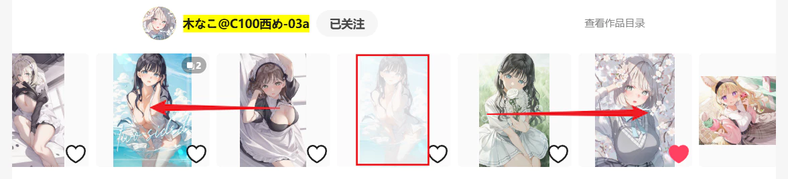
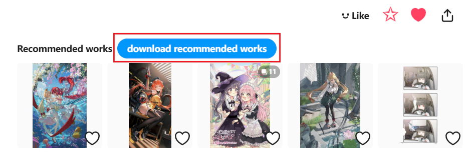

## Crawl the new works from this page

<button id="startCrawlingFromCurrentPageNew" type="button" class="hasRippleAnimation settingsPanelActionBtn" data-btn-emphasis="primary" data-btn-intent="brand">Crawl the new works from this page</button>

Clicking this button makes the downloader crawl the current work and works newer than it.

You can set how many works to crawl (including the current work) in the first crawl condition, `How Many Works to Crawl`. The default value `-1` crawls the current work and all newer works.

--------

"Newer works" are works with a posting time later than the current work. On a work page, they are located to the left of the current work.

Diagram:

Newer works are on the left, older works on the right.

## Crawl the old works from this page

<button id="startCrawlingFromCurrentPageOld" type="button" class="hasRippleAnimation settingsPanelActionBtn" data-btn-emphasis="secondary" data-btn-intent="brand">Crawl the old works from this page</button>

Clicking this button makes the downloader crawl the current work and works older than it.

You can set how many works to crawl (including the current work) in the first crawl condition, `How Many Works to Crawl`. The default value `-1` crawls the current work and all older works.

"Older works" are works with a posting time earlier than the current work. On a work page, they are located to the right of the current work.

## Crawl the related works

<button id="crawlRelatedWork" type="button" class="hasRippleAnimation settingsPanelActionBtn" data-btn-emphasis="secondary" data-btn-intent="brand">Crawl the related works</button>

Related works refer to the "Related Works" section at the bottom of the work page.

You can set how many related works to crawl (including the current work) in the first crawl condition, `How Many Works to Crawl`. The default value `-1` crawls all related works.

?> Related works are limited to a maximum of 180.

### download recommended works

<button class="blueTextBtn hasRippleAnimation" id="downloadRecommendedWorks" type="button">
  download recommended works
</button>

After clicking the bookmark button, Pixiv displays recommended works, and the downloader shows this button, as illustrated below:

Click this button to crawl recommended works.

You can set how many recommended works to crawl in the first crawl condition, `How Many Works to Crawl`. The default value `-1` crawls all recommended works.

?> Recommended works are limited to a maximum of 20.

?> When downloading recommended works, the downloader always starts downloading automatically.

