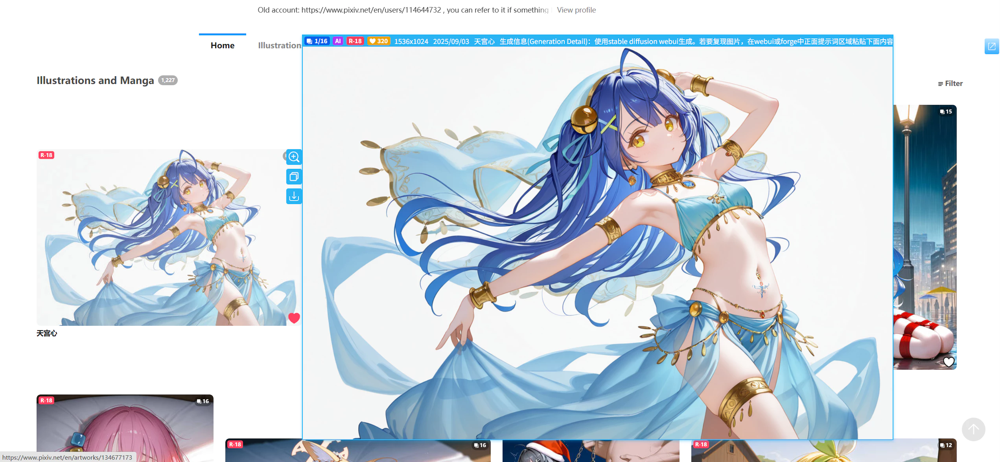
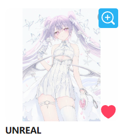

# Convenience Features

The downloader includes several convenience features to improve operational efficiency.

## Quick Download

On a work page, the downloader adds a quick download button on the right side of the page, as shown below:

Click it to download the current work with one click (without opening the downloader's settings panel).

Its shortcut key is `Alt` + `Q`.

## Quick Bookmark

The downloader adds a star-shaped bookmark button below the work:

Its shortcut key is `Alt` + `B`.

It differs from Pixiv's heart-shaped bookmark button in two ways:

1. Quick bookmark automatically likes the work.

2. Quick bookmark adds the work's tag list by default.

Tags refer to those displayed below the work:

When using Pixiv's heart-shaped button to add a bookmark, it does not include the work's tags. However, the quick bookmark button adds all tags by default.

You can use tags to filter works on the bookmark page, making this feature very useful.

You can modify this button's behavior in the [Downloader' bookmark function (✩)](/en/Settings-More-Enhance?id=downloader39-bookmark-function-✩) settings: whether to add tags and whether the bookmark is public.

## Preview Works

When hovering over a work's thumbnail, the downloader displays a larger preview image, as shown below:

While previewing, press the `C` key to download the currently previewed image, or press `D` to download the entire work.

See detailed explanation: [Preview works](/en/Settings-More-Enhance?id=preview-works)

## Long press the right mouse button on the thumbnail to display the large image

With this feature, you can view the original image of a work directly without visiting its page or downloading it.

If you want to quickly copy the original image of a work (without downloading), you can use this feature: after the original image is displayed, right-click the mouse and select "Copy Image".

See detailed explanation: [Long press the right mouse button on the thumbnail to display the large image](/en/Settings-More-Enhance?id=long-press-the-right-mouse-button-on-the-thumbnail-to-display-the-large-image)

## Show zoom button on thumbnail

When the mouse hovers over a work thumbnail, the downloader displays a magnifier icon on the thumbnail, as shown below:

Click the magnifier icon to open the image viewer and view every image in the work.

## Display Copy Button on Work Thumbnail

When the mouse hovers over the work thumbnail, the downloader will display a copy button on the thumbnail, as shown in the following image:

Clicking the copy button allows you to copy both the images and text summary of the work at the same time, then paste them into other software to save, or share with others.

View detailed instructions: [Copy button](/en/Settings-More-Enhance?id=copy-button)

## Show download button on thumbnail

When the mouse hovers over a work thumbnail, the downloader displays a download button on the thumbnail, as shown below:

Click the download button to download the work.

See detailed explanation: [Show download button on thumbnail](/en/Settings-More-Enhance?id=show-download-button-on-thumbnail)

## Image Viewer

The downloader includes a built-in image viewer, as shown below:

?> If the work contains multiple images, the downloader displays thumbnails of all images at the bottom. Click a thumbnail to view its full-size image.

**Function Buttons:**

There are 5 buttons below the image viewer:
- `1:1`: Click this button, and the image will be displayed at a 1:1 ratio. If the image size exceeds the screen, you can use the left mouse button to drag the image. Clicking this button again will restore the image to adaptive display. Its shortcut key is `F`.
- `✩`: Bookmark this work (using the downloader's quick bookmark function). Its shortcut key is `Alt` + `B`.
- Copy button: Click it to copy the images and text summary of the work. Its shortcut key is `Alt` + `C`.
- `↓` Download the currently displayed image (not all images in this work). Its shortcut key is `C`.
- `↓↓↓` Download this work. Its shortcut key is `D`.

**Exit Image Viewer:**

There are multiple ways to exit the image viewer:
- Click on the blank area (black background area)
- Click the close button in the upper right corner
- Press the `Esc` key

**Shortcut Key List:**

- `F` Display at original size; Return to initial ratio
- `Alt` + `B` Bookmark this work
- `Alt` + `C` Click the copy button
- `C` Download the currently displayed image
- `D` Download the currently viewed work
- `←` Switch to the previous image
- `→` Switch to the next image
- `↑` Zoom in the image. Scrolling the mouse wheel upward can also zoom out the image
- `↓` Zoom out the image. Scrolling the mouse wheel downward can also zoom in the image
- `ESC` Exit fullscreen mode; Exit viewer

## In the multi-image work page, display the thumbnail list

When on a **multi-image work** page (e.g., [134821751](https://www.pixiv.net/artworks/134821751)), the downloader displays thumbnails for each image, as shown below:

You can preview or download each image.

See detailed explanation: [Show thumbnail list on multi-image work pages](/en/Settings-More-Enhance?id=show-thumbnail-list-on-multi-image-work-pages)

## Add Quick Search Area on Search Pages

The downloader adds buttons for specific bookmark counts at the top of search pages, as shown below:

Clicking these buttons adds the bookmark count as a tag to the current search tag and performs the search.

See detailed explanation: [Add a quick search area on the search page](/en/Settings-More-Enhance?id=add-a-quick-search-area-on-the-search-page)

## Click Popular Works

On search pages, Pixiv may display popular works, as shown below:

If you don't have a Pixiv premium membership, clicking a work redirects to the membership purchase page.

The downloader optimizes this area, allowing you to click works to visit their pages, or preview and download them directly.

## Batch Bookmark

On user profile and search pages, the "More" tab includes a button:

<button type="button" class="xzbtns hasRippleAnimation" style="background-color: rgb(20, 173, 39);">Bookmark all works on this page</button>

Click it to add all works on the current page to your bookmarks.

See detailed explanation: [Bookmark all works on this page](/en/Buttons-More?id=bookmark-all-works-on-this-page)

## Manage Your Bookmarks

On the bookmark page, the "More" tab includes several buttons to help manage your bookmarks.

For example, if you didn't add tags when bookmarking a work, the downloader can automatically add tags for it.

See detailed explanation: [Bookmark Page Buttons](/en/Buttons-More?id=bookmark-page)