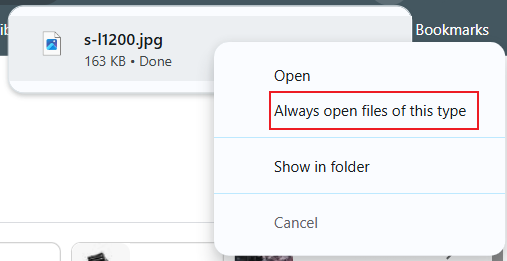
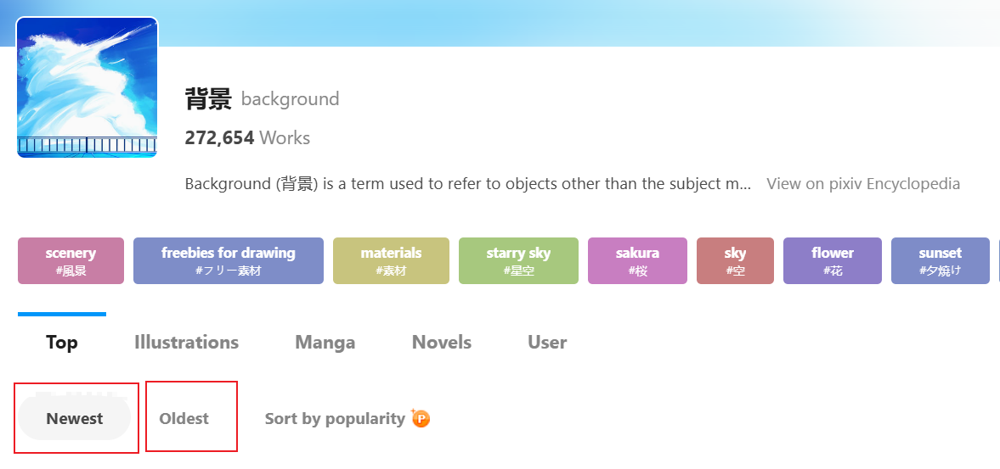
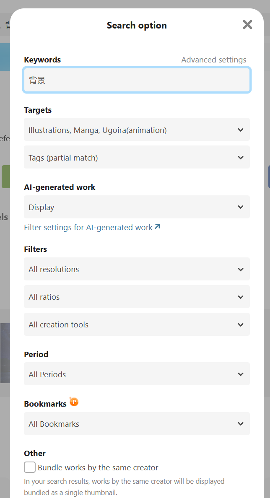
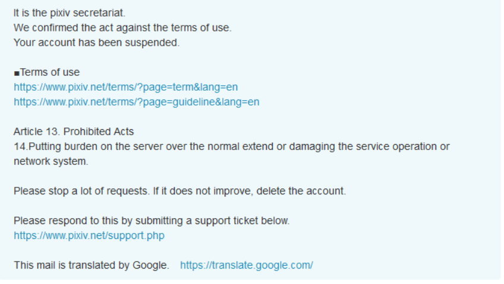

# Frequently Asked Questions

?> You can use the browser's search function `F3` (?Crtl+F?) to search for keywords on this page.

?> Watch the video tutorial: [What to do when encountering issues](https://www.youtube.com/watch?v=9LiUKk88Sfg&list=PLO2Mj4AiZzWEpN6x_lAG8mzeNyJzd478d&index=17':target=_blank')

## Check the following info

When encountering issues, please first check the following:

**Caution: If you encounter problems but your browser is not Chrome or Edge, don't contact me**

1. If you're not using Chrome or Edge, please install the extension on Chrome or Edge and check again.
2. If your Chrome or Edge browser is the latest version, please update.
3. If the extension you use is not the latest version, please update to the latest version. Current version: 
4. Restart your browser and check again.
5. There may be network connectivity issues. Please check your internet connection. Users in mainland China are recommanded to use VPN or proxy tools for stable connectivity.
6. If you're already using VPN, please ensure that the Pixiv domain `i.pximg.net` is included in proxy rules. Some VPNs may not proxy this domain by default.
7. If you're using Nginx reverse proxy to access Pixiv, consider switching to a VPN. Some reverse proxies may have slow image loading speeds, and the downloader may not be able to download images through reverse proxies.
8. Your system disk (usually C:) may be running out of space (minimum 4GB free space required). Free up and storage space and restart your browser.

## Other Questions

1. If you're not sure about how to use certain features, please refer to the relevant sections in this wiki.
2. Check the [Post-Installation Settings](./After_Insatllation) page for potential issues.
3. Review the help info on this page.
4. If the issue persists, please visit the [Contact_Info](./Contact_Info.md) page.

-------------

## Where to find downloaded files?

*File/Image location/path*

Downloaded files are saved in your browser's default download directory.

## Can files be saved outside the browser's default download directory?

**No**, due to browser limitation.

Due to browser security policies, the downloader can only save files to the browser's default download directory.

## How to modify download location

*Modify download path*

If you don't want files to be saved in the default download directory, you can only change the download folder location in your browser settings.

Open your browser's settings page and modify the download location under 'Downloads'.

You can also directly access the download settings by entering `chrome://settings/downloads` in the address bar.

If you don't want to change the browser's default download location, you'll need to manually move files after downloading.

## How to create folders

Use a forward slash `/` in the naming rule. The text before the slash will be used as the folder name.

For example, `{p_title}/{id}-{tags}-{user}` will create a folder using the page title.

## How to group an artist's works in the same folder

*How to keep one artist's works together?*

Simply use the artist's name as the folder name in the naming rule. For example:

```
{user}/{id}
```

## How to save multi-image works in separate folders

If you prefer this structure:

Single images are saved directly in the artist's folder, while multi-image works are saved in additional subfolders.

Example:

```
Downloads
│
├─ArtistName
│  │  99097921.png
│  │
│  └─99276627
│          99276627_p0.png
│          99276627_p1.png
```

First, in the naming rule, create only the artist's folder, e.g.: `{user}/{id}`.

Then enable the "Create a separate folder for each work"(More-Show advanced Settings-Name) setting with the following sub-option (this is the default setting):

```
Number of files > 1   Name {id_num}
```

This will achieve previous effect.

## No works matching filter criteria found after crawling

Sometimes after crawling, you might see this message:

```
Crawl complete but did not find works that match the filter criteria.Please check the settings related to Crawl.
```

This means none of the works met the filter criteria (or filter conditions). 
The settings you see in the "Crawl" tab, such as work type, number of images, bookmarks, publication date, tag requirements, etc.

By default, the filter doesn't exclude any works. If you modify the filter to exclude certain works, you might see this message.

## Why are there more matched files than total works?

Sometimes after crawling, you might see a message like:

```
Total works: 10
Total files: 20
```

This is because some works contain multiple images. Each image is a separate file, so it's normal to have more files than works.

## Downloaded filenames are garbled

*Filename issues/garbled filenames/uuid*

Some users might see downloaded filenames with random characters, like this:


```
7dc64752-0616-448d-99ce-4676c501b503.png
e3852d43-4a9f-4156-abda-544eff38ce3f.jpg
```

This happens when other extension modifies the downloader's filenames.

Try disabling other extensions with **download function** one by one, then use this extension to see if the issue is solved. This can help identify conflicting extensions.

Conflicting extensions are usually those that manage file downloads, such as Chrono Download Manager, or extensions for download software (like IDM browser extension), or extensions with video/image download or screenshot function.

Some **known** conflicting extensions: See the "Beware of conflicting extensions" section on the [Post-Installation Settings](zh-cn/安装之后) page.

*Technically, if an extension uses the `onDeterminingFilename` event in its code, it might conflict with the downloader.*

*The downloader doesn't use this event and doesn't affect other extensions' filenames.*

## Filenames in jfif format

*Filename extension is jfif(file ends with jfif)*

Possible reasons:
1. Affected by other extensions, as mentioned in the "Downloaded filenames are garbled" section.
2. If you selected "Thumbnail" as the image size in download settings, jfif format might be downloaded. This is normal case.

## Does it support resuming interrupted downloads?

Yes, it supports resuming interrupted downloads. If the page crashes or is closed during download, you can reopen the page to continue downloading.

## How to avoid downloading duplicate files?

How to avoid downloading works that have already been downloaded?

Enable the "Don't download duplicate files" option. See the [Don't download duplicate files](/zh-cn/设置-更多?id=不下载重复文件) section.

In some cases, you might also consider using incremental updates to avoid downloading previously downloaded files. See the "Incremental Updates" section in the "Usage Tips" page.**check the term list**

## Download too slow

What to do if downloads are slow or 0 speed?

This is an issue for users in mainland China. We recommend using reliable proxy/VPN software like SSR, V2Ray, or Clash with stable routes. Also, set the proxy rules to **global proxy**. (**Enabling global proxy can improve download speed**)

Another solution is to use the "Copy URL" function to copy image URLs and download them using software like Xunlei-torlent or IDM. However, these software can't rename files during download.

## Animated image downloads are slow

For slow animated image downloads, first refer to the previous section. Also, slow animated image downloads are normal.

1. Animated images are larger in size, so downloads will be slower.
2. Essentially, Pixiv animated images are zip files. If you select "webm", "APNG", or "gif" as the save format, the downloader will also transcode the zip file, which takes extra time.
3. The page might be obscured. See: [Keep the page unobscured when converting animated images](/zh-cn/使用技巧?id=转换动图时保持页面不被完全遮挡)

## Download progress stays at 0


Some users might encounter this issue where a single download progress bar is complete, but the total progress bar shows 0 completed and doesn't proceed to download subsequent images.

Try the following:

1. First, keep refreshing the page and restart/continue download task to check if the issue is resolved.
2. If the issue persists, it's usually because you're using the wrong browser. Some browsers are third-party Chromium derivatives with shells and can't properly use the downloader. Try Chrome or Edge.
3. If your browser meets the requirements, try restarting or updating your browser before starting the download again.
4. If the issue persists, try downloading a few works individually. If some work but others don't, it might be due to **illegal characters in the filename**. Try modifying the naming rules and download again.
5. If the issue still can't be resolved, please refer to the "Contact_Info" page in this wiki to report the issue.

## What to do if a task gets stuck

Caused by network issue in most case. The worse the network condition, the more likely this problem will occur.

If task gets stuck during crawling, you can try waiting for a while to see if it can continue. If not, it's recommended to refresh the page and restart the crawling.

If it gets stuck during downloading, you can pause the task and then click to start download again; or close the page and reopen it later to continue.

?> If your network condition is poor, you can reduce the number of download thread(range 1 to 6, default 5) to decrease the chance of getting stuck.

## Will program re-download automatically when the task gets stuck?

Yes.

When it comes to the network fitter, the task may get stuck due to timeout or network disconnection. The program will automatically retry downloading the failed files.

## Keep getting stuck, unable to download any images

First, check your network. If the network works (you can access Pixiv normally and the speed is fast), then you should check the remaining space on your system disk (usually C drive).

If the system disk is running critically low on space, Chrome might block some large xhr requests, causing continuous download failures. Please free up some space and try downloading again. This cause was discovered by Reinford.

*Note: In this case, Chrome won't block fetch requests*

## Images are corrupted

The Images only have part/half of the content.

Might be network issues during download. Please re-download the corrupted image/work which failed halfway.

If it's still corrupted after re-downloading, it might be broswer caching problem. Please clear your cache, refresh the page, and re-download the work.

## What happen when the download progress bar turns red?

This indicates that an error occurred while downloading this file. The downloader will re-download it.

No need to do anything.

## 117269206_p0 not saved, code: USER_CANCELED

If you see this error message, possible reasons include:

1. "Save As" popped up during download
2. File name is too long
3. Other reasons

Solutions for the first two case are listed below.

## "Save As" dialog box pops up during download

*Save As dialog/window pops up during download*

If the "Save As" dialog pops up during download, please check the following possible reasons:

**Reason 1**: Please confirm that you have **disabled** "Ask where to save each file before downloading" in your browser settings.

If this setting is enabled, the "Save As" dialog will appear for every download, so you should disable this setting.

**Reason 2**: There might be duplicate file names in the download. Please check your naming rules.

If your naming rules include `{id}` or `{p_num}` tags, there shouldn't be duplicate file names; otherwise, duplicate names might occur.

For example, if id 78279423 is a set with three images, `{id}` or `{p_num}` tags will add sequence numbers, preventing duplicate names:

```
78279423_p0.jpg
78279423_p1.jpg
78279423_p2.jpg
```

Without sequence numbers, the names would be duplicated:

```
78279423.jpg
78279423.jpg
78279423.jpg
```

When the naming rules don't include `{id}` or `{p_num}`, be aware of potential duplicate name issues.

**Reason 3**: The file name might be too long.

Generally, most operating systems have a file name length limit of 255 characters. If the file name is too long and exceeds this limit, the browser might not be able to save the file, instead showing the "Save As" dialog for user action.

If you're using Windows and saving files to a local hard drive, you shouldn't encounter this issue because Chrome will automatically truncate excess characters to ensure successful saving.

However, in other cases, such as using certain Linux operating systems or saving to network locations (NAS), Chrome might not handle this correctly, leading to save failures and potentially triggering the "Save As" dialog.

**Reason 4**: The download location might not exist

For example, if your browser's download location is set as `D:\downloads` and this location no longer exists, the "Save As" dialog will appear.

## What to do if the file name is too long

*File name too long/File name exceeds length limit*

If you can't save files due to excessively long file names, you can open the downloader panel, go to the "More" tab, and enable "File name length limit" in the "Naming" section.

The "File name length limit" feature allows you to set a maximum length for file names. If a file name exceeds this length, the downloader will drop the excess characters to ensure saving.


## Why do images open automatically after download

*Images/files/txt files open automatically after download*

Downloaded files won't open automatically by default. If you find certain types of files opening automatically after download, please check if you've selected "Open certain file types automatically after downloading" in the bottom download bar when downloading such files.



If you've selected this option, simply uncheck it.

## Why doesn't downloading start automatically on search pages

You can disable "Preview filter results on search page ? " and enable "Download starts automatically ? " to make downloading start automatically.

[Preview filter results on search page ? ](zh-cn/设置-更多?id=预览搜索页面的筛选结果)

## After offline installation, a prompt appears when the browser starts

If you've installed this program offline, a prompt might appear in the top right corner when the browser starts: Please stop running extensions in developer mode.


>This prompt no longer appears after Chrome version 84. However, it still appears in Edge browser.

If you want to remove this prompt, here are some solutions:

1. If you have Huorong antivirus software installed, you can use its popup blocking feature to block this prompt.


Be careful to only block this prompt, not the entire Chrome window.

Source: [一届书生](https://www.cnblogs.com/52dxer/p/11067617.html ':target=_blank')

*Online installation of this extension won't trigger this warning.*

## Date format error!

If the set "Posting date ?" option is enabled, you need to input start and end times.

If the input time can't be parsed as a valid time, a warning message will appear: `Date format error!`

## No access to a specific work

This occurs when an unhandled error happens while trying to access a specific work.

This is a network request error, possibly because the work is private or simply due to network issues.

You can open the work's page directly using its id. If it's accessible, you can download it directly from this page.


## Download (Crawl) button not showing

This might be due to incorrect values in some settings, causing the downloader to malfunction.

You can try opening the download panel, go to the "More" tab, manage settings, reset settings, and then refresh the page.

## How to download from an ID list

If you have a list of work IDs and want to download based on this list, open the Pixiv homepage, then open the downloader panel, where you'll see this button:

*Type ID to crawl*

Clicking this button will show an input box. Copy your ID list into it to start crawling.

## How to stop crawling

How to stop/abort/interrupt crawling?

Currently, there's no control button to stop crawling. You can refresh the page to force pause crawling.

## Browser gets stuck when boot up

Chrome is lagging / really lag / Chrome starts unresponsive / stuck for a while / browser lagging

This might be caused by too many download records. You can check the number of download records in the "delete browsing data" interface:


Too many download records might cause browser lag, especially during browser startup and when opening the download management page.

Generally, if the totals of download records exceeds 10,000, you can clear them.

If the problem persists after clearing download records, consider uninstalling and reinstalling the browser.

## How to download in batches

Batch download/batch fetch

On pages with a large number of pages, if you are expecting too many crawls, you may want to consider crawling and downloading in batches.

For example:

1. on page 1, set the "How many pages to crawl ?" to 100, and then start crawling and downloading.
2. After the download is complete, jump to page 101, and then crawl page 100 again. Because the downloader will count the number of pages from the current page, so you can grab 101-200 pages.
3. and so on.

## Sorting of filenames in android is confusing

**Android File Manager Sorting Error / Sorting Confusion / Filename Sorting Error / File Sorting Confusion**

pixiv downloads files with id and serial number, suppose a work has many images and the id and serial number are at the beginning of the filename, like this:      

``
94495223_0
94495223_1
94495223_2
94495223_3
94495223_4
94495223_5
......
94495223_20
``

The above is an example for serial number 0 to serial number 20.

Usually we want the downloaded images to be sorted by serial number in Explorer (file manager). So we can do that by selecting the "Filename" sorting method in Explorer.

However, Android users often find that they see the sorting as confusing, e.g. (only the serial number part is listed):

``
0
1
10
11
12
13
14
15
16
17
18
19
2
20
3
4
5
6
7
8
9
``

The reason for this problem: this explorer sorts file names as strings, and this is what happens as a result.

If the serial number part is parsed as a number and then sorted, this problem does not occur.

How to solve this problem on Android? You can enable the setting **Add 0 in front of the serial number ?**  in the "More" tab of the downloader - Name. This will solve the problem.

After enabling "Fill 0 in front of serial number", the serial number will look like the following:

```
000
001
002
003
004
005
006
007
008
009
010
011
012
013
014
015
016
017
018
019
020
```

Since the length of the serial number is the same after 0 is put in front of it, the serial number can be sorted in the normal order on Android.

## How to make downloaded files sorted in the order they appear on the web page

*Sort images, works, and files.*

How to keep the downloaded works in the same order as on the web page?

On most pages, entries are sorted in reverse order by entry id. The later the work is published, the larger the id.

That's probably what you'll see on the web page:

``
96954935
96894692
96800281
96659987
96628297
``

The downloader's default naming convention uses `{id}` at the beginning of the filename. You can have the downloaded files sorted by filename, i.e. using the work id.

However, the default sorting in Explorer is orthogonal (smallest to largest), so you see the files in the reverse order of the web page. If you want the order of the files to be the same as on the web page, you can change the sorting method in Explorer so that the filenames are sorted in reverse order.

## How to make files sorted in favorites order when downloading favorites

When downloading a bookmarked work, how do I make the downloaded file match the bookmarked order of the work?

The reason for this problem is that the works in favorites/bookmarks are not sorted by the id of the work, but by the time you bookmarked it.

By default, your newest favorite will be in the first place, and the earliest favorite will be in the second place. How can I make the downloaded files sorted by the order of favorites?

You can change the naming convention by using `{bmk_id}` at the beginning of the file name, e.g. `{bmk_id}-{id}`.

- `{bmk_id}` Bookmark Id. Each entry in your collection will have a Bookmark Id. The later the collection, the larger the Bookmark Id. When you download your favorites, you can use `{bmk_id}` as a sorting basis.

`{bmk_id}` is a number, but it's not a bookmark id, it's a number generated when you bookmarked the bookmark. Using this number at the beginning of a file name can be used to sort the file.

However, the default sorting in Explorer is orthogonal (smallest to largest), so you see the files in the opposite order from the web page. If you want the order of the files to match the order on the web page, you can change the sorting in Explorer so that the file names are in reverse order.

## What to do if you can only grab up to 1000 pages when searching tags

What if the search page doesn't capture all the entries? There is no way to fix this directly, it will take you a little more time to do it manually.

Some tags have a lot of search results, for example:

https://www.pixiv.net/tags/%E8%83%8C%E6%99%AF/artworks

The "background" tag now has 172,734 entries. One page shows 60 entries, totaling nearly 2900 pages.

But you may only be able to view 1000 pages. When you are on page 1000. The page number at the bottom also ends, and there are no subsequent page numbers:

https://www.pixiv.net/tags/%E8%83%8C%E6%99%AF/artworks?p=1000

! [](./images/Snipaste_2025-03-23_20-06-46.png)

The crawl won't finish, what's going on?

1. this is pixiv's limitation, the downloader can't be broken.
2. pixiv regular users can view up to 1000 pages, pixiv premium members can view up to 5000 pages. 3.
3. how many pages you can view, how many pages the downloader can download.

**How to solve this problem**? Here are some possible ways:

- Method 1: Modify the sorting method to grab more works



By default the search results are sorted from newest to oldest. You can crawl and download 1000 (or 5000) pages normally, and after downloading, click "Oldest" on the first page, so that the search results will be sorted from old to new, and you will be able to download more works, up to 2000 (or 10000) pages of works. But if you still can't download all the works, then you need to consider other ways.

- Method 2: Filter by time period

On the search page, you can click "Search Option", and then set the "Period" option to "Select a Period".

You can set the "Period" option to "Select a Period". 



For example, you can set the timeframe to a particular year, and then view and download the work published during that year.

Once downloaded, you can search for works published in another year and download them. And so on.

- Method 3: Purchase a pixiv Premium Membership

Since pixiv premium members can view 5000 pages, they are less likely to encounter this problem. In contrast, ordinary users can only view 1000 pages, so the chance of encountering this problem is higher.

## An error occurred while downloading and the status code is 0.

Some users may encounter the following error:


An error occurred while downloading with a status code of 0. The request was unsuccessful. Possible causes:

1. The remaining space on the system disk may be insufficient (recommended remaining space is greater than 4GB). Please try to clear the system disk space, and then restart your browser to continue the incomplete download.

2. Network error. The problem may be caused by a network proxy.


This is due to the fact that the browser directly returns a 200 failed status for requests made by the downloader (the request was successful but returned a failure. The status of the XHR request inside the downloader is 0).

Possible causes and solutions:

1. The remaining space on the system disk may be insufficient (it is recommended that the remaining space be greater than 4GB). Note that you need to look at the remaining space on the [system disk], not other disks. If the remaining space of the system disk is small, clean up the space.
2. network error. It is known that some China Mainland users use Nginx to reverse proxy on p-sites, or Apache to reverse proxy on p-sites, which may cause this problem. Please disable these anti-proxy software, and use ladder to access p-site instead, then this error will not occur.

## How do I use a ladder?

Ladder is commonly known as VPN software.

At present, it is easy for white people to make the mistake of buying some paid ladder (vpn) software, but most of these software's are money pit and poor quality. For example: blue light, honeycomb vpn, westworld, cheetah gas pedal and so on.

In these software, it's basically a fixed number of lines that are maintained by the software developers themselves. You can't switch to another airport's VPN service. If the VPN service that comes with this software doesn't work well, there's nothing you can do about it.

Mature ladders are free, and their software is just a tool that doesn't come with a VPN feature. The popular programs on Windows are V2rayN and Clash, and Clash seems to be more convenient for cell phones.

Once you have the ladder software, you need to go to the airport (the website that provides the VPN service) to buy the VPN service, and then use it in the ladder. The routes offered by airports are better than the money-hungry software, both in number and in speed and stability. Some airports offer free routes (the free ones are of lesser quality). If an airport doesn't work well anymore, you can switch to another one.


Some newcomers don't know how to use a ladder, so I'll post here the ladder site (airport) I'm using now:

?>Airport URL: [[TTK Cloud](https://www.ttkcloud.icu/#/register?code=6m4hMaPu)](https://www.ttkcloud.icu/#/register?code=6m4hMaPu ':target=_ blank')

The domain name is Tata Kai! ttk cloud. this ladder I used for a long time, stable, fast and not easy to error.

The way to use the airport is to buy a traffic package first, then get a subscription link, and finally go to ssr, v2ray, and clash to use it. There is also a tutorial in the website, you can sign up to see it.

Because there are a lot of domestic users encounter network problems, so here to post, hope to help.


Many airports have monthly packages (which expire when they expire) or traffic packages (where you buy a certain amount of traffic and it doesn't expire if you don't use it all).

It's like a monthly or point card for some point game, you need to choose according to your needs.

So if you use a lot of traffic, consider a monthly card. If you use less traffic, you will favor the point card.

## Pixiv returned empty data

You may see hints in the logs when you do a crawl on the search page:


Pixiv returned empty data. The downloader has paused the crawl and will wait a few minutes before resuming.


This is because pixiv has recently made anti-crawling measures, if several hundred pages are crawled in a short period of time, a limit will be triggered and pixiv will return empty data directly, which will cause the downloader to crawl nothing.

So when this limit is triggered, the downloader has to wait for a certain period of time (currently 200 seconds) for the limit to be lifted and then continue crawling.

## The total number of entries is 0, Pixiv may have rejected the fetch.

If you have already been restricted from crawling on the search page, and then start crawling again, you will get a "Number of entries is 0" error.

This is due to pixiv's anti-crawl measures, please try again in a few minutes.

## 429 Error

429 Status code

The crawl encountered a 429 problem:

This happens when there are too many crawls in a short period of time. This is pixiv's anti-crawl measure that prevents crawling for a few minutes.

Even though there is a 429, the downloader can still finish crawling, it just takes more time than before.

If you don't want to get a 429, you can enable "Slow down crawl ?" in the downloader settings. (But this will cause the crawl to take longer)

If you want the fastest fetch possible, don't enable "Slow down crawl ?" and let the downloader automatically retry the fetch.

## Will you be blocked?

*Will I be banned if I download too much?*

If you download too much, you may receive an "Excessive Access Warning" email from pixiv with the following message:



If you continue to download large quantities after receiving the email, you may have your account permanently banned by pixiv.

You will not be able to favorite, like, or follow artists on your banned account. However, you can still browse and download most of the content.

If you've been banned, try registering a new account.

?>Downloader now detects if a user has received this message recently, and if it does, it will automatically pause the download to avoid the user being blocked.  

## Unable to open EPUB file

* Can't open EPUB novel; novel's EPUB file is corrupted.

If you get an error when opening an EPUB novel file generated by the downloader, try changing your novel reader.


Obviously, WPS is not a proper EPUB reader.

The same is true of some software.


I suggest you search for "epub reader" to find a program that is really suitable for reading EPUB novels.

Here are some sites that open EPUB novels directly in your browser:

https://www.neat-reader.cn/webapp#/

https://epub-reader.online/#

