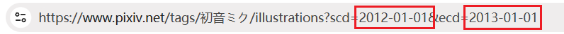

# FAQ

?> You can use the browser's search function (shortcut key is `F3` or `Ctrl` + `F`) and enter keywords to search on this page, which may help you find the needed content more quickly.

## Viewing Help Information

- There is a "FAQ" button in the bottom left corner of the downloader panel, which provides some basic help information.
- You can check the [Settings After Installation](/en/Settings-After-Installation) page to investigate some reasons.
- If you are unsure how to use a specific feature, please refer to the relevant content in this wiki.

## Checking Common Issues

- Check if there are error messages or related prompts displayed in the log at the top of the webpage.
- If the browser freezes for a while (becomes unresponsive) when starting, this is likely due to too many browser download records. Clearing the browser's download history should resolve this issue.
- If you are not using Chrome, Edge, or Firefox, please install this extension on one of these browsers to see if the issue persists. I do not provide support for other browsers.
- If your browser is not the latest version, please update it.
- Restart the browser and retry the previous operation to see if the issue is resolved.
- If this extension is not the latest version, please update to the latest version. You can check the extension's version number in the browser's extension store. If the installed extension is not the latest, usually waiting for a while will allow the browser to update automatically. Alternatively, you can remove the extension and reinstall it (this will clear the downloader's settings, so you can export the settings first).
- It could be a network connection issue; please check your network connection.
- The system partition (usually the C drive) may have insufficient free space. If the available space is less than 4GB, you may not be able to download some larger files due to browser limitations. Try clearing space on the system partition and restarting the browser.

?> If the issue persists, please refer to the information on the [Contact Me](/en/Contact-Me) page.

## Where Are the Downloaded Files Saved?

*File save location/Image save location/Save path*

Downloaded files are saved in the browser's download directory.

## Can Files Be Saved Outside the Browser's Download Directory?

**No**, this is a browser limitation.

When the downloader automatically saves files, it can only save them to the browser's download directory due to the browser's security policies.

## How to Change the Download Location

*Change download path/Download folder*

If you do not want files to be saved in the browser's download directory, you can only change the download location in the browser's settings.

Open the browser's settings page, find the "Downloads" section, and modify the default save location for files.

If you do not want to change the browser's file save location, you can manually move the files to another location after downloading.

## How to Create Folders

*Create folder/Create directory*

Use a slash `/` in the naming rule, and the part before the slash will be used as the folder name.

See detailed instructions: [Creating Folders](/en/Settings-Download?id=Creating-Folders)

## How to Save All Works of an Artist/User to the Same Folder

*How to group an artist's works together?*

Use the username in the naming rule to create a folder. For example: `{user}/{id}`.

## How to Save Multi-Image Works to Separate Folders

If you want this effect:

Single-image works are saved directly to the user's folder, while multi-image works are saved in an additional subfolder.

For example:

```
Downloads
│
├─葛飾ぱち
│  │  99097921.png
│  │
│  └─99276627
│          99276627_p0.png
│          99276627_p1.png
```

First, ensure that your naming rule includes the username to create a folder, such as `{user}/{id}`. The default naming rule `pixiv/{user}-{user_id}/{id}-{title}` also uses the username to create a folder.

Then enable this setting: [Create a Separate Folder for Each Work](/en/Settings-More-Naming?id=Create-a-Separate-Folder-for-Each-Work).

## Crawling Completed, but No Works Match the Filter Conditions

*Crawling result is 0*

Sometimes after crawling, you may see a prompt message:

<span class="log" style="color: rgb(210, 126, 0);">Crawling completed, but no works matching the filter conditions were found.</span>

This is because none of the crawled works meet the filter requirements.

The settings you see in the "Crawl" tab are filters, such as work type, image count, bookmark count, posting date, tag requirements, etc.

If you modify the filter conditions, it may result in a crawling result of 0, displaying the above prompt message.

For example, if you deselect the "illustration" type and all the crawled works are illustrations, the crawling result will be 0.

## Why Are There More Files Than Works Crawled?

Sometimes after crawling, you may see logs like this:

<span class="log">Crawled 10 works in total</span>

<span class="log">Crawled 20 files in total</span>

This is because some works may contain multiple images. In other words, one work may generate multiple files, which is normal.

## File Names Are Garbled After Downloading

*File name abnormal/File name garbled/UUID*

If the downloaded file names are a string of incomprehensible characters, like this:


Please check: [Issue with Abnormal File Names After Downloading](/en/Settings-After-Installation?id=Issue-with-Abnormal-File-Names-After-Downloading).

## File Names Have a .jfif Extension

*File extension is jfif*

Possible reasons:
1. Influence from other extensions.
2. If you selected "thumbnail" in the [Image Size](/en/Settings-More-Download?id=Image-Size) setting of the downloader, it is normal to download files in jfif format.

## Does It Support Resumable Downloads?

Yes, the downloader supports resumable downloads.

If the page crashes or you accidentally close it during downloading, you can reopen the page, and the downloader will resume the download progress, allowing you to continue downloading.

**How it works:**

After crawling is complete, the downloader saves the current download task data to IndexedDB. Once all files are downloaded, the downloader automatically clears the data for this task.

If the download is not complete, the downloader can use the saved data to resume the download progress. However, some actions may clear this data, making it **impossible to resume the task** after the page is closed. These include:
- Clicking the downloader's "Stop Download" button. This indicates you do not need to download the remaining files, so the downloader clears the task data.
- When you delete browser data, if you delete the data saved for each website, the task data will be cleared. In Chrome, this is the "Cookies and other site data" option.

## How to Avoid Downloading Duplicate Files

*How to avoid downloading works that have already been downloaded?*

You can enable the [Do Not Download Duplicate Files](/en/Settings-More-Download?id=Do-Not-Download-Duplicate-Files) feature.

In some cases, you can also consider using incremental updates to only crawl recently posted works. See the [Incremental Updates](/en/Tips?id=Incremental-Updates) section on the "Tips" page.

## Downloads Are Slow

What to do if downloads are slow or have no speed?

This is usually a network issue.

You can also try another method: After crawling, use the "Copy URL" function to copy the image URLs and use other software like IDM to download these files. This may improve download speed, but these software cannot rename files.

## Ugoira Downloads Are Slow

Ugoira files are typically large, so downloading takes longer, which is normal.

Additionally, since Pixiv's Ugoira source files are in zip format, converting them to other formats also takes some time.

If you confirm that the download speed is very slow (e.g., only a few hundred KB per second), please check if there is an issue with your network connection.

## Download Progress Stays at 0

Some users may encounter this issue: The file's download progress bar is full, but the file is not saved, and the total progress bar shows 0 completed tasks. The download cannot continue. See the image below:


You can try these solutions:

- Refresh the page; the downloader should resume downloading.
- Try restarting the browser or updating the browser and then retry downloading.
- Some browsers may encounter this issue due to compatibility problems. Please install this extension on Chrome, Edge, or Firefox.
- If the issue persists, try downloading a few works individually. If some can be downloaded but the problematic one cannot, it may be due to invalid characters in the file name. Try modifying the naming rule (remove certain naming rules) and redownload.
- If the issue still cannot be resolved, please refer to the [Contact Me](/en/Contact-Me) page to report the issue.

## What to Do If a Task Gets Stuck

*Download stuck/Task stuck*

This is generally a network issue; the worse the network condition, the more likely this problem occurs.

If crawling gets stuck, try waiting for a while to see if it resumes. If not, refresh the page and recrawl.

If downloading gets stuck, click the "Pause Task" button, then click the "Start Download" button to try resuming. You can also close the problematic page and reopen it to continue downloading.

?> If your network connection is unstable or download speed is slow, reduce the number of simultaneous downloads to lower the chance of getting stuck.

## Always Stuck, Unable to Download Any Images

*Unable to download files*

First, check for network issues. If the network is fine (you can access Pixiv normally and download speeds are decent), check the free space on the system drive (usually the C drive).

If the system drive has low free space, Chrome may block XHR requests for downloading larger files, causing downloads to fail repeatedly. Clear some space and try downloading again. This issue was identified by Reinford.

## Will It Automatically Retry If a Download Gets Stuck?

Yes.

When the network condition is poor, downloads may get stuck due to request timeouts or network interruptions. The downloader will automatically retry.

## Downloaded Images Are Corrupted

Downloaded images only display partially, with the rest missing.

This is due to a network issue during downloading, causing the file content to be corrupted. When viewing the image, only a portion may be decoded.

Redownload the corrupted image/work. You can open the work's page using the work ID in the file name and redownload it.

?> The URL for image works is fixed: Add the work ID after `https://www.pixiv.net/artworks/` and open it in the browser to access the work's page.

If the redownloaded image is still corrupted, it may be cached. Clear the browser's cache, refresh the page, and redownload the work. Alternatively, click the downloader's "Copy URL" button and use other download software (e.g., IDM) to download the file.

**Note:** This issue should not occur frequently. If it happens often, it indicates a network issue.

## Why Does the Download Progress Bar Turn Red?

This indicates an error occurred while downloading the file in that progress bar, likely due to network issues.

The downloader will attempt to redownload it, so you do not need to take action.

You can also check the log at the top of the webpage to see if help information is displayed and perform checks.

## Download Failed: USER_CANCELED

If you see this error message, possible reasons include:

- A "Save As" dialog pops up during downloading.
- The file name is too long.
- The download is intercepted by other software. The downloader instructs the browser to save the file, but occasionally other download software (e.g., IDM) may take over the download, causing the browser to cancel it. If this happens, disable the interception of Pixiv files in the other download software's settings.
- Other reasons.

Solutions for the first two cases are provided below.

## "Save As" Dialog Pops Up During Downloading

*Download triggers a "Save As" dialog/Save window*

If the browser displays a "Save As" dialog during downloading, check the following possible reasons:

**Reason 1**: Ensure that the "Ask where to save each file before downloading" setting is **disabled** in the browser settings.

If this setting is enabled, every file will trigger a "Save As" dialog, so you should disable it.

**Reason 2**: There may be duplicate file names. Check your naming rule.

If your naming rule includes `{id}` or `{id_num}` + `{p_num}`, there should be no duplicate file names; otherwise, duplicates may occur.

For example, for work ID 78279423 with three images, `{id}` or `{p_num}` adds a sequence number to avoid duplicates:

```
78279423_p0.jpg
78279423_p1.jpg
78279423_p2.jpg
```

Without a sequence number, duplicates occur:

```
78279423.jpg
78279423.jpg
78279423.jpg
```

If the naming rule does not include `{id}` or `{p_num}`, watch out for potential duplicate file names.

**Reason 3**: The file name may be too long.

Most operating systems have a file name length limit of 255 characters. If the file name exceeds this limit, the browser may not save the file and will display a "Save As" dialog for user action.

If you encounter this issue, enable the [File Name Length Restriction](/en/Settings-More-Naming?id=File-Name-Length-Restriction) feature to set a file name length limit.

**Reason 4**: The download location may not exist.

If your browser's download location is `D:\downloads` and this folder no longer exists, a "Save As" dialog will appear.

## What to Do If File Names Are Too Long

*File name too long/File name exceeds limit*

If you cannot save files due to overly long file names, enable the [File Name Length Restriction](/en/Settings-More-Naming?id=File-Name-Length-Restriction) feature to set a file name length limit.

## Why Do Downloaded Images Open Automatically?

*Images open automatically after downloading/Files open automatically/txt files open automatically*

Downloaded files do not open automatically by default, but the browser provides this feature.

For Chrome, you can right-click any file in the download list in the top-right corner and check the "Always open files of this type" setting:


If there is a checkmark ✔ in front of it, this feature is enabled. Click it again to uncheck it.

## Why Doesn't It Automatically Start Downloading on Search Pages?

*Not automatically starting download*

If you have enabled "Automatically start downloading" but the downloader does not start downloading on search pages, you can disable the [Preview Search Page Filter Results](/en/Settings-More-Enhancements?id=Preview-Search-Page-Filter-Results) feature.

## Date Format Error!

This occurs because the time format entered in the [Posting Time](/en/Settings-Crawl?id=Posting-Time) setting is incorrect, causing the downloader to display the error `Date format error!`.

As shown below, the value on the left is incorrect because it does not include the time:


This usually happens when you manually enter the date and time. Make sure to include the time.

## No Permission to Access a Work

This is because an unhandled error occurred while accessing a work.

It may be because the work is private or due to a network issue.

You can open the work's page; if it opens normally, you can download it individually.

## How to Download an ID List

If you have a list of work IDs and want the downloader to download these works, open the Pixiv homepage and use the [Crawl by Entering IDs](/en/Buttons-Crawl?id=Crawl-by-Entering-IDs) feature or similar functions.

## Browser Freezes on Startup

*Browser is slow/Browser unresponsive on startup/Browser freezes/Browser crashes*

This may be due to too many browser download records. Excessive download records can cause the browser to lag, especially when starting the browser or opening the download history page.

Clearing the browser's download history should resolve this issue.

For Chrome users, follow these steps:

Go to the browser's settings page, find the "Privacy and Security" section, and use the "Clear browsing data" function:


Set the "Time range" to "All time," select "Download history," and click "Clear data."

## How to Download in Batches

*Batch crawling/Batch downloading/Download in multiple sessions*

On pages with many results, if you expect a large number of crawling results, consider crawling and downloading in batches.

See: [Tip: Splitting Tasks](/en/Settings-Crawl?id=Tip:-Splitting-Tasks).

## File Name Sorting Is Messy on Android

*Android file manager sorting error/Sorting messy/File name sorting error/File sorting messy*

This issue typically occurs in the file manager on Android systems.

You can enable the [Pad Sequence Numbers with Zeros](/en/Settings-More-Naming?id=Pad-Sequence-Numbers-with-Zeros) feature to resolve this issue.

## How to Sort Downloaded Files in the Same Order as on the Webpage

*Image order/File order*

How to keep downloaded works in the same order as on the webpage?

See: [Sorting with Naming Tags](/en/Settings-Download?id=Sorting-with-Naming-Tags).

## How to Sort Downloaded Bookmarked Works by Bookmark Order

When downloading bookmarked works, how to make the downloaded files match the bookmark order?

This issue arises because the sorting of bookmarked works is not based on work IDs but on the time you bookmarked them. If the file name starts with the work ID, it will not match the bookmark order.

You can use the `{bmk_id}` tag at the start of the file name. See detailed instructions here: [Sorting with Naming Tags](/en/Settings-Download?id=Sorting-with-Naming-Tags).

## What to Do If Tag Search Can Only Crawl 1000 Pages?

When crawling on a search page, you may not be able to crawl all works because the downloader can only crawl 1000 pages or 5000 pages.

**Reason for the issue:**
- On search pages, regular Pixiv users can view up to 1000 pages of works. Premium members can view up to 5000 pages.
- The downloader can only crawl as many pages as you can view.
- This is a Pixiv limitation, and the downloader cannot bypass it.

If a tag has 3000 pages of works but you can only view 1000 pages, you will not be able to crawl all of them.

**How to solve this?**

Here are some feasible methods:

**Purchase a Pixiv Premium Membership**

Pixiv Premium members can view 5000 pages, so they are less likely to encounter this issue. Regular users, limited to 1000 pages, are more likely to face this problem.

?> On other pages, Pixiv Premium members also have access to more content. For example, on the [Latest Works from Followed Users](https://www.pixiv.net/bookmark_new_illust.php) page, regular users can view up to 34 pages, but Premium members can view up to 100 pages.

**Change Sorting to Crawl Double the Works**

Search pages have two sorting options:


The default sorting is from newest to oldest. You can crawl and download 1000 or 5000 pages of works, then return to the first page, click "Sort by oldest," and view or download earlier works.

Using this method, you can download up to 2000 or 10000 pages of works. If this still does not cover all works, consider other methods.

**Filter All Works by Posting Date**

On the search page, click "Search conditions" and set the "Posting period." For example, you can view works posted in a specific year:


Download the works from that year, then set the posting period to the previous year and download those works.

By repeating this process, you can theoretically crawl all works, but it is quite cumbersome.

**Tip:**
- The maximum time range here is 1 year. If the works in a year exceed 1000 pages, you can shorten the time range, e.g., to 6 months, to reduce the number of pages.
- Since Pixiv's built-in date picker is inefficient, you can modify the URL's date to improve efficiency (especially for very old works).

Set a random time range first, and the URL in the address bar will include the date:


Modify the date to your desired time range, for example:



Then press Enter. Pixiv will display the works from that year.

?> Although you can set a time range longer than 1 year in the URL, it is invalid, and Pixiv will still only show works from within 1 year.

## Error During Download, Status Code 0

Some users may encounter this error during downloading, with the downloader displaying `Error during download, status code 0` in the log.

This is because the downloader's request failed. Check the help information displayed in the log.

Possible reasons:
- Insufficient free space on the **system drive**, not other drives. If the system drive has less than 4 GB of free space, clear some space, restart the browser, and retry downloading.
- Network error. If you are using proxy software, try changing the route or proxy server.

## Pixiv Returned Empty Data

When crawling works, you may see this error message in the log:

<span class="log" style="color: #f00;">Pixiv returned empty data. The downloader has paused crawling and will resume after a few minutes. (429)<br>This indicates that your account has been restricted by Pixiv. It will return to normal after a few minutes.</span>

This is because too frequent requests triggered Pixiv's anti-crawling mechanism (429 error). The downloader will pause crawling and retry after a few minutes, so you do not need to take action.

## Total Works is 0, Pixiv May Have Rejected This Crawl

When crawling works on a search page, you may see this error message:

<span class="log" style="color: #f00;">Total works is 0, Pixiv may have rejected this crawl. Please try again later.</span>

The reason is the same as above.

## What Is a 429 Error?

*429 error/429 status code/429 restriction*

Pixiv has an anti-crawling mechanism, likely using a token bucket algorithm.

If the downloader sends too many crawling requests in a short period, exhausting all tokens, it triggers the anti-crawling mechanism, resulting in a 429 error.

This restriction lasts a few minutes. During this time, the downloader cannot crawl, and you cannot browse or bookmark works normally.

When the downloader encounters a 429 error, it pauses crawling and retries after a few minutes, so you do not need to take action.

Additionally, the downloader now enables the [Slow Down Crawling Speed](/en/Settings-More-Crawl?id=Slow-Down-Crawling-Speed) feature by default, which reduces the likelihood of triggering a 429 error but increases crawling time.

## Will Downloading Too Much Get My Account Banned?

*Will I get banned for downloading too much?/Will my account be banned?*

Yes.

If you frequently crawl and download large amounts of files, Pixiv may issue a warning. A second warning may result in Pixiv deleting your account.

See detailed instructions: [Handling Large Downloads](/en/Settings-After-Installation?id=Handling-Large-Downloads).

## Cannot Open EPUB Files

*Cannot open EPUB novels/EPUB novel files are corrupted*

If you cannot open EPUB novels generated by the downloader, try using a different novel reader.

You can search for "EPUB reader" to find suitable software.

Alternatively, you can read EPUB novels online at this website:

https://epub-reader.online/#