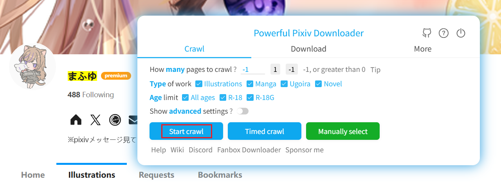
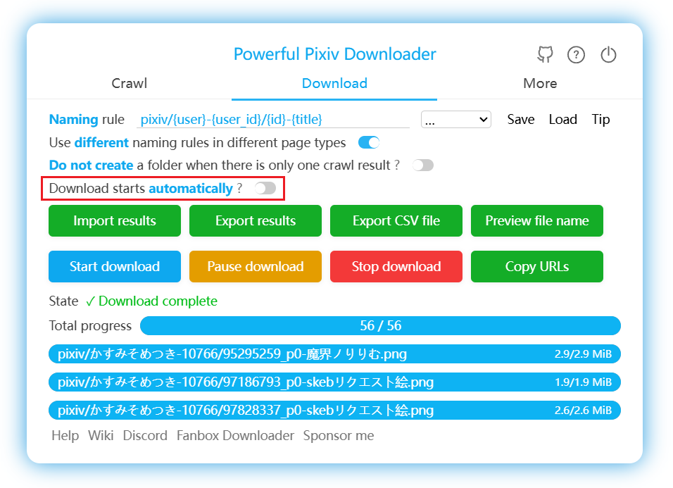
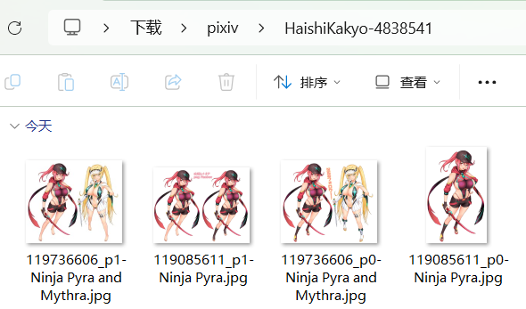

# Trying Your First Download

Open the following test page:

[まふゆ's Work List Page](https://www.pixiv.net/member_illust.php?id=5229572&type=illust ':target=_blank')

## Crawling and Downloading

Open the downloader panel and click the **Start Crawling** button:

The program will automatically start crawling works.

Once crawling is complete, the downloader will automatically begin downloading files. You can view and manage downloads in the **Download** tab:

If you don't want automatic downloading to start, you can disable this switch:

?> If a file download fails, the downloader will automatically retry downloading it. For more details, you can refer to the explanation in [Will It Automatically Retry on Download Failure?](/en/FAQ?id=will-it-automatically-retry-on-download-failure).

?> The downloader supports resuming interrupted downloads. If the page crashes or you accidentally close it during downloading, you can reopen the page, and the downloader will restore the download progress, allowing you to continue. For more details, refer to [Does It Support Resumable Downloads?](/en/FAQ?id=does-it-support-resumable-downloads).

?> If you frequently download large amounts of files, please check the instructions in [Large Downloads May Lead to Your Account Being Banned](/en/AfterInstallation?id=large-downloads-may-lead-to-your-account-being-banned).

During your first batch download, the browser may ask: "Allow this site to download multiple files?" Select "Allow."

## Logs

When the downloader performs tasks, it displays logs at the top of the page, including filtering conditions, crawling progress, download progress, and more. For example:

Start crawling Exclude work types: manga, Ugoira Exclude tag: BL Download 1 page starting from this page Crawling, please wait… Currently 48 works Fetching work information Crawled 48 works Crawled 141 files Crawling complete!  Downloading in progress Saving crawl results Crawl results saved  141 / 141  ✓ Download complete  

In the current version, logs are hidden by default. You can see a blue button at the top of the page, like this:

Click this button to show the logs. You can also use the shortcut key `L` to toggle the visibility of logs.

**Log Levels:**

The downloader has four log levels, each with a different color. Examples:

- 0 normal: Regular logs, colored black or white (depending on the downloader's light or dark theme).
- 1 success: Used for task start and completion logs, colored green.
- 2 warning: Used for notices or minor issues, colored brown.
- 3 error: Used for error messages, colored red.

## Status in the Title Bar

After crawling begins, the downloader adds symbols to the front of the page title to indicate its status. For example:

The `[↓]` at the start indicates downloading is in progress; the number 36 indicates 36 files remain to be downloaded.

Common statuses include:

- ↑ Crawling
- ↓ Downloading
- √ Download complete

Other less common statuses:

- → Crawling complete, awaiting next action (search page)
- ▶ Crawling complete, ready to start downloading (requires manual click of the "Start Download" button)
- ║ Download paused
- ■ Download stopped
- ☑ Download complete, but the page URL differs from the one when crawling started (usually because the user clicked a link to a new page)

## Save Location

Downloaded files are saved in the **browser's download directory**. The downloader will create subfolders to store files, for example:

?> The downloader cannot save files outside the browser's download directory due to browser restrictions. To save to a different location, change the browser's download directory.

## If You Encounter Issues

A common issue is abnormal file names after downloading, with no folders created by the downloader. If you encounter this, refer to [File Names Are Garbled After Downloading](/en/FAQ?id=file-names-are-garbled-after-downloading).

If it's a different issue, check the [FAQ](/en/FAQ) page.

If you still can't find the cause, refer to the [Contact Me](/en/Contact-Me) page.