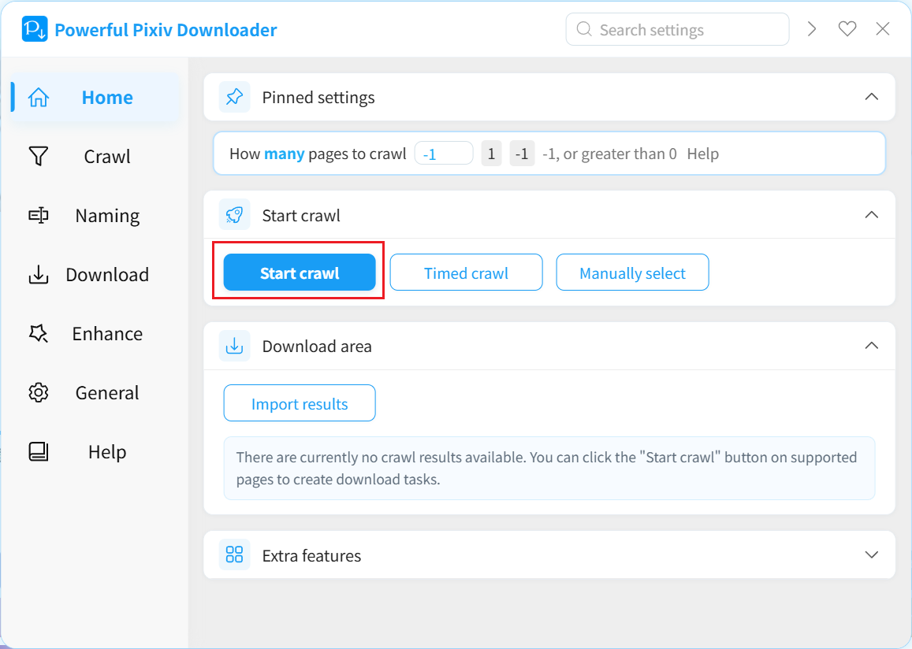
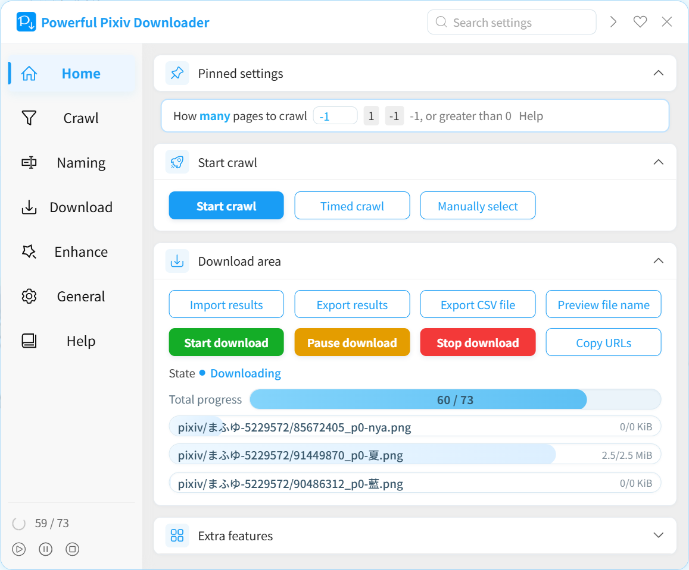
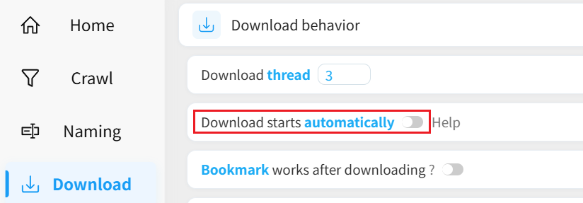
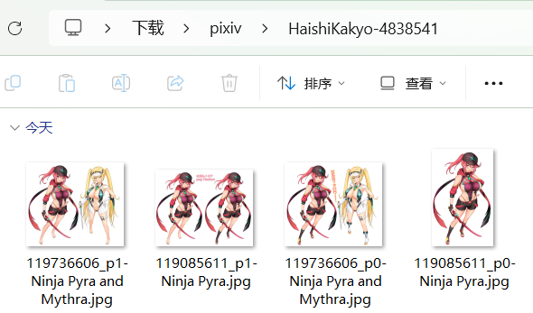

# Trying Your First Download

Open the test page below:

[まふゆ's Work List Page](https://www.pixiv.net/users/5229572/illustrations ':target=_blank')

## Crawling and Downloading

Open the downloader panel and click the **Start Crawling** button:

The downloader will automatically start crawling works.

Once crawling is complete, the downloader will automatically begin downloading files, and the progress will be shown in the Home page's "Download area":

PS: By default, the downloader automatically starts downloading. You can change this default behavior in the "Download" settings:

?> If a file download fails, the downloader will automatically retry downloading it. For more details, you can refer to the explanation in [Will It Automatically Retry on Download Failure?](/en/FAQ?id=will-it-automatically-retry-on-download-failure).

?> The downloader supports resuming interrupted downloads. If the page crashes or you accidentally close it during downloading, you can reopen the page, and the downloader will restore the download progress, allowing you to continue. For more details, refer to [Does It Support Resumable Downloads?](/en/FAQ?id=does-it-support-resumable-downloads).

?> If you frequently download large amounts of files, please check the instructions in [Large Downloads May Lead to Your Account Being Banned](/en/AfterInstallation?id=large-downloads-may-lead-to-your-account-being-banned).

During your first batch download, the browser may ask: "Allow this site to download multiple files?" Select "Allow."

## Logs

When the downloader performs tasks, it displays logs at the top of the page, including filtering conditions, crawling progress, download progress, and more. For example:

🚀Start crawl 🛸Excludes these types of works: Ugoira, Novels 🛸Excludes tag: BL Crawl all pages Getting, please wait... There are now 70 works Start getting work data Crawl threads: 3 ➡️Pending 0, Crawl a total of 70 works Crawled a total of 70 works, producing 73 crawl results ✅Crawl complete!  Crawl results saved Downloading ➡️73 / 73 ✅Download complete  

You can see a blue button at the top of the page, like this:

Click this button to show the logs. You can also use the shortcut key `L` to toggle the visibility of logs.

**Log Levels:**

The downloader has four log levels, each with a different color. Examples:

- 0 normal: Regular logs, colored black or white (depending on whether the downloader's theme is light or dark).
- 1 success: Used for logs showing task start and completion, colored green.
- 2 warning: Used for reminders or non-serious issues, colored brown.
- 3 error: Used for error messages, colored red.

## Status in the Title Bar

After crawling begins, the downloader adds symbols to the front of the page title to indicate its status. For example:

The `[↓]` at the start indicates downloading is in progress; the number 36 that follows means 36 files remain to be downloaded.

Common statuses include:

- ↑ Crawling
- ↓ Downloading
- √ Download complete

There are also some less common statuses:

- → Crawling complete, awaiting the next action (search page)
- ▶ Crawling complete, ready to start downloading (download starts only after you manually click the "Start Download" button)
- ║ Download paused
- ■ Download stopped
- ☑ Download complete, but the page URL differs from the one when crawling started (usually because the user clicked a link to a new page)

## Save Location

Downloaded files are saved in the **browser's download directory**. The downloader will create subfolders to store files, for example:

?> The downloader cannot save files outside the browser's download directory due to browser restrictions. To save to a different location, change the browser's download directory.

## If You Encounter Issues

A common issue is abnormal file names after downloading, and the downloader also does not create folders. If you encounter this issue, refer to [File Names Are Garbled After Downloading](/en/AfterInstallation?id=issues-with-abnormal-file-names-after-download).

If it's not the issue above, check the [FAQ](/en/FAQ) page.

If you still can't find the cause, refer to the [Contact Me](/en/Contact-Me) page.