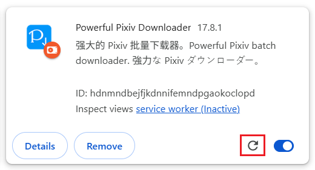

# How to Update

## Automatic Updates

If you installed this extension from a browser’s extension store, it will update automatically.

## Manual Updates

If you installed the extension offline, it will not update automatically.

You can check for new versions on the [releases page](https://github.com/xuejianxianzun/PixivBatchDownloader/releases ':target=_blank'). If a new version is available, you can update manually.

The steps for manual updating are mostly the same as those for [Offline Installation](/en/OfflineInstallation.md), with one difference: since you’ve already installed the extension, you need to overwrite the old version’s files.

Here are the general steps:

1. Download the latest version’s first zip file and extract it to obtain the `powerfulpixivdownloader` folder.
2. Move the `powerfulpixivdownloader` folder to the same location as the old version, overwriting the old version’s files.
3. In the extension management page, click the refresh button for this extension:

This will successfully load the new version of the extension.

?> The above method is an overwrite installation, which will not affect the downloader’s settings.

?> After updating the extension, if you have any open Pixiv pages in the browser, refresh them to use the newly installed extension. You can also restart the browser.