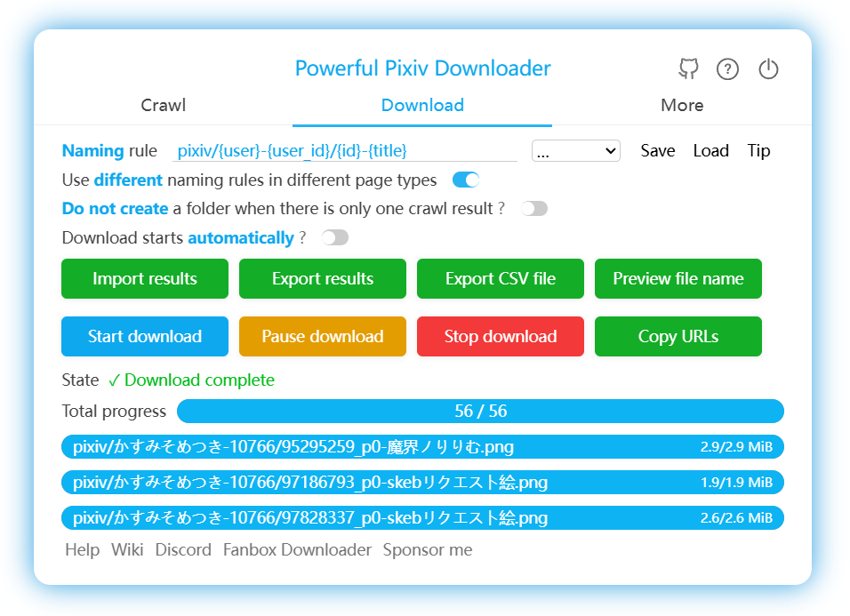

# Introduction

Pixiv Batch Downloader is a browser extension designed for batch downloading images and novels from [Pixiv.net](https://www.pixiv.net/ ':target=_blank'). It also includes enhanced features to optimize the Pixiv user experience.

Supported languages: Simplified Chinese, Traditional Chinese, Japanese, English, Korean, Russian.

Main features:

- Batch download all works of a Pixiv user, your bookmarks, your followed users, rankings, search results, etc.;
- Set multiple filtering conditions to select the works you want to download;
- Create folders using usernames, work titles, custom text, and other rules;
- Customize file names;
- Download illustrations, manga, Ugoira, and novels;
- One-click download for any work you see;
- Manually select (multi-select) works to download;
- Scheduled crawling and downloading;
- Convert Ugoira to WebM, GIF, or APNG formats;
- Save novels in TXT or EPUB formats;
- Save user avatars and cover images;
- Save download progress and resume incomplete downloads;
- Maintain download records to avoid duplicates;
- Batch bookmark works;
- Add tags to unclassified works in your bookmarks;
- Various enhanced features to optimize Pixiv usage and efficiency;
- Preview works and view original images without entering the work page;
- Built-in image viewer for multi-image works;
- Highlight followed users;

?> Official website: [pixiv.download](https://pixiv.download/ ':target=_blank')

## Screenshots

## Supported Pages

Below are the types of pages supported for downloading by this extension, with the numbers indicating the page type identifiers used in the program.

0 [Homepage](https://www.pixiv.net/)

1 [Work Page](https://www.pixiv.net/artworks/72503012)

2 [List Page](https://www.pixiv.net/users/544479/artworks)

2 [Novel List Page](https://www.pixiv.net/users/35419040/novels)

2 [Tag Page](https://www.pixiv.net/users/544479/artworks/%E6%9D%B1%E6%96%B9)

2 [Novel Tag Page](https://www.pixiv.net/users/35419040/novels/%E6%81%8B%E6%84%9B)

3 [Bookmark Page - Old Version](https://www.pixiv.net/bookmark.php)

4 [Bookmark Page - New Version](https://www.pixiv.net/users/9460149/bookmarks/artworks)

5 [Search Page](https://www.pixiv.net/tags/saber/artworks?s_mode=s_tag)

6 [Regional Rankings](https://www.pixiv.net/ranking_area.php?type=state&no=0)

7 [Rankings](https://www.pixiv.net/ranking.php)

8 [Pixivision](https://www.pixivision.net/en/a/3190)

9 [Bookmark Work Details](https://www.pixiv.net/bookmark_add.php?id=63148723)

10 [New Works by Followed Users](https://www.pixiv.net/bookmark_new_illust.php)

11 [Discovery](https://www.pixiv.net/discovery)

12 [Everyone's New Works](https://www.pixiv.net/new_illust.php)

13 [Novel Page](https://www.pixiv.net/novel/show.php?id=12771688)

14 [Novel Series Page](https://www.pixiv.net/novel/series/1090654)

15 [Novel Search Page](https://www.pixiv.net/tags/%E7%99%BE%E5%90%88/novels)

16 [Novel Rankings](https://www.pixiv.net/novel/ranking.php?mode=daily)

17 [New Novels by Followed Users](https://www.pixiv.net/novel/bookmark_new.php)

18 [Everyone's New Novels](https://www.pixiv.net/novel/new.php)

19 [Manga Series Page](https://www.pixiv.net/user/3698796/series/61267)

20 [Followed Users](https://www.pixiv.net/users/9460149/following)

21 [Requests](https://www.pixiv.net/request)

22 [Link-Only Access](https://www.pixiv.net/artworks/unlisted/CbLRCId2sY3ZzQDqnQj6)