# Installing on Microsoft Edge Canary Browser

?> You can watch a video on YouTube: [Installing the Extension on Microsoft Edge Canary Browser - Android](https://www.youtube.com/shorts/ignhT72ybRA)

## Installation Steps

Install the Microsoft Edge Canary browser from Google Play:

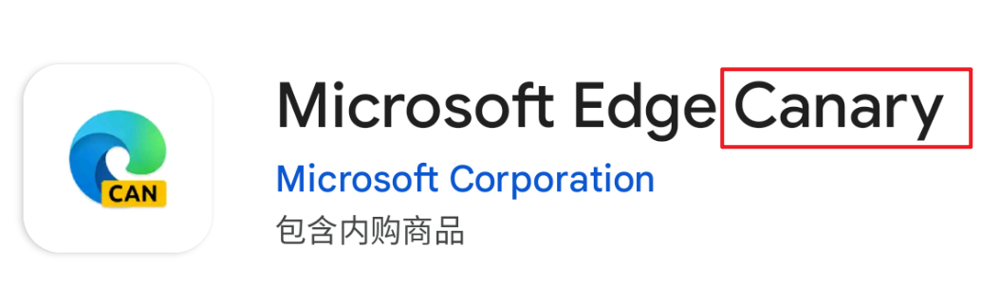

?>Currently, the stable version of Microsoft Edge does not support installing extensions, so the Canary version is required.

After installation, open the menu, go to **Settings** > **About Microsoft Edge**, and tap the version number multiple times to enable developer options:

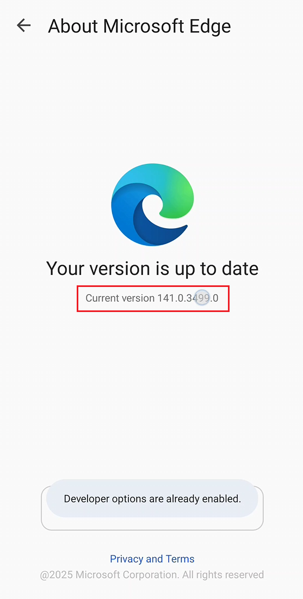

Return to the menu and select **Developer Options** at the bottom:

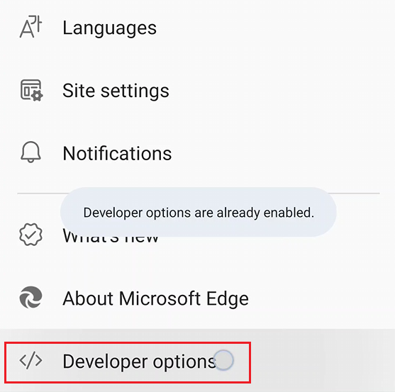

There are many features here; click **Extension install by crx**:

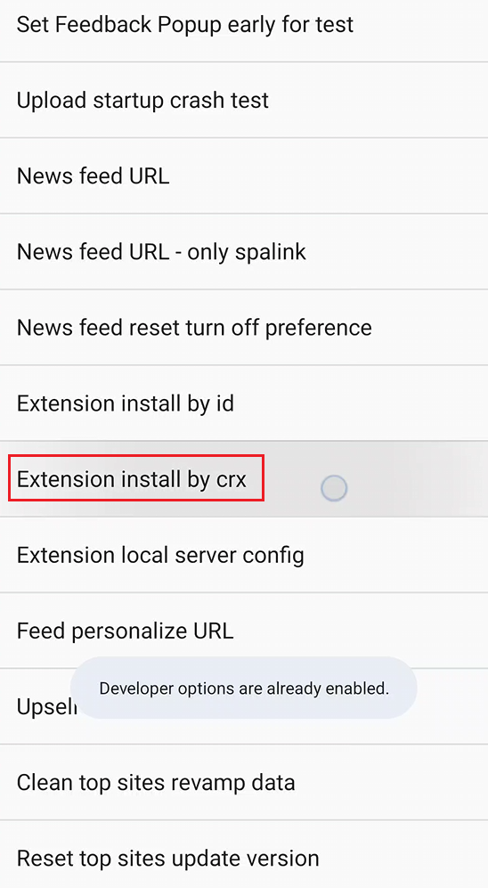

Click **Choose .crx file**:

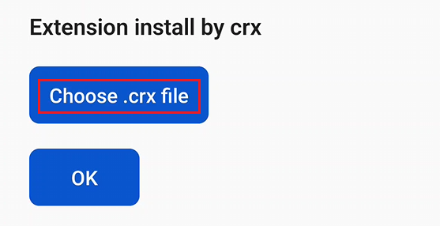

Select the downloader's crx file from the file manager and click **OK**:

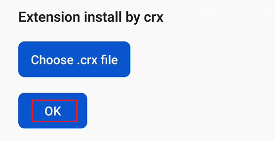

!> You must use a crx file, not a zip file.

----------

**How to obtain the crx file:**

You can download the crx file from the [releases page](https://github.com/xuejianxianzun/PixivBatchDownloader/releases) and transfer it to your Android device:

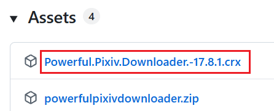

If no crx file is available, you can create one yourself. Download the zip file, extract it to a folder, and use the extension management page in a browser on your PC to select the folder and package it as a crx file. For example:

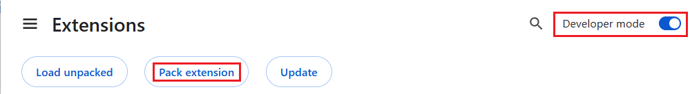

----------

Then agree to add the extension:

Afterward, from the Edge Canary browser's menu, click **Extensions**, and you should see the extension:

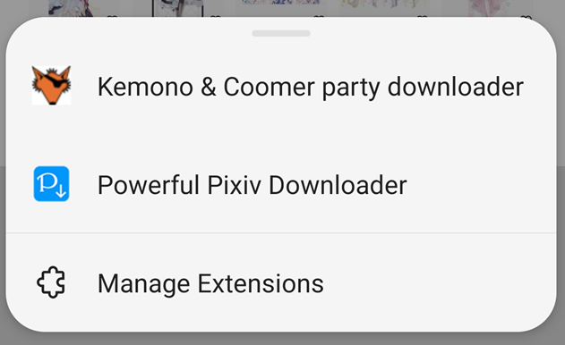

Open or refresh a pixiv.net page, and you should see the downloader's button on the right:

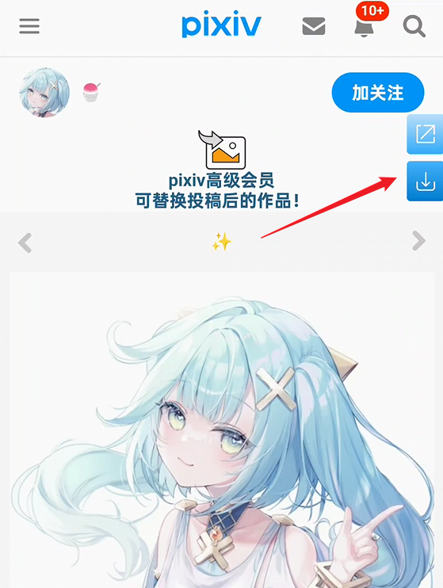

You can now use the downloader. Most of its features are the same as on PC, allowing batch downloads from various pages.

## Notes

- Downloaded files are saved in the **Download** folder on your device's storage. Edge Canary does not support changing the download directory, so files are saved here.
- On PC, the downloader can create subfolders to save files, but on Android, Edge Canary does not create subfolders (possibly due to system limitations), so files are saved directly in the download folder.
- Since the browser does not create folders, only the last segment of the downloader's naming rule takes effect. For example, the default naming rule is `pixiv/{user}-{user_id}/{id}-{title}`, but only `{id}-{title}` will apply. If you modify the naming rule, ensure the last segment includes `{id}`, which is the unique identifier for each file on Pixiv, to avoid duplicate filenames for different works.
- On PC, the downloader overwrites old files when saving duplicates, but Edge Canary saves duplicate files with added sequence numbers, for example:

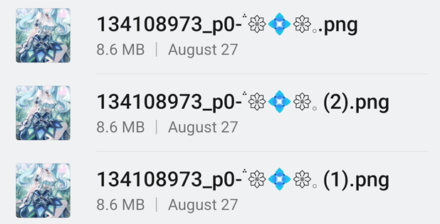

- On mobile web pages, some of the downloader's enhanced features may be unavailable or affected, such as work previews.
- If your device is in landscape mode (e.g., a tablet), try enabling desktop mode in the browser's menu to potentially improve the downloader's experience:

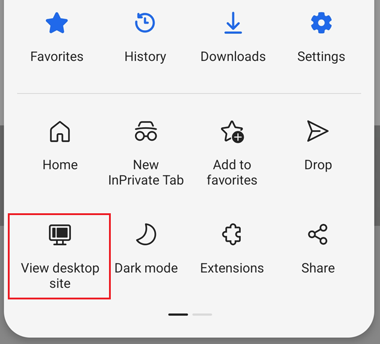

Landscape effect on a phone:

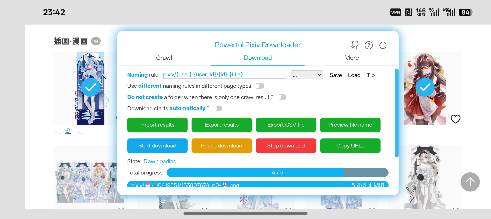

## Differences in Pagination

In some work list pages, the PC version of the webpage displays more works per page compared to the mobile version.

For example, on the bookmark page, the PC version shows 48 works per page, while the mobile version shows 18 works per page.

If you start crawling all works from the first page, this difference has no impact. However, if you need to set the page range for crawling or start crawling from a specific page in the middle, you should be aware of this difference because the downloader currently crawls based on the PC version's rules, assuming 48 works per page on the bookmark page.

Here is an example: A user has 31,544 bookmarks, which amounts to 658 pages on the PC version but 1,753 pages on the mobile version:

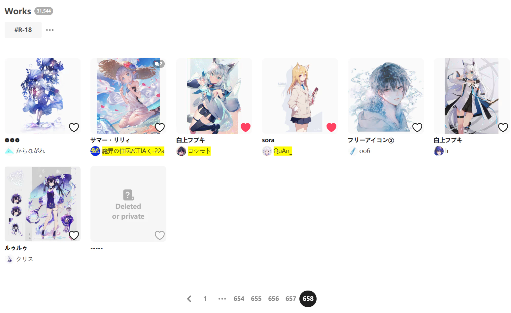

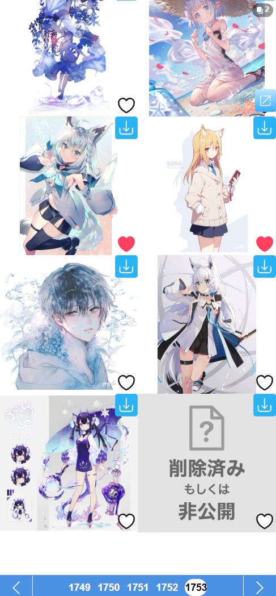

**Potential Impacts:**

- If you set the crawl page range to page 1 on the mobile version, the downloader will crawl 48 works, not the 18 works you see.
- If you start crawling from page 1,000 on the mobile version, the downloader will not crawl any works because there is no page 1,000 in the PC version.

Please understand these differences. Of course, you can also use the PC version of the page (desktop mode) to avoid these discrepancies.

## Keeping the Browser Visible When Converting Ugoira

Due to Android system characteristics, when the browser is switched to the background or the device screen is off, its power consumption is restricted.

This usually has little impact on the downloader, which can still crawl and download files normally. However, if the downloaded files include Ugoira, it may be significantly affected.

The downloader can convert Pixiv Ugoira into other formats (e.g., WebM, GIF, APNG), but the conversion process is CPU-intensive. If the browser is in the background or the device screen is off, the worst-case scenario is that Ugoira conversion may completely stop, causing the download progress to stall and preventing further downloads.

When necessary, keep the browser in the foreground or switch it to a small window mode (keeping it visible) to avoid this issue.