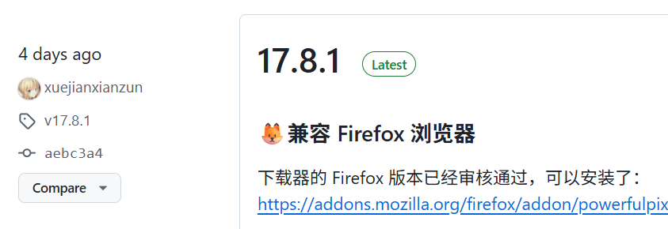
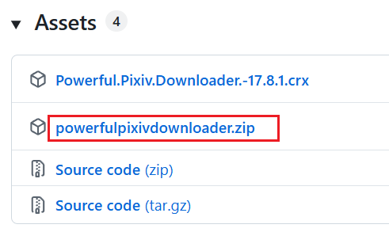
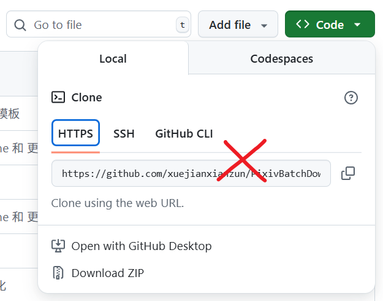
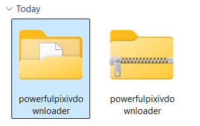
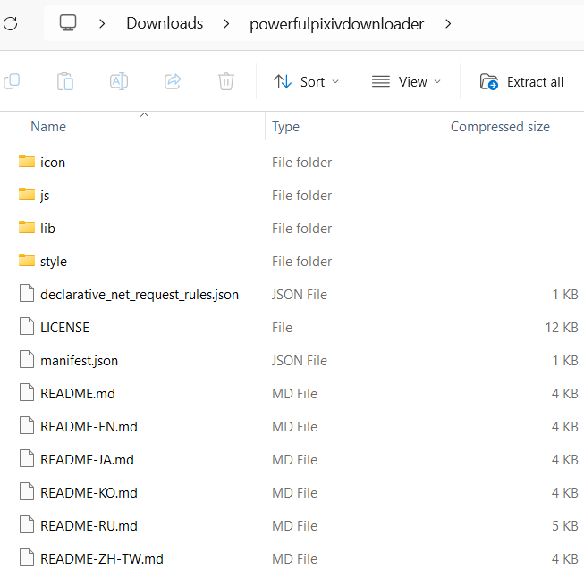
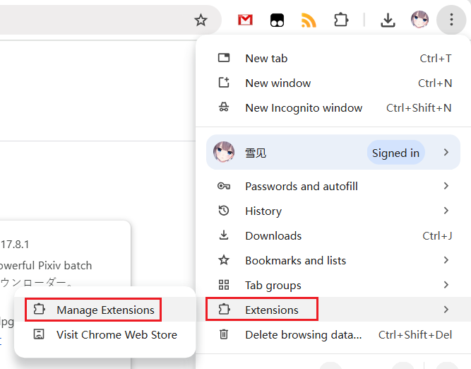
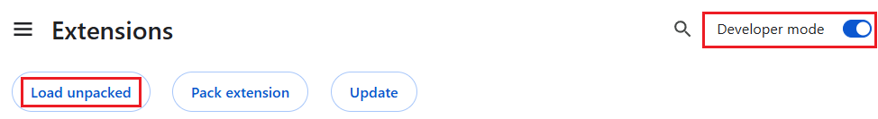
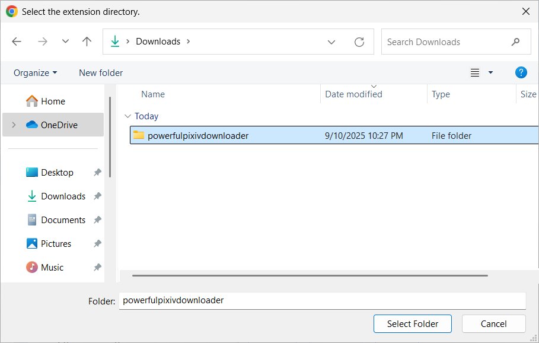
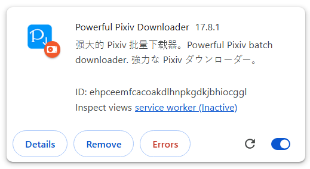

# Offline Installation

!> Before performing an offline installation, check the extension management page to see if this extension is already installed. Some users may have installed it online, in which case you should disable it first before installing the offline version to avoid running multiple instances of this extension simultaneously.

?> The steps below describe installation on a PC. If you want to install on Android, please refer to: [Installing on Microsoft Edge Canary Browser](/en/MicrosoftEdgeCanary.md)

## Download the File

Open the [GitHub releases page](https://github.com/xuejianxianzun/PixivBatchDownloader/releases ':target=_blank') for this program, where you can see the release versions, for example:

The topmost entry is the latest version. Download the `powerfulpixivdownloader.zip` file from the Assets section:

**Note:** Do not download the "Source code" archive or the entire project source code directly from the main page of the repository.

The source code is not a browser extension and cannot be installed directly. Only the `dist` directory contains the extension, but loading the `dist` directory is less convenient than downloading `powerfulpixivdownloader.zip`.

## Extract the File

Extract `powerfulpixivdownloader.zip` to a folder named `powerfulpixivdownloader`:

?> You can move this folder to another location if needed.

**Tip:** The zip file does not include a root folder containing all files, so you need to create a folder during extraction. Most extraction software provides this option.

The file structure inside the zip is as follows:

## Load the Extension

This section uses Chrome as an example.

You can access the extension management page by entering `chrome://extensions/` in the address bar or navigating through the menu:

The top of the extension management page may look like this:

Enable **Developer Mode** in the top-right corner. By default, it is disabled, so click the toggle to enable it.

Then, click **Load unpacked** and select the `powerfulpixivdownloader` folder:

**Note:** Select the folder itself, not its contents.

## Completion

The extension should now appear in the extension management page:

It will have an orange disk icon next to it, indicating it is a local extension. Its user experience is identical to the online-installed version, but it **cannot update automatically**.

?> After offline installation, if you have any open Pixiv pages in the browser, refresh them to use the newly installed extension.