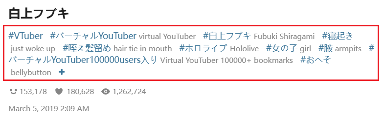

# Settings-Crawl

The **Crawl** tab of the downloader is used to set the crawling scope and filtering conditions.

## Show advanced settings

<p class="option" data-no="51" style="display: flex;">
    <span class="has_tip settingNameStyle1" data-xztip="_ShowAdvancedSettingsDescription" data-tip="The downloader hides some settings by default. Click to show all settings.<br>Hidden settings still take effect.">
    <span data-xztext="_ShowAdvancedSettings">Show <span class="key">advanced</span> settings</span>
    <span class="gray1"> ? </span>
    </span>
    <input type="checkbox" name="showAdvancedSettings" class="need_beautify checkbox_switch">
    <span class="beautify_switch" tabindex="0"></span>
    </p>

Controls whether advanced settings are displayed.

By default, this is not enabled, meaning advanced settings are not shown.

Since the downloader has many options, some less commonly used ones are hidden by default to make the interface cleaner and prevent new users from feeling overwhelmed by too many options.

?> Hidden settings still function normally.

## How many works to crawl

<p class="option" data-no="0" style="display: flex;">
    <span class="settingNameStyle1"><span class="setWantPageTip1 has_tip" data-xztip="_CrawlFromThisPageTip" data-xztext="_CrawlHowManyWorks" data-tip="Start crawling from the current page.<br>If you want to limit the number of pages to crawl, enter a number starting from 1.<br>1 means crawl only this page, -1 means crawl all pages.">Crawl <span class="key">how many</span> works</span><span class="gray1"> ? </span>
    </span>
    <input type="text" name="setWantPage" class="setinput_style1 blue setWantPage" value="-1">
    &nbsp;
    <button class="textButton grayButton" type="button" id="setMin">1</button>
    &nbsp;
    <button class="textButton grayButton" type="button" id="setMax">-1</button>
    &nbsp;
    <span class="setWantPageTip2 gray1" data-xztext="_NumberTip1">-1, or greater than 0</span>
    </p>

For pages where downloading is **based on works**, this setting will be displayed. You can set how many works to crawl.

?> The right side of this setting shows gray text to indicate the range of acceptable numbers. This range may vary depending on the page.

- On **illustration or novel work pages**, crawling starts from the current work (including the current work). Setting it to 1 will crawl only the current work. Setting it to -1 means no limit on the number of works, and the downloader will crawl from the current work to the last one.

- On **other pages** (e.g., rankings or followed users' new works), the downloader starts crawling from the first work on the current page. Setting it to 1 will crawl only the first work. Setting it to -1 means crawling all works on the current page.

## How many pages to crawl

<p class="option" data-no="1" style="display: flex;">
    <span class="settingNameStyle1"><span class="setWantPageTip1 has_tip" data-xztip="_CrawlFromThisPageTip" data-xztext="_CrawlHowManyPages" data-tip="Start crawling from the current page.<br>If you want to limit the number of pages to crawl, enter a number starting from 1.<br>1 means crawl only this page, -1 means crawl all pages.">Crawl <span class="key">how many</span> pages</span><span class="gray1"> ? </span>
    </span>
    <input type="text" name="setWantPage" class="setinput_style1 blue setWantPage" value="-1">
    &nbsp;
    <button class="textButton grayButton" type="button" id="setMin">1</button>
    &nbsp;
    <button class="textButton grayButton" type="button" id="setMax">-1</button>
    &nbsp;
    <span class="setWantPageTip2 gray1" data-xztext="_NumberTip1">-1, or greater than 0</span>
    </p>

When you are on **paginated list pages**, you will see this setting. You can set how many pages to crawl.

?> The right side of this setting shows gray text to indicate the range of acceptable numbers. This range may vary depending on the page.

The downloader always starts crawling **from the current page** (including the current page). If you are on page 1, it starts from page 1. If you are on page 2, it starts from page 2.

- Setting it to 1 will crawl only the works on the current page.
- Setting it to 2 will crawl the current page and the next page, and so on.
- Setting it to -1 will make the downloader crawl from the current page to the last page.

### Tip: Split Tasks

If you need to crawl a large number of pages, consider splitting the task into multiple sessions to reduce losses from unexpected issues (e.g., accidentally closing the tab or crawling getting stuck).

For example, if you need to crawl 1000 pages, you can do this:

1. Set the number of pages to crawl to 100, then start crawling from page 1. The downloader will crawl works from pages 1 to 100.
2. After downloading all files, you can close the page and reopen it to fully release memory.
3. You can wait for a while (for example, until the next day) before continuing to crawl.
4. Navigate to page 101 and start the next crawl. The downloader will crawl works from pages 101 to 200.
5. Continue in this manner.

**Page Navigation Tip:**

On paginated pages, you can modify the page number in the address bar to quickly jump to a specific page. Here's an example:

When you enter a search page, it defaults to page 1, and the address bar does not show a page number.

Click on any page number, such as page 2:


After navigating to page 2, the `p=2` in the address bar indicates the page number:


Change the `2` to the desired number, such as `101`, and press Enter:


This will take you to page 101.

## Type of work

<p class="option" data-no="2" style="display: flex;">
    <span class="settingNameStyle1">
    <span data-xztext="_作品类型"><span class="key">Type</span> of work</span>
    </span>
    <input type="checkbox" name="downType0" id="setWorkType0" class="need_beautify checkbox_common" checked="">
    <span class="beautify_checkbox" tabindex="0" aria-labelledby="setWorkType0"></span>
    <label for="setWorkType0" data-xztext="_Illustration" class="active">Illustration</label>
    <input type="checkbox" name="downType1" id="setWorkType1" class="need_beautify checkbox_common" checked="">
    <span class="beautify_checkbox" tabindex="0" data-xztitle="_Manga" title="Manga"></span>
    <label for="setWorkType1" data-xztext="_Manga" class="active">Manga</label>
    <input type="checkbox" name="downType2" id="setWorkType2" class="need_beautify checkbox_common" checked="">
    <span class="beautify_checkbox" tabindex="0"></span>
    <label for="setWorkType2" data-xztext="_Ugoira" class="active">Ugoira</label>
    <input type="checkbox" name="downType3" id="setWorkType3" class="need_beautify checkbox_common" checked="">
    <span class="beautify_checkbox" tabindex="0"></span>
    <label for="setWorkType3" data-xztext="_Novel" class="active">Novel</label>
    </p>

This setting allows you to filter the types of works you want to download.

The downloader checks the type of each work during crawling and excludes those that do not meet the criteria.

## Age restriction

<p class="option" data-no="44" style="display: flex;">
    <span class="settingNameStyle1">
    <span data-xztext="_年龄限制"><span class="key">Age</span> restriction</span>
    </span>
    <input type="checkbox" name="downAllAges" id="downAllAges" class="need_beautify checkbox_common" checked="">
    <span class="beautify_checkbox" tabindex="0"></span>
    <label for="downAllAges" data-xztext="_AllAges" class="active">All Ages</label>
    <input type="checkbox" name="downR18" id="downR18" class="need_beautify checkbox_common" checked="">
    <span class="beautify_checkbox" tabindex="0"></span>
    <label for="downR18" class="active"> R-18</label>
    <input type="checkbox" name="downR18G" id="downR18G" class="need_beautify checkbox_common" checked="">
    <span class="beautify_checkbox" tabindex="0"></span>
    <label for="downR18G" class="active"> R-18G</label>
    </p>

You can filter works based on their age restriction.

The downloader checks the age restriction of each work during crawling and excludes those that do not meet the criteria.

## AI works

<p class="option" data-no="81" style="display: flex;">
    <span class="settingNameStyle1">
    <span data-xztext="_AI作品"><span class="key">AI</span> works</span>
    </span>
    <input type="checkbox" name="AIGenerated" id="AIGenerated" class="need_beautify checkbox_common" checked="">
    <span class="beautify_checkbox" tabindex="0"></span>
    <label for="AIGenerated" data-xztext="_AIGenerated" class="active">AI Generated</label>
    <input type="checkbox" name="notAIGenerated" id="notAIGenerated" class="need_beautify checkbox_common" checked="">
    <span class="beautify_checkbox" tabindex="0"></span>
    <label for="notAIGenerated" data-xztext="_NonAIGenerated" class="active">Non-AI Generated</label>
    <input type="checkbox" name="UnknownAI" id="UnknownAI" class="need_beautify checkbox_common" checked="">
    <span class="beautify_checkbox" tabindex="0"></span>
    <label for="UnknownAI" data-xztext="_Unknown" class="has_tip active" data-xztip="_AIUnknownWorksDescription" data-tip="Early works have no tags and cannot be identified">Unknown</label>
    </p>

You can filter works based on whether they are AI-generated.

The downloader checks the AI tag of each work during crawling and excludes those that do not meet the criteria.

--------

When submitting new works, illustrations, manga, and Ugoira must specify whether they are AI-generated. For novels, this is optional. Therefore, the downloader can determine whether these works are AI-generated.

However, some works do not have this tag, so they are classified as `Unknown`. These are usually early works, as AI-generated image technology was not widespread at the time, and Pixiv did not require works to be tagged, so the downloader cannot determine if they are AI-generated. Generally, "Unknown" works can be treated as non-AI-generated.

## Bookmark status

<p class="option" data-no="6" style="display: flex;">
    <span class="settingNameStyle1">
    <span data-xztext="_收藏状态"><span class="key">Bookmark</span> status</span>
    </span>
    <input type="checkbox" name="downNotBookmarked" id="setDownNotBookmarked" class="need_beautify checkbox_common" checked="">
    <span class="beautify_checkbox" tabindex="0"></span>
    <label for="setDownNotBookmarked" data-xztext="_NotBookmarked" class="active">Not Bookmarked</label>
    <input type="checkbox" name="downBookmarked" id="setDownBookmarked" class="need_beautify checkbox_common3225" checked="">
    <span class="beautify_checkbox" tabindex="0"></span>
    <label for="setDownBookmarked" data-xztext="_Bookmarked" class="active">Bookmarked</label>
    </p>

You can filter works based on their bookmark status.

The downloader checks whether each work is bookmarked by you during crawling and excludes those that do not meet the criteria.

## Image color

<p class="option" data-no="23" style="display: flex;">
    <span class="settingNameStyle1">
    <span data-xztext="_图片色彩">Image <span class="key">color</span></span>
    </span>
    <input type="checkbox" name="downColorImg" id="setDownColorImg" class="need_beautify checkbox_common" checked="">
    <span class="beautify_checkbox" tabindex="0"></span>
    <label for="setDownColorImg" data-xztext="_ColorImage" class="active">Color Image</label>
    <input type="checkbox" name="downBlackWhiteImg" id="setDownBlackWhiteImg" class="need_beautify checkbox_common" checked="">
    <span class="beautify_checkbox" tabindex="0"></span>
    <label for="setDownBlackWhiteImg" data-xztext="_BlackWhiteImage" class="active">Black and White Image</label>
    </p>

You can filter works based on the color of the images.

If you set filters for color or black-and-white images, the downloader checks the average color of the image to determine if it is color or black-and-white. A common use case is to exclude black-and-white manga images.

The downloader checks this setting during both crawling and downloading.

?> Some images may appear mostly black-and-white but contain some color. These are considered color images, not black-and-white.

When downloading, if a file is excluded due to its color, a corresponding message will appear in the log. For example:

<span class="log" style="color: rgb(210, 126, 0);"><a href="https://www.pixiv.net/i/134469561#1" target="_blank">134469561_p0</a> was not saved because its color does not meet the settings.<br></span>

### Technical Details

The downloader divides the image into 4 parts and checks the color of each part. If any part is colored, the image is considered a color image. Only if all parts are black-and-white is the image considered black-and-white.

This is a rough method and may occasionally lead to misjudgments in extreme cases.

## Number of images

<p class="option" data-no="21" style="display: flex;">
    <span class="settingNameStyle1">
    <span data-xztext="_图片数量"><span class="key">Number</span> of images</span>
    </span>
    <input type="checkbox" name="downSingleImg" id="setDownSingleImg" class="need_beautify checkbox_common" checked="">
    <span class="beautify_checkbox" tabindex="0"></span>
    <label for="setDownSingleImg" data-xztext="_SingleImageWork" class="active">Single Image Work</label>
    <input type="checkbox" name="downMultiImg" id="setDownMultiImg" class="need_beautify checkbox_common" checked="">
    <span class="beautify_checkbox" tabindex="0"></span>
    <label for="setDownMultiImg" data-xztext="_MultiImageWork" class="active">Multi-Image Work</label>
    </p>

You can filter works based on the number of images.

The downloader checks this setting during crawling and excludes works that do not meet the criteria.

Single-image works have only one image; multi-image works contain multiple images, often marked in the top-right corner, for example:


## Multi-image works only download the first few images

<p class="option" data-no="3" style="display: flex;">
    <span class="has_tip settingNameStyle1" data-xztip="_MustBeGreaterThan0" data-tip="Must be greater than 0">
    <span data-xztext="_多图作品只下载前几张图片">Multi-image works only crawl the <span class="key">first few</span> images</span>
    <span class="gray1"> ? </span>
    </span>
    <input type="checkbox" name="firstFewImagesSwitch" class="need_beautify checkbox_switch">
    <span class="beautify_switch" tabindex="0"></span>
    <span class="subOptionWrap" data-show="firstFewImagesSwitch" style="display: none;">
    <input type="text" name="firstFewImages" class="setinput_style1 blue" value="1">
    </span>
    </p>

You can choose to download only the first few images of multi-image works.

-------

In some multi-image works, the first image is the most valuable. For example, the first image may be in color, while the following images are black-and-white or promotional. In such cases, you can set the number to 1 to download only the first image.

You can also use this setting to avoid downloading too many images.

?> If the set number is greater than or equal to the number of images in the work, the downloader will save all images, equivalent to no limit.

## Maximum number of images for multi-image works

<p class="option" data-no="47" style="display: flex;">
    <span class="has_tip settingNameStyle1" data-xztip="_MultiImageWorkLimitTip" data-tip="If the number of images in a multi-image work exceeds the set number, the downloader will not crawl this work.">
    <span data-xztext="_多图作品的图片数量上限"><span class="key">Maximum number</span> of images for multi-image works</span>
    <span class="gray1"> ? </span>
    </span>
    <input type="checkbox" name="multiImageWorkImageLimitSwitch" class="need_beautify checkbox_switch">
    <span class="beautify_switch" tabindex="0"></span>
    <span class="subOptionWrap" data-show="multiImageWorkImageLimitSwitch" style="display: none;">
    &lt;=&nbsp;
    <input type="text" name="multiImageWorkImageLimit" class="setinput_style1 blue" value="1">
    </span>
    </p>

If a multi-image work has more images than the set number, the downloader will not crawl that work.

## Number of bookmarks

<p class="option" data-no="5" style="display: flex;">
    <span class="has_tip settingNameStyle1" data-xztip="_BookmarkCountTip" data-tip="If a work's bookmark count is less than the set number, it will not be downloaded.">
    <span data-xztext="_收藏数量">Number of <span class="key">bookmarks</span></span>
    <span class="gray1"> ? </span>
    </span>
    <input type="checkbox" name="BMKNumSwitch" class="need_beautify checkbox_switch">
    <span class="beautify_switch" tabindex="0"></span>
    <span class="subOptionWrap" data-show="BMKNumSwitch" style="display: none;">
    &gt;=&nbsp;
    <input type="text" name="BMKNumMin" class="setinput_style1 blue bmkNum" value="0">
    &lt;=&nbsp;
    <input type="text" name="BMKNumMax" class="setinput_style1 blue bmkNum" value="9999999">
&nbsp;<span data-xztext="_Or"> Or </span>
    <span class="has_tip settingNameStyle1" data-xztip="_DailyBookmarkCountTip" data-tip="You can set the average daily bookmark count. Works meeting this condition will be downloaded.">
    <span data-xztext="_DailyBookmarkCount">Daily Bookmark Count</span>
    <span class="gray1"> ? </span>
    </span>
    <input type="checkbox" name="BMKNumAverageSwitch" class="need_beautify checkbox_switch">
    <span class="beautify_switch" tabindex="0"></span>
    <span class="subOptionWrap" data-show="BMKNumAverageSwitch" style="display: none;">
    &gt;=&nbsp;
    <input type="text" name="BMKNumAverage" class="setinput_style1 blue bmkNum" value="600">
    </span>
    </span>
    </p>

Bookmark count refers to how many people have bookmarked a work. The higher the bookmark count, the more valuable the work.

This setting has two options:

1. Bookmark Count (total)
2. Daily Bookmark Count

A work will be downloaded if it meets **either** of these conditions.

### Daily Bookmark Count

The daily bookmark count is calculated as `Bookmark Count / Days Since Posting`, designed to optimize crawling for newly published works, especially those published less than a day ago.

Some recently submitted works may have high quality but low bookmark counts due to their short posting time. You can use this setting to crawl such works.

For example, if a work published 6 hours ago has 500 bookmarks, its daily bookmark count is estimated at 2000. If you set the daily bookmark count to around `2000`, you can crawl it.

?> If a work has been published for less than 4 hours, the downloader will not estimate its 24-hour bookmark count, as this is inaccurate. If its bookmark count within 4 hours meets the "Daily Bookmark Count" requirement, the downloader will keep it; otherwise, it will be excluded.

"Daily Bookmark Count" is an optional setting and should be used as a supplementary setting, not the only one. This is because **Daily Bookmark Count is unfair to works published long ago**.

Bookmark count growth is a curve. Generally, the daily bookmark count grows quickly shortly after posting and slows down over time.

Consider the following scenario:

- Work A, published for 1 day, has 30 bookmarks. Daily average: 30.
- Work B, published for 5 years, has 50,000 bookmarks. Daily average: 27.

When comparing daily bookmark counts, the high-quality Work B has a lower daily average than the average-quality Work A, which may not meet your expectations.

?> Unless you know exactly what you're doing, do not use "Daily Bookmark Count" alone.

Alternatively, if you want to use only "Daily Bookmark Count" without the total count, you can set the minimum and maximum bookmark counts to an impossible range like `999999 - 9999999`, then set the "Daily Bookmark Count" to effectively use it alone.

## Width and height

<p class="option" data-no="7" style="display: flex;">
    <span class="has_tip settingNameStyle1" data-xztip="_FilterDimensionsTip" data-tip="Enter the minimum width and height; images that do not meet the requirements will not be downloaded.">
    <span data-xztext="_图片的宽高"><span class="key">Width</span> and height</span>
    <span class="gray1"> ? </span>
    </span>
    <input type="checkbox" name="setWHSwitch" class="need_beautify checkbox_switch">
    <span class="beautify_switch" tabindex="0"></span>
    <span class="subOptionWrap" data-show="setWHSwitch" style="display: none;">
    <input type="radio" name="widthHeightLimit" id="widthHeightLimit1" class="need_beautify radio" value="&gt;=" checked="">
    <span class="beautify_radio" tabindex="0"></span>
    <label for="widthHeightLimit1" class="active">&gt;=</label>
    <input type="radio" name="widthHeightLimit" id="widthHeightLimit1" class="need_beautify radio" value="=">
    <span class="beautify_radio" tabindex="0"></span>
    <label for="widthHeightLimit2">=</label>
    <input type="radio" name="widthHeightLimit" id="widthHeightLimit3" class="need_beautify radio" value="&lt;=">
    <span class="beautify_radio" tabindex="0"></span>
    <label for="widthHeightLimit3">&lt;=</label>
    <span class="verticalSplit"></span>
    <span data-xztext="_Width">Width</span>
    <input type="text" name="setWidth" class="setinput_style1 blue" value="0">
    <input type="radio" name="setWidthAndOr" id="setWidth_AndOr1" class="need_beautify radio" value="&amp;" checked="">
    <span class="beautify_radio" tabindex="0"></span>
    <label for="setWidth_AndOr1" data-xztext="_And" class="active"> And </label>
    <input type="radio" name="setWidthAndOr" id="setWidth_AndOr2" class="need_beautify radio" value="|">
    <span class="beautify_radio" tabindex="0"></span>
    <label for="setWidth_AndOr2" data-xztext="_Or"> Or </label>
    <span data-xztext="_Height">Height</span>
    <input type="text" name="setHeight" class="setinput_style1 blue" value="0">
    </span>
    </p>

You can set the width and height conditions for the images you want to download. The downloader will not download images that do not meet these conditions.

**Tips:**

- The `>=`, `=`, or `<=` conditions apply to both width and height.
- The first input box sets the width, and the second sets the height.
- Selecting `And` means the image's width and height must both meet the set conditions.
- Selecting `Or` means the image only needs to meet either the width or height condition.
- The default values for width and height are 0, meaning no restrictions.

?> For example, you can set `>= Width 1920 And Height 1080` to filter images suitable for computer wallpapers.

## Aspect ratio

<p class="option" data-no="8" style="display: flex;">
    <span class="has_tip settingNameStyle1" data-xztip="_SetAspectRatioTitle" data-tip="Set the aspect ratio, or manually enter the aspect ratio">
    <span data-xztext="_图片的宽高比例">Aspect <span class="key">ratio</span></span>
    <span class="gray1"> ? </span>
    </span>
    <input type="checkbox" name="ratioSwitch" class="need_beautify checkbox_switch">
    <span class="beautify_switch" tabindex="0"></span>
    <span class="subOptionWrap" data-show="ratioSwitch" style="display: none;">
    <input type="radio" name="ratio" id="ratio1" class="need_beautify radio" value="horizontal" checked>
    <span class="beautify_radio" tabindex="0"></span>
    <label for="ratio1" data-xztext="_Horizontal" class="active">Horizontal</label>
    <input type="radio" name="ratio" id="ratio2" class="need_beautify radio" value="vertical">
    <span class="beautify_radio" tabindex="0"></span>
    <label for="ratio2" data-xztext="_Vertical">Vertical</label>
    <input type="radio" name="ratio" id="ratio0" class="need_beautify radio" value="square">
    <span class="beautify_radio" tabindex="0"></span>
    <label for="ratio0" data-xztext="_Square">Square</label>
    <input type="radio" name="ratio" id="ratio3" class="need_beautify radio" value="userSet">
    <span class="beautify_radio" tabindex="0"></span>
    <span class="has_tip settingNameStyle" data-xztip="_宽高比的提示" data-tip="Aspect ratio is the number obtained by dividing the width by the height.&lt;br&gt;When the aspect ratio is less than 1, the image is portrait.&lt;br&gt;When the aspect ratio is greater than 1, the image is landscape.&lt;br&gt;The larger the aspect ratio, the more elongated the image.">
      <label for="ratio3" style="padding: 0;" data-xztext="_宽高比" class="active">Ratio</label>
      <span class="gray1"> ? </span>
    </span>
    <input type="radio" name="userRatioLimit" id="userRatioLimit1" class="need_beautify radio" value="&gt;=" checked="">
    <span class="beautify_radio" tabindex="0"></span>
    <label for="userRatioLimit1" class="active">&gt;=</label>
    <input type="radio" name="userRatioLimit" id="userRatioLimit2" class="need_beautify radio" value="=">
    <span class="beautify_radio" tabindex="0"></span>
    <label for="userRatioLimit2">=</label>
    <input type="radio" name="userRatioLimit" id="userRatioLimit3" class="need_beautify radio" value="&lt;=">
    <span class="beautify_radio" tabindex="0"></span>
    <label for="userRatioLimit3">&lt;=</label>
    <input type="text" name="userRatio" class="setinput_style1 blue" value="1.4">
    </span>
    </p>

You can download only images of specific shapes:

Horizontal, Vertical, or Square.

?> Horizontal images have a width greater than their height; vertical images have a width less than their height.

You can also manually set the range of the image aspect ratio.

?> The aspect ratio is the width divided by the height. An aspect ratio less than 1 indicates a vertical image. An aspect ratio greater than 1 indicates a horizontal image. The larger the aspect ratio, the flatter and longer the image appears.

## ID range

<p class="option" data-no="9" style="display: flex;">
    <span class="has_tip settingNameStyle1" data-xztip="_SetIDRangeTip" data-tip="You can enter a work ID to crawl works newer or older than it">
    <span data-xztext="_id范围"><span class="key">ID</span> range</span>
    <span class="gray1"> ? </span>
    </span>
    <input type="checkbox" name="idRangeSwitch" class="need_beautify checkbox_switch">
    <span class="beautify_switch" tabindex="0"></span>
    <span class="subOptionWrap" data-show="idRangeSwitch" style="display: none;">
    <input type="radio" name="idRange" id="idRange1" class="need_beautify radio" value="&gt;" checked="">
    <span class="beautify_radio" tabindex="0"></span>
    <label for="idRange1" class="active">&gt;</label>
    <input type="radio" name="idRange" id="idRange2" class="need_beautify radio" value="&lt;">
    <span class="beautify_radio" tabindex="0"></span>
    <label for="idRange2">&lt;</label>
    <input type="text" name="idRangeInput" class="setinput_style1 w100 blue" value="0" placeholder="0">
    </span>
    </p>

You can download only works with IDs greater than or less than a specific ID.

### Tip: Incremental Update

This setting is useful for incremental updates. Since work IDs are positively correlated with posting time (later works have larger IDs), you can use this to crawl newer works.

For example: If you previously downloaded works from a user's page and the largest ID in the filenames was 65000000, you can set the ID range to greater than 65000000 to crawl works published after that.

## Posting time

<p class="option" data-no="10" style="display: flex;">
      <a href="https://xuejianxianzun.github.io/PBDWiki/#/en/Settings-Crawl?flag=10" target="_blank" class="has_tip settingNameStyle" data-xztip="_设置投稿时间提示" data-tip="You can download works posted in a specified period of time">
        <span data-xztext="_投稿时间">Posting <span class="key">time</span></span>
        <span class="gray1"> ? </span>
      </a>
      <input type="checkbox" name="postDate" class="need_beautify checkbox_switch">
      <span class="beautify_switch" tabindex="0"></span>
      <span class="subOptionWrap" data-show="postDate" style="display: none;">
        <input type="datetime-local" name="postDateStart" placeholder="yyyy-MM-dd HH:mm" class="setinput_style1 postDate blue" value="2009-01-01T00:00">
        <button class="textButton grayButton mr0" type="button" role="setDate" data-for="postDateStart" data-value="2009-01-01T00:00" data-xztext="_过去">Past</button>
        <button class="textButton grayButton" type="button" role="setDate" data-for="postDateStart" data-value="now" data-xztext="_现在">Now</button>
        -&nbsp;
        <input type="datetime-local" name="postDateEnd" placeholder="yyyy-MM-dd HH:mm" class="setinput_style1 postDate blue" value="2100-01-01T00:00">
        <button class="textButton grayButton mr0" type="button" role="setDate" data-for="postDateEnd" data-value="now" data-xztext="_现在">Now</button>
        <button class="textButton grayButton" type="button" role="setDate" data-for="postDateEnd" data-value="2100-01-01T00:00" data-xztext="_未来">Future</button>
      </span>
    </p>

You can download only works published within a specific time range.

You can click the icon to the right of the input field to use the browser's time and date picker, or you can enter the value manually.

**Note:** When entering the value manually, you must include the full time and date. As shown in the image below, the value on the left is incorrect because it doesn't include the time:


?> The first illustration on Pixiv is https://www.pixiv.net/artworks/20, published at `2007-09-09T13:14:07+00:00`.

### Tip: Incremental Update

This setting is useful for incremental updates. For example:

If the last download's cutoff date was January 1, 2020, when downloading again on the same page, you can set the posting time starting from January 1, 2020, and ending at the present or a future time to download only works updated during that period.

---

If you want to set only a start or end time, how should you set the other time?

For example, if I want to download all works before 2010, I can set the start time to a time earlier than the Pixiv creation date (you can also click the `Past` button), and set the end time to 2010, for example:

`2009-01-01 00:00 - 2010-01-01 00:00`

If I want to download all works after 2020, I can set the end time to a future time (you can also click the `Future` button), for example:

`2020-01-01 00:00 - 2100-01 00:00`

## Include tag

<p class="option" data-no="11" style="display: flex;">
    <span class="has_tip settingNameStyle1" data-xztip="_RequiredTagsTip" data-tip="You can set tags that works must contain before downloading, case-insensitive; use commas to separate multiple tags.">
    <span data-xztext="_必须含有tag"><span class="key">Include</span> tag</span>
    <span class="gray1"> ? </span>
    </span>
    <input type="checkbox" name="needTagSwitch" class="need_beautify checkbox_switch">
    <span class="beautify_switch" tabindex="0"></span>
    <span class="subOptionWrap" data-show="needTagSwitch" style="display: none;">
    <input type="radio" name="needTagMode" id="needTagMode1" class="need_beautify radio" value="all" checked="">
    <span class="beautify_radio" tabindex="0"></span>
    <label for="needTagMode1" data-xztext="_All" class="active">All</label>
    <input type="radio" name="needTagMode" id="needTagMode2" class="need_beautify radio" value="one">
    <span class="beautify_radio" tabindex="0"></span>
    <label for="needTagMode2" data-xztext="_Any">Any</label>
    <input type="text" name="needTag" class="setinput_style1 blue setinput_tag" placeholder="tag1,tag2,tag3">
    </span>
    </p>

You can require works to contain certain tags. Works without these tags will not be crawled.

?> Tags refer to the tag list below the work's description, for example:



### Matching Mode

You can choose between two matching modes:
- All: The default, requiring each work to contain **all** the tags set here.
- Any: Each work only needs to have **any one** of the tags set here.

**Tips:**
- You can add multiple tags, separated by **English commas** `,`.
- Case-insensitive.
- Tags are strictly **exact matches**. If you set `東方 Project` but a work only has `東方`, it will not qualify.
- If you set multiple tags, the downloader will judge based on the "All" or "Any" mode.
- Using Japanese (original) tags is recommended. Translated tags are not recommended.

### Example

Works tagged with `东方 Project` may have inconsistent tags, such as:

`東方Project,東方,東方プロジェクト`

Some works may only have one of these tags, so searching for just one tag may be incomplete. You can include all three tags and set the mode to "Any" to avoid missing `东方 Project` works.

## Excluded tag

<p class="option" data-no="12" style="display: flex;">
    <span class="has_tip settingNameStyle1" data-xztip="_ExcludeTagsTip" data-tip="You can set tags to exclude before downloading, so works containing these tags will not be downloaded.<br>Case-insensitive; use commas to separate multiple tags.<br>Note that excluded tags have higher priority than required tags.">
    <span data-xztext="_不能含有tag"><span class="key">Exclude</span> tag</span>
    <span class="gray1"> ? </span>
    </span>
    <input type="checkbox" name="notNeedTagSwitch" class="need_beautify checkbox_switch">
    <span class="beautify_switch" tabindex="0"></span>
    <span class="subOptionWrap" data-show="notNeedTagSwitch" style="display: none;">
    <span class="gray1" data-xztext="_Any">Any</span>
    <span class="verticalSplit"></span>
    <input type="radio" id="tagMatchMode1" class="need_beautify radio" name="tagMatchMode" value="partial" checked="">
    <span class="beautify_radio" tabindex="0"></span>
    <label for="tagMatchMode1" data-xztext="_PartialMatch">Partial Match</label>
    <input type="radio" id="tagMatchMode2" class="need_beautify radio" name="tagMatchMode" value="whole" checked="">
    <span class="beautify_radio" tabindex="0"></span>
    <label for="tagMatchMode2" data-xztext="_ExactMatch" class="active">Exact Match</label>
    <textarea class="centerPanelTextArea beautify_scrollbar" name="notNeedTag" rows="1" placeholder="tag1,tag2,tag3"></textarea>
    </span>
    </p>

You can require works to not contain certain tags. If a work has **any one** of the tags set here, the downloader will not crawl it.

**Tips:**

- You can add multiple tags, separated by **English commas** `,`.
- If multiple tags are set, a work with **any one** of them will not be downloaded.
- Case-insensitive.
- The **priority** of "Excluded Tags" is higher than "Required Tags". If a work meets both conditions, the downloader will exclude it (i.e., not crawl or download it).
- Using Japanese (original) tags is recommended. Translated tags are not recommended.

### Matching Mode

You can input multiple tags, but this feature only has the **Any** mode, not **All**. This means if a work has **any one** of the tags set here, the downloader will not crawl it.

For **each** input tag, you can set the matching mode:

- Partial Match: If a tag in the work **contains or exactly matches** an input tag, it will be excluded. For example, if you set the `abc` tag, works with `abc` or `abcd` will be excluded.
- Exact Match: The default, requiring **exact matches**. If you set the `abc` tag, only works with the exact `abc` tag will be excluded.

?> The default "Exact Match" is highly accurate but less flexible. "Partial Match" allows for broader matching but may sometimes cause misjudgments.

### Example

Crawling results may include some BL (boys' love) works, which can be difficult to exclude due to the variety and increasing number of BL-related tags.

If using "Exact Match", you must set complete tags, such as:

```
BL,腐向け,腐向けHQ,Free!,腐ree!,BL松,刀剣乱舞,刀剣乱腐,黒子のバスケ,鬼灯の腐向け,創作BL,◆A【腐】,腐術廻戦,dcst腐向け
```

With "Partial Match", you only need to set high-frequency keywords to exclude most BL works, such as:

```
BL,腐
```

!> Note: "Partial Match" is not entirely accurate and may cause incorrect exclusions in some cases. For example, setting `BL` might exclude works with the `blue` tag. If accuracy is important, use "Exact Match".
