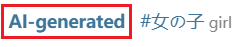
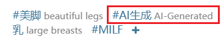
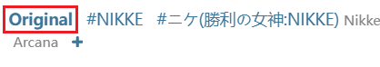
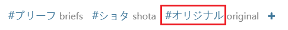
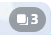

## Type of work

<div class="option settingsPanel_optionCard" data-no="3" data-pin-bound="true" style="display: flex;">
  <a href="http://localhost:3000/#/en/Settings-Crawl/Work-type?flag=3" target="_blank" class="settingNameStyle" data-bind-click="true">
    <span data-xztext="_作品类型"><span class="key">Type</span> of work</span>
  </a>
  <input type="checkbox" name="downType0" id="setWorkType0" class="need_beautify checkbox_common" checked="">
  <span class="beautify_checkbox" tabindex="0" aria-labelledby="setWorkType0"></span>
  <label for="setWorkType0" data-xztext="_插画" class="active">Illustrations</label>
  <input type="checkbox" name="downType1" id="setWorkType1" class="need_beautify checkbox_common" checked="">
  <span class="beautify_checkbox" tabindex="0" data-xztitle="_漫画" title="Manga"></span>
  <label for="setWorkType1" data-xztext="_漫画" class="active">Manga</label>
  <input type="checkbox" name="downType2" id="setWorkType2" class="need_beautify checkbox_common" checked="">
  <span class="beautify_checkbox" tabindex="0"></span>
  <label for="setWorkType2" data-xztext="_动图" class="active">Ugoira</label>
  <input type="checkbox" name="downType3" id="setWorkType3" class="need_beautify checkbox_common" checked="">
  <span class="beautify_checkbox" tabindex="0"></span>
  <label for="setWorkType3" data-xztext="_小说" class="active">Novels</label>
</div>


This setting allows you to filter the types of works you want to download.

The downloader checks the type of each work during crawling and excludes those that do not meet the criteria.

## Age restriction

<div class="option settingsPanel_optionCard" data-no="4" data-pin-bound="true" style="display: flex;">
  <a href="http://localhost:3000/#/en/Settings-Crawl/Work-type?flag=4" target="_blank" class="settingNameStyle" data-bind-click="true">
    <span data-xztext="_年龄限制"><span class="key">Age</span> restriction</span>
  </a>
  <input type="checkbox" name="downAllAges" id="downAllAges" class="need_beautify checkbox_common" checked="">
  <span class="beautify_checkbox" tabindex="0"></span>
  <label for="downAllAges" data-xztext="_全年龄" class="active">All ages</label>
  <input type="checkbox" name="downR18" id="downR18" class="need_beautify checkbox_common" checked="">
  <span class="beautify_checkbox" tabindex="0"></span>
  <label for="downR18" class="active"> R-18</label>
  <input type="checkbox" name="downR18G" id="downR18G" class="need_beautify checkbox_common" checked="">
  <span class="beautify_checkbox" tabindex="0"></span>
  <label for="downR18G" class="active"> R-18G</label>
</div>


You can filter works based on their age restriction.

The downloader checks the age restriction of each work during crawling and excludes those that do not meet the criteria.

## AI works

<div class="option settingsPanel_optionCard" data-no="5" data-pin-bound="true" style="display: flex;">
  <a href="http://localhost:3000/#/en/Settings-Crawl/Work-type?flag=5" target="_blank" class="settingNameStyle" data-bind-click="true">
    <span data-xztext="_AI作品"><span class="key">AI</span> works</span>
  </a>
  <input type="checkbox" name="AIGenerated" id="AIGenerated" class="need_beautify checkbox_common" checked="">
  <span class="beautify_checkbox" tabindex="0"></span>
  <label for="AIGenerated" data-xztext="_AI生成" class="active">AI-generated</label>
  <input type="checkbox" name="notAIGenerated" id="notAIGenerated" class="need_beautify checkbox_common" checked="">
  <span class="beautify_checkbox" tabindex="0"></span>
  <label for="notAIGenerated" data-xztext="_非AI生成" class="active">Not AI-generated</label>
  <input type="checkbox" name="UnknownAI" id="UnknownAI" class="need_beautify checkbox_common" checked="">
  <span class="beautify_checkbox" tabindex="0"></span>
  <label for="UnknownAI" data-xztext="_未知" class="has_tip active" data-xztip="_AI未知作品的说明" data-tip="Early works are not marked and cannot be judged">Unknown</label>
</div>


You can filter works based on whether they are AI-generated.

The downloader checks the AI tag of each work during crawling and excludes those that do not meet the criteria.

--------

When users submit works, illustrations, manga, and Ugoira must select whether they are AI-generated, while novels have the option to select whether they are AI-generated. Therefore, the downloader can determine whether these works are AI-generated.

If the user selects that the work is AI-generated, Pixiv will display the bolded text "AI-generated" at the beginning of the tag list, for example:



If there is no bold "AI-generated", it means the user has set the work as "non-AI-generated".

The `Unknown` type applies to early works. Because AI image generation technology was not widely available in the early days, Pixiv did not require works to add this mark at that time, so the downloader cannot determine whether they are AI-generated. Generally, you can treat `Unknown` works as non-AI-generated.

**Additional Processing:**

Since many users deliberately set AI-generated images as "non-AI-generated" to evade moderation, the downloader will check the work's tags. If it contains specific tags, it will treat the work as AI-generated. For example:



These tags are:

```
AI生成,AI-generated,AIイラスト,AI生成作品,AI 画作,AI生成イラスト,AI 생성,сгенерированный ИИ,สร้างโดย AI,Janaan AI
```

However, some users deliberately do not add any AI-related tags. In this case, the downloader cannot determine whether it is an AI-generated work based on the tags.

## Original works

<div class="option settingsPanel_optionCard new" data-no="6" data-pin-bound="true" style="display: flex;">
  <a href="http://localhost:3000/#/en/Settings-Crawl/Work-type?flag=6" target="_blank" class="settingNameStyle" data-bind-click="true">
    <span data-xztext="_原创作品"><span class="key">Original</span> works</span>
  </a>
  <input type="checkbox" name="crawlOriginalWork" id="setCrawlOriginalWork" class="need_beautify checkbox_common" checked="">
  <span class="beautify_checkbox" tabindex="0"></span>
  <label for="setCrawlOriginalWork" data-xztext="_原创" class="active">Original</label>
  <input type="checkbox" name="crawlNonOriginalWork" id="setCrawlNonOriginalWork" class="need_beautify checkbox_common" checked="">
  <span class="beautify_checkbox" tabindex="0"></span>
  <label for="setCrawlNonOriginalWork" data-xztext="_非原创" class="active">Non-original</label>
  <span class="verticalSplit"></span>
  <input type="checkbox" name="looseMatchOriginal" id="looseMatchOriginal" class="need_beautify checkbox_common" checked="">
  <span class="beautify_checkbox" tabindex="0"></span>
  <label for="looseMatchOriginal" data-xztext="_宽松匹配" class="active">Loose matching</label>
  <button type="button" class="gray1 textButton showMsgBtn" data-title="_原创作品" data-msg="_宽松匹配原创作品的说明" data-xztext="_帮助">Help</button>
<span class="settingsPanel_newBadge" aria-hidden="true">
    <svg class="icon settingsPanel_newBadgeIcon" aria-hidden="true">
      <use xlink:href="#new"></use>
    </svg>
    </span></div>


You can filter original works and non-original works.

**How it works:**

When artists submit a work, they can set whether it is an original work. This becomes a property of the work (`isOriginal`).

For original works, Pixiv displays the bolded word "Original" at the beginning of the tag list, for example:



If it is not an original work, there will be no bold "Original" text. Even if it contains tags related to originality, it is **not** considered an original work, for example:



The downloader first checks the work's `isOriginal` property to determine whether it is an original work. If `isOriginal` is `true`, it is an original work; otherwise, it is a non-original work.

Additionally, the downloader enables the `Loose matching` rule by default: for non-original works, if it contains any of the specific tags, the downloader will treat it as an original work when checking this filter condition. These tags are:

```
原创,原創,創作,オリジナル,Original,original,Creation,creation,창작,오리지널,Asli,ออริจินัล,Оригинал
```

PS: If you disable the `Loose matching` rule, the downloader will not check the tag list, so non-original works will never be treated as original works.

## Image color

<div class="option settingsPanel_optionCard" data-no="7" data-pin-bound="true" style="display: flex;">
  <a href="http://localhost:3000/#/en/Settings-Crawl/Work-type?flag=7" target="_blank" class="settingNameStyle" data-bind-click="true">
    <span data-xztext="_图片色彩">Image <span class="key">color</span></span>
  </a>
  <input type="checkbox" name="downColorImg" id="setDownColorImg" class="need_beautify checkbox_common" checked="">
  <span class="beautify_checkbox" tabindex="0"></span>
  <label for="setDownColorImg" data-xztext="_彩色图片" class="active">Color images</label>
  <input type="checkbox" name="downBlackWhiteImg" id="setDownBlackWhiteImg" class="need_beautify checkbox_common" checked="">
  <span class="beautify_checkbox" tabindex="0"></span>
  <label for="setDownBlackWhiteImg" data-xztext="_黑白图片" class="active">Black and white images</label>
</div>


You can filter works based on the color of the images.

If you set filters for color or black-and-white images, the downloader checks the average color of the image to determine if it is color or black-and-white. A common use case is to exclude black-and-white manga images.

The downloader checks this setting during both crawling and downloading.

?> Some images may appear mostly black-and-white but contain some color. These are considered color images, not black-and-white.

When downloading, if a file is excluded due to its color, a corresponding message will appear in the log. For example:

<span class="log" style="color: rgb(210, 126, 0);"><a href="https://www.pixiv.net/i/134469561#1" target="_blank">134469561_p0</a> was not saved because its color does not meet the settings.<br></span>

## Number of images

<div class="option settingsPanel_optionCard" data-no="8" data-pin-bound="true" style="display: flex;">
  <a href="http://localhost:3000/#/en/Settings-Crawl/Work-type?flag=8" target="_blank" class="settingNameStyle" data-bind-click="true">
    <span data-xztext="_图片数量"><span class="key">Number</span> of images</span>
  </a>
  <input type="checkbox" name="downSingleImg" id="setDownSingleImg" class="need_beautify checkbox_common" checked="">
  <span class="beautify_checkbox" tabindex="0"></span>
  <label for="setDownSingleImg" data-xztext="_单图作品" class="active">Single image works</label>
  <input type="checkbox" name="downMultiImg" id="setDownMultiImg" class="need_beautify checkbox_common" checked="">
  <span class="beautify_checkbox" tabindex="0"></span>
  <label for="setDownMultiImg" data-xztext="_多图作品" class="active">Multi-image works</label>
</div>


You can filter works based on the number of images.

The downloader checks this setting during crawling and excludes works that do not meet the criteria.

Single-image works have only one image; multi-image works contain multiple images, often marked in the top-right corner, for example:




