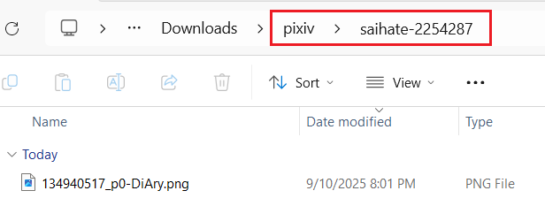
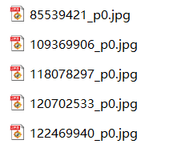
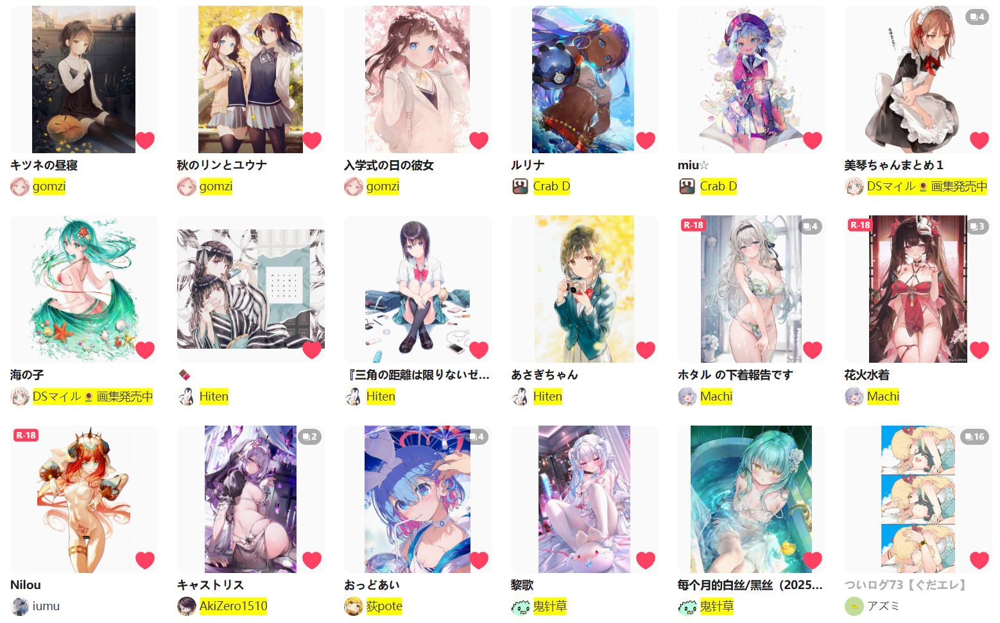
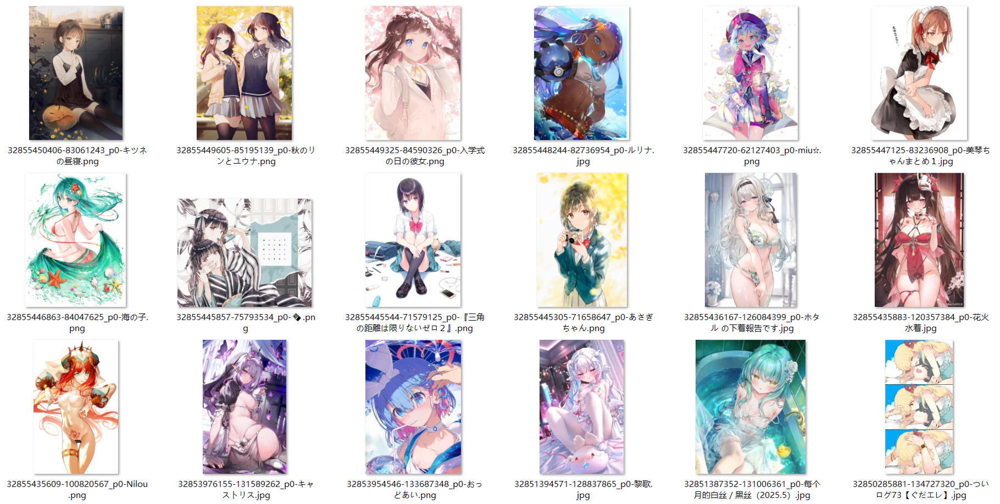
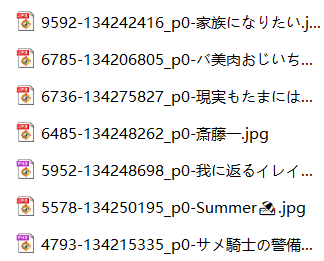
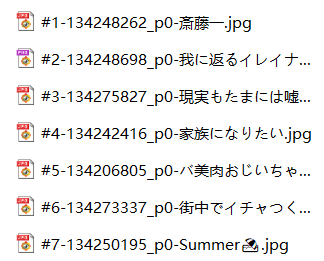
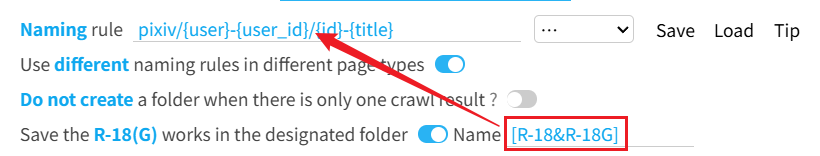
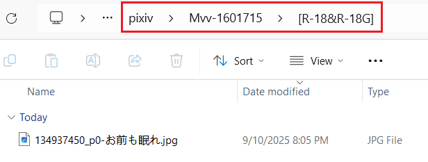
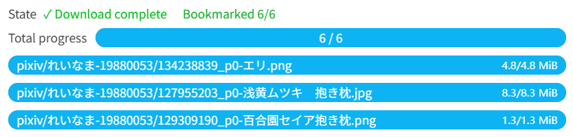

# Settings-Download

## Naming rule

    Naming Rule
    <input type="text" name="userSetName" class="setinput_style1 blue fileNameRule" value="pixiv/{user}-{user_id}/{id}-{title}">
    &nbsp;
    <select name="fileNameSelect" class="beautify_scrollbar">
      <option value="default">…</option>
      <option value="{id}">{id}</option>
      <option value="{user}">{user}</option>
      <option value="{user_id}">{user_id}</option>
      <option value="{title}">{title}</option>
      <option value="{page_title}">{page_title}</option>
      <option value="{tags}">{tags}</option>
      <option value="{tags_translate}">{tags_translate}</option>
      <option value="{tags_transl_only}">{tags_transl_only}</option>
      <option value="{page_tag}">{page_tag}</option>
      <option value="{type}">{type}</option>
      <option value="{AI}">{AI}</option>
      <option value="{like}">{like}</option>
      <option value="{bmk}">{bmk}</option>
      <option value="{bmk_1000}">{bmk_1000}</option>
      <option value="{bmk_id}">{bmk_id}</option>
      <option value="{view}">{view}</option>
      <option value="{rank}">{rank}</option>
      <option value="{date}">{date}</option>
      <option value="{upload_date}">{upload_date}</option>
      <option value="{task_date}">{task_date}</option>
      <option value="{px}">{px}</option>
      <option value="{series_title}">{series_title}</option>
      <option value="{series_order}">{series_order}</option>
      <option value="{series_id}">{series_id}</option>
      <option value="{id_num}">{id_num}</option>
      <option value="{p_num}">{p_num}</option>
      </select>
    &nbsp;
    <slot data-name="saveNamingRule">
  <button class="nameSave textButton has_tip" type="button" data-xztip="_Save Naming Rule Tip" data-xztext="_Save" data-tip="Save naming rule, up to 20">Save</button>
  <button class="nameLoad textButton" type="button" data-xztext="_Load">Load</button>
  <button class="nameLoad textButton" type="button" data-xztext="_Tip">Tip</button>
  </slot>
    

This is a very important feature, allowing you to set the **filename** saved by the downloader and **create folders** for organization.

When saving files, the downloader replaces tags in the naming rule to generate filenames. For example, `{id}` is replaced with the work ID, such as `75863159_p0`.

?> You can modify the naming rule as needed. Only `{id}` is mandatory, as it is the unique identifier for each file.

**Some function buttons:**

You can quickly insert tags from the dropdown menu on the right side of the input box: click a tag to add it to the naming rule. However, this is a Wiki, so it has no effect here.

The `Save` button on the right side of the dropdown saves the current naming rule; the `Load` button displays previously saved naming rules. Using these buttons, you can save multiple commonly used naming tags and switch between them easily.

On the right side of this setting, there is a `Tip` button. Clicking it displays all tags and their functions. However, this is a Wiki, so it has no effect here.

### Creating Folders

You can use a slash `/` to create folders. If needed, you can use multiple slashes `/` to create nested folders.

The default naming rule `pixiv/{user}-{user_id}/{id}-{title}` creates two levels of folders:
- First, a `pixiv` folder is created.
- Inside it, a folder with the username and user ID is created.
- Inside that, the work is saved with a filename consisting of the work ID and title.

Example effect:

?> The `/` is not mandatory. If you don't want to create folders, you can omit the `/`. For example, setting the naming rule to `{id}` saves files directly to the browser's download directory without creating subfolders.

### Tag List

?>* Some tags are not always available and may output nothing in certain cases.

- `{id}` File ID, the default filename, including a suffix, e.g., `44920385_p0`.
- `{user}` User (artist) name.
- `{user_id}` User (artist) ID, a pure number.
- `{title}` Work title.
- `{tags}` List of work tags.
- `{tags_translate}` List of work tags with translated tags (if available).
- `{tags_transl_only}` List of translated tags only.
- `{page_title}` Page title when crawling starts.
- *`{page_tag}` Outputs the tag if all works on the page share the same tag; otherwise, outputs nothing.
- `{type}` Work type, including `Illustration`, `Manga`, `Ugoira`, `Novel`.
- *`{AI}` Outputs `AI` if the work is AI-generated; otherwise, outputs nothing.
- `{like}` Like count, the number of likes for the work.
- `{bmk}` Bookmark count, the number of bookmarks for the work. Placing it at the start allows sorting files by bookmark count.
- `{bmk_1000}` Simplified display of bookmark count, e.g., `0+`, `1000+`, `2000+`, `3000+`, etc.
- `{bmk_id}` Bookmark ID. Each bookmarked work has a unique Bookmark ID. Later bookmarks have larger IDs. When downloading bookmarks, you can use `{bmk_id}` for sorting.
- `{view}` View count, the number of views for the work.
- *`{rank}` Work's ranking on the leaderboard, e.g., `#1`, `#2`, etc. Only usable on leaderboard pages.
- `{date}` Work creation date, e.g., `2019-08-29`.
- `{upload_date}` Date the work's content was last modified, e.g., `2019-08-30`.
- `{task_date}` Date the crawling task was completed, e.g., `2020-10-21`.
- `{px}` Width and height, e.g., `600x900`.
- *`{series_title}` Series title, available when the work belongs to a series.
- *`{series_order}` Work's order in the series, e.g., `#1`, `#2`. Available when the work belongs to a series.
- *`{series_id}` Series ID, available when the work belongs to a series.
- `{id_num}` Numeric ID, e.g., `44920385`.
- `{p_num}` Image sequence number within the work, e.g., `0`, `1`, `2`, etc. Each work resets the count.

### Additional Notes

- You can use multiple tags; it's recommended to add separators between tags, such as `{id}-{tags}-{user}`, to avoid tag content blending together. There's no fixed requirement for separators; use what you prefer.
- Besides preset tags, you can input custom text, e.g., `Title {title} Tags {tags}`. Non-preset text will be retained as is.
- There's no suffix tag because the downloader automatically adds the file extension.
- If the generated filename contains special characters invalid for filenames, they are replaced with similar full-width symbols. For example, a tag containing a slash `/` cannot be used in filenames, so the downloader replaces it with a full-width `／`.
- If you use `{tags_translate}`, there's no need to use `{tags}`, as the former includes the latter. Translated content depends on your Pixiv language settings. For example, if your Pixiv interface is in Chinese, tag translations are typically in Chinese.
- `{tags_transl_only}` saves only translated tags, not original Japanese tags. If a tag has no translation, the original Japanese tag is saved.
- Filenames must include a **unique identifier** to prevent duplicates, which could cause files to overwrite each other or trigger a save-as dialog.
- The default naming rule's `{id}` is the unique identifier. Some users may want to replace `{id}` with `{id_num}` and `{p_num}`. This is possible, but both must be used together, not individually. This is because multi-image works have multiple images with the same `{id_num}`, and `{p_num}` is needed to differentiate them.
- `{bmk_1000}` doesn't show the exact bookmark count but displays an integer in units of 1000 with a `+` (below 1000 displays as `0+`). This makes bookmark counts less cluttered.
- When saving files, if a file with the same name exists, the downloader will overwrite it rather than appending a number. Most PC browsers do this, but Edge Canary on Android may append a number instead.
- Filenames may exceed the operating system's length limit, often due to tags like `{tags}`. If a filename is too long, the file may not save automatically, and the browser may show a save-as dialog. To address this, enable the "Filename Length Limit" option under the "More" tab in the "Naming" category.
- When a filename is too long, some browsers may truncate the excess to save the file. This varies by case. Chrome on Windows does this, but browsers on Linux or Android may not. Saving to remote locations (e.g., network drives) may also prevent truncation, even in Chrome.

### Sorting with Naming Tags

Some tags have predictable patterns. Using them as the **first part** of the filename allows sorting in the file explorer.

#### Tags Reflecting Time Order

On most pages, works are sorted by work ID in descending order. Later-posted works have larger IDs and appear first.

`{id}` (work ID) is incremental. Using `{id}` at the start of the filename and sorting files by ID in descending order aligns with the webpage's order. For example:

`{date}` (posting time) has a similar effect.

--------

`{bmk_id}` reflects the order in which you bookmarked works. Using it at the start, e.g., `{bmk_id}-{id}`, and sorting in descending order aligns files with your bookmark order.

For example, this is the webpage order:

This is the effect of sorting with `{bmk_id}`:

#### Tags Reflecting Quantity

Some tags are numeric, e.g., `{like}`, `{view}`, `{bmk}`, `{bmk_1000}`, `{rank}`.

Example: Sorting works by `{bmk}` (bookmark count) in descending order prioritizes high-quality works:

Example: When downloading from a leaderboard page, sort by `{rank}`:

## Use different naming rules in different page types

    Use different naming rules in different page types
    <input type="checkbox" name="setNameRuleForEachPageType" class="need_beautify checkbox_switch">
    
    

The "Naming Rule" setting above applies to all pages, meaning the same naming rule is used for all page types.

If you want to set independent naming rules for each page type, enable this setting.

**Example Use Cases:**

- On a user's homepage, set to `{user}/{id}` to create folders by username.
- On a search page, set to `{page_tag}/{id}` to create folders by the page's tag.
- On a leaderboard page, set to `{rank}-{id}` to save the work's ranking.

**Notes:**
- After enabling this setting, the downloader uses the preset rule for the page type, overriding the current naming rule. You can modify these rules as needed.
- If you switch page types during downloading after enabling this setting, the naming rule may change, altering filenames or folder names. This may not be desired, so avoid switching to a different page type during downloading (though switching within the same page type is fine).

For example, if downloading from a user's homepage, don't switch to a search page. If downloading from a work page, don't switch to a user's homepage or search page.

## Do not create a folder when there is only one crawl result

    
    Do not create a folder when there is only one crawl result
     ? 
    
    <input type="checkbox" name="notFolderWhenOneFile" class="need_beautify checkbox_switch">
    
    

Sometimes users prefer not to create folders when downloading a single file, saving directly to the download directory, so this option was added.

When enabled, if there is **only one** crawl result, the downloader will not create folders (even if folders are specified in the naming rule).

**Notes:**

This option applies when there is exactly one crawl result in **total**.

Some users may mistakenly think this means "if a work has only one file to download, don't create a folder," which is incorrect. The key is whether the total number of crawl results is one.

For example, crawling 10 works, each with one image, results in 10 crawl results. This option will not take effect in this case.

## Save the R-18(G) works in the designated folder

    Save the R-18(G) works in the designated folder
    <input type="checkbox" name="r18Folder" class="need_beautify checkbox_switch">
    
    
    Folder Name
    <input type="text" name="r18FolderName" class="setinput_style1 blue" style="width:150px;min-width: 150px;" value="[R-18&amp;R-18G]">
    
    

If this setting is enabled, the downloader will save R-18(G) works to a **subfolder**.

The downloader inserts the folder name from this setting **before** the filename:

If the naming rule already creates folders, this option's folder becomes the deepest folder. Example:

**Tips:**

1. R-18 and R-18G works are saved in the same folder; they cannot be separated into different folders.
2. You can modify the folder name and use tags from the naming rule.

## Download thread

    
    Download thread
    
    <input type="text" name="downloadThread" class="has_tip setinput_style1 blue" data-xztip="_Download Threads Description" value="3" data-tip="You can enter a number between 1 and 6 to set the concurrent download count">
    

You can enter a number between 1 and 6 to set the concurrent download count. The default is 3.

**Reminder:**

- Downloading multiple files concurrently can improve download speed.
- If your download speed is slow, reduce the concurrent download count, e.g., to 2, to avoid timeouts that may cause download failures.
- If your download speed is fast, you can increase the concurrent download count.

!> When downloading a large number of files, if the download speed is very fast (e.g., 5 files per second), it's recommended to set a lower concurrent download count, such as 1. Excessive downloading frequency may increase the risk of your account being banned.

## Download starts automatically

    
    Download starts automatically
     ? 
    
    <input type="checkbox" name="autoStartDownload" id="setQuietDownload" class="need_beautify checkbox_switch" checked="">
    
    

When crawling is complete and downloading can begin, the downloader will automatically start downloading.

If this option is disabled, the downloader will not start downloading automatically after crawling but will display the settings panel. You need to manually click the "Start Download" button to begin downloading.

**Notes:**

Some **quick download** methods always start downloading automatically (even if this option is disabled), such as:
- Clicking the quick download button on the right side of a work page.
- Clicking the download button on a work thumbnail.
- Clicking the download button in the image viewer.
- Pressing the `C` or `D` shortcut key to download a work during preview.
- Crawling manually selected works.

There's also a case where downloading won't start automatically:

When crawling on a **search page** with the "Preview Search Page Filter Results" option enabled (default), downloading won't start automatically after crawling. This allows you to adjust the crawl results before starting the download.

## Bookmark works after downloading

    
    Bookmark works after downloading
     ? 
    
    <input type="checkbox" name="bmkAfterDL" class="need_beautify checkbox_switch">
    
    

When enabled, the downloader will bookmark the work associated with each downloaded file.

Bookmark progress is displayed in the download progress area, e.g., `Bookmarked 1/3`.

After downloading, if the bookmark progress shows matching numbers, e.g., `Bookmarked 3/3`, bookmarking is complete. If the numbers differ, wait for bookmarking to finish.

**Notes:**

1. If a work is skipped due to the "Don't download duplicate files" setting, it is still considered successfully downloaded and will be bookmarked.
2. A work may have multiple files but is bookmarked only once. If the bookmark count is less than the file count, this is normal, as the bookmark count reflects the number of works, not files.
3. When downloading many files, bookmark progress may increase slowly. This is because the downloader bookmarks works at intervals of a few seconds rather than rapidly and continuously. Without intervals, you risk triggering a 429 restriction (Pixiv may temporarily block services, affecting browsing, crawling, or bookmarking).

If you want to set the public status when bookmarking a work, as well as whether to add tags, please check this setting: [Downloader' bookmark function (✩)](/en/Settings-More-Enhance?id=downloader39-bookmark-function-✩).