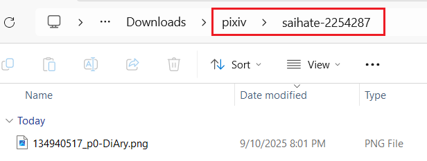
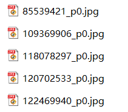
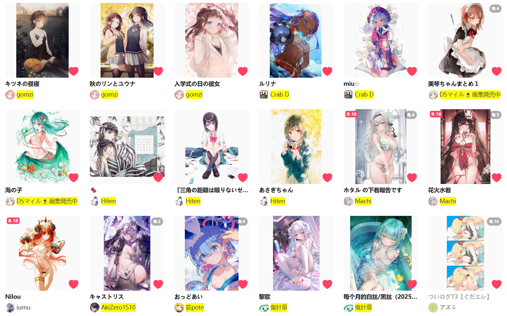
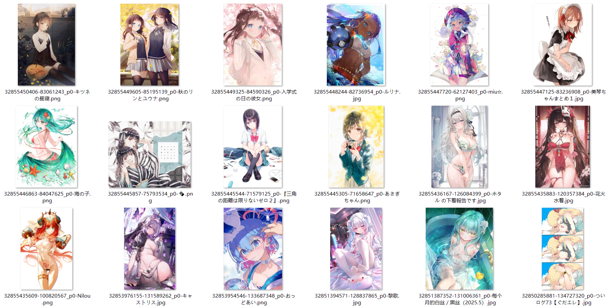
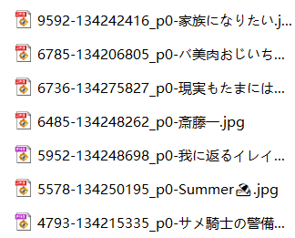
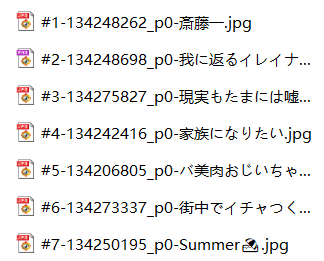
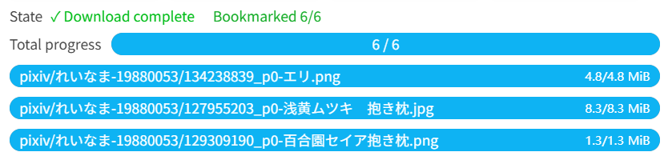

# Settings-Download

## Naming rule for image works

<div class="option" data-no="13" style="display: flex;"><button type="button" class="pinButton" data-title="_置顶">📌</button>
      <span class="fileNameRuleLine1">
        <a href="https://xuejianxianzun.github.io/PBDWiki/#/en/Settings-Download?flag=13" target="_blank" class="settingNameStyle" data-xztext="_图像作品的命名规则"><span class="key">Naming</span> rule for image works</a>
        <span class="fileNameRuleBtnsArea">
          <slot data-name="saveNamingRuleForArtwork"><div class="saveNamingRuleWrap theme-white">
    <button class="nameSave textButton has_tip" type="button" data-xztip="_保存命名规则提示" data-xztext="_保存" data-tip="Save naming rule, up to 20">Save</button>
    <button class="nameLoad textButton" type="button" data-xztext="_加载">Load</button>
  </div></slot>
          <button type="button" class="showFileNameTip textButton toggleArea" data-toggle-target="#fileNameTip" data-for-no="13" data-xztext="_提示">Tip</button>
          &nbsp;
          <select name="fileNameSelect" class="beautify_scrollbar">
            <option value="default">…</option>
            <option value="{id}">{id}</option>
<option value="{pid}">{pid}</option>
<option value="{p}">{p}</option>
<option value="{user}">{user}</option>
<option value="{user_id}">{user_id}</option>
<option value="{title}">{title}</option>
<option value="{page_title}">{page_title}</option>
<option value="{tags}">{tags}</option>
<option value="{tags_translate}">{tags_translate}</option>
<option value="{tags_transl_only}">{tags_transl_only}</option>
<option value="{page_tag}">{page_tag}</option>
<option value="{type}">{type}</option>
<option value="{type_illust}">{type_illust}</option>
<option value="{type_manga}">{type_manga}</option>
<option value="{type_ugoira}">{type_ugoira}</option>
<option value="{type_novel}">{type_novel}</option>
<option value="{AI}">{AI}</option>
<option value="{age}">{age}</option>
<option value="{age_r}">{age_r}</option>
<option value="{like}">{like}</option>
<option value="{bmk}">{bmk}</option>
<option value="{bmk_1000}">{bmk_1000}</option>
<option value="{bmk_id}">{bmk_id}</option>
<option value="{view}">{view}</option>
<option value="{rank}">{rank}</option>
<option value="{date}">{date}</option>
<option value="{upload_date}">{upload_date}</option>
<option value="{task_date}">{task_date}</option>
<option value="{px}">{px}</option>
<option value="{char_count}">{char_count}</option>
<option value="{series_title}">{series_title}</option>
<option value="{series_order}">{series_order}</option>
<option value="{series_id}">{series_id}</option>
<option value="{sl}">{sl}</option>
<option value="{multi_image_folder}">{multi_image_folder}</option>
<option value="{r18_g_folder}">{r18_g_folder}</option>
<option value="{match_tag_folder1}">{match_tag_folder1}</option>
<option value="{match_tag_folder2}">{match_tag_folder2}</option>
          </select>
        </span>
      </span>
      <textarea class="centerPanelTextArea beautify_scrollbar grow fileNameRule" name="userSetName" rows="1" placeholder="pixiv/{user}-{user_id}/{id}-{title}">pixiv/{user}-{user_id}/{id}-{title}</textarea>
    </div>

This is a very important feature, allowing you to set the **filename** saved by the downloader and **create folders** for organization.

When saving files, the downloader replaces tags in the naming rule to generate filenames. For example, `{id}` is replaced with the work ID, such as `75863159_p0`.

?> You can modify the naming rule as needed. Only `{id}` is mandatory, as it is the unique identifier for each file.

**Some function buttons:**

The `Save` button saves the current naming rule, and the `Load` button displays previously saved naming rules. With these two buttons, you can save multiple commonly used naming rules and switch between them conveniently.

The `Tip` button lets you view all tags and their descriptions. However, this is a Wiki, so it has no effect here.

The dropdown list displays all tags. Clicking one inserts it at the cursor position. However, this is a Wiki, so it has no effect here.

### Creating Folders

You can use a slash `/` to create folders. If needed, you can use multiple slashes `/` to create nested folders.

The default naming rule `pixiv/{user}-{user_id}/{id}-{title}` creates two levels of folders:
- First, a `pixiv` folder is created.
- Inside it, a folder with the username and user ID is created.
- Inside that, the work is saved with a filename consisting of the work ID and title.

Example effect:



?> The `/` is not mandatory. If you don't want to create folders, you can omit the `/`. For example, setting the naming rule to `{id}` saves files directly to the browser's download directory without creating subfolders.

### Additional Notes

- You can use multiple tags; it's recommended to add separators between tags, such as `{id}-{tags}-{user}`, to avoid tag content blending together. There's no fixed requirement for separators; use what you prefer.
- Besides preset tags, you can input custom text, e.g., `Title {title} Tags {tags}`. Non-preset text will be retained as is.
- There's no suffix tag because the downloader automatically adds the file extension.
- If the generated filename contains special characters invalid for filenames, they are replaced with similar full-width symbols. For example, a tag containing a slash `/` cannot be used in filenames, so the downloader replaces it with a full-width `／`.
- If you use `{tags_translate}`, there's no need to use `{tags}`, as the former includes the latter. Translated content depends on your Pixiv language settings. For example, if your Pixiv interface is in Chinese, tag translations are typically in Chinese.
- `{tags_transl_only}` saves only translated tags, not original Japanese tags. If a tag has no translation, the original Japanese tag is saved.
- Filenames must include a **unique identifier** to prevent duplicates, which could cause files to overwrite each other or trigger a save-as dialog.
- The default naming rule's `{id}` is the unique identifier. Some users may want to replace `{id}` with `{pid}` and `{p}`. This is possible, but both must be used together, not individually. This is because multi-image works have multiple images with the same `{pid}`, and `{p}` is needed to differentiate them.
- `{bmk_1000}` doesn't show the exact bookmark count but displays an integer in units of 1000 with a `+` (below 1000 displays as `0+`). This makes bookmark counts less cluttered.
- When saving files, if a file with the same name exists, the downloader will overwrite it rather than appending a number. Most PC browsers do this, but Edge Canary on Android may append a number instead.
- Filenames may exceed the operating system's length limit, often due to tags like `{tags}`. If a filename is too long, the file may not save automatically, and the browser may show a save-as dialog. To address this, enable the "Filename Length Limit" option under the "More" tab in the "Naming" category.
- When a filename is too long, some browsers may truncate the excess to save the file. This varies by case. Chrome on Windows does this, but browsers on Linux or Android may not. Saving to remote locations (e.g., network drives) may also prevent truncation, even in Chrome.

### Some Examples

#### Remove the p tag in {id}

`{id}` includes the page number, for example `44920385_p0`. If you want to remove `_p`, you can replace `{id}` with `{pid} {p}`, which will generate `44920385 0`.

?>Note: If you want to replace `{id}`, the naming rule must include both `{pid}` and `{p}` to prevent duplicate filenames.

#### Remove the sequence number from the first image of each work

If you think the first image doesn't need a sequence number and want to change `44920385_p0` to `44920385`, you can enable the [The first image without a serial number](/en/Settings-More-Naming?id=the-first-image-without-a-serial-number) option.

#### Naming rules used by others

Here are some naming rules used by users, you can refer to:

```
{user}/{title}{id}
{user}/{title}{date}/{id}
{user_id}_{user}/{type}/{date} {title}/{id}
{user_id}-{user}/{title}-{id}
{user} (id={user_id})/{id}
{user} {user_id}/{id} {title} {upload_date}
{user}_{date}_{title}_{id}
{id}_{title}_{user_id}_{user}
{id}{user}-{user_id}-{title}{tags}{tags_translate}{page_tag}-{like}-{bmk}-{upload_date}
```

**Note:** The last naming rule is not a good idea because it easily generates filenames that are too long (more than 256 characters), leading to truncation, so the actual filename may only have the first half.

Some works have a large number of tags, so using `{tags}`, `{tags_translate}`, `{tags_transl_only}` in the filename may lead to the filename being too long. If you want to use these naming tags, it is recommended to place them at the end of the filename to avoid truncation of content from other naming tags.

### Sorting with Naming Tags

Some tags have predictable patterns. Using them as the **first part** of the filename allows sorting in the file explorer.

#### Tags Reflecting Time Order

On most pages, works are sorted by work ID in descending order. Later-posted works have larger IDs and appear first.

`{id}` (work ID) is incremental. Using `{id}` at the start of the filename and sorting files by ID in descending order aligns with the webpage's order. For example:



`{date}` (posting time) has a similar effect.

--------

`{bmk_id}` reflects the order in which you bookmarked works. Using it at the start, e.g., `{bmk_id}-{id}`, and sorting in descending order aligns files with your bookmark order.

For example, this is the webpage order:



This is the effect of sorting with `{bmk_id}`:



#### Tags Reflecting Quantity

Some tags are numeric, e.g., `{like}`, `{view}`, `{bmk}`, `{bmk_1000}`, `{rank}`.

Example: Sorting works by `{bmk}` (bookmark count) in descending order prioritizes high-quality works:



Example: When downloading from a leaderboard page, sort by `{rank}`:



## Naming rule for novels

<div class="option new" data-no="106" style="display: flex;"><button type="button" class="pinButton" data-title="_置顶">📌</button>
      <span class="fileNameRuleLine1">
        <a href="https://xuejianxianzun.github.io/PBDWiki/#/en/Settings-Download?flag=106" target="_blank" class="settingNameStyle" data-xztext="_小说的命名规则"><span class="key">Naming</span> rule for novels</a>
        <span class="fileNameRuleBtnsArea">
          <slot data-name="saveNamingRuleForNovel"><div class="saveNamingRuleWrap theme-white">
    <button class="nameSave textButton has_tip" type="button" data-xztip="_保存命名规则提示" data-xztext="_保存" data-tip="Save naming rule, up to 20">Save</button>
    <button class="nameLoad textButton" type="button" data-xztext="_加载">Load</button>
  </div></slot>
          <button type="button" class="showFileNameTip textButton toggleArea" data-toggle-target="#fileNameTipForNovel" data-for-no="106" data-xztext="_提示">Tip</button>
          &nbsp;
          <select name="fileNameSelectForNovel" class="beautify_scrollbar">
            <option value="default">…</option>
            <option value="{id}">{id}</option>
<option value="{pid}">{pid}</option>
<option value="{p}">{p}</option>
<option value="{user}">{user}</option>
<option value="{user_id}">{user_id}</option>
<option value="{title}">{title}</option>
<option value="{page_title}">{page_title}</option>
<option value="{tags}">{tags}</option>
<option value="{tags_translate}">{tags_translate}</option>
<option value="{tags_transl_only}">{tags_transl_only}</option>
<option value="{page_tag}">{page_tag}</option>
<option value="{type}">{type}</option>
<option value="{type_illust}">{type_illust}</option>
<option value="{type_manga}">{type_manga}</option>
<option value="{type_ugoira}">{type_ugoira}</option>
<option value="{type_novel}">{type_novel}</option>
<option value="{AI}">{AI}</option>
<option value="{age}">{age}</option>
<option value="{age_r}">{age_r}</option>
<option value="{like}">{like}</option>
<option value="{bmk}">{bmk}</option>
<option value="{bmk_1000}">{bmk_1000}</option>
<option value="{bmk_id}">{bmk_id}</option>
<option value="{view}">{view}</option>
<option value="{rank}">{rank}</option>
<option value="{date}">{date}</option>
<option value="{upload_date}">{upload_date}</option>
<option value="{task_date}">{task_date}</option>
<option value="{px}">{px}</option>
<option value="{char_count}">{char_count}</option>
<option value="{series_title}">{series_title}</option>
<option value="{series_order}">{series_order}</option>
<option value="{series_id}">{series_id}</option>
<option value="{sl}">{sl}</option>
<option value="{multi_image_folder}">{multi_image_folder}</option>
<option value="{r18_g_folder}">{r18_g_folder}</option>
<option value="{match_tag_folder1}">{match_tag_folder1}</option>
<option value="{match_tag_folder2}">{match_tag_folder2}</option>
            <option value="{follow_artwork}">{follow_artwork}</option>
          </select>
        </span>
      </span>
      <textarea class="centerPanelTextArea beautify_scrollbar grow fileNameRule" name="userSetNameForNovel" rows="1" placeholder="{follow_artwork}">{follow_artwork}</textarea>
    </div>

Novels can use the same naming tags as image works, and they also have one special tag:

`{follow_artwork}` follows the naming rule for image works. It is also the default value, meaning novels use the same naming rule as image works. If you want to set an independent naming rule for novels, remove this tag and configure the naming rule as needed.

PS: This setting affects only the filenames of individual novels. It does not affect the filename of the merged collection file generated for a novel series. That has a separate naming setting.

## Use different naming rules in different page types

<p class="option" data-no="50" style="display: flex;">
    <span class="settingNameStyle1" data-xztext="_在不同的页面类型中使用不同的命名规则">Use <span class="key">different</span> naming rules in different page types</span>
    <input type="checkbox" name="setNameRuleForEachPageType" class="need_beautify checkbox_switch">
    <span class="beautify_switch" tabindex="0"></span>
    </p>

The "Naming Rule" setting above applies to all pages, meaning the same naming rule is used for all page types.

If you want to set independent naming rules for each page type, enable this setting.

**Example Use Cases:**

- On a user's homepage, set to `{user}/{id}` to create folders by username.
- On a search page, set to `{page_tag}/{id}` to create folders by the page's tag.
- On a leaderboard page, set to `{rank}-{id}` to save the work's ranking.

**Notes:**
- After enabling this setting, the downloader uses the preset rule for the page type, overriding the current naming rule. You can modify these rules as needed.
- If you switch page types during downloading after enabling this setting, the naming rule may change, which may cause the file name or folder name to change. This may not be desired, so avoid switching to a different page type during downloading (though switching within the same page type is fine).

For example, if downloading from a user's homepage, don't switch to a search page. If downloading from a work page, don't switch to a user's homepage or search page.

## Do not create folder

<div class="option new" data-no="64" style="display: flex;"><button type="button" class="pinButton" data-title="_置顶">📌</button>
      <a href="https://xuejianxianzun.github.io/PBDWiki/#/en/Settings-Download?flag=64" target="_blank" class="settingNameStyle">
        <span data-xztext="_不创建文件夹">Do <span class="key">not create</span> folder</span>
      </a>
      <input type="checkbox" name="noFolderSwitch" class="need_beautify checkbox_switch">
      <span class="beautify_switch" tabindex="0"></span>
      <span class="subOptionWrap noGrow" data-show="noFolderSwitch" style="display: none;">
        <input type="checkbox" name="noFolderWhenSingleImageWork" id="noFolderWhenSingleImageWork" class="need_beautify checkbox_common" checked="">
        <span class="beautify_checkbox" tabindex="0"></span>
        <label for="noFolderWhenSingleImageWork" data-xztext="_单图作品" class="active">Single image works</label>
        <input type="checkbox" name="noFolderWhenMultiImageWork" id="noFolderWhenMultiImageWork" class="need_beautify checkbox_common" checked="">
        <span class="beautify_checkbox" tabindex="0"></span>
        <label for="noFolderWhenMultiImageWork" data-xztext="_多图作品">Multi-image works</label>
        <input type="checkbox" name="noFolderWhenNovel" id="noFolderWhenNovel" class="need_beautify checkbox_common" checked="">
        <span class="beautify_checkbox" tabindex="0"></span>
        <label for="noFolderWhenNovel" data-xztext="_小说">Novels</label>
      </span>
      <button type="button" class="gray1 textButton showMsgBtn" data-title="_不创建文件夹" data-msg="_以下情况不创建文件夹的帮助内容" data-xztext="_帮助">Help</button>
    </div>

If your naming rule creates folders, but you want some works to be saved directly in the download directory instead, you can enable this setting.

You can choose which types of works should not create folders:
- Single-image works
- Multi-image works
- Novels

## Download thread

<p class="option" data-no="16" style="display: flex;">
    <span class="settingNameStyle1" "="">
    <span data-xztext="_下载线程">Download <span class="key">thread</span></span>
    </span>
    <input type="text" name="downloadThread" class="has_tip setinput_style1 blue" data-xztip="_Download Threads Description" value="3" data-tip="You can enter a number between 1 and 6 to set the concurrent download count">
    </p>

You can enter a number between 1 and 6 to set the concurrent download count. The default is 3.

**Reminder:**

- Downloading multiple files concurrently can improve download speed.
- If your download speed is slow, reduce the concurrent download count, e.g., to 2, to avoid timeouts that may cause download failures.
- If your download speed is fast, you can increase the concurrent download count.

!> When downloading a large number of files, if the download speed is very fast (e.g., 5 files per second), it's recommended to set a lower concurrent download count, such as 1. Excessive downloading frequency may increase the risk of your account being banned.

## Download starts automatically

<div class="option" data-no="17" style="display: flex;"><button type="button" class="pinButton" data-title="_置顶">📌</button>
      <a href="https://xuejianxianzun.github.io/PBDWiki/#/en/Settings-Download?flag=17" target="_blank" class="settingNameStyle">
        <span data-xztext="_自动开始下载">Download starts <span class="key">automatically</span></span>
      </a>
      <input type="checkbox" name="autoStartDownload" class="need_beautify checkbox_switch" checked="">
      <span class="beautify_switch" tabindex="0"></span>
      <button type="button" class="gray1 textButton showMsgBtn" data-title="_自动开始下载" data-msg="_自动开始下载的帮助内容" data-xztext="_帮助">Help</button>
    </div>

When crawling is complete and downloading can begin, the downloader will automatically start downloading.

If this option is disabled, the downloader will not start downloading automatically after crawling but will display the settings panel. You need to manually click the "Start Download" button to begin downloading.

?>There is one situation where the download **will not** start automatically:

When crawling on a **search page** with the [Preview filter results on search page](/en/Settings-More-Enhance?id=preview-filter-results-on-search-page) option enabled (default), downloading won't start automatically after crawling. This allows you to adjust the crawl results before starting the download.

?>Some **quick download** methods always start downloading automatically (even if this option is disabled), such as:

- Clicking the quick download button on the right side of a work page.
- Clicking the download button on a work thumbnail.
- Clicking the download button in the image viewer.
- Pressing the `C` or `D` shortcut key to download a work during preview.
- Crawling manually selected works.

## Bookmark works after downloading

<p class="option" data-no="33" style="display: flex;">
    <span class="has_tip settingNameStyle1" data-xztip="_Bookmark Works After Downloading Tip" data-tip="Automatically bookmark the work after downloading its files.">
    <span data-xztext="_下载之后收藏作品"><span class="key">Bookmark</span> works after downloading</span>
    <span class="gray1"> ? </span>
    </span>
    <input type="checkbox" name="bmkAfterDL" class="need_beautify checkbox_switch">
    <span class="beautify_switch" tabindex="0"></span>
    </p>

When enabled, the downloader will bookmark the work associated with each downloaded file.

Bookmark progress is displayed in the download progress area, e.g., `Bookmarked 1/3`.



After downloading, if the bookmark progress shows matching numbers, e.g., `Bookmarked 3/3`, bookmarking is complete. If the numbers differ, wait for bookmarking to finish.

**Notes:**

1. If a work is skipped due to the "Don't download duplicate files" setting, it is still considered successfully downloaded and will be bookmarked.
2. A work may have multiple files but is bookmarked only once. If the bookmark count is less than the file count, this is normal, as the bookmark count reflects the number of works, not files.
3. When downloading large amounts of files, the bookmark progress may increase relatively slowly. This is because the downloader will bookmark one work every few seconds (using the interval time in [Slow down crawl](/en/Settings-More-Crawl?id=slow-down-crawl)), rather than quickly and continuously bookmarking works. This is to reduce the possibility of triggering the 429 restriction.

If you want to set the public status when bookmarking a work, as well as whether to add tags, please check this setting: [Downloader's bookmark feature (✩)](/en/Settings-More-Enhance?flag=34).
