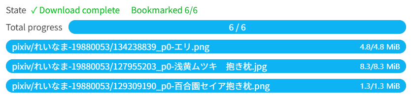
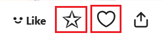
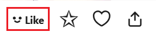

## Download thread

<div class="option settingsPanel_optionCard" data-no="51" data-pin-bound="true" style="display: flex;">
  <a href="http://localhost:3000/#/en/Settings-Download/Download-behavior?flag=51" target="_blank" class="settingNameStyle" data-bind-click="true">
    <span data-xztext="_同时下载数量">Download <span class="key">thread</span></span>
  </a>
  <input type="text" name="downloadThread" class="has_tip setinput_style blue" data-xztip="_下载线程的说明" value="3" data-tip="You can type a number between 1-6 to set the number of concurrent downloads">
</div>

You can enter a number between 1 and 6 to set the concurrent download count. The default is 3.

**Reminder:**

- Downloading multiple files concurrently can improve download speed.
- If your download speed is slow, reduce the concurrent download count, e.g., to 2, to avoid timeouts that may cause download failures.
- If your download speed is fast, you can increase the concurrent download count.

!> When downloading a large number of files, if the download speed is very fast (e.g., 5 files per second), it's recommended to set a lower concurrent download count, such as 1. Excessive downloading frequency may increase the risk of your account being banned.

## Download starts automatically

<div class="option settingsPanel_optionCard" data-no="52" data-pin-bound="true" style="display: flex;">
  <a href="http://localhost:3000/#/en/Settings-Download/Download-behavior?flag=52" target="_blank" class="settingNameStyle" data-bind-click="true">
    <span data-xztext="_自动开始下载">Download starts <span class="key">automatically</span></span>
  </a>
  <input type="checkbox" name="autoStartDownload" class="need_beautify checkbox_switch" checked="">
  <span class="beautify_switch" tabindex="0"></span>
  <button type="button" class="gray1 textButton showMsgBtn" data-title="_自动开始下载" data-msg="_自动开始下载的帮助内容" data-xztext="_帮助">Help</button>
</div>


When crawling is complete and downloading can begin, the downloader will automatically start downloading.

If this option is disabled, the downloader will not start downloading automatically after crawling but will display the settings panel. You need to manually click the "Start Download" button to begin downloading.

?>There is one situation where the download **will not** start automatically:

When crawling on a **search page** with the [Preview filter results on search page](/en/Settings-More-Enhance?id=preview-filter-results-on-search-page) option enabled (default), downloading won't start automatically after crawling. This allows you to adjust the crawl results before starting the download.

?>Some **quick download** methods always start downloading automatically (even if this option is disabled), such as:

- Clicking the quick download button on the right side of a work page.
- Clicking the download button on a work thumbnail.
- Clicking the download button in the image viewer.
- Pressing the `C` or `D` shortcut key to download a work during preview.
- Crawling manually selected works.

## Bookmark works after downloading

<div class="option settingsPanel_optionCard" data-no="53" data-pin-bound="true" style="display: flex;">
  <a href="http://localhost:3000/#/en/Settings-Download/Download-behavior?flag=53" target="_blank" class="has_tip settingNameStyle" data-xztip="_下载之后收藏作品的提示" data-tip="After you download a file, the downloader will automatically bookmark the work." data-bind-click="true">
    <span data-xztext="_下载之后收藏作品"><span class="key">Bookmark</span> works after downloading</span>
    <span class="gray1"> ? </span>
  </a>
  <input type="checkbox" name="bmkAfterDL" class="need_beautify checkbox_switch">
  <span class="beautify_switch" tabindex="0"></span>
</div>


When enabled, the downloader will bookmark the work associated with each downloaded file.

Bookmark progress is displayed in the download progress area, e.g., `Bookmarked 1/3`.



After downloading, if the bookmark progress shows matching numbers, e.g., `Bookmarked 3/3`, bookmarking is complete. If the numbers differ, wait for bookmarking to finish.

**Notes:**

1. If a work is skipped due to the "Don't download duplicate files" setting, it is still considered successfully downloaded and will be bookmarked.
2. A work may have multiple files but is bookmarked only once. If the bookmark count is less than the file count, this is normal, as the bookmark count reflects the number of works, not files.
3. When downloading large amounts of files, the bookmark progress may increase relatively slowly. This is because the downloader will bookmark one work every few seconds (using the interval time in [Slow down crawl](/en/Settings-More-Crawl?id=slow-down-crawl)), rather than quickly and continuously bookmarking works. This is to reduce the possibility of triggering the 429 restriction.

If you want to set the public status when bookmarking a work, as well as whether to add tags, please check this setting: [Downloader's bookmark feature (✩)](/en/Settings-More-Enhance?flag=34).

## Download a work when you click the bookmark button

<div class="option settingsPanel_optionCard" data-no="54" data-pin-bound="true" style="display: flex;">
  <a href="http://localhost:3000/#/en/Settings-Download/Download-behavior?flag=54" target="_blank" class="settingNameStyle" data-bind-click="true">
    <span data-xztext="_点击收藏按钮时下载作品">Download a work when you click the <span class="key">bookmark</span> button</span>
  </a>
  <input type="checkbox" name="downloadOnClickBookmark" class="need_beautify checkbox_switch">
  <span class="beautify_switch" tabindex="0"></span>
</div>

When this feature is enabled, the downloader will automatically download the work when you click its bookmark button.

There are two main use cases:

1. Clicking the bookmark button in the bottom-right corner of the work:

 

2. Clicking the bookmark button inside the work page:



?> Although the screenshots above are for illustrations, this feature also works for novels.

?> This feature is only triggered by **clicking the bookmark button**. The downloader provides some batch bookmarking and quick bookmarking features, but they do not require clicking the bookmark button and thus will not trigger this feature. For example, pressing B while previewing a work will bookmark it but will not trigger this feature.

!> In page types not supported by the downloader, this feature will not work, even if you manually click the bookmark button. This is because the feature requires the downloader to locate the work thumbnail element, but the downloader does not perform this action on some less common pages.

The downloader provides this feature by default:


When you are on a page, hovering the mouse over an illustration thumbnail should show a button in the top-right corner.

This indicates that the downloader supports the page and can use the "Download Work When Clicking the Bookmark Button" feature. However, if the downloader does not display the top-right button, the page is not supported, and the "Download Work When Clicking the Bookmark Button" feature cannot be used.

## Download a work when you click the like button

<div class="option settingsPanel_optionCard" data-no="55" data-pin-bound="true" style="display: flex;">
  <a href="http://localhost:3000/#/en/Settings-Download/Download-behavior?flag=55" target="_blank" class="settingNameStyle" data-bind-click="true">
    <span data-xztext="_点击点赞按钮时下载作品">Download a work when you click the <span class="key">like</span> button</span>
  </a>
  <input type="checkbox" name="downloadOnClickLike" class="need_beautify checkbox_switch">
  <span class="beautify_switch" tabindex="0"></span>
</div>

When this feature is enabled, the downloader will automatically download the work when you like it on the work page.

Like button:



?> Although the screenshot above is for an illustration, this feature also works for novels.

## Download interval

<div class="option settingsPanel_optionCard" data-no="56" data-pin-bound="true" style="display: flex;">
  <a href="http://localhost:3000/#/en/Settings-Download/Download-behavior?flag=56" target="_blank" class="has_tip settingNameStyle" data-xztip="_下载间隔的说明" data-tip="Start a download every certain interval of time.&lt;br&gt;
If the interval time is set to 0, the downloader will not add delay time.&lt;br&gt;
If set to 1 second (default value), then up to 3600 crawl results will be downloaded per hour (not counting attached download files, such as novel cover images and embedded images).&lt;br&gt;
This is because when continuously downloading many files (especially novels), your Pixiv account may be warned or banned. Setting the interval time can alleviate this issue.&lt;br&gt;" data-bind-click="true">
    <span data-xztext="_下载间隔">Download <span class="key">interval</span></span>
    <span class="gray1"> ? </span>
  </a>
  <input type="checkbox" name="downloadIntervalSwitch" class="need_beautify checkbox_switch">
  <span class="beautify_switch" tabindex="0"></span>
  <div class="subOptionWrap flexBasis100" data-show="downloadIntervalSwitch" style="display: inline-flex;">
    <div class="optionLine">
      <span data-xztext="_当文件数量大于">Enable when the number of files exceeds the specified number: </span>
      <input type="text" name="downloadIntervalOnWorksNumber" class="setinput_style blue" value="150">
    </div>
    <div class="optionLine">
      <span data-xztext="_间隔时间">Interval time: </span>
      <input type="text" name="downloadInterval" class="setinput_style blue" value="1">
      <span data-xztext="_秒">seconds</span>
    </div>
  </div>
</div>

You can set how many seconds to wait before allowing the downloader to start a download.

?> The purpose of this setting is to proactively reduce the download frequency during large downloads to reduce the risk of your account being banned by Pixiv.

?> You can modify this setting during the download (e.g., change the interval time, enable or disable the restriction), and the changes will take effect immediately.

### Enable when the number of files exceeds the specified number

This setting will only be enabled if the number of works in the **crawling results** exceeds the set value. The default is `150`.

Note that the judgment is based on the number of crawling results, i.e., how many files need to be downloaded in total, not how many remain. If 150 files are crawled (meeting the conditions) and this setting is activated, it will remain active even if only 1 file is left at the end.

### Interval Time

Whenever the downloader **starts** downloading a file, it sets a timer, and the next download is only allowed after the interval time has passed.

**Detailed Explanation of How It Works:**

- If set to `0`, the downloader will not add delay time, and this setting will not take effect.
- If set to `1` second, a maximum of 3600 files can be downloaded from Pixiv per hour.

If you only download a few hundred files per day, the default interval time is usually safe. If you frequently download more files, you can increase the interval time, for example `2`, `3`, etc. Setting it to `4` is almost absolutely safe, but usually no need to use such a large interval time.

----------

The interval time is not affected by the time required for downloads:

If the previous file takes more than 1 second, the downloader will not wait for it and will start the next file when the countdown ends. This means multiple files may be downloaded simultaneously.

If a file finishes downloading in less than 1 second, the downloader will continue waiting until the countdown ends before starting the next download. When file download times are short, it appears as single-threaded downloading, with only 1 file downloading at a time.

## File download order

<div class="option settingsPanel_optionCard" data-no="57" data-pin-bound="true" style="display: flex;">
  <a href="http://localhost:3000/#/en/Settings-Download/Download-behavior?flag=57" target="_blank" class="settingNameStyle" data-xztext="_文件下载顺序" data-bind-click="true">File download <span class="key">order</span></a>
  <input type="checkbox" name="setFileDownloadOrder" class="need_beautify checkbox_switch">
  <span class="beautify_switch" tabindex="0"></span>
  <div class="subOptionWrap flexBasis100" data-show="setFileDownloadOrder" style="display: none;">
    <div class="optionLine">
      <span class="settingNameStyle" data-xztext="_排序依据">Sort by</span>
      <input type="radio" name="downloadOrderSortBy" id="downloadOrderSortBy1" class="need_beautify radio" value="ID" checked="">
      <span class="beautify_radio" tabindex="0"></span>
      <label for="downloadOrderSortBy1" data-xztext="_作品ID" class="active">Work ID</label>
      <input type="radio" name="downloadOrderSortBy" id="downloadOrderSortBy2" class="need_beautify radio" value="bookmarkCount">
      <span class="beautify_radio" tabindex="0"></span>
      <label for="downloadOrderSortBy2" data-xztext="_收藏数量2">Bookmark count</label>
      <input type="radio" name="downloadOrderSortBy" id="downloadOrderSortBy3" class="need_beautify radio" value="bookmarkID">
      <span class="beautify_radio" tabindex="0"></span>
      <label for="downloadOrderSortBy3" data-xztext="_收藏时间">Bookmark time</label>
    </div>
    <div class="optionLine">
      <span class="settingNameStyle" data-xztext="_排序方式">Sorting order</span>
      <input type="radio" name="downloadOrder" id="downloadOrder1" class="need_beautify radio" value="desc" checked="">
      <span class="beautify_radio" tabindex="0"></span>
      <label for="downloadOrder1" data-xztext="_降序" class="active">Descending</label>
      <input type="radio" name="downloadOrder" id="downloadOrder2" class="need_beautify radio" value="asc">
      <span class="beautify_radio" tabindex="0"></span>
      <label for="downloadOrder2" data-xztext="_升序">Ascending</label>
    </div>
  </div>
</div>

Some users want the downloader to download files in a specific order so that when sorting by **modification time** in the file explorer, the files are organized.

If you need this, you can enable the setting, but it is usually unnecessary. I do not recommend sorting works by modification time, as this method is unreliable, especially when some files are re-downloaded, refreshing their modification time and disrupting the order.

**Using specific naming tags** and sorting by filename achieves the same effect and is more reliable, as filenames are independent of modification time and unaffected by re-downloads.

- To sort by `Work ID`, use `{id}` at the beginning of the filename.
- To sort by `Bookmark count`, use `{bmk}` at the beginning of the filename.
- To sort by `Bookmark time`, use `{bmk_id}` at the beginning of the filename.

Please refer to: [Sorting with Naming Tags](/en/Settings-Download?id=sorting-with-naming-tags).

-----------------

This setting has 2 sub-options:
1. **Sort by**: Indicates how the downloader sorts the files.
2. **Sort order**: Indicates how the downloader downloads files. If set to `Descending`, the downloader downloads files with higher values first, then lower ones. `Ascending` is the opposite.

---------

**Note:** Enabling this setting may increase the time required to complete downloads.

This is because when downloading multiple files simultaneously, later files may finish before earlier ones. To maintain the order, the downloader will make later files wait.

For example, with 5 simultaneous downloads, files numbered 1, 2, 3, 4, 5, but 5 may finish first. The downloader will wait for 1, 2, 3, 4 to download and save to disk before saving 5, causing 5 to wait and potentially increasing download time.

When downloads include Ugoira, wait times can increase further. If a Ugoira starts converting after download (even assuming it's the first and not yet finished downloading or converting), later images may finish but must wait for the Ugoira conversion. Since Ugoira conversion can take time, waiting increases.

---------

Trivia:

By default, this setting is disabled, and the downloader only sorts crawling results on certain page types:

- On user profiles and following pages, the downloader sorts by work ID in descending order to prioritize newly posted works.
- On search pages, the downloader sorts by bookmark count in descending order to prioritize high-bookmark works.
- On other pages, crawling results are not sorted.

If this setting is not enabled, the downloader does not guarantee files are saved to disk in strict order, as download times vary, changing the order.

## Prioritize downloading Ugoira

<div class="option settingsPanel_optionCard" data-no="58" data-pin-bound="true" style="display: flex;">
  <a href="http://localhost:3000/#/en/Settings-Download/Download-behavior?flag=58" target="_blank" class="settingNameStyle" data-bind-click="true">
    <span data-xztext="_优先下载动图">Prioritize downloading <span class="key">Ugoira</span></span>
  </a>
  <input type="checkbox" name="downloadUgoiraFirst" class="need_beautify checkbox_switch">
  <span class="beautify_switch" tabindex="0"></span>
</div>

If you enable this setting, the downloader will sort the crawl results before starting downloads and place Ugoira at the front, so Ugoira are downloaded first.

Note: If you also enable `File download order` and `Prioritize downloading Ugoira`, they are applied in sequence — Ugoira will always be placed at the very front.

## File size limit

<div class="option settingsPanel_optionCard" data-no="59" data-pin-bound="true" style="display: flex;">
  <a href="http://localhost:3000/#/en/Settings-Download/Download-behavior?flag=59" target="_blank" class="has_tip settingNameStyle" data-xztip="_文件体积限制的说明" data-tip="If a file does not meet the required size, the downloader will not download it." data-bind-click="true">
    <span data-xztext="_文件体积限制">File <span class="key">size</span> limit</span>
    <span class="gray1"> ? </span>
  </a>
  <input type="checkbox" name="sizeSwitch" class="need_beautify checkbox_switch">
  <span class="beautify_switch" tabindex="0"></span>
  <div class="subOptionWrap" data-show="sizeSwitch" style="display: none;">
    <input type="text" name="sizeMin" class="setinput_style blue" value="0">MiB &nbsp;-&nbsp;
    <input type="text" name="sizeMax" class="setinput_style blue" value="100">MiB
  </div>
</div>

If you have requirements for file sizes, you can set a range.

?> You can enter numbers with decimals here, e.g., `0.5`.

When the downloader starts downloading a file, it can retrieve its size. If it does not meet your set conditions, the downloader will cancel the download and display a log:

<span class="log" style="color: rgb(210, 126, 0);"><a href="https://www.pixiv.net/i/133950803#3" target="_blank">133950803_p2</a> was not saved because its size does not meet the set conditions.<br></span>

?> This check occurs during the downloading phase. It is not checked during crawling.

## Save file to the user's last selected location

<div class="option settingsPanel_optionCard" data-no="60" data-pin-bound="true" style="display: flex;">
  <a href="http://localhost:3000/#/en/Settings-Download/Download-behavior?flag=60" target="_blank" class="has_tip settingNameStyle" data-xztip="_使用前请先查看提示" data-tip="View the tip before use" data-bind-click="true">
    <span data-xztext="_把文件保存到用户上次选择的位置">Save file to the user's last <span class="key">selected</span> location</span>
    <span class="gray1"> ? </span>
  </a>
  <input type="checkbox" name="rememberTheLastSaveLocation" class="need_beautify checkbox_switch">
  <span class="beautify_switch" tabindex="0"></span>
  <button type="button" class="gray1 textButton showMsgBtn" data-title="_把文件保存到用户上次选择的位置" data-msg="_把文件保存到用户上次选择的位置的说明" data-xztext="_帮助">Help</button>
</div>

This setting is designed for users who prefer to **save files manually** with the `Save As` dialog and want the downloader to remember the last location they chose.

If you want to use this feature, note the following:

- To make this setting work correctly, you must enable `Ask where to save each file before downloading` in the browser's download settings. Otherwise, the browser will not show the Save As dialog, and files will be saved to the browser's configured download location instead of the last location you chose.
- If you disable `Ask where to save each file before downloading` in the browser's download settings, you should also disable this setting.
- If you enable this setting, the downloader will not create folders; it will only set the filename. That is because remembering the last save location requires downloading via the `download` attribute of an `a` tag, and folders cannot be created in that case.
- If you enable this setting, the downloader always assumes the file was downloaded successfully, even if you cancel saving it. This is to simplify processing.

**Technical details:**

When this setting is disabled (the default), the downloader uses the browser API to download files, for example:

```js
browser.downloads.download({
  url,
  filename,
  conflictAction: 'overwrite',
  saveAs: false,
})
```

The downloader sets `saveAs: false` to try to save the file directly.

If you enable `Ask where to save each file before downloading` in the browser's download settings, the browser will still show the Save As dialog. However, the dialog will always open in the default download folder, not the folder you used last time.

If you enable this setting, the downloader uses the `download` attribute of an `a` tag to download the file. In that case, the Save As dialog opens in the location you saved to last time. The code looks like this:

```js
const a = document.createElement('a')
a.href = url
a.download = fileName
a.click()
```

## Show notification after download is complete

<div class="option settingsPanel_optionCard" data-no="61" data-pin-bound="true" style="display: flex;">
  <a href="http://localhost:3000/#/en/Settings-Download/Download-behavior?flag=61" target="_blank" class="has_tip settingNameStyle" data-xztip="_下载完成后显示通知的说明" data-tip="Show a system notification when all files have been downloaded. May require notification permission." data-bind-click="true">
    <span data-xztext="_下载完成后显示通知">Show <span class="key">notification</span> after download is complete</span>
    <span class="gray1"> ? </span>
  </a>
  <input type="checkbox" name="showNotificationAfterDownloadComplete" class="need_beautify checkbox_switch">
  <span class="beautify_switch" tabindex="0"></span>
</div>

If you enable this option, the downloader will display a system notification after all files have finished downloading. It may also request notification permission, and there may be a notification sound depending on your operating system settings.

The style of the notification varies by operating system. 
