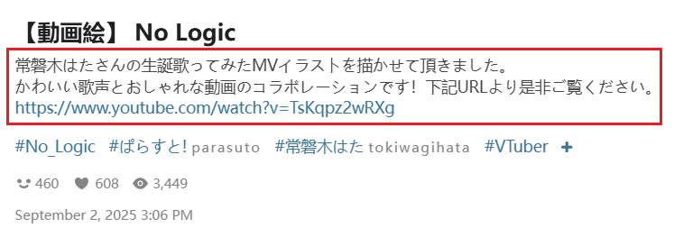
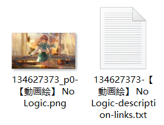

## Save the metadata of the work

<div class="option settingsPanel_optionCard" data-no="73" data-pin-bound="true" style="display: flex;">
  <a href="/#/en/Settings-Download/Metadata?flag=73" target="_blank" class="has_tip settingNameStyle" data-xztip="_保存作品的元数据说明" data-tip="The downloader can generate a file with the same name (but different extension) for each work to save its metadata.&lt;br&gt;
You can choose which types of works to generate metadata files for, and you can choose TXT format or (and) JSON format.&lt;br&gt;
TXT format is easy to read but only contains relatively common data.&lt;br&gt;
JSON format is the downloader's internal data and saves more information." data-bind-click="true">
    <span data-xztext="_保存作品的元数据">Save the <span class="key">metadata</span> of the work</span>
    <span class="gray1"> ? </span>
  </a>
  <div class="optionLine">
    <span class="mb4" data-xztext="_作品类型带冒号">Work type: </span>
    <input type="checkbox" name="saveMetaType0" id="setSaveMetaType0" class="need_beautify checkbox_common">
    <span class="beautify_checkbox" tabindex="0"></span>
    <label for="setSaveMetaType0" data-xztext="_插画">Illustrations</label>
    <input type="checkbox" name="saveMetaType1" id="setSaveMetaType1" class="need_beautify checkbox_common">
    <span class="beautify_checkbox" tabindex="0"></span>
    <label for="setSaveMetaType1" data-xztext="_漫画">Manga</label>
    <input type="checkbox" name="saveMetaType2" id="setSaveMetaType2" class="need_beautify checkbox_common">
    <span class="beautify_checkbox" tabindex="0"></span>
    <label for="setSaveMetaType2" data-xztext="_动图">Ugoira</label>
    <input type="checkbox" name="saveMetaType3" id="setSaveMetaType3" class="need_beautify checkbox_common">
    <span class="beautify_checkbox" tabindex="0"></span>
    <label for="setSaveMetaType3" data-xztext="_小说">Novels</label>
  </div>
  <div class="optionLine">
    <span class="mb4" data-xztext="_文件格式">File format: </span>
    <input type="checkbox" name="saveMetaFormatTXT" id="saveMetaFormatTXT" class="need_beautify checkbox_common" checked="">
    <span class="beautify_checkbox" tabindex="0"></span>
    <label for="saveMetaFormatTXT" class="active"> TXT </label>
    <input type="checkbox" name="saveMetaFormatJSON" id="saveMetaFormatJSON" class="need_beautify checkbox_common" checked="">
    <span class="beautify_checkbox" tabindex="0"></span>
    <label for="saveMetaFormatJSON"> JSON </label>
  </div>
</div>

The downloader can generate a file for each work during download to save some of its data.

Example:


?> The filename of the metadata includes a `meta` marker at the end.

### Work Type

Divided into `illustration`, `manga`, `Ugoira`, `novel`.

The downloader will create a metadata file for the work only if the downloaded file type matches the types you have checked.

?> Novels have a separate setting for saving metadata: [Save metadata in the novel](/en/Settings-Download/Novels?id=save-metadata-in-the-novel), which saves some metadata at the beginning of the novel without creating a separate TXT file, making it more convenient. However, it saves less metadata. If you have enabled "Save metadata in the novel," you usually do not need to select the "Novel" type in this option.

### File Format

There are two formats to choose from, and you can select both:
- `TXT` format is easy to read but only contains relatively commonly used data.
- `JSON` format is the downloader's internal data, retaining more information.

#### TXT Format

For image works (illustration, manga, Ugoira), an example of the metadata saved by the downloader is as follows:

```
ID
120589699

URL
https://www.pixiv.net/i/120589699

Original
https://i.pximg.net/img-original/img/2024/07/16/19/51/00/120589699_p0.jpg

Thumbnail
https://i.pximg.net/c/250x250_80_a2/custom-thumb/img/2024/07/16/19/51/00/120589699_p0_custom1200.jpg

xRestrict
AllAges

AI
No

User
愛田乃彩

UserID
91879154

Title
マジシャンフリーナ

Description
(Twitter) https://twitter.com/aida_noa_
無断転載・使用禁止/All rights reserved.

Tags
#原神
#GenshinImpact
#フリーナ
#Furina
#女の子
#イラスト

Size
4096 x 2537

Bookmark
814

Date
2024-07-16T10:51:00+00:00
```

The metadata for novels is roughly the same but does not include `Original` or `Size`. Additionally, the `Thumbnail` for novels is the URL of its cover image.

#### JSON Format

The content of the JSON file is the downloader's internal data (i.e., the crawl result of the work). If you want to know the meaning of each property, you can check the comments in the source code (only in Chinese): [StoreType.d.ts](https://github.com/xuejianxianzun/PixivBatchDownloader/blob/master/src/ts/store/StoreType.d.ts).

An example of the metadata content saved in the JSON file is as follows:

```json
{
  "aiType": 1,
  "idNum": 120589699,
  "id": "120589699_p0",
  "original": "https://i.pximg.net/img-original/img/2024/07/16/19/51/00/120589699_p0.jpg",
  "thumb": "https://i.pximg.net/c/250x250_80_a2/custom-thumb/img/2024/07/16/19/51/00/120589699_p0_custom1200.jpg",
  "regular": "https://i.pximg.net/img-master/img/2024/07/16/19/51/00/120589699_p0_master1200.jpg",
  "small": "https://i.pximg.net/c/540x540_70/img-master/img/2024/07/16/19/51/00/120589699_p0_master1200.jpg",
  "title": "マジシャンフリーナ",
  "description": "(Twitter) <strong><a href=\"https://twitter.com/aida_noa_\" target=\"_blank\">twitter/aida_noa_</a></strong><br />無断転載・使用禁止/All rights reserved.",
  "pageCount": 1,
  "index": 0,
  "tags": [
    "原神",
    "GenshinImpact",
    "フリーナ",
    "Furina",
    "女の子",
    "イラスト"
  ],
  "tagsWithTransl": [
    "原神",
    "GenshinImpact",
    "フリーナ",
    "Furina",
    "女の子",
    "イラスト",
    "芙宁娜",
    "女孩子",
    "插画"
  ],
  "tagsTranslOnly": [
    "原神",
    "GenshinImpact",
    "芙宁娜",
    "Furina",
    "女孩子",
    "插画"
  ],
  "user": "愛田乃彩",
  "userId": "91879154",
  "fullWidth": 4096,
  "fullHeight": 2537,
  "ext": "jpg",
  "bmk": 868,
  "bookmarked": false,
  "bmkId": "",
  "date": "2024-07-16T10:51:00+00:00",
  "uploadDate": "2024-07-16T10:51:00+00:00",
  "type": 0,
  "rank": null,
  "ugoiraInfo": null,
  "seriesTitle": "",
  "seriesOrder": null,
  "seriesId": null,
  "novelMeta": null,
  "likeCount": 452,
  "viewCount": 4703,
  "commentCount": 3,
  "xRestrict": 0,
  "sl": 2
}
```

## Save work description

<div class="option settingsPanel_optionCard" data-no="74" data-pin-bound="true" style="display: flex;">
  <a href="/#/en/Settings-Download/Metadata?flag=74" target="_blank" class="has_tip settingNameStyle" data-xztip="_保存作品简介的说明" data-tip="Create a TXT file to save the work description" data-bind-click="true">
    <span data-xztext="_保存作品的简介">Save work <span class="key">description</span></span>
    <span class="gray1"> ? </span>
  </a>
  <input type="checkbox" name="saveWorkDescription" class="need_beautify checkbox_switch">
  <span class="beautify_switch" tabindex="0"></span>
  <div class="subOptionWrap flexBasis100" data-show="saveWorkDescription" style="display: none;">
    <div class="optionLine">
      <label for="saveEachDescription" data-xztext="_每个作品分别保存" class="has_tip active" data-xztip="_简介的Links标记" data-tip="Save each work's description in a separate TXT file.&lt;br&gt;If the work description contains hyperlinks, the downloader will add a 'links' tag at the end of the file name">Save each work separately</label>
      <span class="gray1"> ? &nbsp;</span>
      <input type="checkbox" name="saveEachDescription" id="saveEachDescription" class="need_beautify checkbox_switch">
      <span class="beautify_switch" tabindex="0"></span>
    </div>
    <div class="optionLine">
      <label for="summarizeDescription" data-xztext="_汇总到一个文件">Summarize to one file</label>
      <input type="checkbox" name="summarizeDescription" id="summarizeDescription" class="need_beautify checkbox_switch">
      <span class="beautify_switch" tabindex="0"></span>
    </div>
  </div>
</div>

If you enable this feature, the downloader will create a TXT file for each work to save its description.
The description refers to the text below the work's title. For example:



The TXT description file saved by the downloader:



The filename of the TXT description file may include two markers:

1. A `description` marker, which is always included. This marker depends on the downloader's language setting, e.g., it is `简介` when using Chinese.
2. If the description contains URL links, the downloader will add a `links` marker.

?> Some works do not have a description, in which case the downloader will not create a TXT description file for them.

This setting has two sub-options, which can be enabled simultaneously:

### Save each work separately

Create a TXT description file for each work. When downloading multiple works, the downloader will generate multiple description files.

### Summarize to one file

When crawling is complete, the downloader will generate a TXT file aggregating all work descriptions.

The **save location** for this file has two cases:

1. If the aggregated file's description data comes from works by multiple different users, it will be saved directly to the browser's download directory. Since it does not belong to a specific user, it should not be placed in a username folder.

2. If the description data comes from the same user:

- If a folder in the naming rule contains `{user}`, the downloader will save the aggregated file in that folder. For the default naming rule, it will be saved in `pixiv/{user}-{user_id}/`.
- If none of the folders in the naming rule contain `{user}`, the downloader will save it directly to the browser's download directory.

The **filename** of the aggregated file includes multiple parts:
1. `description summary` marker, which changes based on the downloader's language.
2. `user` marker with the username. This is only present if all data in the aggregated file comes from the same user.
3. Current page title
4. Time and date

For example:

```
description summary-user saihate-No_Logic, virtual YouTuber ／ 【動画絵】 No Logic ／ September 2nd, 2025 - pixiv-9／10／2025, 11：31：11 PM.txt
```

