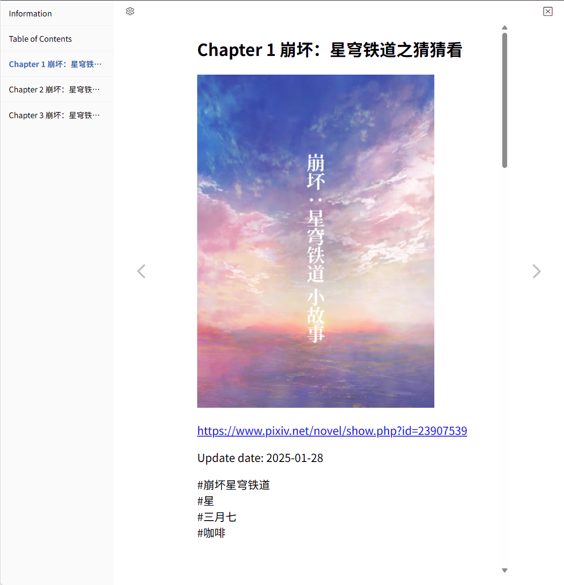
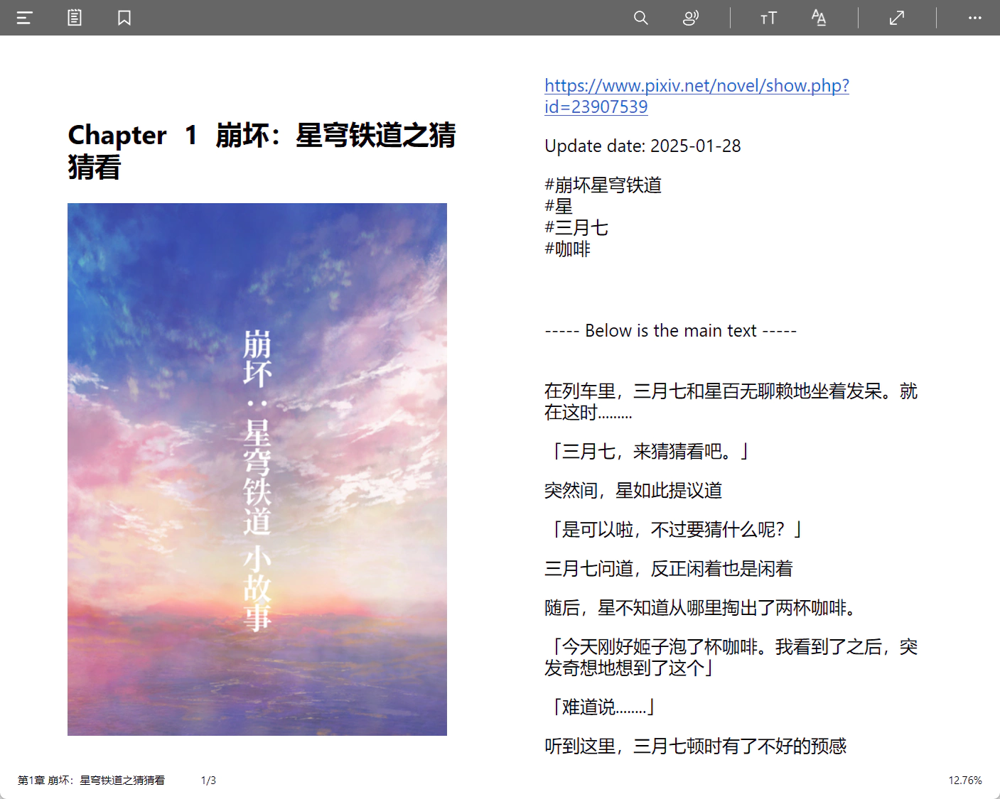
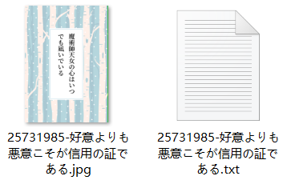
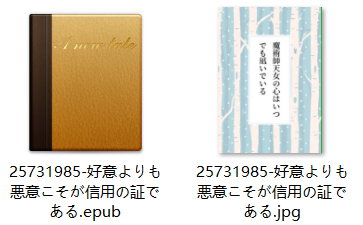
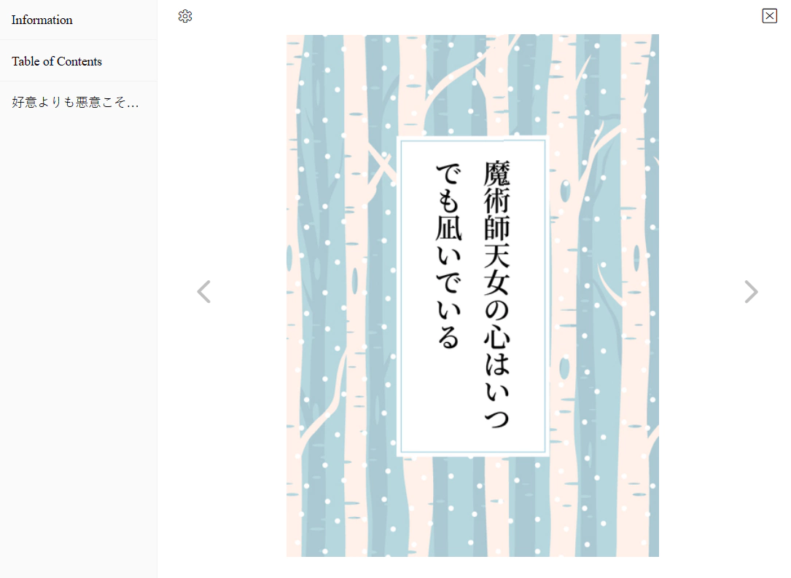
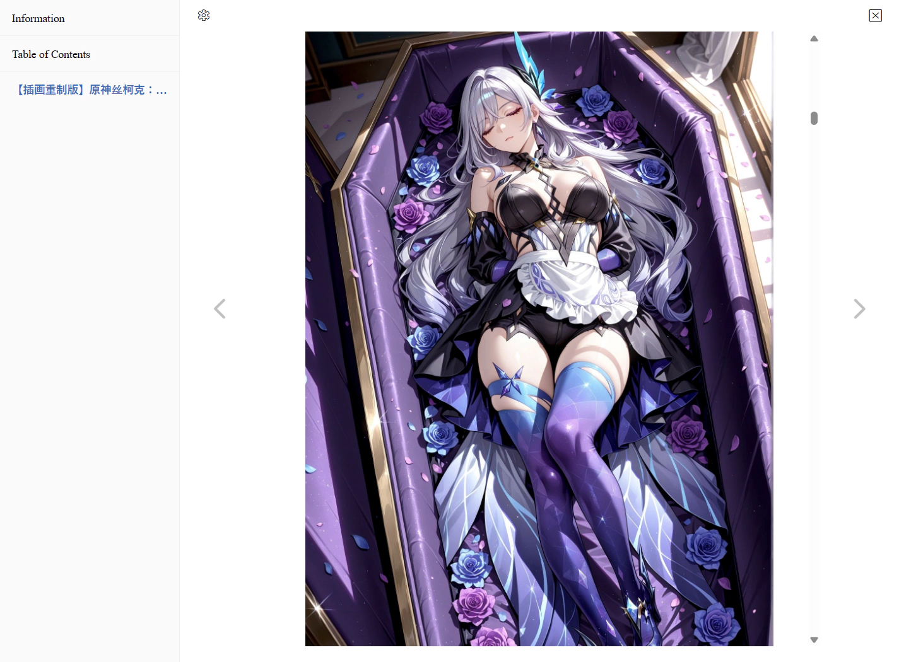

## Save the novel as

<div class="option settingsPanel_optionCard" data-no="67" data-pin-bound="true" style="display: flex;">
  <a href="http://localhost:3000/#/en/Settings-Download/Novels?flag=67" target="_blank" class="has_tip settingNameStyle" data-xztip="_小说保存格式的说明" data-tip="TXT is a plain text file. When you select TXT format, the pictures in the novel will be saved separately. &lt;br&gt;EPUB is an e-book format, and the pictures in the novel will be embedded in the EPUB file." data-bind-click="true">
    <span data-xztext="_小说保存格式">Save the <span class="key">novel</span> as</span>
    <span class="gray1"> ? </span>
  </a>
  <input type="radio" name="novelSaveAs" id="novelSaveAs2" class="need_beautify radio" value="epub" checked="">
  <span class="beautify_radio" tabindex="0"></span>
  <label for="novelSaveAs2"> EPUB </label>
  <input type="radio" name="novelSaveAs" id="novelSaveAs1" class="need_beautify radio" value="txt">
  <span class="beautify_radio" tabindex="0"></span>
  <label for="novelSaveAs1" class="active"> TXT </label>
</div>

You can choose to save novels in TXT or EPUB format. The default format is EPUB.

EPUB is an e-book format that can display rich text styles, supports a table of contents, and can save cover images and illustrations internally.

?> The EPUB files generated by the downloader follow the EPUB `2.0` standard. Some software cannot open it correctly, such as WPS. Please use a novel reader to open them.

PS: Compared with EPUB, TXT has some disadvantages:
- TXT files contain only plain text and cannot display rich text styles such as text formatting or hyperlinks.
- TXT files do not have a unified heading-level structure. When they contain multiple novels or chapters, many readers cannot recognize the chapter structure correctly.
- TXT files cannot store illustrations inside the novel, so images can only be saved as separate files. Sometimes one TXT file may end up with more than a dozen related images, which becomes messy.

### Some Novel Readers

**Online Reading**: https://epub-reader.online/



**Windows**: Aquile Reader


You can install it from the Microsoft Store.



**Android**: Moon+ Reader


## Save metadata in the novel

<div class="option settingsPanel_optionCard" data-no="68" data-pin-bound="true" style="display: flex;">
  <a href="http://localhost:3000/#/en/Settings-Download/Novels?flag=68" target="_blank" class="has_tip settingNameStyle" data-xztip="_在小说里保存元数据提示" data-tip="Save the novel's title, author, tags and other information to the beginning of the novel." data-bind-click="true">
    <span data-xztext="_在小说里保存元数据">Save <span class="key">metadata</span> in the novel</span>
    <span class="gray1"> ? </span>
  </a>
  <input type="checkbox" name="saveNovelMeta" class="need_beautify checkbox_switch">
  <span class="beautify_switch" tabindex="0"></span>
</div>

If you enable this option, the program will save the following information at the beginning of the novel content:

- Novel title
- Author name
- Novel URL
- Novel description
- Novel tags

For example:

```
好意よりも悪意こそが信用の証である

切由

https://www.pixiv.net/novel/show.php?id=25731985

2025-08-28

土井先生追い討ちのターンです。胃薬もらいに行きましょうね。

#RKRN夢
#忍玉-夢
#rkrn夢
#RKRNプラス
#久々知兵助
#土井半助
#中在家長次
#SAN値チェックのお時間です
#逆方向の信用…
```

?> This setting applies regardless of whether the novel is saved in TXT or EPUB format.

## Download the novel's cover image

<div class="option settingsPanel_optionCard" data-no="69" data-pin-bound="true" style="display: flex;">
  <a href="http://localhost:3000/#/en/Settings-Download/Novels?flag=69" target="_blank" class="settingNameStyle" data-xztext="_下载小说的封面图片" data-bind-click="true">Download the novel's <span class="key">cover</span> image</a>
  <input type="checkbox" name="downloadNovelCoverImage" class="need_beautify checkbox_switch" checked="">
  <span class="beautify_switch" tabindex="0"></span>
</div>

The downloader will save novel cover images separately, with filenames matching the novel's filename for alignment.

Example:





If you do not want to save cover images, you can disable this option.

If you save the novel in EPUB format, the downloader will also add an embedded cover image, for example:



Currently, regardless of whether this option is enabled, the downloader always adds an embedded cover. In future versions, I plan to make the embedded cover follow this setting, meaning if you disable this option, the downloader will not add an embedded cover.

## Download embedded images in novels

<div class="option settingsPanel_optionCard" data-no="70" data-pin-bound="true" style="display: flex;">
  <a href="http://localhost:3000/#/en/Settings-Download/Novels?flag=70" target="_blank" class="settingNameStyle" data-xztext="_下载小说里的内嵌图片" data-bind-click="true">Download <span class="key">embedded</span> images in novels</a>
  <input type="checkbox" name="downloadNovelEmbeddedImage" class="need_beautify checkbox_switch" checked="">
  <span class="beautify_switch" tabindex="0"></span>
</div>

Some novels have images inserted in the body (mainly R-18 novels); these are embedded images.

The downloader saves embedded images by default. There are differences depending on the novel save format.

When saving novels as TXT, images are saved separately with filenames matching the novel's. For example:


When saving novels as EPUB, images are not saved separately but stored inside the EPUB. For example:



!> For large PNG format embedded images, some novel readers may only display part of them. This is an issue with the reader, not the downloader.

## Automatically merge novel series

<div class="option settingsPanel_optionCard" data-no="71" data-pin-bound="true" style="display: flex;">
  <a href="http://localhost:3000/#/en/Settings-Download/Novels?flag=71" target="_blank" class="has_tip settingNameStyle" data-xztip="_自动合并系列小说的说明" data-tip="When crawling works, if a novel belongs to a series, automatically crawl all novels in that series and merge them." data-bind-click="true">
    <span data-xztext="_自动合并系列小说">Automatically <span class="key">merge</span> novel series</span>
    <span class="gray1"> ? </span>
  </a>
  <input type="checkbox" name="autoMergeNovel" class="need_beautify checkbox_switch">
  <span class="beautify_switch" tabindex="0"></span>
  <div class="subOptionWrap" data-show="autoMergeNovel" style="display: none;">
    <label for="skipNovelsInSeriesWhenAutoMerge" data-xztext="_不再单独下载系列里的小说" class="has_tip active" data-xztip="_不再单独下载系列里的小说的说明" data-tip="When you enable &quot;Automatically merge series novels&quot;, there is usually no need to download novels in the series individually, as they are already included in the merged novel file.&lt;br&gt;If you still want to download them, you can uncheck this sub-setting.">No longer download novels in the series individually</label>
    <span class="gray1"> ? &nbsp;</span>
    <input type="checkbox" name="skipNovelsInSeriesWhenAutoMerge" id="skipNovelsInSeriesWhenAutoMerge" class="need_beautify checkbox_switch" checked="">
    <span class="beautify_switch" tabindex="0"></span>
  </div>
</div>

When crawling works, if a novel belongs to a certain series, the downloader can automatically crawl all novels in this series and merge them.

This feature is disabled by default, and you can enable it yourself when needed.

-----------

Sub-options:

### No Longer Download Novels in the Series Individually

This option is enabled by default.

The premise for this option to take effect is that you have enabled the "Automatically Merge Series Novels" feature.

During one crawl, if a novel belongs to a series, the downloader will merge the series it belongs to and no longer download this novel individually, because they are already included in the merged novel file.

This feature may lead to fewer crawl results. For example: In 30 novels, 20 novels belong to series, and the remaining 10 novels are standalone, then there will only be 10 crawl results in the end.

If you still want to download these novels individually, you can disable this sub-option.

-----------

Below are some detailed explanations of the "Automatically Merge Series Novels" feature, assuming you have enabled it.

### Detailed Instructions

**Recommend Using EPUB Format:**

When merging series novels, one file will contain multiple novels (multiple chapters), but many readers cannot recognize chapter markers in TXT, so I strongly recommend using the EPUB format.

**Timing of Operation:**

Although this setting belongs to the "Download" category, it actually works during the crawl stage.

When crawling works, if a novel belongs to a series, the downloader will automatically start merging this series of novels. The original crawl progress will pause until this series of novels is merged. In other words, crawling works and merging novels will alternate, rather than happening simultaneously. This is to avoid sending too many requests at the same time.

**Increased Number of Requests:**

When using this feature, the downloader may crawl additional novels, leading to an increase in the number of requests.

For example: Initially there are 30 novels, which belong to 10 series, and these 10 series contain a total of 100 novels, then the downloader needs to crawl the 100 novels in the series.

**Relevance:**

When you search for a certain tag and merge series novels, one thing to know is that some novels in the series may not belong to the current tag, meaning the relevance is not strong.

For example: When I search for "ブルーアーカイブ", there is a series containing 411 novels, but only 89 of them contain "ブルーアーカイブ":
https://www.pixiv.net/novel/series/1368392

**May Download Duplicates:**

When merging series novels, the downloader does not check if it has been downloaded before. That is, it is not affected by the "Do not download duplicate files" function. In two crawls, if they contain the same series novel, it will be merged and downloaded twice.

**No Duplicate Merging in a Single Crawl:**

In the same crawl task, each series will only be merged once. For example: If 10 novels belong to the same series, the downloader will only merge once, not 10 times.

**Split Large Files:**

Some series novels may contain a large number of illustrations, leading to a very large size. When the novel's save format is EPUB, the downloader will split the very large novel into multiple parts, generating multiple EPUB files, with each file's size usually a bit larger than 100 MB.

In one test, a series novel had nearly 4 GB of illustrations, and the downloader split it into 28 EPUB files.

### Interval Time

Since each series may contain multiple novels, and each novel has a cover image and/or illustrations, the downloader may send many requests.

To avoid triggering Pixiv's warning, the downloader **always** adds interval time when merging novels to reduce the frequency of sending requests. Even if you have not enabled "Slow Down Crawl Speed" or "Download Interval" settings, the downloader will still add interval time when executing this feature.

**Detailed Instructions:**
- When crawling novel data, the downloader defaults to using a `2400` ms interval time. This is the minimum value. If the "Interval Time" you set in "Slow Down Crawl Speed" is greater than this value, the downloader will use your set interval time.
- When downloading novel images, the downloader defaults to using a `2000` ms interval time. This is the minimum value. If the "Interval Time" you set in "Download Interval" is greater than this value, the downloader will use your set interval time.

The current interval times were determined after several large-scale crawl tests. If you don't frequently crawl large numbers of novels, there is usually no need to use larger interval times. If you are concerned about being warned by Pixiv when using this feature, you can increase the interval time in the two settings mentioned above, for example, set to `3000` ms or 3 seconds, and change it back after the task is completed.

### Some Test Data

During the development of this feature, I conducted several large-scale crawl tests, each crawling 900 or more novels (the maximum was 3000). Based on average data, if crawling 1000 novels each time, when the crawl is finished, some data is as follows:
- 50% - 60% of novels belong to series novels
- 150 - 200 series novels
- Approximately 7000 - 10000 requests will be sent. These requests mainly include: retrieving series information, setting information, novel data; downloading novel cover images, downloading illustrations in novels.

The above data volume is relatively small, just for reference, to have a rough idea.

Due to too many requests, I was warned by Pixiv several times, and one account was even banned. So I gradually increased the interval time to reduce the possibility of being warned.

## Split threshold when merging series novels

<div class="option settingsPanel_optionCard new" data-no="72" data-pin-bound="true" style="display: flex;">
  <a href="http://localhost:3000/#/en/Settings-Download/Novels?flag=72" target="_blank" class="settingNameStyle" data-bind-click="true">
    <span data-xztext="_合并系列小说时的分割阈值">Split <span class="key">threshold</span> when merging series novels</span>
  </a>
  <input type="text" name="singleEPUBFileSizeLimit" class="setinput_style blue" value="200">
  <span>MiB</span>
  <button type="button" class="gray1 textButton showMsgBtn" data-title="_合并系列小说时的分割阈值" data-msg="_合并系列小说时的分割阈值的帮助" data-xztext="_帮助">Help</button>
<span class="settingsPanel_newBadge" aria-hidden="true">
    <svg class="icon settingsPanel_newBadgeIcon" aria-hidden="true">
      <use xlink:href="#new"></use>
    </svg>
    </span></div>


Some novel series contain a very large number of illustrations and may even exceed 4 GB. If a single EPUB file is too large, it may fail to download, and some readers may not be able to open it. So when merging a novel series, the downloader uses this setting to split the file.

If the split threshold is set to 200 MB, then when the downloader merges a novel series with a total size of 1 GB, it will split it into about 5 or 6 files.

**Tips:**
- This setting takes effect only when merging novel series. Individually downloaded novels will not be split.
- The minimum value is 100 MiB, and the maximum value is 1000 MiB (not recommended).
- When splitting EPUB files, the downloader does not cut off chapter content. In practice, the downloader checks the size only after adding a chapter, so the chapter at the split point is always complete.
