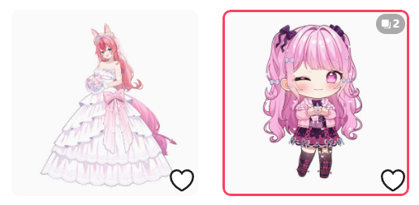
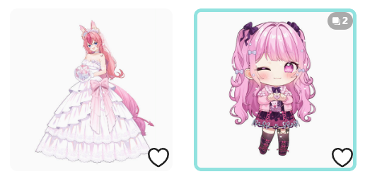
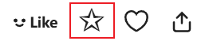
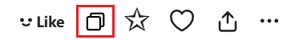
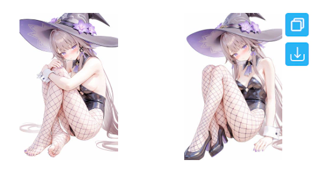
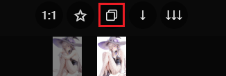
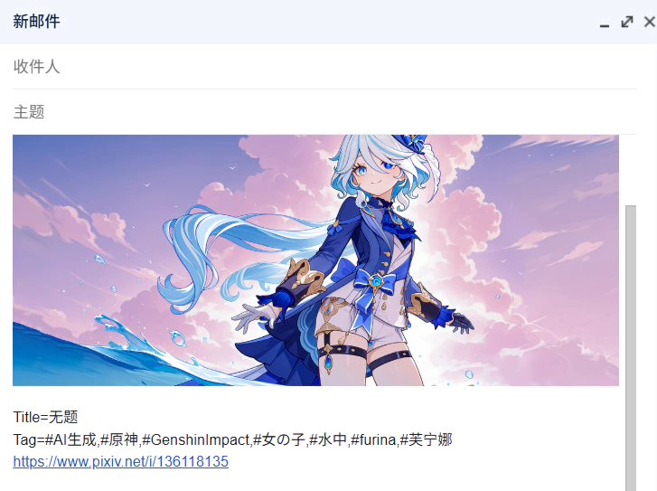

## Highlight following users

  <a href="/#/en/Settings-Enhance/Other?flag=86" target="_blank" class="has_tip settingNameStyle" data-xztip="_高亮关注的用户的说明" data-tip="The names of users you are following will have a yellow background, or be displayed in yellow. &lt;br&gt;This is convenient for you to confirm whether you follow a certain user." data-bind-click="true">
    Highlight following users
     ? 
  </a>
  <input type="checkbox" name="highlightFollowingUsers" class="need_beautify checkbox_switch" checked="">
  

The names of users you are following will be highlighted, allowing you to quickly see whether you are following a user.

The visual effect varies depending on the color mode of the Pixiv page.

In default (light) mode, usernames will have a yellow background:

In night mode, usernames will be displayed in yellow:

## Display a border on downloaded works

  <a href="/#/en/Settings-Enhance/Other?flag=87" target="_blank" class="settingNameStyle" data-xztext="_在下载过的作品上显示边框" data-bind-click="true">Display a border on downloaded works</a>
  <input type="checkbox" name="showBorderOnDownloadedWorks" class="need_beautify checkbox_switch">
  
  

    

      Width
      <input type="text" name="borderWidth" class="setinput_style blue w30" value="3">
      px
    

    

      Color (Hex)
      <input type="text" name="borderColor" class="setinput_style blue w80" id="borderColor" value="#ff4060">
    

  

    <svg class="icon settingsPanel_newBadgeIcon" aria-hidden="true">
      <use xlink:href="#new"></use>
    </svg>
    

This feature depends on the download records saved by the downloader itself.

If you want to see at a glance whether a work has already been downloaded, you can enable this setting.

The downloader will display a border on downloaded works. The default border is red, as shown below:

The left one has not been downloaded, and the right one has.

This setting has 2 sub-options: you can set the border width and color. Below is the effect with a border width of `4` px and a color of `#91e2df`:

Known issue:

To prevent the border from being covered or clipped by other elements, the downloader displays it inside the thumbnail area. Because of that, it covers the edge area. This usually does not matter for image works, but on some pages for novel works it may cover the text at the top:

## Downloader's bookmark feature (✩)

  <a href="/#/en/Settings-Enhance/Other?flag=88" target="_blank" class="has_tip settingNameStyle" data-xztip="_收藏设置的说明" data-tip="Sometimes you'll see a bookmark button (✩) added by the downloader, which you can click to bookmark the work. &lt;br&gt;
You can choose whether to include tags for the work, and whether to make it public.&lt;br&gt;
This setting is also used when you use the Downloader to bookmark works in batches." data-bind-click="true">
    Downloader's bookmark feature (✩)
     ? 
  </a>
  

    Whether to add tags
    <input type="radio" name="widthTag" id="widthTag1" class="need_beautify radio" value="yes" checked="">
    
    <label for="widthTag1" data-xztext="_添加" class="active">Add</label>
    <input type="radio" name="widthTag" id="widthTag2" class="need_beautify radio" value="no">
    
    <label for="widthTag2" data-xztext="_不添加">Do not add</label>
  

  

    Public
    <input type="radio" name="restrict" id="restrict1" class="need_beautify radio" value="no" checked="">
    
    <label for="restrict1" data-xztext="_公开" class="active">Public</label>
    <input type="radio" name="restrict" id="restrict2" class="need_beautify radio" value="yes">
    
    <label for="restrict2" data-xztext="_不公开">Private</label>
  

You can use this setting to control the downloader's behavior when bookmarking works.

?> Pixiv's original bookmark button (heart-shaped) is not affected by this setting.

**Features affected by this setting:**

1. Quick bookmark button (☆) on work pages:

2. Quick bookmark button (☆) when previewing search results on search pages:

3. Bookmarking a work with the `B` shortcut while previewing.
4. Bookmarking a work by clicking the (☆) button in the image viewer.
5. [Bookmark after download](/en/Settings-Download/Download-behavior?id=bookmark-works-after-downloading) feature.
6. "Bookmark all works on this page" feature in the downloader's "More" tab on user homepages and search pages.

**Features not affected by this setting:**

The "Add tags to uncategorized works" button on the bookmark page is unaffected. This feature always includes tags and automatically sets public or private status based on the work's prior bookmark status.

**Sub-options:**

When using features affected by this setting, you can configure:
- Whether to include the work's tags
- Whether to bookmark as public or private

The default is to add tags and bookmark publicly.

?> If a work has already been bookmarked, you can still bookmark it again. This will not change its bookmark time (and thus will not affect its order on the bookmark page), but it can update its public status and tag list. For example: if a work was previously set to public and had tags added, you can, if needed, change the settings to private with no tags and have the downloader bookmark it again.

## Copy button

  <a href="/#/en/Settings-Enhance/Other?flag=89" target="_blank" class="has_tip settingNameStyle" data-xztip="_显示复制按钮的提示" data-tip="The downloader will display a copy button on the work thumbnail and within the work page. Clicking it allows you to copy the work's image and some data.
&lt;br&gt;
You can customize the data and format to be copied.
&lt;br&gt;
On the work page, and when previewing a work, you can use the shortcut key &lt;span class=&quot;blue&quot;&gt;Alt + C&lt;/span&gt; to copy." data-bind-click="true">
    Copy button
     ? 
  </a>
  

    Copy content
    <input type="checkbox" name="copyFormatImage" id="setCopyFormatImage" class="need_beautify checkbox_common">
    
    <label for="setCopyFormatImage">image/png</label>
    <input type="checkbox" name="copyFormatText" id="setCopyFormatText" class="need_beautify checkbox_common" checked="">
    
    <label for="setCopyFormatText" class="active">text/plain</label>
    <input type="checkbox" name="copyFormatHtml" id="setCopyFormatHtml" class="need_beautify checkbox_common" checked="">
    
    <label for="setCopyFormatHtml" class="active">text/html</label>
    <button type="button" class="gray1 textButton showMsgBtn" data-title="_复制内容" data-msg="_对复制的内容的说明" data-xztext="_帮助">Help</button>
  

  

    Image size
    <input type="radio" name="copyImageSize" id="copyImageSize1" class="need_beautify radio" value="original">
    
    <label for="copyImageSize1" data-xztext="_原图" class="active">Original</label>
    <input type="radio" name="copyImageSize" id="copyImageSize2" class="need_beautify radio" value="regular" checked="">
    
    <label for="copyImageSize2" data-xztext="_普通">Regular</label>
  

  

    Text format
    <button type="button" class="gray1 textButton toggleArea" data-toggle-target="#copyWorkInfoFormatTip" data-for-no="89" data-xztext="_提示">Tip</button>
    <textarea class="centerPanelTextArea beautify_scrollbar" name="copyWorkInfoFormat" rows="1" placeholder="id: {id}{n}title: {title}{n}tags: {tags}{n}url: {url}{n}user: {user}">id: {id}{n}title: {title}{n}tags: {tags}{n}url: {url}{n}user: {user}</textarea>
  

  

    You can set the format of the text content, which will affect the content copied in text/plain and text/html formats.
 
You can use all tags from the naming rule, or input custom characters, such as spaces, underscores, the name of each tag.
 
Additionally, you can use these tags:
     
    {url}
    This work's URL
     
    {n}
    Line break
     
  

The downloader will display a copy button on the work thumbnail and within the work page. Clicking it allows you to copy the work's image and some data. You can paste it into other software to save or share with others. For example:

### Usable Scenarios

Overall, there are two methods:
- In some scenarios, the downloader displays a copy button; clicking it performs the copy.
- In some scenarios, there is no copy button; use the shortcut `Alt` + `C`.

Detailed explanations follow:

#### Copy Button on Thumbnails

Click the copy button to copy.

At this point, the downloader will only copy the first image of the work.

#### Copy Button Below the Image in the Work Page

Click the copy button to copy.

At this point, the downloader will only copy the first image of the work.

?> In the work page, you can press the shortcut `Alt` + `C` to use the copy function.

#### When Previewing Work Details

Click the copy button to copy.

At this point, the downloader will only copy the first image of the work.

-----------

In the following usage scenarios, the downloader will copy the currently viewed image, rather than always the first one.

#### Copy Button on Thumbnail List in the Work Page

The downloader adds a thumbnail list on multi-image work pages. Click the copy button to copy.

The downloader will copy the image corresponding to this thumbnail, not fixed to the first one.

#### When Previewing a Work

Press the shortcut `Alt` + `C` to copy the currently viewed image.

#### When Long-Pressing the Right Mouse Button on a Work Thumbnail to View the Large Image

Press the shortcut `Alt` + `C` to copy the currently viewed image.

#### In the Image Viewer

Click the copy button, or use the shortcut `Alt` + `C` to copy the currently viewed image.

### Copy Content

You can choose the content to copy based on your needs.

**Description of Each Format:**
- `image/png` copies the work's image. Not selected by default, because its priority is too high in some social software, causing `text/html` content to be ignored.
You can choose to copy the original image or the thumbnail.
- `text/plain` copies the work's text information. Almost all applications support pasting plain text content.
- `text/html` copies both the work's image and text information simultaneously. This is rich text format, containing both of the above. In the HTML-formatted text, the downloader adds hyperlinks to the work ID, URL, and author name, but many software remove the hyperlinks during pasting, retaining only the text, so there may be no hyperlinks after pasting.

**Tips:**
- The focus of this feature in design is to copy both image and text content (`text/html`) simultaneously for sharing or archiving, but the actual effect depends on the target application. Some applications may not support this format or cannot display the image correctly.
- You can select multiple formats at the same time, meaning copying multiple contents. However, when pasting in an application, the application will only use one of them—the format with the highest priority. Other formats will be ignored.
- Priorities may differ across applications. This is unrelated to the downloader.
- For example: if you copy both `image/png` and `text/html` content, some applications will use the former, while others may use the latter. If the pasted content does not meet your expectations, you can deselect one of the formats.

### Image Size

You can choose the size of the image to copy:
- `Original`: Default value, the downloader will copy the original image.
- `Regular`: The downloader will copy the thumbnail (maximum size 1200px).

**Behavior When Copying Images:**

- The downloader copies the original image by default. However, some original images are quite large (for example, over 30 MiB), and may not paste properly in certain applications. If you encounter this issue, you can change the "Image Size" setting to `Regular`.
- For illustration and manga works, the downloader copies the first image or the one you're viewing, depending on the scenario.
- For Ugoira works, the downloader always copies its static thumbnail.
- For novel works, the downloader always copies its cover image.

### Text Format

You can set the format for the downloader to copy text content, which affects the generated `text/plain` and `text/html` content.

You can use all tags from the naming rule, or input custom characters, such as spaces, underscores, or tag names.

Additionally, you can use these tags:

- `{url}` the URL of this work
- `{n}` line break

-----------

The default text format rule is `id: {id}{n}title: {title}{n}tags: {tags}{n}url: {url}{n}user: {user}`, and the generated text content example is as follows:

id: [134304155](https://www.pixiv.net/i/134304155)

title: 黑塔

tags: #女の子,#崩壊スターレイル,#尻神様,#おっぱい,#裸足,#ヘルタ,#黑塔,#網タイツ,#AI生成作品,#崩坏星穹铁道

url: [https://www.pixiv.net/i/134304155](https://www.pixiv.net/i/134304155)

user: [光怪陆离](https://www.pixiv.net/users/95485582)

### Some Screenshots

I tested the pasting effects. Many PC software perform well, but Android applications do not, so I only recommend using this feature on PC.

#### Browser

Input areas on web pages can only paste plain text content by default, i.e., `text/plain`.

Some web applications may have targeted optimizations, for example, in Discord you can paste images `image/png`.

In Gmail, you can paste both image and text simultaneously, i.e., `text/html`, for example:

#### Microsoft Word

Word prioritizes `text/html` format content, then `image/png`, and finally `text/plain`. For example:

#### Telegram

Telegram does not support `text/html` format, so you cannot paste both image and text simultaneously in Telegram.

Other format priorities are: `image/png`, `text/plain`.

If you want to paste an image in Telegram, select the `image/png` format to paste the image:

#### QQ

QQ's priority is: `image/png`, `text/html`, `text/plain`.

If you want to paste both image and text in QQ, select `text/html` and deselect `image/png`; otherwise, only the image will be pasted.

#### WeChat

WeChat has the same priority as QQ. You can paste both image and text simultaneously, but WeChat splits them during sending. For example:

#### Android Applications

Some Android applications can paste `text/html` content, but the image may not display:

If you want to send an image, select the `image/png` format and deselect other formats. This way, the downloader only copies the image, which can be pasted in some applications.

Some Android applications can paste images copied by the downloader, such as Telegram and WeChat. But in some applications, images cannot be pasted, such as QQ.

