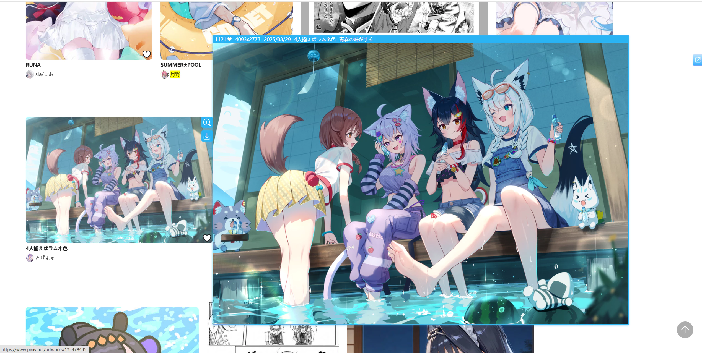
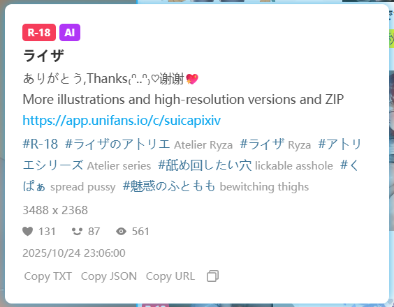

## Preview works

  <a href="http://localhost:3000/#/en/Settings-Enhance/Preview?flag=75" target="_blank" class="has_tip settingNameStyle" data-xztip="_预览作品的说明" data-tip="When you hover the mouse over the image thumbnail, the downloader can display a larger image." data-bind-click="true">
    Preview works
     ? 
  </a>
  <input type="checkbox" name="PreviewWork" class="need_beautify checkbox_switch" checked="">
  
  

    

      <input type="checkbox" name="previewSingleImageWork" id="previewSingleImageWork" class="need_beautify checkbox_common" checked="">
      
      <label for="previewSingleImageWork" data-xztext="_单图作品" class="active">Single image works</label>
      <input type="checkbox" name="previewMultiImageWork" id="previewMultiImageWork" class="need_beautify checkbox_common" checked="">
      
      <label for="previewMultiImageWork" data-xztext="_多图作品" class="active">Multi-image works</label>
      <input type="checkbox" name="previewUgoira" id="previewUgoira" class="need_beautify checkbox_common" checked="">
      
      <label for="previewUgoira" data-xztext="_动图" class="active">Ugoira</label>
    

    

      <label for="checkBlockTagsForPreviewWork" data-xztext="_检查屏蔽的标签">Check blocked tags</label>
      <input type="checkbox" name="checkBlockTagsForPreviewWork" id="checkBlockTagsForPreviewWork" class="need_beautify checkbox_switch">
      
      <button type="button" class="gray1 textButton showMsgBtn" data-title="_检查屏蔽的标签" data-msg="_检查屏蔽的标签的帮助" data-xztext="_帮助">Help</button>
    

    

      <label for="wheelScrollSwitchImageOnPreviewWork" class="has_tip active" data-xztext="_使用鼠标滚轮切换作品里的图片" data-xztip="_这可能会阻止页面滚动" data-tip="This might stop the page from scrolling">Use the mouse wheel to switch images in multi-image works</label>
      <input type="checkbox" name="wheelScrollSwitchImageOnPreviewWork" id="wheelScrollSwitchImageOnPreviewWork" class="need_beautify checkbox_switch" checked="">
      
    

    

      <label for="swicthImageByKeyboard" class="has_tip active" data-xztext="_使用方向键和空格键切换图片" data-xztip="_使用方向键和空格键切换图片的提示" data-tip="← ↑ Previous image&lt;br&gt;→ ↓ Next image&lt;br&gt;Spacebar Next image">Use the arrow keys and space bar to switch images</label>
      <input type="checkbox" name="swicthImageByKeyboard" id="swicthImageByKeyboard" class="need_beautify checkbox_switch" checked="">
      
    

    

      <label for="previewWorkWait" data-xztext="_等待时间">Waiting time</label>
      <input type="text" name="previewWorkWait" id="previewWorkWait" class="setinput_style blue" value="400">
      ms
    

    

      <label for="showPreviewWorkTip" data-xztext="_显示摘要信息" class="active">Show summary</label>
      <input type="checkbox" name="showPreviewWorkTip" id="showPreviewWorkTip" class="need_beautify checkbox_switch" checked="">
      
    

    

      View image dimensions
      <input type="radio" name="prevWorkSize" id="prevWorkSize1" class="need_beautify radio" value="original">
      
      <label for="prevWorkSize1" data-xztext="_原图">Original</label>
      <input type="radio" name="prevWorkSize" id="prevWorkSize2" class="need_beautify radio" value="regular" checked="">
      
      <label for="prevWorkSize2" data-xztext="_普通" class="active">Regular</label>
    

    

      <button type="button" class="gray1 textButton toggleArea" data-toggle-target="#previewWorkShortcutTip" data-for-no="75" data-xztext="_快捷键列表">Shortcut list</button>
    

  

  

    Alt + P Toggle preview work function on/off 
When viewing the preview image, you can use the following shortcut keys: 
B(ookmark) Bookmark the previewed work 
C(urrent) Download the currently previewed image (if the work has multiple images, only the current one will be downloaded) 
D(ownload) Download the currently previewed work (if the work has multiple images, all will be downloaded by default) 
Alt + C Copy the currently previewed image and work information 
Esc Close the preview image 
← ↑ Previous image 
→ ↓ Next image 
Spacebar Next image
  

This feature is enabled by default. When the mouse cursor hovers over a work thumbnail, the downloader displays a larger preview image, as shown below:

<!-- https://www.pixiv.net/artworks/134677173 -->

?> The preview image adapts to the available area and won't exceed the screen.

To **close the preview image**, use one of these methods:
- Move the mouse cursor outside the thumbnail area
- Click the preview image
- Press the `Esc` key

### Shortcut Key List

Use the shortcut key `Alt` + `P` to toggle the preview work feature on or off.

When viewing a preview image, you can use the following shortcuts:
- `B`ookmark: Bookmark the previewed work
- `C`urrent: Download the currently displayed image (if the work has multiple images, only the current one is downloaded)
- `D`ownload: Download the entire previewed work (if the work has multiple images, all are downloaded)
- `Alt` + `C` copies the current preview image and work information
- `Esc`: Close the preview image
- `←` `↑`: Previous image
- `→` `↓`: Next image
- `Space`: Next image

### Check blocked tags

This feature is disabled by default.

If you enable it, the downloader checks whether the work contains either of these two kinds of blocked tags:
1. The `must not contain tags` you configured in the downloader
2. The tags you muted in your Pixiv account settings

If the work matches either blocked condition, the downloader will not preview it.

### Use the mouse wheel to switch images in multi-image works

This feature is enabled by default.

When previewing a work with **multiple images**, you can scroll the mouse wheel to switch between images.

- Scrolling down shows the next image
- Scrolling up shows the previous image

?> If the mouse wheel is used to switch images, the downloader prevents page scrolling. This is because page scrolling would move the mouse away from the thumbnail, causing the preview area to disappear.

### Use the arrow keys and space bar to switch images

This feature is enabled by default.

It enables the following shortcuts:
- `←` `↑`: Previous image
- `→` `↓`: Next image
- `Space`: Next image

When the preview area is displayed and this feature is enabled, the downloader prevents the default behavior of these keys, so they won't scroll the page.

If you want these keys to always scroll the page, disable this feature.

### Wait Time

After the mouse enters the thumbnail area, if it doesn't leave within a certain time, the downloader prepares to display the preview image.

The default wait time is `400` milliseconds, which you can adjust as needed.

### Show summary

This feature is enabled by default.

The downloader displays some information at the top of the preview image. For example:

The information displayed from left to right is as follows:

- Current image number and total number of images being viewed, such as `1/7`. This information is only displayed when the work contains multiple images.
- `AI` tag. This tag is only displayed when the work is generated by AI.
- `R-18` or `R-18G` tag. All-ages works will not display this tag.
- Number of bookmarks for the work.
- Image dimensions (always displays the dimensions of the first image)
- Posting time of the work
- Title of the work
- Description of the work (if any)

### View image dimensions

You can choose which image size the downloader loads when previewing works.

- `Original`: Loads the original image. Some original images may be large, so loading may be slower.
- `Regular`: Default, loads regular-sized images. These are smaller, so they load quickly.

?> This option only affects the image size during preview, not the size during download.

**Difference between sizes:**

- If the original image's dimensions exceed 1200 px, the regular size will be 1200 px.
- If the original image is smaller than 1200 px, the regular size matches it. For example, if the original is 500 x 500 px, the regular size is also 500 x 500 px.

**Display area differences:**

When selecting "Original," if the image is larger than 1200 px and there's enough space around it, the downloader displays a larger preview image.

Here's an example. The regular image width is 1200 px:

The original image width is 4093 px, so the display area is larger:

?> Although the original image can sometimes be displayed larger, this isn't always the case. If the available area around the thumbnail is limited, the regular image may already fill it, and the original won't appear larger.

## Long press the right mouse button on the thumbnail to display the large image

  <a href="http://localhost:3000/#/en/Settings-Enhance/Preview?flag=76" target="_blank" class="settingNameStyle" data-xztext="_长按右键显示大图" data-bind-click="true">Long press the right mouse button on the thumbnail to display the large image</a>
  <input type="checkbox" name="showOriginImage" class="need_beautify checkbox_switch" checked="">
  
  

    

      View image dimensions
      <input type="radio" name="showOriginImageSize" id="showOriginImageSize1" class="need_beautify radio" value="original">
      
      <label for="showOriginImageSize1" data-xztext="_原图" class="active">Original</label>
      <input type="radio" name="showOriginImageSize" id="showOriginImageSize2" class="need_beautify radio" value="regular" checked="">
      
      <label for="showOriginImageSize2" data-xztext="_普通">Regular</label>
    

    

      <button type="button" class="gray1 textButton toggleArea" data-toggle-target="#showOriginImageShortcutTip" data-for-no="76" data-xztext="_快捷键列表">Shortcut list</button>
    

  

  

    When viewing the large image of the work, press the shortcut key D to download the work.
     
    Press the shortcut key C to download only the currently displayed image.
     
    Alt + C Copy the currently previewed image and work information.
     
    
  

When previewing a work, long-pressing the right mouse button on a thumbnail displays the full image.

By default, the downloader loads the original image and displays it at its original size (1:1). If the original image is large, it may exceed the screen (this is not a bug).

For example, when viewing the original image of this work, only the top half is shown:

**Tips:**

- If parts of the image exceed the screen, move the mouse cursor to view the full image.
- Use the mouse wheel to zoom in or out.
- When previewing a multi-image work, the full image shown matches the previewed image (e.g., `3/10`).

To **close the full image**, use one of these methods:
- Click the left mouse button.
- Press the `Esc` key.

### Shortcut Key List

When the downloader displays the full image, you can use these shortcuts:
- `C`urrent: Download the currently displayed image
- `D`ownload: Download the entire work the image belongs to (if the work has multiple images, all are downloaded)
- `Alt` + `C` copies the current preview image and work information

### View image dimensions

You can choose whether the downloader loads the original or regular image when displaying the full image. The default is original.

Regular images have a maximum size of 1200 px, while original images may be larger, so they may appear bigger at 1:1 display.

## Preview the details of the work

  <a href="http://localhost:3000/#/en/Settings-Enhance/Preview?flag=77" target="_blank" class="has_tip settingNameStyle" data-xztip="_预览作品的详细信息的说明" data-tip="Mouse over the thumbnail of the work to view the work data" data-bind-click="true">
    Preview the details of the work
     ? 
  </a>
  <input type="checkbox" name="PreviewWorkDetailInfo" class="need_beautify checkbox_switch">
  
  

    Display area width&nbsp;
    <input type="text" name="PreviewDetailInfoWidth" class="setinput_style blue" value="400">
    &nbsp;px
  

Normally, you can only view detailed information, such as a work's description, tag list, view count, like count, and bookmark count, on the work's page.

If you want to view details without entering the work's page, enable this feature. When you hover over a thumbnail, the downloader will display detailed information, such as:

Links in this panel, such as URLs in the description or tag links, are clickable.

To close the details panel, click it or move the mouse outside its boundaries.

**Bottom Buttons:**

There are some buttons at the bottom of the panel:

- `Copy TXT` Click it, and the downloader will copy some metadata to the clipboard, the content is the same as the TXT file generated by the [Save the metadata of the work](/en/Settings-Download/Metadata?id=save-the-metadata-of-the-work) function.
- `Copy JSON` Click it, and the downloader will copy the work's JSON data (unprocessed raw data).
- `Copy URL` Click it, and the downloader will copy the work's URL.
- `Copy Button` Click it, and the downloader will copy the first image of the work and the text summary.

