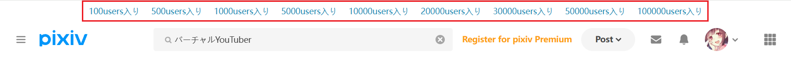
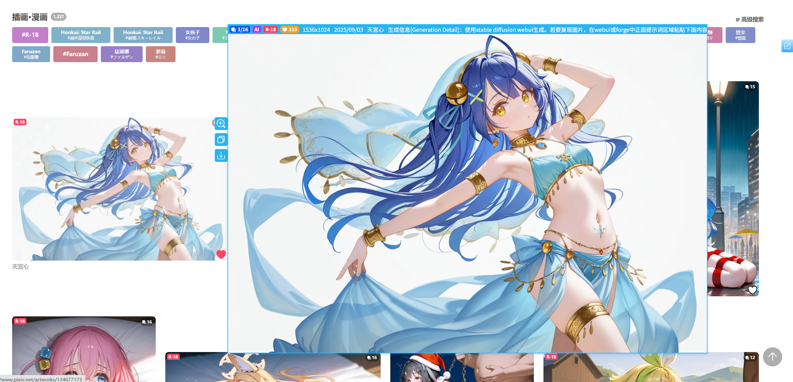
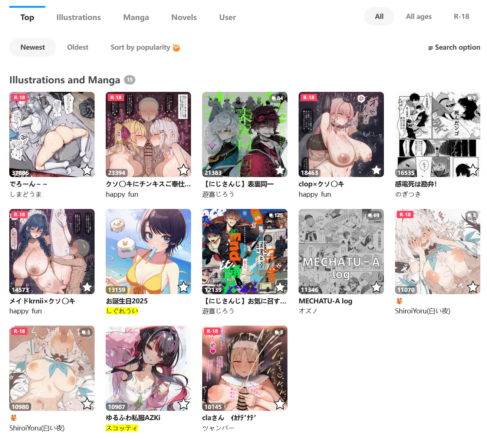

## Add a quick search area on the search page

<div class="option settingsPanel_optionCard" data-no="90" data-pin-bound="true" style="display: flex;">
  <a href="http://localhost:3000/#/en/Settings-Enhance/Search-page?flag=90" target="_blank" class="has_tip settingNameStyle" data-xztip="_在搜索页面添加快捷搜索区域的说明" data-tip="At the top of the search page (/tags/), the downloader can display some bookmarks tags, such as &quot;10000users入り&quot;, and you can click it to add it after the searched tag." data-bind-click="true">
    <span data-xztext="_在搜索页面添加快捷搜索区域">Add a quick <span class="key">search</span> area on the search page</span>
    <span class="gray1"> ? </span>
  </a>
  <input type="checkbox" name="showFastSearchArea" class="need_beautify checkbox_switch" checked="">
  <span class="beautify_switch" tabindex="0"></span>
</div>


The downloader adds buttons for specific bookmark counts at the top of search pages, for example:



Clicking these buttons adds the bookmark count tag to the current search and performs the search.

For example, on the `バーチャルYouTuber` page, clicking the `10000users入り` button makes the downloader search for `バーチャルYouTuber 10000users入り`.

?> This feature is particularly useful for non-Pixiv premium users.

?> This feature is not always accurate. Some users may add the `10000users入り` tag to works with low bookmark counts, which is deceptive.

The bookmark count buttons added by the downloader are:

```
100users入り 500users入り 1000users入り 5000users入り 10000users入り 20000users入り 30000users入り 50000users入り 100000users入り
```

## Filter works on the search page

<div class="option settingsPanel_optionCard" data-no="91" data-pin-bound="true">
  <a href="http://localhost:3000/#/en/Settings-Enhance/Search-page?flag=91" target="_blank" class="settingNameStyle" data-bind-click="true">
    <span data-xztext="_过滤搜索页面的作品"><span class="key">Filter</span> works on the search page</span>
  </a>
  <input type="checkbox" name="filterSearchResults" class="need_beautify checkbox_switch">
  <span class="beautify_switch" tabindex="0"></span>
  <button type="button" class="gray1 textButton showMsgBtn" data-title="_过滤搜索页面的作品" data-msg="_过滤搜索页面的作品的说明" data-xztext="_帮助">Help</button>
</div>


This feature is enabled by default. When the mouse cursor hovers over a work thumbnail, the downloader displays a larger preview image, as shown below:


<!-- https://www.pixiv.net/artworks/134677173 -->

?> The preview image adapts to the available area and won't exceed the screen.

To **close the preview image**, use one of these methods:
- Move the mouse cursor outside the thumbnail area
- Click the preview image
- Press the `Esc` key

## Remove the works of followed users from the search page

<div class="option settingsPanel_optionCard" data-no="92" data-pin-bound="true" style="display: flex;">
  <a href="http://localhost:3000/#/en/Settings-Enhance/Search-page?flag=92" target="_blank" class="has_tip settingNameStyle" data-xztip="_在搜索页面里移除已关注用户的作品的说明" data-tip="This will only display the works of unfollowed users, making it easier for you to discover new users you like.&lt;br&gt;Only works on the search page (/tags/)." data-bind-click="true">
    <span data-xztext="_在搜索页面里移除已关注用户的作品"><span class="key">Remove</span> the works of followed users from the search page</span>
    <span class="gray1"> ? </span>
  </a>
  <input type="checkbox" name="removeWorksOfFollowedUsersOnSearchPage" class="need_beautify checkbox_switch">
  <span class="beautify_switch" tabindex="0"></span>
</div>


If enabled, the downloader removes works by followed users when you're on a search page.

This helps you focus on works from unfollowed users when discovering new artists, reducing distractions and improving efficiency.

?> This feature does not affect crawl results. Even if works by followed users are removed, the downloader will still crawl them.

## Preview filter results on search page

<div class="option settingsPanel_optionCard" data-no="93" data-pin-bound="true" style="display: flex;">
  <a href="http://localhost:3000/#/en/Settings-Enhance/Search-page?flag=93" target="_blank" class="has_tip settingNameStyle" data-xztip="_预览搜索结果说明" data-tip="When crawling in the search page (/tags/), the downloader can display the crawled works on the current page and sort them from high to low according to the number of bookmarks. &lt;br&gt;
    When the preview function is enabled, the downloader will not automatically start downloading, so that users can filter the crawled results again. &lt;br&gt;
    You can set how many previews to display. If there are too many previews, the page may crash." data-bind-click="true">
    <span data-xztext="_预览搜索结果"><span class="key">Preview</span> filter results on search page</span>
    <span class="gray1"> ? </span>
  </a>
  <input type="checkbox" name="previewResult" class="need_beautify checkbox_switch" checked="">
  <span class="beautify_switch" tabindex="0"></span>
  <div class="subOptionWrap" data-show="previewResult" style="display: inline-flex;">
    <span class="settingNameStyle" data-xztext="_上限">Upper limit</span>
    <input type="text" name="previewResultLimit" class="setinput_style blue w80" value="3000">
  </div>
</div>


When crawling on search pages for illustrations, manga, or Ugoira, the downloader displays crawled works on the current page, sorted by bookmark count from high to low.

Example:



This feature provides a what-you-see-is-what-you-get experience. You can preview crawl results, filter them, and then download.

?> After crawling, you can use buttons in the downloader's "Crawl" tab to filter results.

**Note:** When this feature is enabled, the "Automatically start downloading" setting is disabled. This allows users to filter results before downloading. To start downloading automatically after crawling, disable this feature.

?> This feature does not work on novel search pages.

### Upper Limit

When the downloader crawls many works (e.g., thousands), displaying them all on the page increases memory usage. In extreme cases, this may cause the page to crash.

You can set a "Limit" to control the maximum number of displayed works. The default is `3000`.


