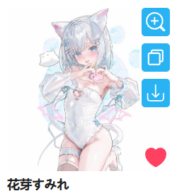
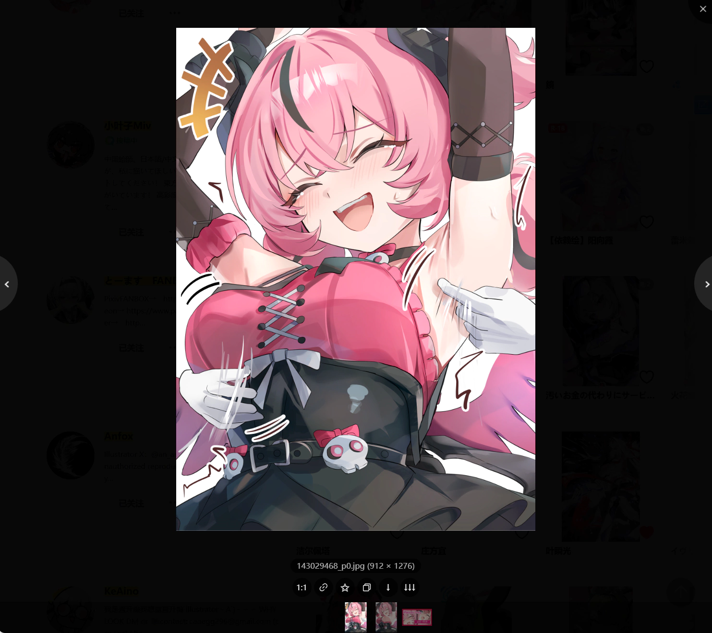
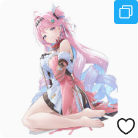

## Button position on thumbnails

  <a href="/#/en/Settings-Enhance/Thumbnail-buttons?flag=82" target="_blank" class="settingNameStyle has_tip" data-xztip="_缩略图上按钮的位置的说明" data-tip="The downloader will display some buttons on the work thumbnails. You can set whether they appear on the left or right side of the thumbnail." data-bind-click="true">
    Button position on thumbnails
     ? 
  </a>
  <input type="radio" name="magnifierPosition" id="magnifierPosition1" class="need_beautify radio" value="left">
  
  <label for="magnifierPosition1" data-xztext="_左侧">Left</label>
  <input type="radio" name="magnifierPosition" id="magnifierPosition2" class="need_beautify radio" value="right" checked="">
  
  <label for="magnifierPosition2" data-xztext="_右侧" class="active">Right</label>

    <svg class="icon settingsPanel_newBadgeIcon" aria-hidden="true">
      <use xlink:href="#new"></use>
    </svg>
    

When you hover over a thumbnail, the downloader displays some buttons on it, as shown below:

By default they are shown on the right side, but you can switch them to the left side if you want.

## Show zoom button on thumbnail

  <a href="/#/en/Settings-Enhance/Thumbnail-buttons?flag=83" target="_blank" class="settingNameStyle" data-xztext="_在作品缩略图上显示放大按钮" data-bind-click="true">Show zoom button on thumbnail</a>
  <input type="checkbox" name="magnifier" class="need_beautify checkbox_switch" checked>
  
  

    

      View image dimensions
      <input type="radio" name="magnifierSize" id="magnifierSize1" class="need_beautify radio" value="original">
      
      <label for="magnifierSize1" data-xztext="_原图" class="active">Original</label>
      <input type="radio" name="magnifierSize" id="magnifierSize2" class="need_beautify radio" value="regular" checked="">
      
      <label for="magnifierSize2" data-xztext="_普通">Regular</label>
    

  

When the mouse hovers over a work's thumbnail, the downloader displays a magnifier icon, as shown below:

Clicking the magnifier icon opens the image viewer to view each image in the work. The effect is shown below:

You can find detailed information about the image viewer here: [Image Viewer](/en/Convenience-Features?id=image-viewer).

## Display copy button on thumbnail

  <a href="/#/en/Settings-Enhance/Thumbnail-buttons?flag=84" target="_blank" class="settingNameStyle" data-xztext="_在缩略图上显示复制按钮" data-bind-click="true">Display copy button on thumbnail</a>
  <input type="checkbox" name="showCopyBtnOnThumb" class="need_beautify checkbox_switch" checked="">
  

When you hover the mouse over a work's thumbnail, the downloader will show a Copy button on the thumbnail, as shown below:

Clicking it copies the original image and some information about the work. You can adjust what gets copied in the [Copy Button](/en/Settings-Enhance/Other?id=copy-button) settings.

## Show download button on thumbnail

  <a href="/#/en/Settings-Enhance/Thumbnail-buttons?flag=85" target="_blank" class="settingNameStyle" data-xztext="_在作品缩略图上显示下载按钮" data-bind-click="true">Show download button on thumbnail</a>
  <input type="checkbox" name="showDownloadBtnOnThumb" class="need_beautify checkbox_switch" checked="">
  

When the mouse hovers over a work thumbnail, the downloader will display a download button on the thumbnail. Clicking the download button allows you to download this work. This feature makes downloading works much more convenient.

