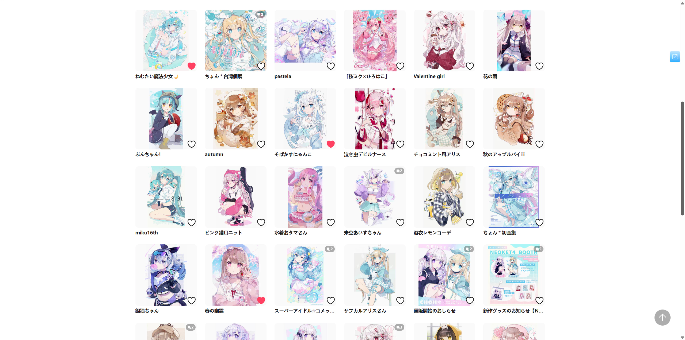
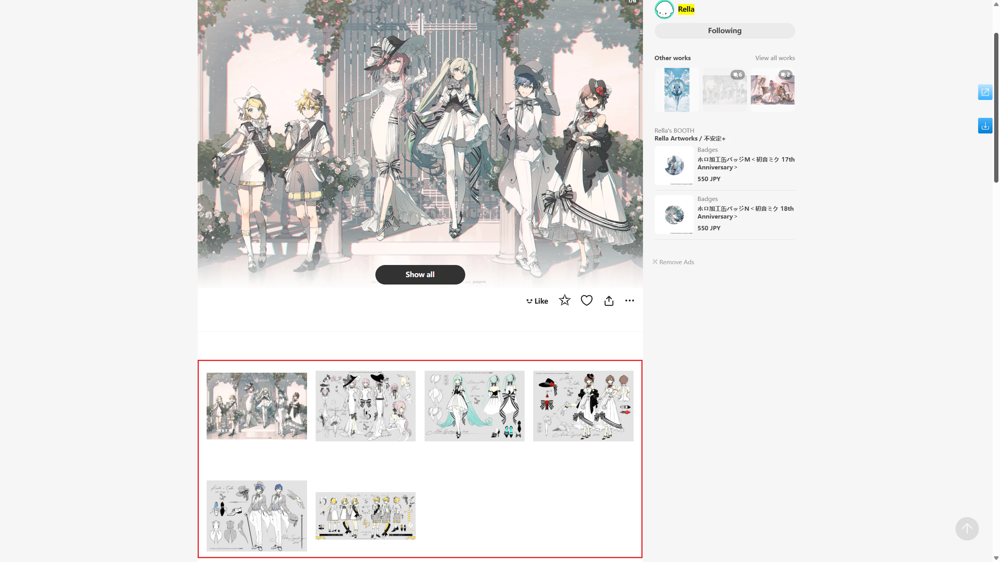

## Show larger thumbnails

  <a href="http://localhost:3000/#/en/Settings-Enhance/Thumbnails?flag=78" target="_blank" class="has_tip settingNameStyle" data-xztip="_显示更大的缩略图的说明" data-tip="Pixiv's default thumbnails are relatively small, and the downloader can display larger thumbnails for easier preview.&lt;br&gt;This feature is not very stable, because Pixiv's code updates may cause this feature to partially fail." data-bind-click="true">
    Show larger thumbnails
     ? 
  </a>
  <input type="checkbox" name="showLargerThumbnails" class="need_beautify checkbox_switch">
  

Pixiv's work thumbnails are small, typically 184 px in size. Here's a screenshot of the default situation:

Because thumbnails are small and lack detail, I often need to click to view the full image to decide if I like it.

Enabling this feature widens the page display area and increases thumbnail size to 250 px.

If the "Replace square thumbnails to show image aspect ratio" feature below is enabled, thumbnails will increase to 540 px, as shown below:

This makes images clearer and easier on the eyes, reducing fatigue.

?> The number of images displayed per row varies depending on screen resolution and DPI scaling.

## Replace square thumbnails to show image ratio

  <a href="http://localhost:3000/#/en/Settings-Enhance/Thumbnails?flag=79" target="_blank" class="has_tip settingNameStyle" data-xztip="_替换方形缩略图以显示图片比例的说明" data-tip="Pixiv's thumbnails are square, so you can't see the whole picture or whether it's horizontal or vertical. &lt;br&gt;The downloader can display the full thumbnail to show the image ratio." data-bind-click="true">
    Replace square thumbnails to show image ratio
     ? 
  </a>
  <input type="checkbox" name="replaceSquareThumb" class="need_beautify checkbox_switch" checked="">
  

Pixiv's thumbnails are 250 px square images, making it impossible to see the image's aspect ratio (horizontal or vertical) or its full content, as edges are cropped. For example:

Enabling this feature replaces square thumbnails with 540 px thumbnails, showing the image's original aspect ratio and full content. For example:

## Show thumbnail list on multi-image work pages

  <a href="http://localhost:3000/#/en/Settings-Enhance/Thumbnails?flag=80" target="_blank" class="has_tip settingNameStyle" data-xztip="_在多图作品页面里显示缩略图列表的说明" data-tip="On a multi-image artwork page (/artworks/), the downloader can display a preview of each image." data-bind-click="true">
    Show thumbnail list on multi-image work pages
     ? 
  </a>
  <input type="checkbox" name="displayThumbnailListOnMultiImageWorkPage" class="need_beautify checkbox_switch" checked="">
  

When on a **multi-image work** page (e.g., [121525173](https://www.pixiv.net/artworks/121525173)), the downloader can display thumbnails for each image. For example:

You can preview or download each image.

When hovering over a thumbnail, you can use enhancement features, such as:

These features include:
- Preview work (you can still use shortcuts `C` to download a single image or `D` to download the entire work)
- View full image by long-pressing the right mouse button
- Show download button on thumbnails (clicking this button downloads only the specific image)
- Clicking a thumbnail opens the image viewer, for example:

## Display images in grayscale

  <a href="http://localhost:3000/#/en/Settings-Enhance/Thumbnails?flag=81" target="_blank" class="settingNameStyle" data-bind-click="true">
    Display images in grayscale
  </a>
  <input type="checkbox" name="imageToGray" class="need_beautify checkbox_switch" checked="">
  

