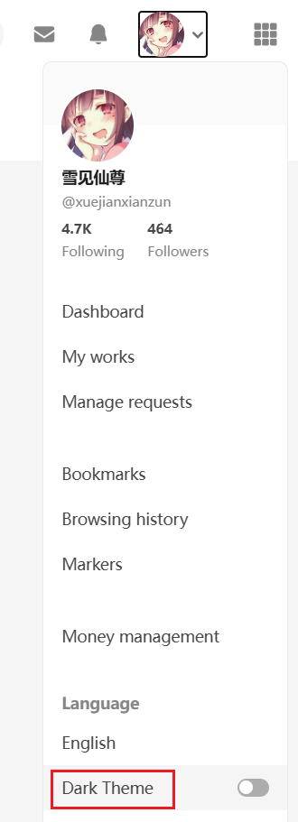
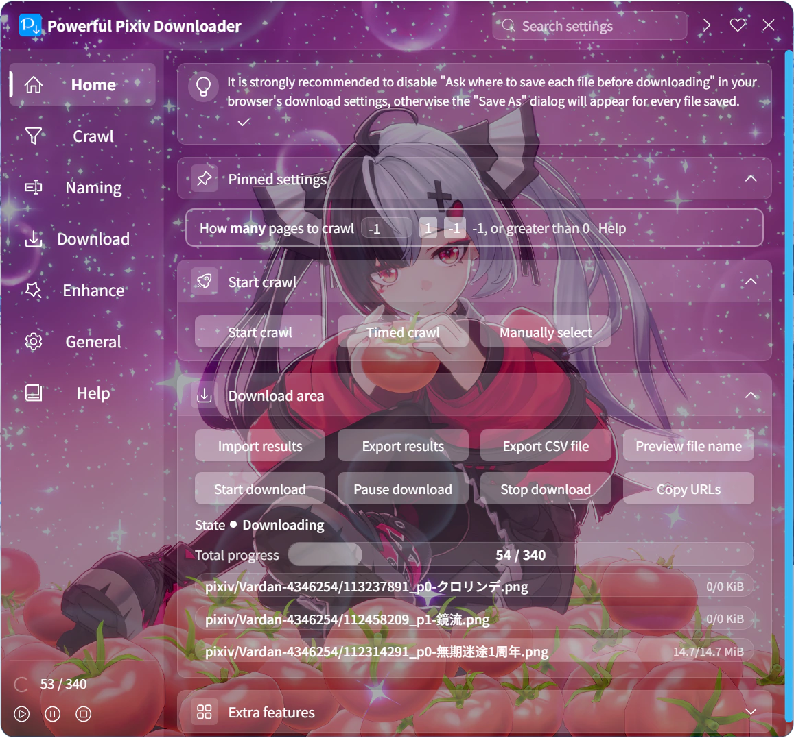

## Color theme

  <a href="/#/en/Settings-General/Appearance?flag=98" target="_blank" class="settingNameStyle" data-xztext="_颜色主题" data-bind-click="true">Color theme</a>
  <input type="radio" name="theme" id="theme1" class="need_beautify radio" value="auto" checked="">
  
  <label for="theme1" data-xztext="_自动检测" class="active">Auto</label>
  <input type="radio" name="theme" id="theme2" class="need_beautify radio" value="white">
  
  <label for="theme2">White</label>
  <input type="radio" name="theme" id="theme3" class="need_beautify radio" value="dark">
  
  <label for="theme3">Dark</label>

You can choose the downloader's color theme.

- `Auto detect`: the default. The downloader will automatically detect the page background color and Pixiv's color theme to decide whether to use light mode or dark mode.
- `White`: Light mode
- `Dark`: Dark mode

?> The downloader defaults to following Pixiv's color theme.

Pixiv's pages default to light mode. To use dark mode, click your Pixiv avatar and select "Dark mode" from the menu, as shown:

## Background image

  <a href="/#/en/Settings-General/Appearance?flag=99" target="_blank" class="has_tip settingNameStyle" data-xztip="_背景图片的说明" data-tip="You can select a local image as the background image of the downloader." data-bind-click="true">
    Background image
     ? 
  </a>
  <input type="checkbox" name="bgDisplay" class="need_beautify checkbox_switch">
  
  

    

      <button type="button" class="textButton fireEvent" data-event="selectBG" id="selectBG" data-xztext="_选择文件">Select a file</button>
      <button type="button" class="textButton fireEvent" data-event="clearBG" id="clearBG" data-xztext="_清除">Clear</button>
    

    

      Alignment&nbsp;
      <input type="radio" name="bgPositionY" id="bgPosition1" class="need_beautify radio" value="center" checked="">
      
      <label for="bgPosition1" data-xztext="_居中">center</label>
      <input type="radio" name="bgPositionY" id="bgPosition2" class="need_beautify radio" value="top">
      
      <label for="bgPosition2" data-xztext="_顶部" class="active">top</label>
    

    

      Opacity
      <input name="bgOpacity" type="range">
    

  

You can set a favorite image as the downloader's background image and adjust its transparency and alignment.

The effect is shown below:

?> The downloader does not include built-in background images, so you need to select one yourself.

This setting includes buttons and options:

### Select File

Clicking this button opens a file selection dialog, allowing you to choose an image as the background.

?> Supported image formats: `.jpg, .jpeg, .png, .bmp, .webp`.

### Clear

Clicking this button removes the downloader's background image, restoring it to no background.

### Alignment

- `Center`: Aligns the center of the background image with the center of the settings panel. If the image's height exceeds the panel's height, the top and bottom may be cropped.
- `Top`: Default. Aligns the top of the background image with the top of the settings panel. If the image's height exceeds the panel's height, the bottom may be cropped.

You can adjust the alignment based on the specific image for a better display effect.

### Opacity

You can use this slider to adjust the background image's opacity. The default is `75%`.

?> There is a black background layer beneath the background image, and the image is semi-transparent by default, making it appear darker. This design ensures the text on the settings panel is readable. Adjusting opacity essentially controls how much the background image obscures the black background.

Increasing opacity makes the image closer to its original appearance; decreasing it darkens the image.

## Highlight keywords

  <a href="/#/en/Settings-General/Appearance?flag=100" target="_blank" class="has_tip settingNameStyle" data-xztip="_高亮显示关键字的说明" data-tip="Highlight the keywords in each setting name so that you can quickly find the settings you need." data-bind-click="true">
    Highlight keywords
     ? 
  </a>
  <input type="checkbox" name="boldKeywords" class="need_beautify checkbox_switch" checked>
  

Keywords in each setting are highlighted in blue and bold to help users find specific settings more quickly.

