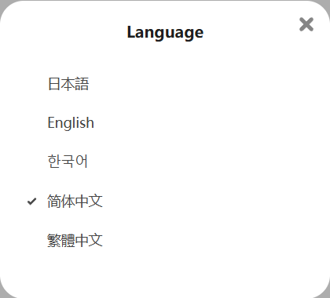

## Language

  <a href="http://localhost:3000/#/en/Settings-General/Language?flag=94" target="_blank" class="settingNameStyle" data-xztext="_Language" data-bind-click="true">Language</a>
  <input type="radio" name="userSetLang" id="userSetLang1" class="need_beautify radio" value="auto" checked="">
  
  <label for="userSetLang1" data-xztext="_自动检测">Auto</label>
  <input type="radio" name="userSetLang" id="userSetLang2" class="need_beautify radio" value="zh-cn">
  
  <label for="userSetLang2">简体中文</label>
  <input type="radio" name="userSetLang" id="userSetLang3" class="need_beautify radio" value="zh-tw">
  
  <label for="userSetLang3">繁體中文</label>
  <input type="radio" name="userSetLang" id="userSetLang4" class="need_beautify radio" value="ja">
  
  <label for="userSetLang4">日本語</label>
  <input type="radio" name="userSetLang" id="userSetLang5" class="need_beautify radio" value="en">
  
  <label for="userSetLang5" class="active">English</label>
  <input type="radio" name="userSetLang" id="userSetLang6" class="need_beautify radio" value="ko">
  
  <label for="userSetLang6">한국어</label>
  <input type="radio" name="userSetLang" id="userSetLang7" class="need_beautify radio" value="ru">
  
  <label for="userSetLang7">Русский</label>

You can choose the language used by the downloader.

The default is `Auto`, where the downloader uses the same language as the Pixiv page. You can also manually select a language.

?> You can use a different language from the Pixiv page. This setting only affects the downloader, not Pixiv's pages.

--------

Tip: Pixiv offers multiple language options. Click your avatar and select Language settings to switch languages:

?> Pixiv previously offered a Russian language option, but it's no longer available. If you're a Russian user, you can manually select `Русский` in the downloader's Language settings to use Russian.

