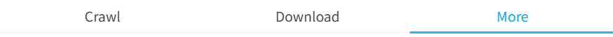

## How to switch tabs

  <a href="http://localhost:3000/#/en/Settings-General/Operation-method?flag=95" target="_blank" class="has_tip settingNameStyle" data-xztip="_选项卡切换方式的说明" data-tip="Sets how to switch the primary category navigation of the Downloader." data-bind-click="true">
    How to switch tabs
     ? 
  </a>
  <input type="radio" name="switchTabBar" id="switchTabBar1" class="need_beautify radio" value="over" checked="">
  
  <label for="switchTabBar1" data-xztext="_鼠标经过" class="active">Mouse over</label>
  <input type="radio" name="switchTabBar" id="switchTabBar2" class="need_beautify radio" value="click">
  
  <label for="switchTabBar2" data-xztext="_鼠标点击">Mouse click</label>

"Tabs" refer to the three tabs at the top of the downloader: "Crawl," "Download," and "More":

- `Mouse hover`: Default. Moving the mouse pointer over a tab title immediately switches to that tab, which is convenient.
- `Mouse click`: Moving the mouse pointer over a tab title doesn't switch tabs; you need to click the title to switch. This is for users who find the hover method causes accidental switches.

## Click the setting card to toggle its switch status

  <a href="http://localhost:3000/#/en/Settings-General/Operation-method?flag=96" target="_blank" class="settingNameStyle" data-bind-click="true">
    Click the setting card to toggle its switch status
  </a>
  <input type="checkbox" name="clickOptionCardToToggleSwitch" class="need_beautify checkbox_switch" checked="">
  
  <button type="button" class="gray1 textButton showMsgBtn" data-title="_点击设置卡片时切换它的开关状态" data-msg="_点击设置卡片时切换它的开关状态的说明" data-xztext="_帮助">Help</button>

    <svg class="icon settingsPanel_newBadgeIcon" aria-hidden="true">
      <use xlink:href="#new"></use>
    </svg>
    

## Open Wiki link when clicking setting name

  <a href="http://localhost:3000/#/en/Settings-General/Operation-method?flag=97" target="_blank" class="settingNameStyle" data-bind-click="true">
    Open Wiki link when clicking setting name
  </a>
  <input type="checkbox" name="clickSettingNameOpenWiki" class="need_beautify checkbox_switch" checked>
  

