# Settings - More - Download

## Manage download records

<div class="option new" data-no="101" style="display: flex;"><button type="button" class="pinButton" data-title="_置顶">📌</button>
      <a href="https://xuejianxianzun.github.io/PBDWiki/#/en/Settings-More-Download?flag=101" target="_blank" class="settingNameStyle" data-xztext="_管理下载记录">Manage download <span class="key">records</span></a>
      <button type="button" class="textButton gray1" id="exportDownloadRecord" data-xztext="_导出">Export</button>
      <button type="button" class="textButton gray1" id="importDownloadRecord" data-xztext="_导入">Import</button>
      <button type="button" class="textButton gray1" id="clearDownloadRecord" data-xztext="_清除">Clear</button>
      <button type="button" class="textButton gray1 showMsgBtn" data-title="_管理下载记录" data-msg="_管理下载记录的提示" data-xztext="_帮助">Help</button>
    </div>

The download records here refer to the downloader's own download records, not the browser's download history.

### How it works

Whenever the downloader successfully downloads a file, it saves a download record in the browser's IndexedDB database. This record includes the work ID, the work's modification date, and the filename used at download time. For example:

```json
{
  "id": "85290993_p0",
  "d": "2021/05/22/13/07/51",
  "n": "85290993_p0-小日向ほしみ-原创,女孩子,原创,waitress,过膝袜.jpg"
}
```

Some downloader features depend on download records, for example:
- Do not crawl already downloaded works
- Don't download duplicate files
- Show a border on downloaded works

**Additional notes:**
- The downloader's download records are stored in the browser's IndexedDB. Clearing the browser's download history does not affect the downloader's download records, so you can clear the browser's download history safely.
- Note: if you clear browser data, choosing "Cookies and other site data" will also clear the downloader's download records. If necessary, you can export the downloader's download records before clearing data, then import them afterward.

Also, this method is **not completely reliable**, because the downloader can query only its own download records and cannot check files on your disk.

- If a file already exists on your disk but the downloader has no record for it, the downloader will still download it.
- Conversely, if you previously downloaded a file and later deleted it from your disk, but the downloader still has a record for it, the downloader will not download it again unless you disable the relevant feature or change its strategy.

When these situations occur, features that rely on download records may make incorrect judgments, so you can disable those features if needed.

### Export

Click the export button to export the downloader's download records. This creates a JSON file and saves it directly to the browser's download directory.

This can be used for backup, for example before clearing browser data. You can also export records from one browser and import them into another.

?> The downloader displays export progress in the log at the top of the page. If there are many records, exporting takes some time, so wait until the downloader indicates that the export is complete.

### Import

Click the import button to select a previously exported download record file (JSON) and import it.

Importing does not clear existing download records, so you can import multiple files and the records will be merged together.

?> The downloader displays import progress in the log at the top of the page. If there are many records, importing takes some time, so wait until the downloader indicates that the import is complete.

### Import an ID list

This is a hidden feature. You can use it by entering the command `recordtxt` on a Pixiv page (just press these keys in sequence).

The downloader's `Import` button can import only JSON files, but some users want to import their own TXT-format ID lists, so I added this hidden feature.

**Use cases:**
1. You downloaded many files before using this downloader, so they have no corresponding download records and you want to create records manually.
2. You accidentally cleared the downloader's download records and want to rebuild them to some extent.

You need to prepare a list of previously downloaded work IDs yourself (for example by generating a file list with shell commands) and save it as a TXT file, one ID per line, like this:

```
84334853_p0
84334853_p1
84334853_p2
140035432
27640268
```

**Notes:**
- Illustration and manga IDs must include the page number, because they may have multiple pages. Ugoira and novel IDs must not include the page number.
- After importing an ID list, the "Don't download duplicate files" feature is suitable only for the `Loose` strategy. Because this import contains only IDs and no other data, the `Strict` strategy cannot be used.

### Clear

Clear all download records saved by the downloader.

Even if you delete files from your disk, the downloader may still have their download records. When you try to download them again, the downloader will think they were already downloaded and will not download them again.

If this happens, you can clear the download records or disable the "Don't download duplicate files" setting.

?> The downloader displays clear progress in the log at the top of the page. If there are many records, clearing takes some time, so wait until the downloader indicates that it is complete.

## Don't download duplicate files

<div class="option" data-no="28" style="display: flex;"><button type="button" class="pinButton" data-title="_置顶">📌</button>
      <a href="https://xuejianxianzun.github.io/PBDWiki/#/en/Settings-More-Download?flag=28" target="_blank" class="settingNameStyle" data-xztext="_不下载重复文件">Don't download <span class="key">duplicate</span> files</a>
      <input type="checkbox" name="deduplication" class="need_beautify checkbox_switch">
      <span class="beautify_switch" tabindex="0"></span>
      <span class="subOptionWrap noGrow" data-show="deduplication" style="display: none;">
        <span data-xztext="_策略">Strategy:</span>
        <input type="radio" name="dupliStrategy" id="dupliStrategy2" class="need_beautify radio" value="loose">
        <span class="beautify_radio" tabindex="0"></span>
        <label class="has_tip active" for="dupliStrategy2" data-xztip="_宽松模式说明" data-xztext="_宽松" data-tip="Judgment conditions: id, upload date of the work">Loose</label>
        <input type="radio" name="dupliStrategy" id="dupliStrategy1" class="need_beautify radio" value="strict" checked="">
        <span class="beautify_radio" tabindex="0"></span>
        <label class="has_tip" for="dupliStrategy1" data-xztip="_严格模式说明" data-xztext="_严格" data-tip="Judgment conditions: id, upload date, file name of the work">Strict</label>
      </span>
      <button type="button" class="textButton gray1 showMsgBtn" data-title="_不下载重复文件" data-msg="_不下载重复文件的提示" data-xztext="_帮助">Help</button>
    </div>

This feature depends on the download records saved by the downloader itself.

If you enable this feature, the downloader will check the download records before downloading each file. If the file is a duplicate, the downloader will skip it.

When the downloader skips duplicate files, it displays a list of file IDs in the top log, for example:

<span class="log" style="color: inherit;"><span style="color:#d27e00">因为不下载重复文件，跳过了 1 个文件 : </span><br><a href="https://www.pixiv.net/n/25755517" target="_blank">25755517</a><br></span>

?> This feature takes effect during the download stage. If you want to skip already downloaded works during crawling, enable the crawl setting [Do not crawl already downloaded works](/en/Settings-Crawl?id=do-not-crawl-already-downloaded-works).

### Loose strategy

Checks only 2 conditions: the work ID and the modification date.

It does not check whether the filename is the same.

### Strict strategy

Checks all 3 conditions: the work ID, the modification date, and the filename used at download time.

If the current file has a download record and all three conditions match exactly, it is considered a duplicate file.

### Notes

If a file is skipped, some related tasks will also be skipped, for example:
- Saving work metadata
- Saving work descriptions
- Downloading novel cover images
- Downloading embedded images in novels

However, the "Bookmark works after downloading" feature is not affected.

## Show border on downloaded works

<div class="option new" data-no="100" style="display: flex;"><button type="button" class="pinButton" data-title="_置顶">📌</button>
      <a href="https://xuejianxianzun.github.io/PBDWiki/#/en/Settings-More-Download?flag=100" target="_blank" class="settingNameStyle" data-xztext="_在已下载的作品上显示边框">Show <span class="key">border</span> on downloaded works</a>
      <input type="checkbox" name="showBorderOnDownloadedWorks" class="need_beautify checkbox_switch">
      <span class="beautify_switch" tabindex="0"></span>
      <span class="subOptionWrap noGrow" data-show="showBorderOnDownloadedWorks" style="display: none;">
        <span data-xztext="_宽度">Width</span>
        <input type="text" name="borderWidth" class="setinput_style1 blue w20" value="3">
        px
        <span class="verticalSplit"></span>
        <span data-xztext="_颜色">Color</span> (Hex)
        <input type="text" name="borderColor" class="setinput_style1 blue w80" id="borderColor" value="#ff4060">
      </span>
    </div>

This feature depends on the download records saved by the downloader itself.

If you want to see at a glance whether a work has already been downloaded, you can enable this setting.

The downloader will display a border on downloaded works. The default border is red, as shown below:

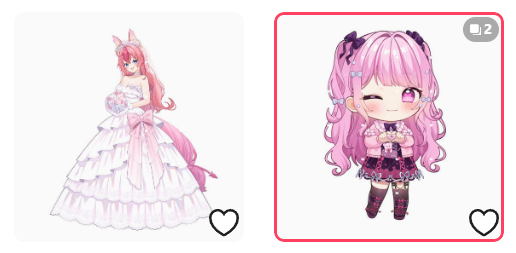

The left one has not been downloaded, and the right one has.

This setting has 2 sub-options: you can set the border width and color. Below is the effect with a border width of `4` px and a color of `#91e2df`:

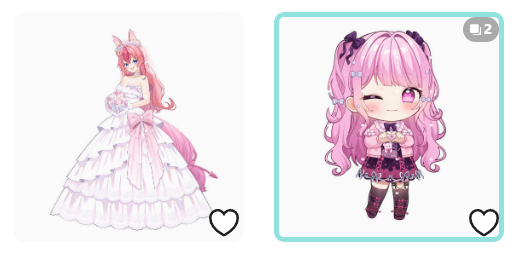

Known issue:

To prevent the border from being covered or clipped by other elements, the downloader displays it inside the thumbnail area. Because of that, it covers the edge area. This usually does not matter for image works, but on some pages for novel works it may cover the text at the top:

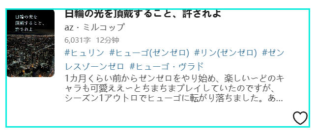

## Download interval

<p class="option" data-no="90" style="display: flex;">
    <span class="has_tip settingNameStyle1" data-xztip="_Description of download interval" data-tip="Start a download at regular intervals. &lt;br&gt;
Default value is 0, meaning no restriction. &lt;br&gt;
If set to 1 second, a maximum of 3600 files can be downloaded from Pixiv per hour. &lt;br&gt;
If you are concerned about account bans due to frequent downloads, set a number greater than 0 to mitigate this issue. &lt;br&gt;">
    <span data-xztext="_下载间隔">Download <span class="key">interval</span></span>
    <span class="gray1"> ? </span>
    </span>
    <span data-xztext="_When the number of works is greater than">Enable when the number of files exceeds the specified number:</span>
    <input type="text" name="downloadIntervalOnWorksNumber" class="setinput_style1 blue" value="150">
    <span class="verticalSplit"></span>
    <span data-xztext="_Interval time">Interval time:</span>
    <input type="text" name="downloadInterval" class="setinput_style1 blue" value="1">
    <span data-xztext="_Seconds">seconds</span>
    </p>

You can set how many seconds to wait before allowing the downloader to start a download.

?> The purpose of this setting is to proactively reduce the download frequency during large downloads to reduce the risk of your account being banned by Pixiv.

?> You can modify this setting during the download (e.g., change the interval time, enable or disable the restriction), and the changes will take effect immediately.

### Enable when the number of files exceeds the specified number

This setting will only be enabled if the number of works in the **crawling results** exceeds the set value. The default is `150`.

Note that the judgment is based on the number of crawling results, i.e., how many files need to be downloaded in total, not how many remain. If 150 files are crawled (meeting the conditions) and this setting is activated, it will remain active even if only 1 file is left at the end.

### Interval Time

Whenever the downloader **starts** downloading a file, it sets a timer, and the next download is only allowed after the interval time has passed.

**Detailed Explanation of How It Works:**

- If set to `0`, the downloader will not add delay time, and this setting will not take effect.
- If set to `1` second, a maximum of 3600 files can be downloaded from Pixiv per hour.

If you only download a few hundred files per day, the default interval time is usually safe. If you frequently download more files, you can increase the interval time, for example `2`, `3`, etc. Setting it to `4` is almost absolutely safe, but usually no need to use such a large interval time.

----------

The interval time is not affected by the time required for downloads:

If the previous file takes more than 1 second, the downloader will not wait for it and will start the next file when the countdown ends. This means multiple files may be downloaded simultaneously.

If a file finishes downloading in less than 1 second, the downloader will continue waiting until the countdown ends before starting the next download. When file download times are short, it appears as single-threaded downloading, with only 1 file downloading at a time.

## Download a work when you click the bookmark button

<p class="option" data-no="76" style="display: flex;">
    <span class="settingNameStyle1">
    <span data-xztext="_点击收藏按钮时下载作品">Download a work when you click the <span class="key">bookmark</span> button</span>
    </span>
    <input type="checkbox" name="downloadOnClickBookmark" class="need_beautify checkbox_switch">
    <span class="beautify_switch" tabindex="0"></span>
    </p>

When this feature is enabled, the downloader will automatically download the work when you click its bookmark button.

There are two main use cases:

1. Clicking the bookmark button in the bottom-right corner of the work:

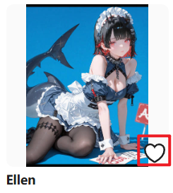 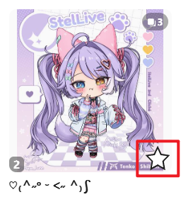

2. Clicking the bookmark button inside the work page:


?> Although the screenshots above are for illustrations, this feature also works for novels.

?> This feature is only triggered by **clicking the bookmark button**. The downloader provides some batch bookmarking and quick bookmarking features, but they do not require clicking the bookmark button and thus will not trigger this feature. For example, pressing B while previewing a work will bookmark it but will not trigger this feature.

!> In page types not supported by the downloader, this feature will not work, even if you manually click the bookmark button. This is because the feature requires the downloader to locate the work thumbnail element, but the downloader does not perform this action on some less common pages.

The downloader provides this feature by default:

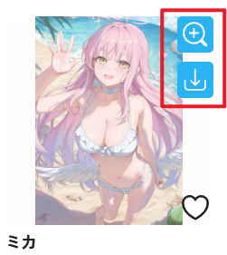

When you are on a page, hovering the mouse over an illustration thumbnail should show a button in the top-right corner.

This indicates that the downloader supports the page and can use the "Download Work When Clicking the Bookmark Button" feature. However, if the downloader does not display the top-right button, the page is not supported, and the "Download Work When Clicking the Bookmark Button" feature cannot be used.

## Download a work when you click the like button

<p class="option" data-no="77" style="display: flex;">
    <span class="settingNameStyle1">
    <span data-xztext="_点击点赞按钮时下载作品">Download a work when you click the <span class="key">like</span> button</span>
    </span>
    <input type="checkbox" name="downloadOnClickLike" class="need_beautify checkbox_switch">
    <span class="beautify_switch" tabindex="0"></span>
    </p>

When this feature is enabled, the downloader will automatically download the work when you like it on the work page.

Like button:

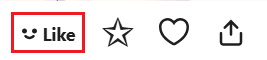

?> Although the screenshot above is for an illustration, this feature also works for novels.

## Save the ugoira work as

<p class="option" data-no="4" style="display: flex;">
    <span class="has_tip settingNameStyle1" data-xztip="_Description of Ugoira save format" data-tip="Pixiv's Ugoira source file is a Zip compressed file containing multiple static images. The downloader can convert it to other formats. &lt;br&gt;
WebM video has the smallest size with minimal quality loss. It is the default choice. &lt;br&gt;
GIF images have the best compatibility but are larger in size and have poorer quality, not recommended. &lt;br&gt;
APNG images are lossless compressed with the best quality, but usually the largest in size. &lt;br&gt;
Zip file is the source file.">
    <span data-xztext="_动图保存格式">Save the <span class="key">ugoira</span> work as</span>
    <span class="gray1"> ? </span>
    </span>
    <input type="radio" name="ugoiraSaveAs" id="ugoiraSaveAs1" class="need_beautify radio" value="webm" checked="">
    <span class="beautify_radio" tabindex="0"></span>
    <label for="ugoiraSaveAs1" data-xztext="_WebM video" class="active">WebM video</label>
    <input type="radio" name="ugoiraSaveAs" id="ugoiraSaveAs3" class="need_beautify radio" value="gif"> 
    <span class="beautify_radio" tabindex="0"></span>
    <label for="ugoiraSaveAs3" data-xztext="_GIF">GIF image</label>
    <input type="radio" name="ugoiraSaveAs" id="ugoiraSaveAs4" class="need_beautify radio" value="png"> 
    <span class="beautify_radio" tabindex="0"></span>
    <label for="ugoiraSaveAs4" class="has_tip" data-xztip="_Lossless" data-xztext="_APNG" data-tip="Lossless">APNG image</label>
    <input type="radio" name="ugoiraSaveAs" id="ugoiraSaveAs2" class="need_beautify radio" value="zip"> 
    <span class="beautify_radio" tabindex="0"></span>
    <label for="ugoiraSaveAs2" data-xztext="_Zip file">Zip file</label>
    </p>

When downloading Ugoira works, the downloader can save them in various formats. You can choose one based on your needs.

**Characteristics of Each Format:**

- WebM video has high quality and small size, making it the default option. However, it may be inconvenient on mobile devices as it requires a video player to open.
- GIF image is a common animated image format with good compatibility, but poor quality and larger size.
- APNG image is a **lossless** quality animated image format. It has the best quality but the largest size. Additionally, its compatibility is not great, as some image viewers or applications do not support playing APNG images.
- Zip file is the original Ugoira file, unconverted. It contains multiple static images without animation effects.

**Reminder:**

- Converting Ugoira to other formats takes some time, possibly from a few seconds to a few minutes, depending on the original size, volume, and target format of the Ugoira.
- During Ugoira conversion, the downloader's progress bar may not change, which is normal as the downloader is waiting for the conversion to complete.
- Converting Ugoira affects the usability of the page it is on. The page can be scrolled, but interaction with elements on the page is blocked. This is because some synchronous code executes for a long time, blocking the user thread.

## How many animations are converted at the same time 

<p class="option" data-no="24" style="display: flex;">
    <span class="has_tip settingNameStyle1" data-xztip="_Description of number of Ugoira to convert simultaneously" data-tip="Converting multiple Ugoira simultaneously increases resource usage. &lt;br&gt;
Recommended not to exceed 3.">
    <span data-xztext="_同时转换多少个动图">How many animations are <span class="key">converted</span> at the same time</span>
    <span class="gray1"> ? </span>
    </span>
    <input type="text" name="convertUgoiraThread" class="setinput_style1 blue" value="1">
    </p>

The default value is 1.

**Explanation:**

- Compared to downloading static images, converting Ugoira uses more CPU and memory resources.
- Converting multiple Ugoira simultaneously increases resource usage. If a page uses too much memory, it may crash, so this value should not be set too high. Recommended not to exceed 3.
- The number of simultaneous Ugoira conversions will not exceed the number of simultaneous downloads. If the downloader downloads 3 files simultaneously, at most 3 Ugoira will be converted simultaneously.

## Save the novel as

<div class="option" data-no="26" style="display: flex;"><button type="button" class="pinButton" data-title="_置顶">📌</button>
      <a href="https://xuejianxianzun.github.io/PBDWiki/#/en/Settings-More-Download?flag=26" target="_blank" class="has_tip settingNameStyle" data-xztip="_小说保存格式的说明" data-tip="TXT is a plain text file. When you select TXT format, the pictures in the novel will be saved separately. &lt;br&gt;EPUB is an e-book format, and the pictures in the novel will be embedded in the EPUB file.">
        <span data-xztext="_小说保存格式">Save the <span class="key">novel</span> as</span>
        <span class="gray1"> ? </span>
      </a>
      <input type="radio" name="novelSaveAs" id="novelSaveAs2" class="need_beautify radio" value="epub" checked="">
      <span class="beautify_radio" tabindex="0"></span>
      <label for="novelSaveAs2" class="active"> EPUB </label>
      <input type="radio" name="novelSaveAs" id="novelSaveAs1" class="need_beautify radio" value="txt">
      <span class="beautify_radio" tabindex="0"></span>
      <label for="novelSaveAs1"> TXT </label>
    </div>

You can choose to save novels in TXT or EPUB format. The default format is EPUB.

EPUB is an e-book format that can display rich text styles, supports a table of contents, and can save cover images and illustrations internally.

?> The EPUB files generated by the downloader follow the EPUB `2.0` standard. Some software cannot open it correctly, such as WPS. Please use a novel reader to open them.

PS: Compared with EPUB, TXT has some disadvantages:
- TXT files contain only plain text and cannot display rich text styles such as text formatting or hyperlinks.
- TXT files do not have a unified heading-level structure. When they contain multiple novels or chapters, many readers cannot recognize the chapter structure correctly.
- TXT files cannot store illustrations inside the novel, so images can only be saved as separate files. Sometimes one TXT file may end up with more than a dozen related images, which becomes messy.

### Some Readers

**Online Reading**: https://epub-reader.online/

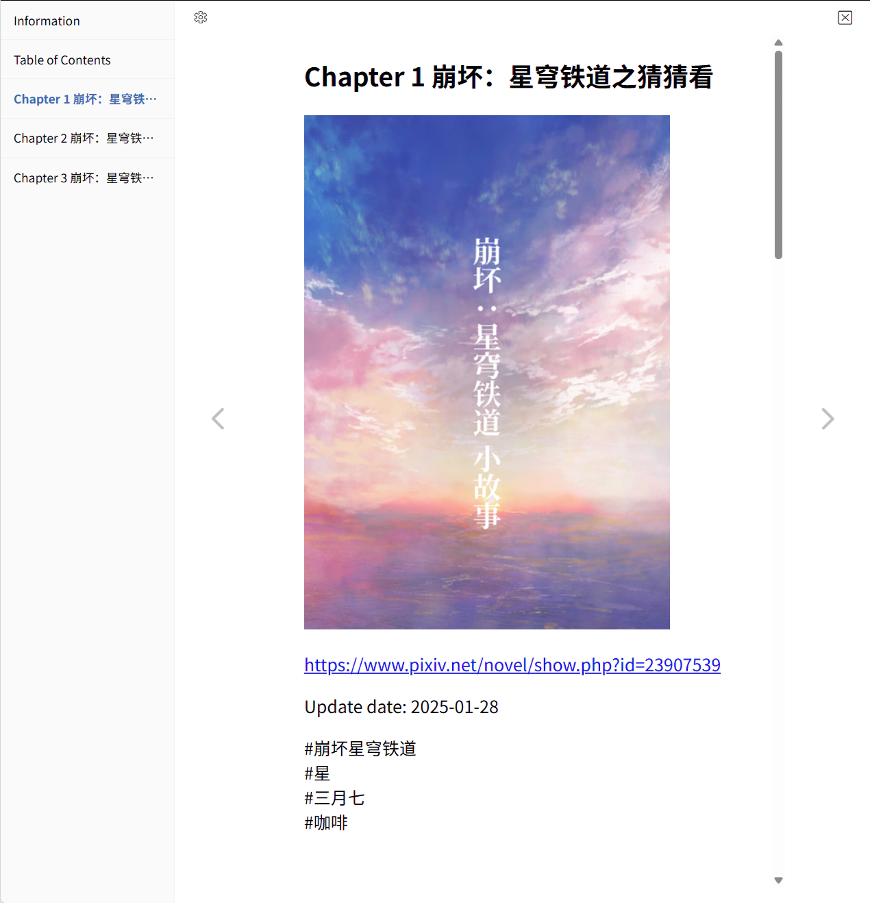

**Windows**: Aquile Reader

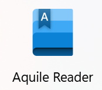

You can install it from the Microsoft Store.

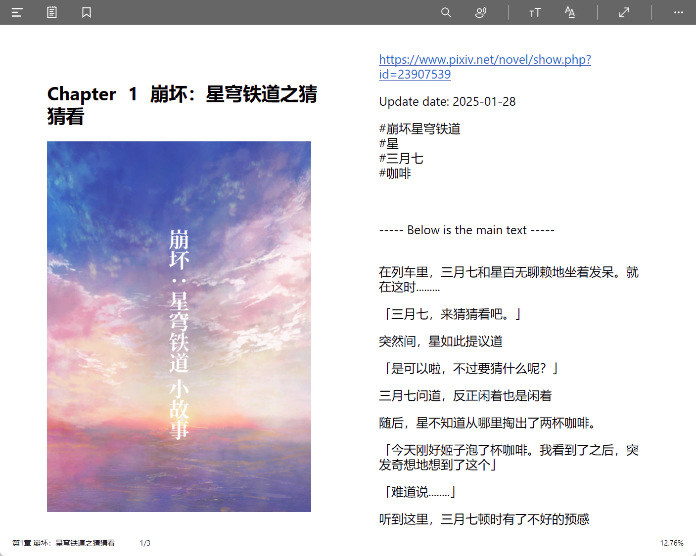

**Android**: Moon+ Reader


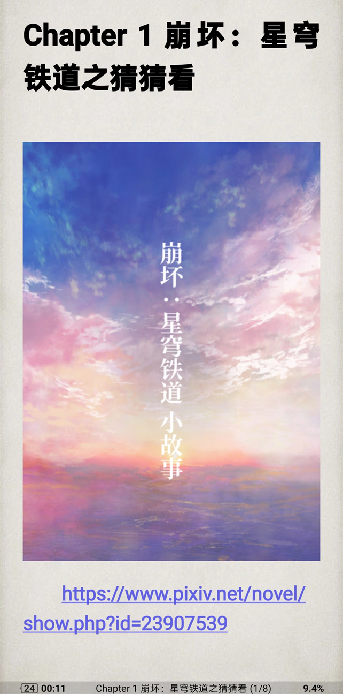

## Automatically merge novel series

<p class="option new" data-no="73" style="display: flex;">
      <a href="https://xuejianxianzun.github.io/PBDWiki/" target="_blank" class="has_tip settingNameStyle" data-xztip="_自动合并系列小说的说明" data-tip="When crawling works, if a novel belongs to a series, automatically crawl all novels in that series and merge them.">
        <span data-xztext="_自动合并系列小说">Automatically <span class="key">merge</span> novel series</span>
        <span class="gray1"> ? </span>
      </a>
      <input type="checkbox" name="autoMergeNovel" class="need_beautify checkbox_switch">
      <span class="beautify_switch" tabindex="0"></span>
      <span class="subOptionWrap" data-show="autoMergeNovel" style="display: none;">
        <label for="skipNovelsInSeriesWhenAutoMerge" data-xztext="_不再单独下载系列里的小说" class="has_tip active" data-xztip="_不再单独下载系列里的小说的说明" data-tip="When you enable &quot;Automatically merge series novels&quot;, there is usually no need to download novels in the series individually, as they are already included in the merged novel file.&lt;br&gt;If you still want to download them, you can uncheck this sub-setting.">No longer download novels in the series individually</label>
        <span class="gray1"> ? &nbsp;</span>
        <input type="checkbox" name="skipNovelsInSeriesWhenAutoMerge" id="skipNovelsInSeriesWhenAutoMerge" class="need_beautify checkbox_switch" checked="">
        <span class="beautify_switch" tabindex="0"></span>
      </span>
    </p>

When crawling works, if a novel belongs to a certain series, the downloader can automatically crawl all novels in this series and merge them.

This feature is disabled by default, and you can enable it yourself when needed.

-----------

Sub-options:

### No Longer Download Novels in the Series Individually

This option is enabled by default.

The premise for this option to take effect is that you have enabled the "Automatically Merge Series Novels" feature.

During one crawl, if a novel belongs to a series, the downloader will merge the series it belongs to and no longer download this novel individually, because they are already included in the merged novel file.

This feature may lead to fewer crawl results. For example: In 30 novels, 20 novels belong to series, and the remaining 10 novels are standalone, then there will only be 10 crawl results in the end.

If you still want to download these novels individually, you can disable this sub-option.

-----------

Below are some detailed explanations of the "Automatically Merge Series Novels" feature, assuming you have enabled it.

### Detailed Instructions

**Recommend Using EPUB Format:**

When merging series novels, one file will contain multiple novels (multiple chapters), but many readers cannot recognize chapter markers in TXT, so I strongly recommend using the EPUB format.

**Timing of Operation:**

Although this setting belongs to the "Download" category, it actually works during the crawl stage.

When crawling works, if a novel belongs to a series, the downloader will automatically start merging this series of novels. The original crawl progress will pause until this series of novels is merged. In other words, crawling works and merging novels will alternate, rather than happening simultaneously. This is to avoid sending too many requests at the same time.

**Increased Number of Requests:**

When using this feature, the downloader may crawl additional novels, leading to an increase in the number of requests.

For example: Initially there are 30 novels, which belong to 10 series, and these 10 series contain a total of 100 novels, then the downloader needs to crawl the 100 novels in the series.

**Relevance:**

When you search for a certain tag and merge series novels, one thing to know is that some novels in the series may not belong to the current tag, meaning the relevance is not strong.

For example: When I search for "ブルーアーカイブ", there is a series containing 411 novels, but only 89 of them contain "ブルーアーカイブ":
https://www.pixiv.net/novel/series/1368392

**May Download Duplicates:**

When merging series novels, the downloader does not check if it has been downloaded before. That is, it is not affected by the "Do not download duplicate files" function. In two crawls, if they contain the same series novel, it will be merged and downloaded twice.

**No Duplicate Merging in a Single Crawl:**

In the same crawl task, each series will only be merged once. For example: If 10 novels belong to the same series, the downloader will only merge once, not 10 times.

**Split Large Files:**

Some series novels may contain a large number of illustrations, leading to a very large size. When the novel's save format is EPUB, the downloader will split the very large novel into multiple parts, generating multiple EPUB files, with each file's size usually a bit larger than 100 MB.

In one test, a series novel had nearly 4 GB of illustrations, and the downloader split it into 28 EPUB files.

### Interval Time

Since each series may contain multiple novels, and each novel has a cover image and/or illustrations, the downloader may send many requests.

To avoid triggering Pixiv's warning, the downloader **always** adds interval time when merging novels to reduce the frequency of sending requests. Even if you have not enabled "Slow Down Crawl Speed" or "Download Interval" settings, the downloader will still add interval time when executing this feature.

**Detailed Instructions:**
- When crawling novel data, the downloader defaults to using a `2400` ms interval time. This is the minimum value. If the "Interval Time" you set in "Slow Down Crawl Speed" is greater than this value, the downloader will use your set interval time.
- When downloading novel images, the downloader defaults to using a `2000` ms interval time. This is the minimum value. If the "Interval Time" you set in "Download Interval" is greater than this value, the downloader will use your set interval time.

The current interval times were determined after several large-scale crawl tests. If you don't frequently crawl large numbers of novels, there is usually no need to use larger interval times. If you are concerned about being warned by Pixiv when using this feature, you can increase the interval time in the two settings mentioned above, for example, set to `3000` ms or 3 seconds, and change it back after the task is completed.

### Some Test Data

During the development of this feature, I conducted several large-scale crawl tests, each crawling 900 or more novels (the maximum was 3000). Based on average data, if crawling 1000 novels each time, when the crawl is finished, some data is as follows:
- 50% - 60% of novels belong to series novels
- 150 - 200 series novels
- Approximately 7000 - 10000 requests will be sent. These requests mainly include: retrieving series information, setting information, novel data; downloading novel cover images, downloading illustrations in novels.

The above data volume is relatively small, just for reference, to have a rough idea.

Due to too many requests, I was warned by Pixiv several times, and one account was even banned. So I gradually increased the interval time to reduce the possibility of being warned.

## Split threshold when merging novel series

<div class="option new" data-no="105" style="display: flex;"><button type="button" class="pinButton" data-title="_置顶">📌</button>
      <a href="https://xuejianxianzun.github.io/PBDWiki/#/en/Settings-More-Download?flag=105" target="_blank" class="settingNameStyle">
        <span data-xztext="_合并系列小说时的分割阈值">Split <span class="key">threshold</span> when merging series novels</span>
      </a>
      <input type="text" name="singleEPUBFileSizeLimit" class="setinput_style1 blue" value="200"> MiB
      <button type="button" class="gray1 textButton showMsgBtn" data-title="_合并系列小说时的分割阈值" data-msg="_合并系列小说时的分割阈值的帮助" data-xztext="_帮助">Help</button>
    </div>

Some novel series contain a very large number of illustrations and may even exceed 4 GB. If a single EPUB file is too large, it may fail to download, and some readers may not be able to open it. So when merging a novel series, the downloader uses this setting to split the file.

If the split threshold is set to 200 MB, then when the downloader merges a novel series with a total size of 1 GB, it will split it into about 5 or 6 files.

**Tips:**
- This setting takes effect only when merging novel series. Individually downloaded novels will not be split.
- The minimum value is 100 MiB, and the maximum value is 1000 MiB (not recommended).
- When splitting EPUB files, the downloader does not cut off chapter content. In practice, the downloader checks the size only after adding a chapter, so the chapter at the split point is always complete.

## Save metadata in the novel

<p class="option" data-no="27" style="display: flex;">
    <span class="has_tip settingNameStyle1" data-xztip="_Tip for saving metadata in novels" data-tip="Save the novel's title, author, tags, and other information at the beginning of the novel.">
    <span data-xztext="_在小说里保存元数据">Save <span class="key">metadata</span> in the novel</span>
    <span class="gray1"> ? </span>
    </span>
    <input type="checkbox" name="saveNovelMeta" class="need_beautify checkbox_switch">
    <span class="beautify_switch" tabindex="0"></span>
    </p>

If you enable this option, the program will save the following information at the beginning of the novel content:

- Novel title
- Author name
- Novel URL
- Novel description
- Novel tags

For example:

```
好意よりも悪意こそが信用の証である

切由

https://www.pixiv.net/novel/show.php?id=25731985

2025-08-28

土井先生追い討ちのターンです。胃薬もらいに行きましょうね。

#RKRN夢
#忍玉-夢
#rkrn夢
#RKRNプラス
#久々知兵助
#土井半助
#中在家長次
#SAN値チェックのお時間です
#逆方向の信用…
```

?> This setting applies regardless of whether the novel is saved in TXT or EPUB format.

## Download the cover image of the novel

<p class="option" data-no="70" style="display: flex;">
    <span class="settingNameStyle1" data-xztext="_下载小说的封面图片">Download the <span class="key">cover</span> image of the novel</span>
    <input type="checkbox" name="downloadNovelCoverImage" class="need_beautify checkbox_switch" checked="">
    <span class="beautify_switch" tabindex="0"></span>
    </p>

The downloader will save novel cover images separately, with filenames matching the novel's filename for alignment.

Example:

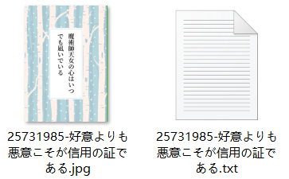

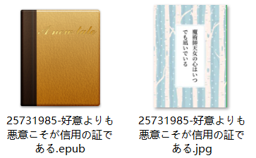

If you do not want to save cover images, you can disable this option.

If you save the novel in EPUB format, the downloader will also add an embedded cover image, for example:

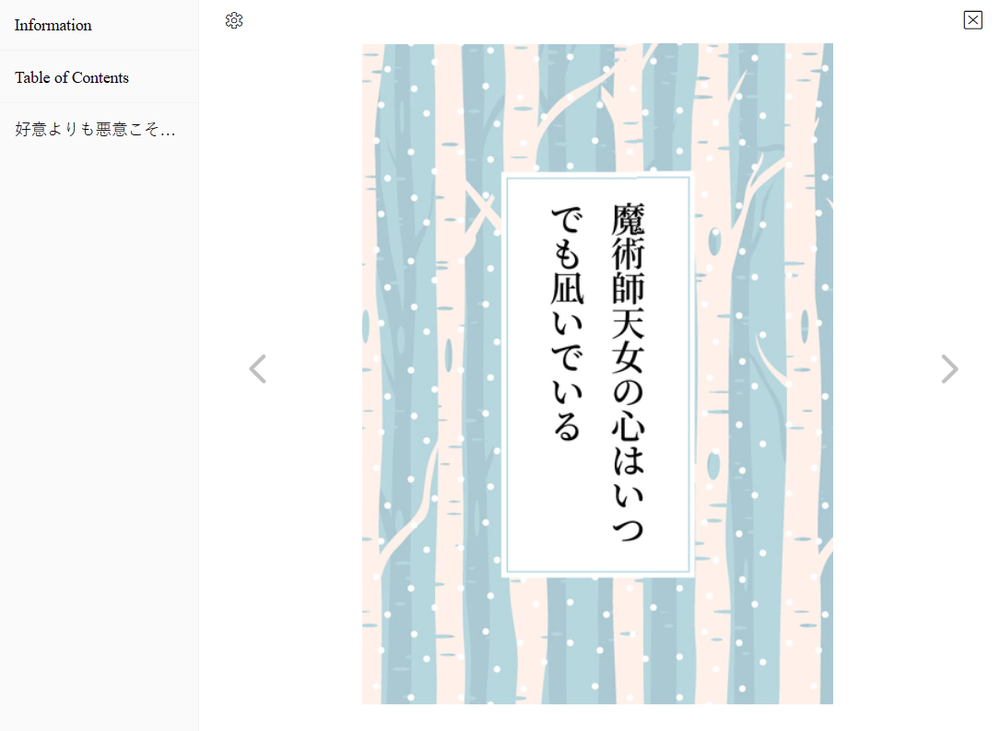

Currently, regardless of whether this option is enabled, the downloader always adds an embedded cover. In future versions, I plan to make the embedded cover follow this setting, meaning if you disable this option, the downloader will not add an embedded cover.

## Download embedded images in novels

<p class="option" data-no="72" style="display: flex;">
    <span class="settingNameStyle1" data-xztext="_下载小说里的内嵌图片">Download <span class="key">embedded</span> images in novels</span>
    <input type="checkbox" name="downloadNovelEmbeddedImage" class="need_beautify checkbox_switch" checked="">
    <span class="beautify_switch" tabindex="0"></span>
    </p>

Some novels have images inserted in the body (mainly R-18 novels); these are embedded images.

The downloader saves embedded images by default. There are differences depending on the novel save format.

When saving novels as TXT, images are saved separately with filenames matching the novel's. For example:

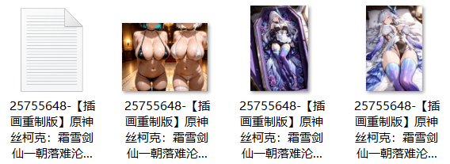

When saving novels as EPUB, images are not saved separately but stored inside the EPUB. For example:

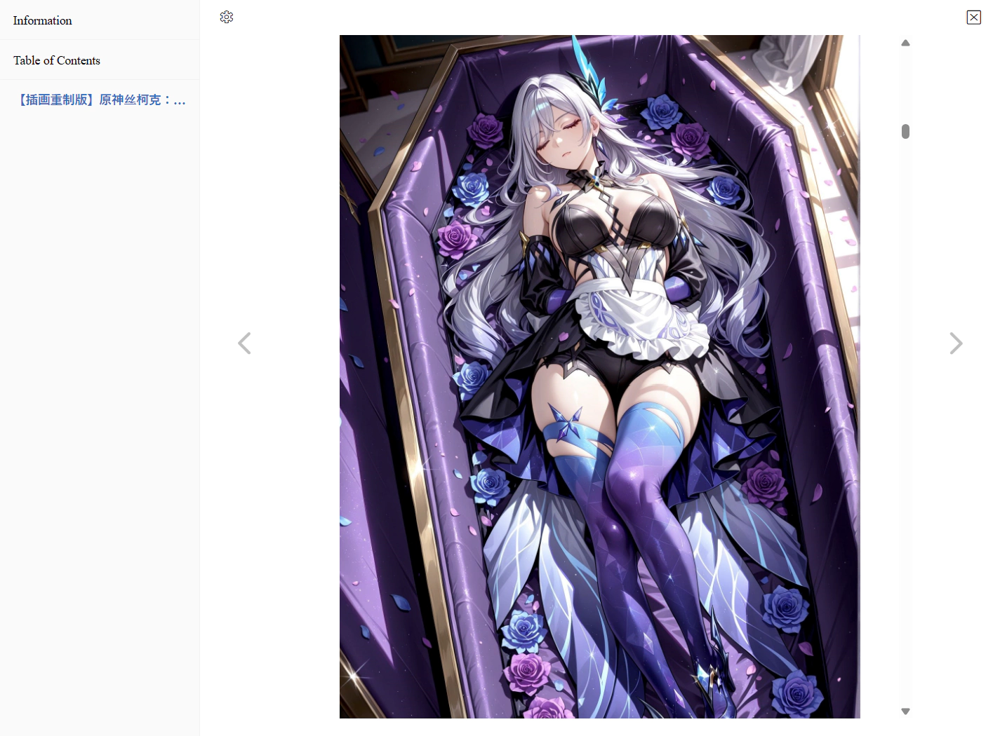

!> For large PNG format embedded images, some novel readers may only display part of them. This is an issue with the reader, not the downloader.

## Save the metadata of the work

<p class="option" data-no="49" style="display: flex;">
  <a href="https://xuejianxianzun.github.io/PBDWiki/#/en/Settings-More-Download?flag=49" target="_blank" class="has_tip settingNameStyle" data-xztip="_保存作品的元数据说明"">
    <span data-xztext="_保存作品的元数据">Save the <span class="key">metadata</span> of the work</span>
    <span class="gray1"> ? </span>
  </a>
  <input type="checkbox" name="saveMetaType0" id="setSaveMetaType0" class="need_beautify checkbox_common">
  <span class="beautify_checkbox" tabindex="0"></span>
  <label for="setSaveMetaType0" data-xztext="_插画" class="active">Illustrations</label>
  <input type="checkbox" name="saveMetaType1" id="setSaveMetaType1" class="need_beautify checkbox_common">
  <span class="beautify_checkbox" tabindex="0"></span>
  <label for="setSaveMetaType1" data-xztext="_漫画" class="active">Manga</label>
  <input type="checkbox" name="saveMetaType2" id="setSaveMetaType2" class="need_beautify checkbox_common">
  <span class="beautify_checkbox" tabindex="0"></span>
  <label for="setSaveMetaType2" data-xztext="_动图" class="active">Ugoira</label>
  <input type="checkbox" name="saveMetaType3" id="setSaveMetaType3" class="need_beautify checkbox_common">
  <span class="beautify_checkbox" tabindex="0"></span>
  <label for="setSaveMetaType3" data-xztext="_小说" class="active">Novels</label>
  <span class="verticalSplit"></span>
  <span class="settingNameStyle" data-xztext="_文件格式">File format</span>
  <input type="checkbox" name="saveMetaFormatTXT" id="saveMetaFormatTXT" class="need_beautify checkbox_common">
  <span class="beautify_checkbox" tabindex="0"></span>
  <label for="saveMetaFormatTXT"> TXT </label>
  <input type="checkbox" name="saveMetaFormatJSON" id="saveMetaFormatJSON" class="need_beautify checkbox_common">
  <span class="beautify_checkbox" tabindex="0"></span>
  <label for="saveMetaFormatJSON"> JSON </label>
</p>

The downloader can generate a file for each work during download to save some of its data.

Example:

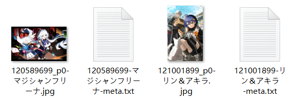

?> The filename of the metadata includes a `meta` marker at the end.

### Work Type

Divided into `illustration`, `manga`, `Ugoira`, `novel`.

The downloader will create a metadata file for the work only if the downloaded file type matches the types you have checked.

?> Novels have a separate setting for saving metadata: [Save metadata in the novel](/en/Settings-More-Download?id=save-metadata-in-the-novel), which saves some metadata at the beginning of the novel without creating a separate TXT file, making it more convenient. However, it saves less metadata. If you have enabled "Save metadata in the novel," you usually do not need to select the "Novel" type in this option.

### File Format

There are two formats to choose from, and you can select both:
- `TXT` format is easy to read but only contains relatively commonly used data.
- `JSON` format is the downloader's internal data, retaining more information.

#### TXT Format

For image works (illustration, manga, Ugoira), an example of the metadata saved by the downloader is as follows:

```
ID
120589699

URL
https://www.pixiv.net/i/120589699

Original
https://i.pximg.net/img-original/img/2024/07/16/19/51/00/120589699_p0.jpg

Thumbnail
https://i.pximg.net/c/250x250_80_a2/custom-thumb/img/2024/07/16/19/51/00/120589699_p0_custom1200.jpg

xRestrict
AllAges

AI
No

User
愛田乃彩

UserID
91879154

Title
マジシャンフリーナ

Description
(Twitter) https://twitter.com/aida_noa_
無断転載・使用禁止/All rights reserved.

Tags
#原神
#GenshinImpact
#フリーナ
#Furina
#女の子
#イラスト

Size
4096 x 2537

Bookmark
814

Date
2024-07-16T10:51:00+00:00
```

The metadata for novels is roughly the same but does not include `Original` or `Size`. Additionally, the `Thumbnail` for novels is the URL of its cover image.

#### JSON Format

The content of the JSON file is the downloader's internal data (i.e., the crawl result of the work). If you want to know the meaning of each property, you can check the comments in the source code (only in Chinese): [StoreType.d.ts](https://github.com/xuejianxianzun/PixivBatchDownloader/blob/master/src/ts/store/StoreType.d.ts).

An example of the metadata content saved in the JSON file is as follows:

```json
{
  "aiType": 1,
  "idNum": 120589699,
  "id": "120589699_p0",
  "original": "https://i.pximg.net/img-original/img/2024/07/16/19/51/00/120589699_p0.jpg",
  "thumb": "https://i.pximg.net/c/250x250_80_a2/custom-thumb/img/2024/07/16/19/51/00/120589699_p0_custom1200.jpg",
  "regular": "https://i.pximg.net/img-master/img/2024/07/16/19/51/00/120589699_p0_master1200.jpg",
  "small": "https://i.pximg.net/c/540x540_70/img-master/img/2024/07/16/19/51/00/120589699_p0_master1200.jpg",
  "title": "マジシャンフリーナ",
  "description": "(Twitter) <strong><a href=\"https://twitter.com/aida_noa_\" target=\"_blank\">twitter/aida_noa_</a></strong><br />無断転載・使用禁止/All rights reserved.",
  "pageCount": 1,
  "index": 0,
  "tags": [
    "原神",
    "GenshinImpact",
    "フリーナ",
    "Furina",
    "女の子",
    "イラスト"
  ],
  "tagsWithTransl": [
    "原神",
    "GenshinImpact",
    "フリーナ",
    "Furina",
    "女の子",
    "イラスト",
    "芙宁娜",
    "女孩子",
    "插画"
  ],
  "tagsTranslOnly": [
    "原神",
    "GenshinImpact",
    "芙宁娜",
    "Furina",
    "女孩子",
    "插画"
  ],
  "user": "愛田乃彩",
  "userId": "91879154",
  "fullWidth": 4096,
  "fullHeight": 2537,
  "ext": "jpg",
  "bmk": 868,
  "bookmarked": false,
  "bmkId": "",
  "date": "2024-07-16T10:51:00+00:00",
  "uploadDate": "2024-07-16T10:51:00+00:00",
  "type": 0,
  "rank": null,
  "ugoiraInfo": null,
  "seriesTitle": "",
  "seriesOrder": null,
  "seriesId": null,
  "novelMeta": null,
  "likeCount": 452,
  "viewCount": 4703,
  "commentCount": 3,
  "xRestrict": 0,
  "sl": 2
}
```

## Save work description

<p class="option" data-no="50" style="display: flex;">
    <span class="has_tip settingNameStyle1" data-xztip="_保存作品简介的说明" data-tip="为每个作品生成一个 TXT 文件，保存它的简介。">
    <span data-xztext="_保存作品的简介">Save work <span class="key">description</span></span>
    <span class="gray1"> ? </span>
    </span>
    <input type="checkbox" name="saveDescType0" id="setSaveDescType0" class="need_beautify checkbox_common">
    <span class="beautify_checkbox" tabindex="0"></span>
    <label for="setSaveDescType0" data-xztext="_Illustration">Illustration</label>
    <input type="checkbox" name="saveDescType1" id="setSaveDescType1" class="need_beautify checkbox_common">
    <span class="beautify_checkbox" tabindex="0"></span>
    <label for="setSaveDescType1" data-xztext="_Manga">Manga</label>
    <input type="checkbox" name="saveDescType2" id="setSaveDescType2" class="need_beautify checkbox_common">
    <span class="beautify_checkbox" tabindex="0"></span>
    <label for="setSaveDescType2" data-xztext="_Ugoira">Ugoira</label>
    <input type="checkbox" name="saveDescType3" id="setSaveDescType3" class="need_beautify checkbox_common">
    <span class="beautify_checkbox" tabindex="0"></span>
    <label for="setSaveDescType3" data-xztext="_Novel">Novel</label>
    <span class="verticalSplit"></span>
    <span class="settingNameStyle1" data-xztext="_保存方式">Save method</span>
    <input type="radio" name="saveDescMethod" id="saveDescMethod1" class="need_beautify radio" value="separate" checked="">
    <span class="beautify_radio" tabindex="0"></span>
    <label for="saveDescMethod1" data-xztext="_Each work separately" class="active">Save each work separately</label>
    <input type="radio" name="saveDescMethod" id="saveDescMethod2" class="need_beautify radio" value="merge">
    <span class="beautify_radio" tabindex="0"></span>
    <label for="saveDescMethod2" data-xztext="_Merge into one file">Summarize to one file</label>
    </p>

If you enable this feature, the downloader will create a TXT file for each work to save its description.
The description refers to the text below the work's title. For example:

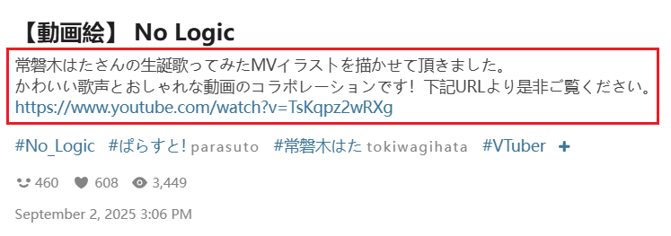

The TXT description file saved by the downloader:

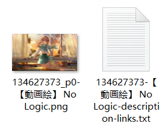

The filename of the TXT description file may include two markers:

1. A `description` marker, which is always included. This marker depends on the downloader's language setting, e.g., it is `简介` when using Chinese.
2. If the description contains URL links, the downloader will add a `links` marker.

?> Some works do not have a description, in which case the downloader will not create a TXT description file for them.

This setting has two sub-options, which can be enabled simultaneously:

### Save each work separately

Create a TXT description file for each work. When downloading multiple works, the downloader will generate multiple description files.

### Summarize to one file

When crawling is complete, the downloader will generate a TXT file aggregating all work descriptions.

The **save location** for this file has two cases:

1. If the aggregated file's description data comes from works by multiple different users, it will be saved directly to the browser's download directory. Since it does not belong to a specific user, it should not be placed in a username folder.

2. If the description data comes from the same user:

- If a folder in the naming rule contains `{user}`, the downloader will save the aggregated file in that folder. For the default naming rule, it will be saved in `pixiv/{user}-{user_id}/`.
- If none of the folders in the naming rule contain `{user}`, the downloader will save it directly to the browser's download directory.

The **filename** of the aggregated file includes multiple parts:
1. `description summary` marker, which changes based on the downloader's language.
2. `user` marker with the username. This is only present if all data in the aggregated file comes from the same user.
3. Current page title
4. Time and date

For example:

```
description summary-user saihate-No_Logic, virtual YouTuber ／ 【動画絵】 No Logic ／ September 2nd, 2025 - pixiv-9／10／2025, 11：31：11 PM.txt
```

## Image size

<p class="option" data-no="30" style="display: flex;">
    <span class="settingNameStyle1" data-xztext="_Image size">Image <span class="key">size</span></span>
    <input type="radio" name="imageSize" id="imageSize1" class="need_beautify radio" value="original" checked="">
    <span class="beautify_radio" tabindex="0"></span>
    <label for="imageSize1" data-xztext="_Original image" class="active">Original</label>
    <input type="radio" name="imageSize" id="imageSize2" class="need_beautify radio" value="regular">
    <span class="beautify_radio" tabindex="0"></span>
    <label for="imageSize2" data-xztext="_Regular">Regular</label>
    <span class="gray1">(1200px)</span>
    <input type="radio" name="imageSize" id="imageSize3" class="need_beautify radio" value="small">
    <span class="beautify_radio" tabindex="0"></span>
    <label for="imageSize3" data-xztext="_Small image">Small</label>
    <span class="gray1">(540px)</span>
    <input type="radio" name="imageSize" id="imageSize4" class="need_beautify radio" value="thumb">
    <span class="beautify_radio" tabindex="0"></span>
    <label for="imageSize4" data-xztext="_Square thumbnail">Square thumbnail</label>
    <span class="gray1">(250px)</span>
    </p>

When downloading image works (illustrations, manga, Ugoira), you can choose the image size to download.

- Original image: Download the original image
- Regular: Download medium-sized images, maximum size 1200*1200 px. The preview images displayed on Pixiv's work pages are this size. If the original is larger, it will be scaled proportionally to this size.
- Small image: Maximum size 540*540 px. If the original is larger, it will be scaled proportionally to this size.
- Square thumbnail: Size 250*250 px. It is always square and does not maintain the original aspect ratio.

?> These image sizes are automatically generated by Pixiv. The downloader does not crop or convert images.

?> When downloading Ugoira, the first 3 options are the same because Ugoira does not have corresponding sized images, so the source file is downloaded. The "Square thumbnail" is effective for Ugoira.

--------------

Sometimes you may not need the original images and just want to view thumbnails; you can select a smaller size to speed up downloads.

There are other use cases:

You may want to batch bookmark some works without downloading their originals. In this case, enable the "Bookmark works after downloading" option and set the image size to "Square thumbnail". Then download these works.

!> When selecting a smaller size and **with a large number of files**, the download frequency may be very fast, e.g., nearly 10 images per second. It is recommended to set a [Download interval](/en/Settings-More-Download?id=download-interval) to proactively reduce the frequency, otherwise Pixiv may issue a warning.

## File size limit

<p class="option" data-no="25" style="display: flex;">
    <span class="has_tip settingNameStyle1" data-xztip="_Description of file size limit" data-tip="If a file's size does not meet the requirements, the downloader will not download it.">
    <span data-xztext="_File size limit">File <span class="key">size</span> limit</span>
    <span class="gray1"> ? </span>
    </span>
    <input type="checkbox" name="sizeSwitch" class="need_beautify checkbox_switch">
    <span class="beautify_switch" tabindex="0"></span>
    <span class="subOptionWrap" data-show="sizeSwitch" style="display: none;">
    <input type="text" name="sizeMin" class="setinput_style1 blue" value="0">MiB
    &nbsp;-&nbsp;
    <input type="text" name="sizeMax" class="setinput_style1 blue" value="100">MiB
    </span>
    </p>

If you have requirements for file sizes, you can set a range.

?> You can enter numbers with decimals here, e.g., `0.5`.

When the downloader starts downloading a file, it can retrieve its size. If it does not meet your set conditions, the downloader will cancel the download and display a log:

<span class="log" style="color: rgb(210, 126, 0);"><a href="https://www.pixiv.net/i/133950803#3" target="_blank">133950803_p2</a> was not saved because its size does not meet the set conditions.<br></span>

?> This check occurs during the downloading phase. It is not checked during crawling.

## File download order

<p class="option" data-no="82" style="display: flex;">
    <span class="settingNameStyle1" data-xztext="_File download order">File download <span class="key">order</span></span>
    <input type="checkbox" name="setFileDownloadOrder" class="need_beautify checkbox_switch">
    <span class="beautify_switch" tabindex="0"></span>
    <span class="subOptionWrap" data-show="setFileDownloadOrder" style="display: none;">
    <span class="settingNameStyle1" data-xztext="_Sort by">Sort by</span>
    <input type="radio" name="downloadOrderSortBy" id="downloadOrderSortBy1" class="need_beautify radio" value="ID" checked="">
    <span class="beautify_radio" tabindex="0"></span>
    <label for="downloadOrderSortBy1" data-xztext="_Work ID" class="active">Work ID</label>
    <input type="radio" name="downloadOrderSortBy" id="downloadOrderSortBy2" class="need_beautify radio" value="bookmarkCount">
    <span class="beautify_radio" tabindex="0"></span>
    <label for="downloadOrderSortBy2" data-xztext="_Bookmark count 2">Bookmark count</label>
    <input type="radio" name="downloadOrderSortBy" id="downloadOrderSortBy3" class="need_beautify radio" value="bookmarkID">
    <span class="beautify_radio" tabindex="0"></span>
    <label for="downloadOrderSortBy3" data-xztext="_Bookmark time">Bookmark time</label>
    <span class="verticalSplit"></span>
    <input type="radio" name="downloadOrder" id="downloadOrder1" class="need_beautify radio" value="desc" checked="">
    <span class="beautify_radio" tabindex="0"></span>
    <label for="downloadOrder1" data-xztext="_Descending" class="active">Descending</label>
    <input type="radio" name="downloadOrder" id="downloadOrder2" class="need_beautify radio" value="asc">
    <span class="beautify_radio" tabindex="0"></span>
    <label for="downloadOrder2" data-xztext="_Ascending">Ascending</label>
    </span>
    </p>

Some users want the downloader to download files in a specific order so that when sorting by **modification time** in the file explorer, the files are organized.

If you need this, you can enable the setting, but it is usually unnecessary. I do not recommend sorting works by modification time, as this method is unreliable, especially when some files are re-downloaded, refreshing their modification time and disrupting the order.

**Using specific naming tags** and sorting by filename achieves the same effect and is more reliable, as filenames are independent of modification time and unaffected by re-downloads.

- To sort by `Work ID`, use `{id}` at the beginning of the filename.
- To sort by `Bookmark count`, use `{bmk}` at the beginning of the filename.
- To sort by `Bookmark time`, use `{bmk_id}` at the beginning of the filename.

Please refer to: [Sorting with Naming Tags](/en/Settings-Download?id=sorting-with-naming-tags).

-----------------

This setting has 2 sub-options:
1. **Sort by**: Indicates how the downloader sorts the files.
2. **Sort order**: Indicates how the downloader downloads files. If set to `Descending`, the downloader downloads files with higher values first, then lower ones. `Ascending` is the opposite.

---------

**Note:** Enabling this setting may increase the time required to complete downloads.

This is because when downloading multiple files simultaneously, later files may finish before earlier ones. To maintain the order, the downloader will make later files wait.

For example, with 5 simultaneous downloads, files numbered 1, 2, 3, 4, 5, but 5 may finish first. The downloader will wait for 1, 2, 3, 4 to download and save to disk before saving 5, causing 5 to wait and potentially increasing download time.

When downloads include Ugoira, wait times can increase further. If a Ugoira starts converting after download (even assuming it's the first and not yet finished downloading or converting), later images may finish but must wait for the Ugoira conversion. Since Ugoira conversion can take time, waiting increases.

---------

Trivia:

By default, this setting is disabled, and the downloader only sorts crawling results on certain page types:

- On user profiles and following pages, the downloader sorts by work ID in descending order to prioritize newly posted works.
- On search pages, the downloader sorts by bookmark count in descending order to prioritize high-bookmark works.
- On other pages, crawling results are not sorted.

If this setting is not enabled, the downloader does not guarantee files are saved to disk in strict order, as download times vary, changing the order.

## Save file to the user's last selected location

<div class="option" data-no="20" style="display: flex;">
      <a href="https://xuejianxianzun.github.io/PBDWiki/#/en/Settings-More-Download?flag=20" target="_blank" class="has_tip settingNameStyle" data-xztip="_使用前请先查看提示" data-tip="View the tip before use">
        <span data-xztext="_把文件保存到用户上次选择的位置">Save file to the user's last <span class="key">selected</span> location</span>
        <span class="gray1"> ? </span>
      </a>
      <input type="checkbox" name="rememberTheLastSaveLocation" class="need_beautify checkbox_switch" checked="">
      <span class="beautify_switch" tabindex="0"></span>
      <button type="button" class="gray1 textButton showMsgBtn" data-title="_把文件保存到用户上次选择的位置" data-msg="_把文件保存到用户上次选择的位置的说明" data-xztext="_帮助">Help</button>
    </div>

This setting is designed for users who prefer to **save files manually** with the `Save As` dialog and want the downloader to remember the last location they chose.

If you want to use this feature, note the following:

- To make this setting work correctly, you must enable `Ask where to save each file before downloading` in the browser's download settings. Otherwise, the browser will not show the Save As dialog, and files will be saved to the browser's configured download location instead of the last location you chose.
- If you disable `Ask where to save each file before downloading` in the browser's download settings, you should also disable this setting.
- If you enable this setting, the downloader will not create folders; it will only set the filename. That is because remembering the last save location requires downloading via the `download` attribute of an `a` tag, and folders cannot be created in that case.
- If you enable this setting, the downloader always assumes the file was downloaded successfully, even if you cancel saving it. This is to simplify processing.

**Technical details:**

When this setting is disabled (the default), the downloader uses the browser API to download files, for example:

```js
browser.downloads.download({
  url,
  filename,
  conflictAction: 'overwrite',
  saveAs: false,
})
```

The downloader sets `saveAs: false` to try to save the file directly.

If you enable `Ask where to save each file before downloading` in the browser's download settings, the browser will still show the Save As dialog. However, the dialog will always open in the default download folder, not the folder you used last time.

If you enable this setting, the downloader uses the `download` attribute of an `a` tag to download the file. In that case, the Save As dialog opens in the location you saved to last time. The code looks like this:

```js
const a = document.createElement('a')
a.href = url
a.download = fileName
a.click()
```

## Show notification after download is complete

<div class="option" data-no="52" style="display: flex;"><button type="button" class="pinButton" data-title="_置顶">📌</button>
      <a href="https://xuejianxianzun.github.io/PBDWiki/#/en/Settings-More-Download?flag=52" target="_blank" class="has_tip settingNameStyle" data-xztip="_下载完成后显示通知的说明" data-tip="Show a system notification when all files have been downloaded. May require notification permission.">
        <span data-xztext="_下载完成后显示通知">Show <span class="key">notification</span> after download is complete</span>
        <span class="gray1"> ? </span>
      </a>
      <input type="checkbox" name="showNotificationAfterDownloadComplete" class="need_beautify checkbox_switch">
      <span class="beautify_switch" tabindex="0"></span>
    </div>

If you enable this option, the downloader will display a system notification after all files have finished downloading. It may also request notification permission, and there may be a notification sound depending on your operating system settings.

The style of the notification varies by operating system. On Windows 10, it may look like this in the bottom-right corner of the screen:


If you have Do Not Disturb enabled, the notification will be collected into the notification center and will not appear in the bottom-right corner, though there may still be a notification sound.


