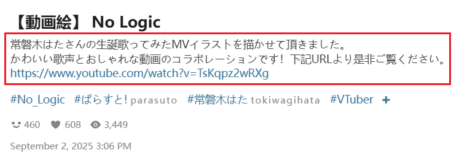
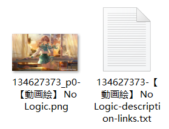

# Settings - More - Download

## Show notification after download is complete

<p class="option" data-no="52" style="display: flex;">
    <span class="has_tip settingNameStyle1" data-xztip="_Description of showing notification after download completes" data-tip="Display a system notification when all files have finished downloading. May request notification permission.">
    <span data-xztext="_下载完成后显示通知">Show <span class="key">notification</span> after download is complete</span>
    <span class="gray1"> ? </span>
    </span>
    <input type="checkbox" name="showNotificationAfterDownloadComplete" class="need_beautify checkbox_switch">
    <span class="beautify_switch" tabindex="0"></span>
    </p>

If this option is enabled, the downloader will display a system notification after all files have finished downloading (may request notification permission)：


And there may also be a notification sound (depending on the operating system settings).

If Do Not Disturb mode is enabled, the notification will be stored in the notification center and will not appear in the bottom-right corner (but there may still be a notification sound).


## Download interval

<p class="option" data-no="90" style="display: flex;">
    <span class="has_tip settingNameStyle1" data-xztip="_Description of download interval" data-tip="Start a download at regular intervals. &lt;br&gt;
Default value is 0, meaning no restriction. &lt;br&gt;
If set to 1 second, a maximum of 3600 files can be downloaded from Pixiv per hour. &lt;br&gt;
If you are concerned about account bans due to frequent downloads, set a number greater than 0 to mitigate this issue. &lt;br&gt;">
    <span data-xztext="_下载间隔">Download <span class="key">interval</span></span>
    <span class="gray1"> ? </span>
    </span>
    <span data-xztext="_When the number of works is greater than">Enable when the number of files exceeds the specified number:</span>
    <input type="text" name="downloadIntervalOnWorksNumber" class="setinput_style1 blue" value="150">
    <span class="verticalSplit"></span>
    <span data-xztext="_Interval time">Interval time:</span>
    <input type="text" name="downloadInterval" class="setinput_style1 blue" value="1">
    <span data-xztext="_Seconds">seconds</span>
    </p>

You can set how many seconds to wait before allowing the downloader to start a download.

?> The purpose of this setting is to proactively reduce the download frequency during large downloads to reduce the risk of your account being banned by Pixiv.

?> You can modify this setting during the download (e.g., change the interval time, enable or disable the restriction), and the changes will take effect immediately.

### Enable when the number of files exceeds the specified number

This setting will only be enabled if the number of works in the **crawling results** exceeds the set value. The default is `150`.

Note that the judgment is based on the number of crawling results, i.e., how many files need to be downloaded in total, not how many remain. If 150 files are crawled (meeting the conditions) and this setting is activated, it will remain active even if only 1 file is left at the end.

### Interval Time

Whenever the downloader **starts** downloading a file, it sets a timer, and the next download is only allowed after the interval time has passed.

**Detailed Explanation of How It Works:**

- If set to `0`, the downloader will not add delay time, and this setting will not take effect.
- If set to `1` second, a maximum of 3600 files can be downloaded from Pixiv per hour.

If you only download a few hundred files per day, the default interval time is usually safe. If you frequently download more files, you can increase the interval time, for example `2`, `3`, etc.

----------

The interval time is not affected by the time required for downloads:

If the previous file takes more than 1 second, the downloader will not wait for it and will start the next file when the countdown ends. This means multiple files may be downloaded simultaneously.

If a file finishes downloading in less than 1 second, the downloader will continue waiting until the countdown ends before starting the next download. When file download times are short, it appears as single-threaded downloading, with only 1 file downloading at a time.

## Download a work when you click the bookmark button

<p class="option" data-no="76" style="display: flex;">
    <span class="settingNameStyle1">
    <span data-xztext="_点击收藏按钮时下载作品">Download a work when you click the <span class="key">bookmark</span> button</span>
    </span>
    <input type="checkbox" name="downloadOnClickBookmark" class="need_beautify checkbox_switch">
    <span class="beautify_switch" tabindex="0"></span>
    </p>

When this feature is enabled, the downloader will automatically download the work when you click its bookmark button.

There are two main use cases:

1. Clicking the bookmark button in the bottom-right corner of the work:

 

2. Clicking the bookmark button inside the work page:


?> Although the screenshots above are for illustrations, this feature also works for novels.

?> This feature is only triggered by **clicking the bookmark button**. The downloader provides some batch bookmarking and quick bookmarking features, but they do not require clicking the bookmark button and thus will not trigger this feature. For example, pressing B while previewing a work will bookmark it but will not trigger this feature.

!> In page types not supported by the downloader, this feature will not work, even if you manually click the bookmark button. This is because the feature requires the downloader to locate the work thumbnail element, but the downloader does not perform this action on some less common pages.

The downloader provides this feature by default:


When you are on a page, hovering the mouse over an illustration thumbnail should show a button in the top-right corner.

This indicates that the downloader supports the page and can use the "Download Work When Clicking the Bookmark Button" feature. However, if the downloader does not display the top-right button, the page is not supported, and the "Download Work When Clicking the Bookmark Button" feature cannot be used.

## Download a work when you click the like button

<p class="option" data-no="77" style="display: flex;">
    <span class="settingNameStyle1">
    <span data-xztext="_点击点赞按钮时下载作品">Download a work when you click the <span class="key">like</span> button</span>
    </span>
    <input type="checkbox" name="downloadOnClickLike" class="need_beautify checkbox_switch">
    <span class="beautify_switch" tabindex="0"></span>
    </p>

When this feature is enabled, the downloader will automatically download the work when you like it on the work page.

Like button:


?> Although the screenshot above is for an illustration, this feature also works for novels.

## Save the ugoira work as

<p class="option" data-no="4" style="display: flex;">
    <span class="has_tip settingNameStyle1" data-xztip="_Description of Ugoira save format" data-tip="Pixiv's Ugoira source file is a Zip compressed file containing multiple static images. The downloader can convert it to other formats. &lt;br&gt;
WebM video has the smallest size with minimal quality loss. It is the default choice. &lt;br&gt;
GIF images have the best compatibility but are larger in size and have poorer quality, not recommended. &lt;br&gt;
APNG images are lossless compressed with the best quality, but usually the largest in size. &lt;br&gt;
Zip file is the source file.">
    <span data-xztext="_动图保存格式">Save the <span class="key">ugoira</span> work as</span>
    <span class="gray1"> ? </span>
    </span>
    <input type="radio" name="ugoiraSaveAs" id="ugoiraSaveAs1" class="need_beautify radio" value="webm" checked="">
    <span class="beautify_radio" tabindex="0"></span>
    <label for="ugoiraSaveAs1" data-xztext="_WebM video" class="active">WebM video</label>
    <input type="radio" name="ugoiraSaveAs" id="ugoiraSaveAs3" class="need_beautify radio" value="gif"> 
    <span class="beautify_radio" tabindex="0"></span>
    <label for="ugoiraSaveAs3" data-xztext="_GIF">GIF image</label>
    <input type="radio" name="ugoiraSaveAs" id="ugoiraSaveAs4" class="need_beautify radio" value="png"> 
    <span class="beautify_radio" tabindex="0"></span>
    <label for="ugoiraSaveAs4" class="has_tip" data-xztip="_Lossless" data-xztext="_APNG" data-tip="Lossless">APNG image</label>
    <input type="radio" name="ugoiraSaveAs" id="ugoiraSaveAs2" class="need_beautify radio" value="zip"> 
    <span class="beautify_radio" tabindex="0"></span>
    <label for="ugoiraSaveAs2" data-xztext="_Zip file">Zip file</label>
    </p>

When downloading Ugoira works, the downloader can save them in various formats. You can choose one based on your needs.

**Characteristics of Each Format:**

- WebM video has high quality and small size, making it the default option. However, it may be inconvenient on mobile devices as it requires a video player to open.
- GIF image is a common animated image format with good compatibility, but poor quality and larger size.
- APNG image is a **lossless** quality animated image format. It has the best quality but the largest size. Additionally, its compatibility is not great, as some image viewers or applications do not support playing APNG images.
- Zip file is the original Ugoira file, unconverted. It contains multiple static images without animation effects.

**Reminder:**

- Converting Ugoira to other formats takes some time, possibly from a few seconds to a few minutes, depending on the original size, volume, and target format of the Ugoira.
- During Ugoira conversion, the downloader's progress bar may not change, which is normal as the downloader is waiting for the conversion to complete.
- Converting Ugoira affects the usability of the page it is on. The page can be scrolled, but interaction with elements on the page is blocked. This is because some synchronous code executes for a long time, blocking the user thread.

## How many animations are converted at the same time 

<p class="option" data-no="24" style="display: flex;">
    <span class="has_tip settingNameStyle1" data-xztip="_Description of number of Ugoira to convert simultaneously" data-tip="Converting multiple Ugoira simultaneously increases resource usage. &lt;br&gt;
Recommended not to exceed 3.">
    <span data-xztext="_同时转换多少个动图">How many animations are <span class="key">converted</span> at the same time</span>
    <span class="gray1"> ? </span>
    </span>
    <input type="text" name="convertUgoiraThread" class="setinput_style1 blue" value="1">
    </p>

The default value is 1.

**Explanation:**

- Compared to downloading static images, converting Ugoira uses more CPU and memory resources.
- Converting multiple Ugoira simultaneously increases resource usage. If a page uses too much memory, it may crash, so this value should not be set too high. Recommended not to exceed 3.
- The number of simultaneous Ugoira conversions will not exceed the number of simultaneous downloads. If the downloader downloads 3 files simultaneously, at most 3 Ugoira will be converted simultaneously.

## Save the novel as

<p class="option" data-no="26" style="display: flex;">
    <span class="has_tip settingNameStyle1" data-xztip="_Description of novel save format" data-tip="TXT is a plain text file. When selecting TXT format, images in the novel will be saved separately. &lt;br&gt;EPUB is an e-book format, with images in the novel embedded into the EPUB file.">
    <span data-xztext="_小说保存格式">Save the <span class="key">novel</span> as</span>
    <span class="gray1"> ? </span>
    </span>
    <input type="radio" name="novelSaveAs" id="novelSaveAs1" class="need_beautify radio" value="txt" checked="">
    <span class="beautify_radio" tabindex="0"></span>
    <label for="novelSaveAs1" class="active"> TXT </label>
    <input type="radio" name="novelSaveAs" id="novelSaveAs2" class="need_beautify radio" value="epub"> 
    <span class="beautify_radio" tabindex="0"></span>
    <label for="novelSaveAs2"> EPUB </label>
    </p>

You can choose to save novels in TXT or EPUB format. The default is TXT.

TXT format is plain text with good universality but cannot display rich text styles (e.g., text styles, hyperlinks). Additionally, it cannot embed images, so the downloader will save the novel's cover image and illustrations separately.

EPUB is an e-book format that can display rich text styles, support chapter directories, and save cover images and illustrations internally.

While EPUB provides a better reading experience, it requires a novel reader to view, so the downloader's default is TXT format.

?> Please use a novel reader to view EPUB novels. Some software can open EPUB files but may have compatibility issues, such as WPS.

## Save metadata in the novel

<p class="option" data-no="27" style="display: flex;">
    <span class="has_tip settingNameStyle1" data-xztip="_Tip for saving metadata in novels" data-tip="Save the novel's title, author, tags, and other information at the beginning of the novel.">
    <span data-xztext="_在小说里保存元数据">Save <span class="key">metadata</span> in the novel</span>
    <span class="gray1"> ? </span>
    </span>
    <input type="checkbox" name="saveNovelMeta" class="need_beautify checkbox_switch">
    <span class="beautify_switch" tabindex="0"></span>
    </p>

If you enable this option, the program will save the following information at the beginning of the novel content:

- Novel title
- Author name
- Novel URL
- Novel description
- Novel tags

For example:

```
好意よりも悪意こそが信用の証である

切由

https://www.pixiv.net/novel/show.php?id=25731985

2025-08-28

土井先生追い討ちのターンです。胃薬もらいに行きましょうね。

#RKRN夢
#忍玉-夢
#rkrn夢
#RKRNプラス
#久々知兵助
#土井半助
#中在家長次
#SAN値チェックのお時間です
#逆方向の信用…
```

?> This setting applies regardless of whether the novel is saved in TXT or EPUB format.

## Download the cover image of the novel

<p class="option" data-no="70" style="display: flex;">
    <span class="settingNameStyle1" data-xztext="_下载小说的封面图片">Download the <span class="key">cover</span> image of the novel</span>
    <input type="checkbox" name="downloadNovelCoverImage" class="need_beautify checkbox_switch" checked="">
    <span class="beautify_switch" tabindex="0"></span>
    </p>

The downloader will save novel cover images separately, with filenames matching the novel's filename for alignment.

Example:


If you do not want to save cover images, you can disable this option.

If you save the novel in EPUB format, the downloader will also add an embedded cover image, for example:


Currently, regardless of whether this option is enabled, the downloader always adds an embedded cover. In future versions, I plan to make the embedded cover follow this setting, meaning if you disable this option, the downloader will not add an embedded cover.

## Download embedded images in novels

<p class="option" data-no="72" style="display: flex;">
    <span class="settingNameStyle1" data-xztext="_下载小说里的内嵌图片">Download <span class="key">embedded</span> images in novels</span>
    <input type="checkbox" name="downloadNovelEmbeddedImage" class="need_beautify checkbox_switch" checked="">
    <span class="beautify_switch" tabindex="0"></span>
    </p>

Some novels have images inserted in the body (mainly R-18 novels); these are embedded images.

The downloader saves embedded images by default. There are differences depending on the novel save format.

When saving novels as TXT, images are saved separately with filenames matching the novel's. For example:


When saving novels as EPUB, images are not saved separately but stored inside the EPUB. For example:


!> For large PNG format embedded images, some novel readers may only display part of them. This is an issue with the reader, not the downloader.

## Save the metadata of the work

<p class="option" data-no="49" style="display: flex;">
    <span class="has_tip settingNameStyle1" data-xztip="_Description of saving work metadata" data-tip="Generate a TXT file for each work to save its metadata.">
    <span data-xztext="_保存作品的元数据">Save the <span class="key">metadata</span> of the work</span>
    <span class="gray1"> ? </span>
    </span>
    <input type="checkbox" name="saveMetaType0" id="setSaveMetaType0" class="need_beautify checkbox_common">
    <span class="beautify_checkbox" tabindex="0"></span>
    <label for="setSaveMetaType0" data-xztext="_Illustration">Illustration</label>
    <input type="checkbox" name="saveMetaType1" id="setSaveMetaType1" class="need_beautify checkbox_common">
    <span class="beautify_checkbox" tabindex="0"></span>
    <label for="setSaveMetaType1" data-xztext="_Manga">Manga</label>
    <input type="checkbox" name="saveMetaType2" id="setSaveMetaType2" class="need_beautify checkbox_common">
    <span class="beautify_checkbox" tabindex="0"></span>
    <label for="setSaveMetaType2" data-xztext="_Ugoira">Ugoira</label>
    <input type="checkbox" name="saveMetaType3" id="setSaveMetaType3" class="need_beautify checkbox_common">
    <span class="beautify_checkbox" tabindex="0"></span>
    <label for="setSaveMetaType3" data-xztext="_Novel">Novel</label>
    </p>

If you select certain work types, the downloader will create a TXT file during downloading to save some metadata for these works.

Example


?> The filename of the metadata includes a `meta` marker at the end.

For image works (illustrations, manga, Ugoira), an example of the metadata saved by the downloader is as follows:

```
ID
120589699

URL
https://www.pixiv.net/i/120589699

Original
https://i.pximg.net/img-original/img/2024/07/16/19/51/00/120589699_p0.jpg

Thumbnail
https://i.pximg.net/c/250x250_80_a2/custom-thumb/img/2024/07/16/19/51/00/120589699_p0_custom1200.jpg

xRestrict
AllAges

AI
No

User
愛田乃彩

UserID
91879154

Title
マジシャンフリーナ

Description
(Twitter) https://twitter.com/aida_noa_
無断転載・使用禁止/All rights reserved.

Tags
#原神
#GenshinImpact
#フリーナ
#Furina
#女の子
#イラスト

Size
4096 x 2537

Bookmark
814

Date
2024-07-16T10:51:00+00:00
```

The metadata for novels is roughly the same but does not include `Original` or `Size`. Additionally, the `Thumbnail` for novels is the URL of its cover image.

?> Novels have a separate setting for saving metadata: [Save metadata in the novel](/en/Settings-More-Download?id=save-metadata-in-the-novel), which saves some metadata at the beginning of the novel without creating a separate TXT file, making it more convenient. However, it saves less metadata. If you have enabled "Save metadata in the novel," you usually do not need to select the "Novel" type in this option.

## Save work description

<p class="option" data-no="50" style="display: flex;">
    <span class="has_tip settingNameStyle1" data-xztip="_保存作品简介的说明" data-tip="为每个作品生成一个 TXT 文件，保存它的简介。">
    <span data-xztext="_保存作品的简介">Save work <span class="key">description</span></span>
    <span class="gray1"> ? </span>
    </span>
    <input type="checkbox" name="saveDescType0" id="setSaveDescType0" class="need_beautify checkbox_common">
    <span class="beautify_checkbox" tabindex="0"></span>
    <label for="setSaveDescType0" data-xztext="_Illustration">Illustration</label>
    <input type="checkbox" name="saveDescType1" id="setSaveDescType1" class="need_beautify checkbox_common">
    <span class="beautify_checkbox" tabindex="0"></span>
    <label for="setSaveDescType1" data-xztext="_Manga">Manga</label>
    <input type="checkbox" name="saveDescType2" id="setSaveDescType2" class="need_beautify checkbox_common">
    <span class="beautify_checkbox" tabindex="0"></span>
    <label for="setSaveDescType2" data-xztext="_Ugoira">Ugoira</label>
    <input type="checkbox" name="saveDescType3" id="setSaveDescType3" class="need_beautify checkbox_common">
    <span class="beautify_checkbox" tabindex="0"></span>
    <label for="setSaveDescType3" data-xztext="_Novel">Novel</label>
    <span class="verticalSplit"></span>
    <span class="settingNameStyle1" data-xztext="_保存方式">Save method</span>
    <input type="radio" name="saveDescMethod" id="saveDescMethod1" class="need_beautify radio" value="separate" checked="">
    <span class="beautify_radio" tabindex="0"></span>
    <label for="saveDescMethod1" data-xztext="_Each work separately" class="active">Save each work separately</label>
    <input type="radio" name="saveDescMethod" id="saveDescMethod2" class="need_beautify radio" value="merge">
    <span class="beautify_radio" tabindex="0"></span>
    <label for="saveDescMethod2" data-xztext="_Merge into one file">Summarize to one file</label>
    </p>

If you enable this feature, the downloader will create a TXT file for each work to save its description.
The description refers to the text below the work's title. For example:



The TXT description file saved by the downloader:



The filename of the TXT description file may include two markers:

1. A `description` marker, which is always included. This marker depends on the downloader's language setting, e.g., it is `简介` when using Chinese.
2. If the description contains URL links, the downloader will add a `links` marker.

?> Some works do not have a description, in which case the downloader will not create a TXT description file for them.

This setting has two sub-options, which can be enabled simultaneously:

### Save each work separately

Create a TXT description file for each work. When downloading multiple works, the downloader will generate multiple description files.

### Summarize to one file

When crawling is complete, the downloader will generate a TXT file aggregating all work descriptions.

The **save location** for this file has two cases:

1. If the aggregated file's description data comes from works by multiple different users, it will be saved directly to the browser's download directory. Since it does not belong to a specific user, it should not be placed in a username folder.

2. If the description data comes from the same user:

- If a folder in the naming rule contains `{user}`, the downloader will save the aggregated file in that folder. For the default naming rule, it will be saved in `pixiv/{user}-{user_id}/`.
- If none of the folders in the naming rule contain `{user}`, the downloader will save it directly to the browser's download directory.

The **filename** of the aggregated file includes multiple parts:
1. `description summary` marker, which changes based on the downloader's language.
2. `user` marker with the username. This is only present if all data in the aggregated file comes from the same user.
3. Current page title
4. Time and date

For example:

```
description summary-user saihate-No_Logic, virtual YouTuber ／ 【動画絵】 No Logic ／ September 2nd, 2025 - pixiv-9／10／2025, 11：31：11 PM.txt
```

## Image size

<p class="option" data-no="30" style="display: flex;">
    <span class="settingNameStyle1" data-xztext="_Image size">Image <span class="key">size</span></span>
    <input type="radio" name="imageSize" id="imageSize1" class="need_beautify radio" value="original" checked="">
    <span class="beautify_radio" tabindex="0"></span>
    <label for="imageSize1" data-xztext="_Original image" class="active">Original</label>
    <input type="radio" name="imageSize" id="imageSize2" class="need_beautify radio" value="regular">
    <span class="beautify_radio" tabindex="0"></span>
    <label for="imageSize2" data-xztext="_Regular">Regular</label>
    <span class="gray1">(1200px)</span>
    <input type="radio" name="imageSize" id="imageSize3" class="need_beautify radio" value="small">
    <span class="beautify_radio" tabindex="0"></span>
    <label for="imageSize3" data-xztext="_Small image">Small</label>
    <span class="gray1">(540px)</span>
    <input type="radio" name="imageSize" id="imageSize4" class="need_beautify radio" value="thumb">
    <span class="beautify_radio" tabindex="0"></span>
    <label for="imageSize4" data-xztext="_Square thumbnail">Square thumbnail</label>
    <span class="gray1">(250px)</span>
    </p>

When downloading image works (illustrations, manga, Ugoira), you can choose the image size to download.

- Original image: Download the original image
- Regular: Download medium-sized images, maximum size 1200*1200 px. The preview images displayed on Pixiv's work pages are this size. If the original is larger, it will be scaled proportionally to this size.
- Small image: Maximum size 540*540 px. If the original is larger, it will be scaled proportionally to this size.
- Square thumbnail: Size 250*250 px. It is always square and does not maintain the original aspect ratio.

?> These image sizes are automatically generated by Pixiv. The downloader does not crop or convert images.

?> When downloading Ugoira, the first 3 options are the same because Ugoira does not have corresponding sized images, so the source file is downloaded. The "Square thumbnail" is effective for Ugoira.

--------------

Sometimes you may not need the original images and just want to view thumbnails; you can select a smaller size to speed up downloads.

There are other use cases:

You may want to batch bookmark some works without downloading their originals. In this case, enable the "Bookmark works after downloading" option and set the image size to "Square thumbnail". Then download these works.

!> When selecting a smaller size and **with a large number of files**, the download frequency may be very fast, e.g., nearly 10 images per second. It is recommended to set a [Download interval](/en/Settings-More-Download?id=download-interval) to proactively reduce the frequency, otherwise Pixiv may issue a warning.

## File size limit

<p class="option" data-no="25" style="display: flex;">
    <span class="has_tip settingNameStyle1" data-xztip="_Description of file size limit" data-tip="If a file's size does not meet the requirements, the downloader will not download it.">
    <span data-xztext="_File size limit">File <span class="key">size</span> limit</span>
    <span class="gray1"> ? </span>
    </span>
    <input type="checkbox" name="sizeSwitch" class="need_beautify checkbox_switch">
    <span class="beautify_switch" tabindex="0"></span>
    <span class="subOptionWrap" data-show="sizeSwitch" style="display: none;">
    <input type="text" name="sizeMin" class="setinput_style1 blue" value="0">MiB
    &nbsp;-&nbsp;
    <input type="text" name="sizeMax" class="setinput_style1 blue" value="100">MiB
    </span>
    </p>

If you have requirements for file sizes, you can set a range.

?> You can enter numbers with decimals here, e.g., `0.5`.

When the downloader starts downloading a file, it can retrieve its size. If it does not meet your set conditions, the downloader will cancel the download and display a log:

<span class="log" style="color: rgb(210, 126, 0);"><a href="https://www.pixiv.net/i/133950803#3" target="_blank">133950803_p2</a> was not saved because its size does not meet the set conditions.<br></span>

?> This check occurs during the downloading phase. It is not checked during crawling.

## File download order

<p class="option" data-no="82" style="display: flex;">
    <span class="settingNameStyle1" data-xztext="_File download order">File download <span class="key">order</span></span>
    <input type="checkbox" name="setFileDownloadOrder" class="need_beautify checkbox_switch">
    <span class="beautify_switch" tabindex="0"></span>
    <span class="subOptionWrap" data-show="setFileDownloadOrder" style="display: none;">
    <span class="settingNameStyle1" data-xztext="_Sort by">Sort by</span>
    <input type="radio" name="downloadOrderSortBy" id="downloadOrderSortBy1" class="need_beautify radio" value="ID" checked="">
    <span class="beautify_radio" tabindex="0"></span>
    <label for="downloadOrderSortBy1" data-xztext="_Work ID" class="active">Work ID</label>
    <input type="radio" name="downloadOrderSortBy" id="downloadOrderSortBy2" class="need_beautify radio" value="bookmarkCount">
    <span class="beautify_radio" tabindex="0"></span>
    <label for="downloadOrderSortBy2" data-xztext="_Bookmark count 2">Bookmark count</label>
    <input type="radio" name="downloadOrderSortBy" id="downloadOrderSortBy3" class="need_beautify radio" value="bookmarkID">
    <span class="beautify_radio" tabindex="0"></span>
    <label for="downloadOrderSortBy3" data-xztext="_Bookmark time">Bookmark time</label>
    <span class="verticalSplit"></span>
    <input type="radio" name="downloadOrder" id="downloadOrder1" class="need_beautify radio" value="desc" checked="">
    <span class="beautify_radio" tabindex="0"></span>
    <label for="downloadOrder1" data-xztext="_Descending" class="active">Descending</label>
    <input type="radio" name="downloadOrder" id="downloadOrder2" class="need_beautify radio" value="asc">
    <span class="beautify_radio" tabindex="0"></span>
    <label for="downloadOrder2" data-xztext="_Ascending">Ascending</label>
    </span>
    </p>

Some users want the downloader to download files in a specific order so that when sorting by **modification time** in the file explorer, the files are organized.

If you need this, you can enable the setting, but it is usually unnecessary. I do not recommend sorting works by modification time, as this method is unreliable, especially when some files are re-downloaded, refreshing their modification time and disrupting the order.

**Using specific naming tags** and sorting by filename achieves the same effect and is more reliable, as filenames are independent of modification time and unaffected by re-downloads.

- To sort by `Work ID`, use `{id}` at the beginning of the filename.
- To sort by `Bookmark count`, use `{bmk}` at the beginning of the filename.
- To sort by `Bookmark time`, use `{bmk_id}` at the beginning of the filename.

Please refer to: [Sorting with Naming Tags](/en/Settings-Download?id=sorting-with-naming-tags).

-----------------

This setting has 2 sub-options:
1. **Sort by**: Indicates how the downloader sorts the files.
2. **Sort order**: Indicates how the downloader downloads files. If set to `Descending`, the downloader downloads files with higher values first, then lower ones. `Ascending` is the opposite.

---------

**Note:** Enabling this setting may increase the time required to complete downloads.

This is because when downloading multiple files simultaneously, later files may finish before earlier ones. To maintain the order, the downloader will make later files wait.

For example, with 5 simultaneous downloads, files numbered 1, 2, 3, 4, 5, but 5 may finish first. The downloader will wait for 1, 2, 3, 4 to download and save to disk before saving 5, causing 5 to wait and potentially increasing download time.

When downloads include Ugoira, wait times can increase further. If a Ugoira starts converting after download (even assuming it's the first and not yet finished downloading or converting), later images may finish but must wait for the Ugoira conversion. Since Ugoira conversion can take time, waiting increases.

---------

Trivia:

By default, this setting is disabled, and the downloader only sorts crawling results on certain page types:

- On user profiles and following pages, the downloader sorts by work ID in descending order to prioritize newly posted works.
- On search pages, the downloader sorts by bookmark count in descending order to prioritize high-bookmark works.
- On other pages, crawling results are not sorted.

If this setting is not enabled, the downloader does not guarantee files are saved to disk in strict order, as download times vary, changing the order.

## Don't download duplicate files

<p class="option" data-no="28" style="display: flex;">
    <span data-xztext="_不下载重复文件">Don't download <span class="key">duplicate</span> files</span>
    <input type="checkbox" name="deduplication" class="need_beautify checkbox_switch">
    <span class="beautify_switch" tabindex="0"></span>
    <span class="subOptionWrap" data-show="deduplication" style="display: none;">
    &nbsp; <span data-xztext="_Strategy">Strategy:</span>
    <input type="radio" name="dupliStrategy" id="dupliStrategy1" class="need_beautify radio" value="strict" checked="">
    <span class="beautify_radio" tabindex="0"></span>
    <label class="has_tip" for="dupliStrategy1" data-xztip="_Description of strict mode" data-xztext="_Strict" data-tip="Conditions: Work ID, upload date, filename">Strict</label>
    <input type="radio" name="dupliStrategy" id="dupliStrategy2" class="need_beautify radio" value="loose">
    <span class="beautify_radio" tabindex="0"></span>
    <label class="has_tip active" for="dupliStrategy2" data-xztip="_Description of loose mode" data-xztext="_Loose" data-tip="Conditions: Work ID, upload date">Loose</label>
    <button class="textButton gray1" type="button" id="exportDownloadRecord" data-xztext="_Export">Export</button>
    <button class="textButton gray1" type="button" id="importDownloadRecord" data-xztext="_Import">Import</button>
    <button class="textButton gray1" type="button" id="clearDownloadRecord" data-xztext="_Clear">Clear</button>
    </span>
    </p>

If you enable this feature, the downloader will skip downloading duplicate files.

### How It Works

After successfully downloading a file, the downloader saves a download record in the browser's IndexedDB database, including the work ID, work modification date, and filename at download time. For example:

```
{
  "id": "85290993_p0",
  "d": "2021/05/22/13/07/51",
  "n": "85290993_p0-小日向ほしみ-オリジナル,女の子,オリジナル,waitress,過膝襪.jpg"
}
```

?> Even if this feature is not enabled, the downloader saves download records for future use.

If enabled, the downloader queries records before downloading each file to check if it is a duplicate.

When skipping duplicates, the downloader displays a list of file IDs in the top log, for example:

<span class="log" style="color: inherit;"><span style="color:#d27e00">Skipped 1 file due to skip duplicate files: </span><br><a href="https://www.pixiv.net/n/25755517" target="_blank">25755517</a><br></span>

### Notes

If a file is skipped, some associated tasks are also skipped, such as:
- Saving work metadata
- Saving work descriptions
- Downloading novel cover images
- Downloading embedded images in novels

However, the "Bookmark works after downloading" feature is unaffected.

!> If you clear "Cookies and other site data" in browser data, the downloader's saved data will also be cleared. If you need the skip duplicate files feature, export download records using the "Export" button before clearing data.

Additionally, this method **is not completely reliable**, as the downloader can only query its own records, not check files on the disk (due to lack of permission).

- If a file you want to download exists on the disk but is not recorded, it will still be downloaded.
- Conversely, if a file was downloaded before and deleted from the disk but recorded, the downloader will not download it again (unless you disable this feature or change the strategy).

### Strict Strategy

Checks all 3 conditions: Work ID, modification date, filename at download time.

If the current file has a record and all three match exactly, it is considered a duplicate.

### Loose Strategy

Checks only 2 conditions: Work ID, modification date.

Does not check if the filename matches.

### Export

Click the export button to export the downloader's download records. This is a JSON file saved directly to the browser's download directory.

This can be used for backups, such as exporting before clearing browser data. You can also export from one browser and import into another.

?> The downloader displays export progress in the top log. If there are many records, exporting takes time; wait for the downloader to indicate completion.

### Import

Click the import button to select a previously exported download records (JSON file) for import.

Importing does not clear previous records, so you can import multiple files (if any), and the records will be merged.

?> The downloader displays import progress in the top log. If there are many records, importing takes time; wait for the downloader to indicate completion.

### Import ID List

This is a hidden feature; enter the command `recordtxt` on the page to use it (press these keys in sequence on a Pixiv page).

The downloader's "Import" button only imports JSON files, but some users want to import self-made TXT format ID lists, so I added this hidden feature.

**Applicable Scenarios:**
1. You downloaded many files before using this downloader, without corresponding records, so you want to manually create records.
2. You accidentally cleared the downloader's records and want to partially rebuild them.

You need to obtain a list of previously downloaded work IDs (e.g., using shell commands to generate a file list) and save it to a TXT file, separated by newlines. The format is as follows:

```
84334853_p0
84334853_p1
84334853_p2
```

One file ID per line. For image works (illustrations, manga, Ugoira), the ID must include the sequence number. Novels do not need sequence numbers, as they do not have them.

?> After importing the ID list, it is suitable only for the "Loose" strategy. Since only IDs are imported without other data, the "Strict" strategy cannot be used.

### Clear

Clear all download records saved by the downloader.

Even if you delete downloaded files from the disk, records remain. When downloading again, the downloader considers them already downloaded and will not download them.

If you encounter this, clear the records or disable the "Skip duplicate files" option.

?> The downloader displays clear progress in the top log. If there are many records, clearing takes time; wait for the downloader to indicate completion.