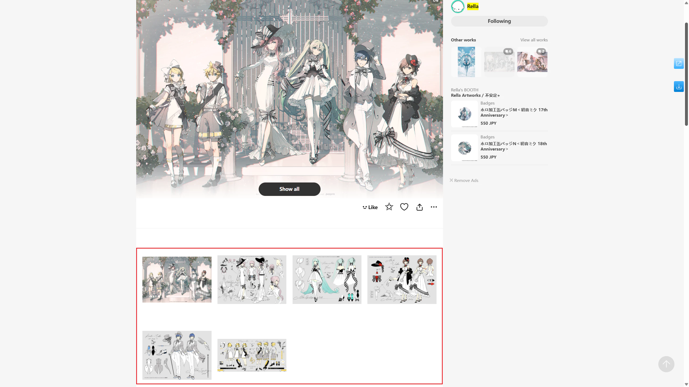

# Settings - More - Enhance

The downloader includes several enhancement features to improve the Pixiv user experience. Some features are enabled by default.

**Note:** In browsers on Android systems, some enhancement features may not work, and the downloader will hide these features. In such cases, it's normal if you don't see certain settings.

## Highlight following users

<p class="option" data-no="84" style="display: flex;">
    <span class="has_tip settingNameStyle1" data-xztip="_Highlight followed users description" data-tip="The names of users you are following will have a yellow background or be displayed in yellow.<br>This makes it easier to confirm whether you are following a user.">
    <span data-xztext="_高亮关注的用户"><span class="key">Highlight</span> following users</span>
    <span class="gray1"> ? </span>
    </span>
    <input type="checkbox" name="highlightFollowingUsers" class="need_beautify checkbox_switch" checked="">
    <span class="beautify_switch" tabindex="0"></span>
    </p>

The names of users you are following will be highlighted, allowing you to quickly see whether you are following a user.

The visual effect varies depending on the color mode of the Pixiv page.

In default (light) mode, usernames will have a yellow background:


In night mode, usernames will be displayed in yellow:


## Preview the details of the work

<p class="option" data-no="87" style="display: flex;">
    <span class="has_tip settingNameStyle1" data-xztip="_Preview work details description" data-tip="Hovering over a work's thumbnail allows you to view its data">
    <span data-xztext="_预览作品的详细信息">Preview the <span class="key">details</span> of the work</span>
    <span class="gray1"> ? </span>
    </span>
    <input type="checkbox" name="PreviewWorkDetailInfo" class="need_beautify checkbox_switch">
    <span class="beautify_switch" tabindex="0"></span>
    <span class="subOptionWrap" data-show="PreviewWorkDetailInfo" style="display: none;">
    <span data-xztext="_Display area width">Display area width</span>&nbsp;
    <input type="text" name="PreviewDetailInfoWidth" class="setinput_style1 blue" value="500" style="width:40px;min-width: 40px;">
    <span>&nbsp;px</span>
    </span>
    </p>

Normally, you can only view detailed information, such as a work's description, tag list, view count, like count, and bookmark count, on the work's page.

If you want to view details without entering the work's page, enable this feature. When you hover over a thumbnail, the downloader will display detailed information, such as:


Links in this panel, such as URLs in the description or tag links, are clickable.

At the bottom of the panel, there are buttons:
- `Copy TXT`: Click it, and the downloader will copy some metadata to the clipboard, matching the content of the TXT file generated by the [Save the metadata of the work](/en/Settings-More-Download?id=save-the-metadata-of-the-work) feature.
- `Copy JSON`: Click it, and the downloader will copy the work's raw JSON data.

More buttons may be added in the future.

To close the details panel, click it or move the mouse outside its boundaries.

?> This feature depends on the [Preview works](/en/Settings-More-Enhance?id=preview-works) feature. If the "Preview work" feature is disabled, this feature will not work. This is mainly to simplify code and avoid multiple requests for work data without caching.

## Show larger thumbnails

<p class="option" data-no="68" style="display: flex;">
    <span class="has_tip settingNameStyle1" data-xztip="_Show larger thumbnails description" data-tip="Pixiv's default thumbnails are small. The downloader can display larger thumbnails for easier previewing.<br>This feature is not very stable, as Pixiv's code updates may cause it to partially fail.">
    <span data-xztext="_显示更大的缩略图">Show <span class="key">larger</span> thumbnails</span>
    <span class="gray1"> ? </span>
    </span>
    <input type="checkbox" name="showLargerThumbnails" class="need_beautify checkbox_switch" checked="">
    <span class="beautify_switch" tabindex="0"></span>
    </p>

Pixiv's work thumbnails are small, typically 184 px in size. Here's a screenshot of the default situation:


Because thumbnails are small and lack detail, I often need to click to view the full image to decide if I like it.

Enabling this feature widens the page display area and increases thumbnail size to 250 px.

If the "Replace square thumbnails to show image aspect ratio" feature below is enabled, thumbnails will increase to 540 px, as shown below:


This makes images clearer and easier on the eyes, reducing fatigue.

?> The number of images displayed per row varies depending on screen resolution and DPI scaling.

## Replace square thumbnails to show image ratio

<p class="option" data-no="63" style="display: flex;">
    <span class="has_tip settingNameStyle1" data-xztip="_Replace square thumbnails to show image aspect ratio description" data-tip="Pixiv's thumbnails are square, so you can't see the full image or its aspect ratio (horizontal or vertical).<br>The downloader can display complete thumbnails to show the image's aspect ratio.">
    <span data-xztext="_替换方形缩略图以显示图片比例">Replace square <span class="key">thumbnails</span> to show image ratio</span>
    <span class="gray1"> ? </span>
    </span>
    <input type="checkbox" name="replaceSquareThumb" class="need_beautify checkbox_switch" checked="">
    <span class="beautify_switch" tabindex="0"></span>
    </p>

Pixiv's thumbnails are 250 px square images, making it impossible to see the image's aspect ratio (horizontal or vertical) or its full content, as edges are cropped. For example:


Enabling this feature replaces square thumbnails with 540 px thumbnails, showing the image's original aspect ratio and full content. For example:


## Preview works

<p class="option" data-no="55" style="display: flex;">
    <span class="has_tip settingNameStyle1" data-xztip="_Preview work description" data-tip="When hovering over an image's thumbnail, the downloader can display a larger image.">
    <span data-xztext="_Preview work"><span class="key">Preview</span> works</span>
    <span class="gray1"> ? </span>
    </span>
    <input type="checkbox" name="PreviewWork" class="need_beautify checkbox_switch" checked="">
    <span class="beautify_switch" tabindex="0"></span>
    <span class="subOptionWrap" data-show="PreviewWork" style="display: inline-flex;">
    <label for="wheelScrollSwitchImageOnPreviewWork" class="has_tip active" data-xztext="_Use mouse wheel to switch images in work" data-xztip="_This may prevent page scrolling" data-tip="This may prevent page scrolling">Use the mouse wheel to switch images in multi-image works</label>
    <input type="checkbox" name="wheelScrollSwitchImageOnPreviewWork" id="wheelScrollSwitchImageOnPreviewWork" class="need_beautify checkbox_switch" checked="">
    <span class="beautify_switch" tabindex="0"></span>
    <span class="verticalSplit"></span>
    <label for="swicthImageByKeyboard" class="has_tip active" data-xztext="_Use arrow keys and spacebar to switch images" data-xztip="_Use arrow keys and spacebar to switch images description" data-tip="← ↑ Previous image<br>→ ↓ Next image<br>Spacebar Next image">Use the arrow keys and space bar to switch images</label>
    <input type="checkbox" name="swicthImageByKeyboard" id="swicthImageByKeyboard" class="need_beautify checkbox_switch" checked="">
    <span class="beautify_switch" tabindex="0"></span>
    <span class="verticalSplit"></span>
    <span data-xztext="_Wait time">Wait time</span>&nbsp;
    <input type="text" name="previewWorkWait" class="setinput_style1 blue" value="400" style="width:40px;min-width: 40px;">
    <span>&nbsp;ms</span>
    <span class="verticalSplit"></span>
    <label for="showPreviewWorkTip" data-xztext="_Show summary information" class="active">Show summary</label>
    <input type="checkbox" name="showPreviewWorkTip" id="showPreviewWorkTip" class="need_beautify checkbox_switch" checked="">
    <span class="beautify_switch" tabindex="0"></span>
    <span class="verticalSplit"></span>
    <span class="settingNameStyle1" data-xztext="_Image size">Image size</span>
    <input type="radio" name="prevWorkSize" id="prevWorkSize1" class="need_beautify radio" value="original">
    <span class="beautify_radio" tabindex="0"></span>
    <label for="prevWorkSize1" data-xztext="_Original">Original</label>
    <input type="radio" name="prevWorkSize" id="prevWorkSize2" class="need_beautify radio" value="regular" checked="">
    <span class="beautify_radio" tabindex="0"></span>
    <label for="prevWorkSize2" data-xztext="_Regular" class="active">Regular</label>
    <span class="verticalSplit"></span>
    <button type="button" class="gray1 textButton showPreviewWorkTip" data-xztext="_Shortcut key list">Shortcut list</button>
    </span>
    </p>

When the mouse cursor hovers over a work's thumbnail, the downloader displays a larger preview image.

The effect is shown below:


?> The preview image adapts to the available area and won't exceed the screen.

To **close the preview image**, use one of these methods:
- Move the mouse cursor outside the thumbnail area
- Click the preview image
- Press the `Esc` key

### Shortcut Key List

Use the shortcut key `Alt` + `P` to toggle the preview work feature on or off.

When viewing a preview image, you can use the following shortcuts:
- `B`ookmark: Bookmark the previewed work
- `C`urrent: Download the currently displayed image (if the work has multiple images, only the current one is downloaded)
- `D`ownload: Download the entire previewed work (if the work has multiple images, all are downloaded)
- `Esc`: Close the preview image
- `←` `↑`: Previous image
- `→` `↓`: Next image
- `Space`: Next image

### Use the mouse wheel to switch images in multi-image works

This feature is enabled by default.

When previewing a work with **multiple images**, you can scroll the mouse wheel to switch between images.

- Scrolling down shows the next image
- Scrolling up shows the previous image

?> If the mouse wheel is used to switch images, the downloader prevents page scrolling. This is because page scrolling would move the mouse away from the thumbnail, causing the preview area to disappear.

### Use the arrow keys and space bar to switch images

This feature is enabled by default.

It enables the following shortcuts:
- `←` `↑`: Previous image
- `→` `↓`: Next image
- `Space`: Next image

When the preview area is displayed and this feature is enabled, the downloader prevents the default behavior of these keys, so they won't scroll the page.

If you want these keys to always scroll the page, disable this feature.

### Wait Time

After the mouse enters the thumbnail area, if it doesn't leave within a certain time, the downloader prepares to display the preview image.

The default wait time is `400` milliseconds, which you can adjust as needed.

### Show summary

This feature is enabled by default.

The downloader displays some information at the top of the preview image. For example:


From left to right, the displayed information includes:
- `AI` tag: Shown only if the work is AI-generated
- Current image number and total images, e.g., `1/16` (shown only for multi-image works)
- Bookmark count of the work, followed by a heart symbol
- Image dimensions (always shows the first image's dimensions)
- Work's posting date
- Work title
- Work description (if available)

### Image Size

You can choose which image size the downloader loads when previewing works.

- `Original`: Loads the original image. Some original images may be large, so loading may be slower.
- `Regular`: Default, loads regular-sized images. These are smaller, so they load quickly.

?> This option only affects the image size during preview, not the size during download.

**Difference between sizes:**

- If the original image's dimensions exceed 1200 px, the regular size will be 1200 px.
- If the original image is smaller than 1200 px, the regular size matches it. For example, if the original is 500 x 500 px, the regular size is also 500 x 500 px.

**Display area differences:**

When selecting "Original," if the image is larger than 1200 px and there's enough space around it, the downloader displays a larger preview image.

Here's an example. The regular image width is 1200 px:


The original image width is 4093 px, so the display area is larger:


?> Although the original image can sometimes be displayed larger, this isn't always the case. If the available area around the thumbnail is limited, the regular image may already fill it, and the original won't appear larger.

## Preview Ugoira

<p class="option" data-no="71" style="display: flex;">
    <span class="settingNameStyle1" data-xztext="_Preview Ugoira"><span class="key">Preview</span> Ugoira</span>
    <input type="checkbox" name="previewUgoira" class="need_beautify checkbox_switch" checked="">
    <span class="beautify_switch" tabindex="0"></span>
    </p>

When you hover the mouse cursor over an Ugoira's thumbnail, the downloader displays a preview with animation effects. For example:


If this feature is disabled, the downloader won't show Ugoira previews (not even static images).

?> This feature does not depend on the "Preview work" feature. You can preview Ugoira even if "Preview work" is disabled.

## Long press the right mouse button on the thumbnail to display the large image

<p class="option" data-no="62" style="display: flex;">
    <span class="settingNameStyle1" data-xztext="_长按右键显示大图">Long press the right mouse button on the thumbnail to display the <span class="key">large image</span></span>
    <input type="checkbox" name="showOriginImage" class="need_beautify checkbox_switch" checked="">
    <span class="beautify_switch" tabindex="0"></span>
    <span class="subOptionWrap" data-show="showOriginImage" style="display: inline-flex;">
    <span class="settingNameStyle1" data-xztext="_Image size">Image size</span>
    <input type="radio" name="showOriginImageSize" id="showOriginImageSize1" class="need_beautify radio" value="original">
    <span class="beautify_radio" tabindex="0"></span>
    <label for="showOriginImageSize1" data-xztext="_Original" class="active">Original</label>
    <input type="radio" name="showOriginImageSize" id="showOriginImageSize2" class="need_beautify radio" value="regular" checked="">
    <span class="beautify_radio" tabindex="0"></span>
    <label for="showOriginImageSize2" data-xztext="_Regular">Regular</label>
    </span></p>

When previewing a work, long-pressing the right mouse button on a thumbnail displays the full image.

By default, the downloader loads the original image and displays it at its original size (1:1). If the original image is large, it may exceed the screen (this is not a bug).

For example, when viewing the original image of this work, only the top half is shown:


**Tips:**

- If parts of the image exceed the screen, move the mouse cursor to view the full image.
- Use the mouse wheel to zoom in or out.
- When previewing a multi-image work, the full image shown matches the previewed image (e.g., `3/10`).

To **close the full image**, use one of these methods:
- Click the left mouse button.
- Press the `Esc` key.

?> This feature currently depends on the "Preview work" feature. If "Preview work" is disabled, this feature won't work. In the future, I may make it independent.

### Shortcut Key List

When the downloader displays the full image, you can use these shortcuts:
- `C`urrent: Download the currently displayed image
- `D`ownload: Download the entire work the image belongs to (if the work has multiple images, all are downloaded)

### Image Size

You can choose whether the downloader loads the original or regular image when displaying the full image. The default is original.

Regular images have a maximum size of 1200 px, while original images may be larger, so they may appear bigger at 1:1 display.

## Show zoom button on thumbnail

<p class="option" data-no="40" style="display: flex;">
    <span class="settingNameStyle1" data-xztext="_在作品缩略图上显示放大按钮">Show <span class="key">zoom</span> button on thumbnail</span>
    <input type="checkbox" name="magnifier" class="need_beautify checkbox_switch" checked>
    <span class="beautify_switch" tabindex="0"></span>
    <span class="subOptionWrap" data-show="magnifier" style="display: inline-flex;">
    <span class="settingNameStyle1" data-xztext="_Position">Position</span>
    <input type="radio" name="magnifierPosition" id="magnifierPosition1" class="need_beautify radio" value="left">
    <span class="beautify_radio" tabindex="0"></span>
    <label for="magnifierPosition1" data-xztext="_Left">Left</label>
    <input type="radio" name="magnifierPosition" id="magnifierPosition2" class="need_beautify radio" value="right" checked="">
    <span class="beautify_radio" tabindex="0"></span>
    <label for="magnifierPosition2" data-xztext="_Right" class="active">Right</label>
    <span class="verticalSplit"></span>
    <span class="settingNameStyle1" data-xztext="_Image size">Image size</span>
    <input type="radio" name="magnifierSize" id="magnifierSize1" class="need_beautify radio" value="original">
    <span class="beautify_radio" tabindex="0"></span>
    <label for="magnifierSize1" data-xztext="_Original" class="active">Original</label>
    <input type="radio" name="magnifierSize" id="magnifierSize2" class="need_beautify radio" value="regular" checked="">
    <span class="beautify_radio" tabindex="0"></span>
    <label for="magnifierSize2" data-xztext="_Regular">Regular</label>
    </span>
    </p>

When the mouse hovers over a work's thumbnail, the downloader displays a magnifier icon, as shown below:


Clicking the magnifier icon opens the image viewer to view each image in the work. The effect is shown below:


You can find detailed information about the image viewer here: [Image Viewer](/en/Convenience-Features?id=image-viewer).

This feature has two sub-options:

### Position

- `Left`: Displays the magnifier icon in the top-left corner of the thumbnail.
- `Right`: Displays the magnifier icon in the top-right corner of the thumbnail.

### Image Size

- `Original`: Clicking the magnifier icon loads original-sized images in the image viewer.
- `Regular`: Clicking the magnifier icon loads regular-sized images (up to 1200 px) in the image viewer.

The default is original.

?> This setting only affects the image size **displayed** in the image viewer. When clicking the download button at the bottom of the image viewer, the downloaded image size follows the [Image size](/en/Settings-More-Download?id=image-size) setting in "Settings - More - Download". The default is "Original".

## Show download button on thumbnail

<p class="option" data-no="56" style="display: flex;">
    <span class="settingNameStyle1" data-xztext="_Show download button on work thumbnails">Show <span class="key">download</span> button on thumbnail</span>
    <input type="checkbox" name="showDownloadBtnOnThumb" class="need_beautify checkbox_switch" checked="">
    <span class="beautify_switch" tabindex="0"></span>
    </p>

When the mouse hovers over a work's thumbnail, the downloader displays a download button, as shown below:


Clicking the download button downloads the work, making downloading more convenient.

?> The downloaded image size follows the [Image size](/en/Settings-More-Download?id=image-size) setting in "Settings - More - Download". The default is "Original".

?> The download button's position aligns with the "Show magnifier button on work thumbnails" feature. Both buttons can be displayed simultaneously.

## Show thumbnail list on multi-image work pages

<p class="option" data-no="86" style="display: flex;">
    <span class="has_tip settingNameStyle1" data-xztip="_Show thumbnail list on multi-image work pages description" data-tip="On multi-image work pages (/artworks/), the downloader can display a preview of each image.">
    <span data-xztext="_Show thumbnail list on multi-image work pages">Show <span class="key">thumbnail</span> list on multi-image work pages</span>
    <span class="gray1"> ? </span>
    </span>
    <input type="checkbox" name="displayThumbnailListOnMultiImageWorkPage" class="need_beautify checkbox_switch" checked="">
    <span class="beautify_switch" tabindex="0"></span>
    </p>

When on a **multi-image work** page (e.g., [121525173](https://www.pixiv.net/artworks/121525173)), the downloader can display thumbnails for each image. For example:



You can preview or download each image.

When hovering over a thumbnail, you can use enhancement features, such as:


These features include:
- Preview work (you can still use shortcuts `C` to download a single image or `D` to download the entire work)
- View full image by long-pressing the right mouse button
- Show download button on thumbnails (clicking this button downloads only the specific image)
- Clicking a thumbnail opens the image viewer, for example:


## Add a quick search area on the search page

<p class="option" data-no="48" style="display: flex;">
    <span class="has_tip settingNameStyle1" data-xztip="_Add quick search area on search pages description" data-tip="At the top of search pages (/tags/), the downloader can display bookmark count tags, such as '10000users入り'. Clicking them adds the tag to the search.">
    <span data-xztext="_在搜索页面添加快捷搜索区域">Add a quick <span class="key">search</span> area on the search page</span>
    <span class="gray1"> ? </span>
    </span>
    <input type="checkbox" name="showFastSearchArea" class="need_beautify checkbox_switch" checked="">
    <span class="beautify_switch" tabindex="0"></span>
    </p>

The downloader adds buttons for specific bookmark counts at the top of search pages, for example:


Clicking these buttons adds the bookmark count tag to the current search and performs the search.

For example, on the `バーチャルYouTuber` page, clicking the `10000users入り` button makes the downloader search for `バーチャルYouTuber 10000users入り`.

?> This feature is particularly useful for non-Pixiv premium users.

?> This feature is not always accurate. Some users may add the `10000users入り` tag to works with low bookmark counts, which is deceptive.

The bookmark count buttons added by the downloader are:

```
100users入り 500users入り 1000users入り 5000users入り 10000users入り 20000users入り 30000users入り 50000users入り 100000users入り
```

## Remove the works of followed users from the search page

<p class="option" data-no="88" style="display: flex;">
    <span class="has_tip settingNameStyle1" data-xztip="_Remove works of followed users on search pages description" data-tip="This displays only works from unfollowed users, helping you discover new users you like.<br>Only applies on search pages (/tags/).">
    <span data-xztext="_在搜索页面里移除已关注用户的作品"><span class="key">Remove</span> the works of followed users from the search page</span>
    <span class="gray1"> ? </span>
    </span>
    <input type="checkbox" name="removeWorksOfFollowedUsersOnSearchPage" class="need_beautify checkbox_switch">
    <span class="beautify_switch" tabindex="0"></span>
    </p>

If enabled, the downloader removes works by followed users when you're on a search page.

This helps you focus on works from unfollowed users when discovering new artists, reducing distractions and improving efficiency.

?> This feature does not affect crawl results. Even if works by followed users are removed, the downloader will still crawl them.

## Preview filter results on search page

<p class="option" data-no="18" style="display: flex;">
    <span class="has_tip settingNameStyle1" data-xztip="_Preview search results description" data-tip="When crawling on search pages (/tags/), the downloader can display crawled works on the current page, sorted by bookmark count from high to low.<br>
    When preview is enabled, the downloader won't automatically start downloading, allowing users to further filter results.<br>
    You can set the maximum number of previews to avoid page crashes if too many are displayed.">
    <span data-xztext="_预览搜索结果"><span class="key">Preview</span> filter results on search page</span>
    <span class="gray1"> ? </span>
    </span>
    <input type="checkbox" name="previewResult" class="need_beautify checkbox_switch" checked="">
    <span class="beautify_switch" tabindex="0"></span>
    <span class="subOptionWrap" data-show="previewResult" style="display: inline-flex;">
    <span class="settingNameStyle1" data-xztext="_Limit">Upper Limit</span>
    <input type="text" name="previewResultLimit" class="setinput_style1 blue" value="3000" style="width:80px;min-width: 80px;">
    </span>
    </p>

When crawling on search pages for illustrations, manga, or Ugoira, the downloader displays crawled works on the current page, sorted by bookmark count from high to low.

Example:


This feature provides a what-you-see-is-what-you-get experience. You can preview crawl results, filter them, and then download.

?> After crawling, you can use buttons in the downloader's "Crawl" tab to filter results.

**Note:** When this feature is enabled, the "Automatically start downloading" setting is disabled. This allows users to filter results before downloading. To start downloading automatically after crawling, disable this feature.

?> This feature does not work on novel search pages.

### Upper Limit

When the downloader crawls many works (e.g., thousands), displaying them all on the page increases memory usage. In extreme cases, this may cause the page to crash.

You can set a "Limit" to control the maximum number of displayed works. The default is `3000`.

## Downloader' bookmark function (✩)

<p class="option" data-no="34" style="display: flex;">
    <span class="has_tip settingNameStyle1" data-xztip="_Bookmark settings description" data-tip="Sometimes you'll see the downloader's bookmark button (✩). Clicking it bookmarks the work.<br>
    You can choose whether to include the work's tags and whether it's public.<br>
    This setting also applies when batch-bookmarking works with the downloader.">
    <span data-xztext="_收藏设置">Downloader' <span class="key">bookmark</span> function (✩)</span>
    <span class="gray1"> ? </span>
    </span>
    <input type="radio" name="widthTag" id="widthTag1" class="need_beautify radio" value="yes" checked="">
    <span class="beautify_radio" tabindex="0"></span>
    <label for="widthTag1" data-xztext="_Add tags" class="active">Add tags</label>
    <input type="radio" name="widthTag" id="widthTag2" class="need_beautify radio" value="no">
    <span class="beautify_radio" tabindex="0"></span>
    <label for="widthTag2" data-xztext="_Do not add tags">Don't add tag</label>
    <span class="verticalSplit"></span>
    <input type="radio" name="restrict" id="restrict1" class="need_beautify radio" value="no" checked="">
    <span class="beautify_radio" tabindex="0"></span>
    <label for="restrict1" data-xztext="_Public" class="active">Public</label>
    <input type="radio" name="restrict" id="restrict2" class="need_beautify radio" value="yes">
    <span class="beautify_radio" tabindex="0"></span>
    <label for="restrict2" data-xztext="_Private">Private</label>
    </p>

You can use this setting to control the downloader's behavior when bookmarking works.

?> Pixiv's original bookmark button (heart-shaped) is not affected by this setting.

**Features affected by this setting:**

1. Quick bookmark button (☆) on work pages:


2. Quick bookmark button (☆) when previewing search results on search pages:


3. Bookmarking a work with the `B` shortcut while previewing.
4. Bookmarking a work by clicking the (☆) button in the image viewer.
5. [Bookmark after download](/en/Settings-Download?id=bookmark-works-after-downloading) feature.
6. "Bookmark all works on this page" feature in the downloader's "More" tab on user homepages and search pages.

**Features not affected by this setting:**

The "Add tags to uncategorized works" button on the bookmark page is unaffected. This feature always includes tags and automatically sets public or private status based on the work's prior bookmark status.

**Sub-options:**

When using features affected by this setting, you can configure:
- Whether to include the work's tags
- Whether to bookmark as public or private

The default is to add tags and bookmark publicly.

?> If a work has already been bookmarked, you can still bookmark it again. This will not change its bookmark time (and thus will not affect its order on the bookmark page), but it can update its public status and tag list. For example: if a work was previously set to public and had tags added, you can, if needed, change the settings to private with no tags and have the downloader bookmark it again.
