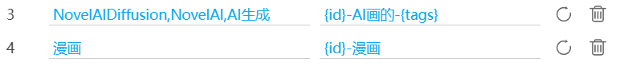

# Hidden Settings

Some hidden settings are not displayed on the downloader’s panel.

## Don't download the last few images for specific user's multi-image works

    
    Don't download the last few images for specific user's multi-image works
     ? 
    
    <slot data-name="DoNotDownloadLastFewImagesSlot">
    
    0
      <button type="button" class="textButton expand" data-xztext="_Expand">Expand</button>
      <button type="button" class="textButton showAdd" data-xztext="_Add">Add</button>
    
    

      

        

          User ID (numeric)
          <input type="text" class="setinput_style1 blue addUidInput" data-xzplaceholder="_Must be numeric" placeholder="Must be numeric">
        

        

          Do not download last few images
          <input type="text" class="has_tip setinput_style1 blue addValueInput" data-xztip="_0 means no effect" data-tip="0 means no effect">
        

      

    

  </slot>
    

This setting is always active, whether displayed or not.

By default, it has no rules, so it has no effect. It only takes effect after you add rules.

Click the "Add" button to enter a user ID and specify how many of their work’s last images to exclude from downloading.

?> The downloader has a similar setting: [Do not crawl the last image of multi-image works](/en/Settings-More-Crawl?id=Do-not-crawl-the-last-image-of-multi-image-works). That setting cannot target specific users and always excludes the last image. This setting allows for more detailed rules.

------------

To view this setting, follow these steps:

1. Enable the downloader’s "Show advanced settings" option and switch to the "More" tab.
2. Press F12 to inspect elements, go to the "Elements" panel, press `Ctrl` + `F`, and search for `p[data-no="79"]` to locate this element.
3. It has a default `display: none;` style. Remove this style to make it visible and usable.

## Use a different naming rule for the work if it has certain tags

    Use a different naming rule for the work if it has certain tags
    <input type="checkbox" name="UseDifferentNameRuleIfWorkHasTagSwitch" class="need_beautify checkbox_switch">
    
    
    <slot data-name="UseDifferentNameRuleIfWorkHasTagSlot">

    
    0
      <button type="button" class="textButton expand" data-xztext="_Collapse">Collapse</button>
      <button type="button" class="textButton showAdd" data-xztext="_Add">Add</button>
    
    

      

        

          Tags
          <input type="text" class="setinput_style1 blue addTagsInput" data-xzplaceholder="_Tags separated by commas" placeholder="Multiple tags separated by commas">
        

        

          Naming rule
          <input type="text" class="setinput_style1 blue addRuleInput">
        

      

    

  
</slot>
    
    

You can add custom rules, for example:

If a work contains the specified tags, the downloader uses the folder part from the default naming rule combined with the filename part specified here to create a new naming rule.

Since this setting was designed for a specific user, it has special rules:

1. The "naming rule" here should only include the **filename** rule. It should not include folders (i.e., no slashes `/`), as this may cause unexpected results.
2. The "naming rule" must start with `{id}`. Regardless of whether you include `{id}`, the downloader internally adds `{id}` to the beginning.

------------

To view this setting, follow the steps for the previous setting, but use the selector `p[data-no="80"]`.

## Create Folders Based on sl

Create folders based on the `sl` attribute in a work’s metadata.

This feature is disabled by default and not available in the settings panel.

**What is `sl`?**

`sl` is a field in a work’s data, possibly indicating the "erotic level" rating of the work.

`sl` values and their roles (speculated):

- `0`: Newly posted works typically have this value, possibly indicating no rating yet. After some time, it changes to another value.
- `2`: These works generally have no erotic elements.
- `4`: These works often have some erotic elements, such as large breasts, exposed thighs, or revealing clothing, but usually not at an R-18 level.
- `6`: These works typically have very obvious erotic elements, possibly R-18. Even if not R-18, they may include suggestive content.

This feature creates folders based on the work’s `sl` attribute, resulting in folder names like:

- sl0
- sl2
- sl4
- sl6

?> Novels do not have `sl` data, so this feature does not apply to novels. It only works for illustrations, manga, and Ugoira.

------------

To enable/disable this feature:

Enter one of the following commands on a Pixiv page (type the letters sequentially using the keyboard):

- `ppdss1`
- `switchsl`
- `kaiguansl`

If the command is correct, the downloader displays a prompt at the mouse cursor’s position. The prompts for enabling/disabling are:

createFolderBySl On

createFolderBySl Off

## Prioritize Downloading Ugoira

This feature is disabled by default and not available in the settings panel.

If enabled, after crawling is complete, the downloader prioritizes Ugoira by sorting them to the top of the crawl results, allowing Ugoira to be downloaded first.

------------

To enable/disable this feature:

Enter one of the following commands on a Pixiv page (type the letters sequentially using the keyboard):

- `ppdss2`
- `dlugoirafirst`
- `qw111`

If the command is correct, the downloader displays a prompt at the mouse cursor’s position. The prompts for enabling/disabling are:

downloadUgoiraFirst On

downloadUgoiraFirst Off