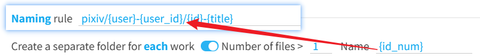
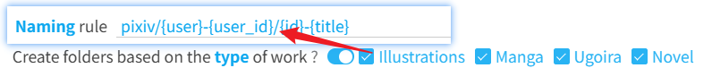
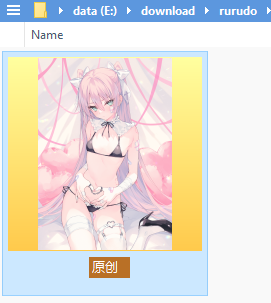
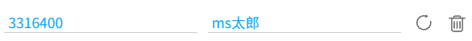

# Settings - More - Naming

## Create a separate folder for each work

<p class="option" data-no="19" style="display: flex;">
    <span class="settingNameStyle1" data-xztext="_为作品建立单独的文件夹">Create a separate folder for <span class="key">each</span> work</span>
    <input type="checkbox" name="workDir" class="need_beautify checkbox_switch">
    <span class="beautify_switch" tabindex="0"></span>
    <span class="subOptionWrap" data-show="workDir" style="display: none;">
    <label for="workDirFileNumber" data-xztext="_Number of files greater than">Number of files &gt;</label>
    <input type="text" name="workDirFileNumber" id="workDirFileNumber" class="setinput_style1 blue" value="1" style="width:30px;min-width: 30px;">
    <span>&nbsp;</span>
    <label for="workDirNameRule" data-xztext="_Folder name">Name</label>
    <input class="has_tip setinput_style1 blue" type="text" data-xztip="_Use id_num instead of id" name="workDirNameRule" id="workDirNameRule" value="{id_num}" data-tip="Use {id_num} instead of {id} here">
    </span>
    </p>

The downloader can create a separate folder for each work.

**Sub-options:**

- `Number of files`: The downloader will create a folder for a work only if the number of files in that work exceeds the set value. The default is 1, which means folders are created only for multi-image works. You can set other values. If set to 0, a folder will be created for every work (though this is unnecessary since the same effect can be achieved using the "naming rule").
- `Folder name`: The name of the folder created for the work. You can use tags from the naming rule or use `/` to create subfolders. The default value is `{id_num}`, which uses the work ID (without sequence numbers) to create a folder and store files inside it.

If the number of files in a work meets the condition, the downloader will insert the folder name before the filename, creating a folder:



!> Do not use the `{id}` tag here; use `{id_num}` instead. This is because each image in a multi-image work has a different `{id}`. Using `{id}` would result in a separate folder for each image.

---

For example, take work [79239641](https://www.pixiv.net/artworks/79239641 ':target=_blank'), which has 3 images.

When this feature is enabled, the downloader will, by default, place the images in a folder named after the work’s ID, like this:

```
79239641/
  |---- 79239641_p0.jpg
  |---- 79239641_p1.jpg
  |---- 79239641_p2.jpg
```

## Create folders based on the type of work

<p class="option" data-no="42" style="display: flex;">
    <span class="has_tip settingNameStyle1" data-xztip="_Description of automatically creating folders by work type" data-tip="Folder name for illustrations: Illustration&lt;br&gt;
Folder name for manga: Manga&lt;br&gt;
Folder name for Ugoira: Ugoira&lt;br&gt;
Folder name for novels: Novel">
    <span data-xztext="_根据作品类型自动建立文件夹">Create folders based on the <span class="key">type</span> of work</span>
    <span class="gray1"> ? </span>
    </span>
    <input type="checkbox" name="createFolderByType" class="need_beautify checkbox_switch">
    <span class="beautify_switch" tabindex="0"></span>
    <span class="subOptionWrap" data-show="createFolderByType" style="display: none;">
    <input type="checkbox" name="createFolderByTypeIllust" id="createFolderByTypeIllust" class="need_beautify checkbox_common">
    <span class="beautify_checkbox" tabindex="0"></span>
    <label for="createFolderByTypeIllust" class="has_tip" data-tip="Illustration">
    <span data-xztext="_Illustration">Illustration</span></label>
    <input type="checkbox" name="createFolderByTypeManga" id="createFolderByTypeManga" class="need_beautify checkbox_common">
    <span class="beautify_checkbox" tabindex="0"></span>
    <label for="createFolderByTypeManga" class="has_tip" data-tip="Manga">
    <span data-xztext="_Manga">Manga</span></label>
    <input type="checkbox" name="createFolderByTypeUgoira" id="createFolderByTypeUgoira" class="need_beautify checkbox_common">
    <span class="beautify_checkbox" tabindex="0"></span>
    <label for="createFolderByTypeUgoira" class="has_tip" data-tip="Ugoira">
    <span data-xztext="_Ugoira">Ugoira</span></label>
    <input type="checkbox" name="createFolderByTypeNovel" id="createFolderByTypeNovel" class="need_beautify checkbox_common">
    <span class="beautify_checkbox" tabindex="0"></span>
    <label for="createFolderByTypeNovel" class="has_tip" data-tip="Novel">
    <span data-xztext="_Novel">Novel</span></label>
    </span></p>

You can select **any number** of these options, and the downloader will automatically create folders based on the work type.

If a folder needs to be created for a work, the downloader will add a folder before the filename:



- If `Illustration` is selected, illustration works will be stored in the `Illustration` folder.
- If `Manga` is selected, manga works will be stored in the `Manga` folder.
- If `Ugoira` is selected, Ugoira works will be stored in the `Ugoira` folder.
- If `Novel` is selected, novel works will be stored in the `Novel` folder.

?> There is a similar naming tag: `{type}`. It outputs the work type, and using it to create folders is equivalent to selecting all four options in this setting. However, `{type}` creates folders for all work types and cannot limit to specific types. If you only want folders for certain types (e.g., only for "Ugoira"), use this setting.

## Create a folder with the first matched tag

<p class="option" data-no="43" style="display: flex;">
    <span class="has_tip settingNameStyle1" data-xztip="_Description of creating folders using matching tags" data-tip="If the work’s tag list contains a user-specified tag, that tag will be used to create a folder (only the first matching tag is used)">
    <span data-xztext="_使用第一个匹配的tag建立文件夹">Create a folder with the first matched <span class="key">tag</span></span>
    <span class="gray1"> ? </span>
    </span>
    <input type="checkbox" name="createFolderByTag" class="need_beautify checkbox_switch">
    <span class="beautify_switch" tabindex="0"></span>
    <span class="subOptionWrap" data-show="createFolderByTag" style="display: none;">
    <textarea class="centerPanelTextArea beautify_scrollbar" name="createFolderTagList" rows="1" placeholder="tag1,tag2,tag3"></textarea>
    </span>
    </p>

When this setting is enabled, users can input a list of tags.

When downloading each file, the downloader checks if the work’s tags include **any** of the tags specified here. Once a matching tag is found (the first one), it will use that tag to create a folder.

This setting allows you to categorize files with specific tags separately.

---

For example, work [94964157](https://www.pixiv.net/artworks/94964157 ':target=_blank') contains the tag "原创":


If you include `原创` in this setting, the downloader will create an "原创" folder to store this work:



---

Another use case: The downloader has a naming setting: [Save the R-18(G) works in the designated folder](/en/Settings-Downloading?id=Store-R-18G-works-in-a-specified-folder), which places works with `R-18` and `R-18G` tags into **one** separate folder.

Some users may want `R-18` and `R-18G` works to be saved in **two** separate folders, which the above setting cannot achieve. In this case, you can use this setting.

Enter `R-18,R-18G` in this setting. When a work has the `R-18` tag, an `R-18` folder will be created; if it has the `R-18G` tag, an `R-18G` folder will be created.

## The first image without a serial number

<p class="option" data-no="22" style="display: flex;">
    <span class="has_tip settingNameStyle1" data-xztip="_Description of removing sequence number from the first image" data-tip="Remove the sequence number from the first image of each work. For example, 80036479_p0 becomes 80036479">
    <span data-xztext="_第一张图不带序号">The first image without a <span class="key">serial number</span></span>
    <span class="gray1"> ? </span>
    </span>
    <input type="checkbox" name="noSerialNo" class="need_beautify checkbox_switch">
    <span class="beautify_switch" tabindex="0"></span>
    <span class="subOptionWrap" data-show="noSerialNo" style="display: none;">
      <input type="checkbox" name="noSerialNoForSingleImg" id="setNoSerialNoForSingleImg" class="need_beautify checkbox_common" checked="">
      <span class="beautify_checkbox" tabindex="0"></span>
      <label for="setNoSerialNoForSingleImg" data-xztext="_Single-image works" class="active">Single-image works</label>
      <input type="checkbox" name="noSerialNoForMultiImg" id="setNoSerialNoForMultiImg" class="need_beautify checkbox_common" checked="">
      <span class="beautify_checkbox" tabindex="0"></span>
      <label for="setNoSerialNoForMultiImg" data-xztext="_Multi-image works" class="active">Multi-image works</label>
    </span>
    </p>

What is a sequence number? If you use the `{id}` naming tag, each work’s ID will include a sequence number, such as:

```
80447108_p0
80447108_p1
80447108_p2
```

The `_p0`, `_p1`, `_p2` at the end are sequence numbers.

If you enable this option, the downloader will remove the sequence number from the **first image of each work**, resulting in:

```
// The sequence number 0 is removed from the first image
80447108
80447108_p1
80447108_p2
```

**Sub-options:**
- `Single-image works`: Remove the sequence number for single-image works.
- `Multi-image works`: Remove the sequence number for the first image of multi-image works.

?> The naming tag `{p_num}` also outputs sequence numbers, but as plain numbers `0`, `1`, `2`. This setting also applies to `{p_num}`, meaning it can remove the `0` output by `{p_num}`.

## Add 0 in front of the serial number

<p class="option" data-no="46" style="display: flex;">
    <span class="has_tip settingNameStyle1" data-xztip="_Description of padding sequence numbers with zeros" data-tip="This can resolve issues where some software fails to sort files correctly by filename.">
    <span data-xztext="_在序号前面填充0"><span class="key">Add 0</span> in front of the serial number</span>
    <span class="gray1"> ? </span>
    </span>
    <input type="checkbox" name="zeroPadding" class="need_beautify checkbox_switch">
    <span class="beautify_switch" tabindex="0"></span>
    <span class="subOptionWrap" data-show="zeroPadding" style="display: none;">
    <span data-xztext="_Sequence number total length">Total length of serial number</span>
    <input type="text" name="zeroPaddingLength" class="setinput_style1 blue" value="3" style="width:30px;min-width: 30px;">
    </span>
    </p>

Illustrations and manga works may have multiple images, so their filenames include sequence numbers, such as:

```
0
1
2
3
...
10
11
12
...
```

By default, the downloader does not pad sequence numbers with zeros, but some software may sort filenames incorrectly. In such cases, padding with zeros is needed.

**Note:** If you don’t encounter issues with "incorrect sorting by filename due to sequence numbers," you don’t need to enable this setting.

This issue often occurs on Android systems, where many file managers may sort files incorrectly, like this:

```
0
1
11
12
...
2
20
21
...
3
30
...
```

This happens because these file managers sort filenames as strings, causing the issue.

By enabling this feature, the downloader will pad sequence numbers with zeros:

```
001
002
003
...
010
011
012
...
```

This resolves the sorting issue.

You can set the total length of the padded sequence number in the sub-option, with a default of 3.

?> A single illustration or manga work on Pixiv can have up to 200 images, so setting the length to 3 is the most appropriate.

## File name length limit

<p class="option" data-no="29" style="display: flex;">
    <span class="has_tip settingNameStyle1" data-xztip="_Description of filename length limit" data-tip="If a filename is too long, the browser may display a Save As dialog, requiring manual handling. &lt;br&gt;
    You usually don’t need to enable this setting, as browsers on Windows typically truncate long filenames automatically. &lt;br&gt;
    However, on other operating systems or when saving to a network drive, the browser may not truncate filenames, resulting in a Save As dialog. &lt;br&gt;
    If you think it’s necessary, enable this setting, and the downloader will truncate the overly long parts of filenames. &lt;br&gt;
    A number less than 256 is recommended. The default is 200.">
    <span data-xztext="_文件名长度限制">File name <span class="key">length</span> limit</span>
    <span class="gray1"> ? </span>
    </span>
    <input type="checkbox" name="fileNameLengthLimitSwitch" class="need_beautify checkbox_switch">
    <span class="beautify_switch" tabindex="0"></span>
    <span class="subOptionWrap" data-show="fileNameLengthLimitSwitch" style="display: none;">
    <input type="text" name="fileNameLengthLimit" class="setinput_style1 blue" value="200">
    </span>
    </p>

You can set an upper limit for filename length. This length includes only the filename and extension, not the folder path.

For example, with the default naming rule `pixiv/{user}-{user_id}/{id}-{title}`, the part after the last slash `/`, `{id}-{title}`, is the filename. The downloader also adds an extension, such as `.jpg` or `.png`.

If this setting is enabled, the downloader will check each file’s name. If the filename plus extension exceeds the set value, the downloader will truncate the filename to make it shorter than the set value.

This setting only truncates the filename, not the folder name. Folder names are always kept complete.

**Why might filenames be too long?**

If some naming rule tags output a lot of text, the filename may exceed the length allowed by the operating system. Typically, two types of tags can cause this issue: `{title}`, as some novel titles are very long, and tag-related tags like `{tags}`, `{tags_translate}`, `{tags_transl_only}`, as some tags have many characters.

**When should you enable this setting?**

Enable this setting only when the browser cannot automatically save files due to overly long filenames.

Specifically, if you use Windows with Chrome and save files to a local disk (not a network location), you don’t need this setting, as the browser will automatically truncate long filenames.

In other cases, the browser may not truncate long filenames, causing a Save As dialog to appear for files with overly long names, requiring manual handling.

In such cases, enable this setting to let the downloader truncate the long parts.

A number less than 256 is recommended. The default is 200, but you may need a smaller value in some cases.

?> Files are stored in folders. If the combined length of all preceding folder names is long, the available characters for the filename will be reduced. Conversely, if the folder names are short, more characters are available for the filename.

## Tag separation symbol

<p class="option" data-no="83" style="display: flex;">
    <span class="settingNameStyle1" data-xztext="_标签分隔符号">Tag <span class="key">separation</span> symbol</span>
    <input type="text" name="tagsSeparator" class="setinput_style1 blue" value=",">
    <button type="button" class="gray1 textButton showTagsSeparatorTip" data-xztext="_Tip">Tip</button>
    </p>

This affects only the results of these naming tags: `{tags}`, `{tags_translate}`, `{tags_transl_only}`.

By default, the downloader uses `,` to separate tags, so the output of these tags looks like: `tag1,tag2,tag3`. If you want to use a different symbol, you can change it here.

For example, if you set it to `#`, the tag list output will be `tag1#tag2#tag3`.

Here are some commonly used separators:

```
,
#
&
_
-
```

?> The separator can be a single character or multiple characters (if needed).

## Remove @ and subsequent characters in username

<p class="option" data-no="67" style="display: flex;">
    <span class="has_tip settingNameStyle1" data-xztip="_Description of removing @ and subsequent characters from username" data-tip="For example: Anmi@画集発売中 → Anmi">
    <span data-xztext="_移除用户名中的at和后续字符">Remove <span class="key">@</span> and subsequent characters in username</span>
    <span class="gray1"> ? </span>
    </span>
    <input type="checkbox" name="removeAtFromUsername" class="need_beautify checkbox_switch">
    <span class="beautify_switch" tabindex="0"></span>
    </p>

Some users add an @ suffix to their usernames, for example:

- Anmi@画集発売中
- 奥馬@skeb募集中
- TonyG@__tony_g

Additionally, the text after the @ may change over time.

If you want to remove the @ and subsequent text, enable this option. This will cause the `{user}` naming tag to truncate the username at the @, resulting in:

- Anmi
- 奥馬
- TonyG

## Customize username

<div class="option" data-no="66" style="display: flex;">
    <span class="has_tip settingNameStyle1" data-xztip="_Description of custom username" data-tip="Some users may change their names. If you want to use their original name, you can set it manually here. &lt;br&gt;
You can also set an alias for a user. &lt;br&gt;
When using the {user} tag in the naming rule, the downloader will prioritize the name you set.">
    <span data-xztext="_自定义用户名">Customize <span class="key">username</span></span>
    <span class="gray1"> ? </span>
    </span>
    <slot data-name="setUserNameSlot"><span class="setUserNameWrap">
    <span class="controlBar">
    <span class="total">0</span>
      <button type="button" class="textButton expand" data-xztext="_Collapse">Collapse</button>
      <button type="button" class="textButton showAdd" data-xztext="_Add">Add</button>
    </span>
    <div class="addWrap">
      <div class="settingItem addInputWrap">
        <div class="inputItem uid">
          <span class="label uidLabel" data-xztext="_User ID">User ID (number)</span>
          <input type="text" class="setinput_style1 blue addUidInput" data-xzplaceholder="_Must be a number" placeholder="Must be a number">
        </div>
        <div class="inputItem name">
          <span class="label nameLabel" data-xztext="_User naming tag">User name</span>
          <input type="text" class="setinput_style1 blue addNameInput">
        </div>
      </div>
    </div>
  </span></slot>
    </div>

You can add a user’s ID and set a custom name for them here. This affects the `{user}` naming tag.

For example, the username for https://www.pixiv.net/users/3316400 is `MだSたろう`. If you want to set a custom name, you can enter the user ID as `3316400` and the username as `ms太郎`, then save.

When downloading their works, the `{user}` tag will ignore the original name and output the custom name `ms太郎`.

After adding a rule, the downloader will display it like this:



If needed, you can modify the settings here (e.g., change the username) and click the refresh button on the right to update the rule. You can also delete the rule.

---

**Use Case 1:** Prevent issues with users changing names.

Some users may frequently change their names. If you want to use their original name, you can set it manually here.

A common case is usernames with an @ symbol, such as:

- Anmi@画集発売中
- 奥馬@skeb募集中
- さしみなす@依頼募集中

While the [Remove @ and subsequent characters from username](/en/Settings-More-Naming?id=Remove-@-and-subsequent-characters-from-username) feature can address this, some users’ names may not use @, for example:

- いの字/inoji
- 焔すばる★２日目 東C17a
- 送り萬都 🔞仕事募集中
- しりー＊C99木曜東A21b
- ショーンC99木東ユ40b
- オムレットマト西ぬ31b

You can set a fixed name for them here.

---

**Use Case 2:** Set aliases or nicknames for users.

For example, if a user’s name is in Japanese but you don’t input Japanese and it’s inconvenient to search on your device, you can set a Chinese alias (or another language you can use) for easier searching.

If a user’s name is hard to remember, you can also set an easy-to-remember alias.