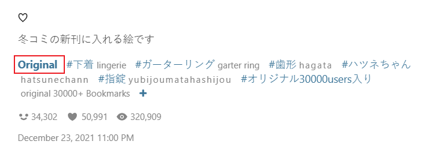
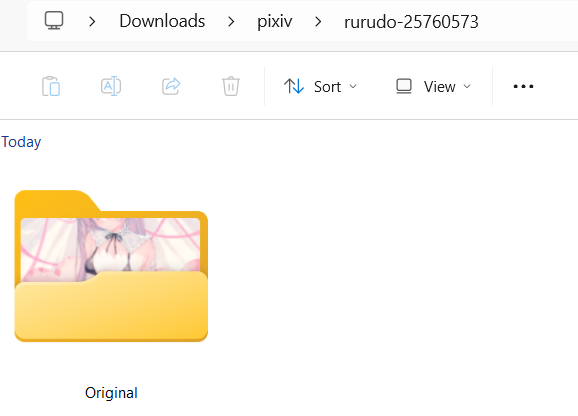
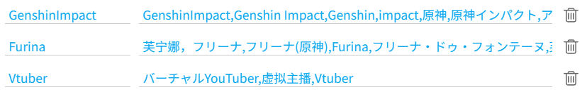
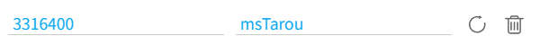

# Settings - More - Naming

## Add a folder layer for multi-image works

<div class="option new" data-no="19" style="display: flex;"><button type="button" class="pinButton" data-title="_置顶">📌</button>
      <a href="https://xuejianxianzun.github.io/PBDWiki/#/en/Settings-More-Naming?flag=19" target="_blank" class="settingNameStyle" data-xztext="_为多图作品添加一层文件夹">Add a folder layer for <span class="key">multi-image</span> works</a>
      <input type="checkbox" name="folderForMultiImageWorksSwitch" class="need_beautify checkbox_switch">
      <span class="beautify_switch" tabindex="0"></span>
      <button type="button" class="gray1 textButton showMsgBtn" data-title="_为多图作品添加一层文件夹" data-msg="为多图作品添加一层文件夹的帮助" data-xztext="_帮助">Help</button>
      <span class="subOptionWrap" data-show="folderForMultiImageWorksSwitch" style="display: none;">
        <label for="folderForMultiImageWorksImageNumber" data-xztext="_图片数量2">Number of images</label>
        &gt;
        <input class="setinput_style1 blue w150 noGrow" type="text" name="folderForMultiImageWorksImageNumber" id="folderForMultiImageWorksImageNumber" value="1">
        <label for="folderForMultiImageWorksRule" data-xztext="_文件夹规则">Folder rule</label>
        <input class="setinput_style1 blue w150 grow" type="text" name="folderForMultiImageWorksRule" id="folderForMultiImageWorksRule" value="{pid}">
      </span>
    </div>

The downloader can add a separate folder layer for multi-image works. Click the `Help` button for this setting in the downloader panel to view the detailed explanation.

For example, work [79239641](https://www.pixiv.net/artworks/79239641 ':target=_blank') has 3 images. After enabling this feature, you can put those images into a folder named with the work ID, like this:

```
79239641/
  |---- 79239641_p0.jpg
  |---- 79239641_p1.jpg
  |---- 79239641_p2.jpg
```

**Sub-options:**

- `Image count`: The downloader adds the configured folder only when the number of images in the work is greater than this value. The default is 1, so it applies to all multi-image works. You can set other values if needed.
- `Folder rule`: The name of the folder added for multi-image works. Like the regular naming rule, you can use tags and custom text here, and you can also use `/` to create nested folders. The default value is `{pid}`, which uses the work ID without the page number.

After that, you also need to modify the `Naming rule for image works` setting and insert `/{multi_image_folder}/` where needed to add the folder layer. Example: `pixiv/{user}-{user_id}/{multi_image_folder}/{id}-{title}`

You need to insert this tag manually so you can decide where this folder layer should appear. Usually it is placed before the filename, but some users may want it in a higher-level folder or even inside the filename.

**Tips:**

- If you want to use the work ID in the folder name, do not use `{id}`. Use `{pid}` instead. In a multi-image work, each image has a different `{id}`, so using `{id}` would create a separate folder for each image.
- Although the setting name says `add one folder layer`, you can actually configure multiple nested folders here.
- `{multi_image_folder}` itself does not create a folder unless your folder rule already ends with a slash `/`. So in most cases you need to add `/` after it. But this can also be useful: if you do not want to create a folder and only want to mark multi-image works in the filename, you can use it in the filename directly. For example, if the folder rule is `multi-image` and you add it to the filename like `pixiv/{user}-{user_id}/{id}-{multi_image_folder}`, the filename will include the `multi-image` marker.

## Add a folder layer for R-18(G) works

<div class="option" data-no="38" style="display: flex;"><button type="button" class="pinButton" data-title="_置顶">📌</button>
      <a href="https://xuejianxianzun.github.io/PBDWiki/#/en/Settings-More-Naming?flag=38" target="_blank" class="settingNameStyle" data-xztext="_为r18作品添加一层文件夹">Add a folder layer for <span class="key">R-18(G)</span> works</a>
      <input type="checkbox" name="r18Folder" class="need_beautify checkbox_switch">
      <span class="beautify_switch" tabindex="0"></span>
      <span class="subOptionWrap" data-show="r18Folder" style="display: none;">
        <span data-xztext="_文件夹规则">Folder rule</span>
        <input type="text" name="r18FolderName" class="setinput_style1 blue grow" value="[R-18&amp;R-18G]">
      </span>
      <button type="button" class="gray1 textButton showMsgBtn" data-title="_为r18作品添加一层文件夹" data-msg="_为r18作品添加一层文件夹的帮助" data-xztext="_帮助">Help</button>
    </div>

If you want to put R-18(G) works into a separate folder layer, you can enable this setting. Click the `Help` button for this setting in the downloader panel to view the detailed explanation.

To make this setting take effect, you also need to modify the naming rule and use `{r18_g_folder}` to represent the folder rule configured here. When downloading an R-18(G) work, the downloader replaces `{r18_g_folder}` with the folder rule set here.

## Create a folder with the first matched tag

<div class="option" data-no="43" style="display: flex;"><button type="button" class="pinButton" data-title="_置顶">📌</button>
      <a href="https://xuejianxianzun.github.io/PBDWiki/#/en/Settings-More-Naming?flag=43" target="_blank" class="settingNameStyle">
        <span data-xztext="_使用第一个匹配的标签建立文件夹">Create a folder with the first matched <span class="key">tag</span></span>
      </a>
      <input type="checkbox" name="createFolderByTag" class="need_beautify checkbox_switch">
      <span class="beautify_switch" tabindex="0"></span>
      <button type="button" class="gray1 textButton showMsgBtn" data-title="_使用第一个匹配的标签建立文件夹" data-msg="_使用第一个匹配的标签建立文件夹的说明" data-xztext="_帮助">Help</button>
      <span class="subOptionWrap namingTipArea flexBasis100" data-show="createFolderByTag" style="display: none;">
        <span class="name" data-bind-copy="true">{match_tag_folder1}</span>
        <textarea class="centerPanelTextArea beautify_scrollbar" name="createFolderTagList" rows="1" placeholder="tag1,tag2,tag3"></textarea>
        <span class="name" data-bind-copy="true">{match_tag_folder2}</span>
        <textarea class="centerPanelTextArea beautify_scrollbar" name="createFolderTagList2" rows="1" placeholder="tag1,tag2,tag3"></textarea>
      </span>
    </div>

If you want to create a special folder layer when a work contains certain tags, you can enable this setting. Click the `Help` button for this setting in the downloader panel to view the detailed explanation.

For example, work [94964157](https://www.pixiv.net/artworks/94964157 ':target=_blank') contains the `Original` tag:



If you include `Original` in this setting, the downloader will create an `Original` folder for this work:



----------

After enabling this setting, you can configure two tag lists.

When downloading each file, the downloader checks whether the work's tags contain **any** of the tags you configured here. Once it finds a matching tag, it uses that tag to create a folder.

This setting lets you categorize files with specific tags separately.

## Tag alias

<div class="option new" data-no="107" style="display: flex;"><button type="button" class="pinButton" data-title="_置顶">📌</button>
      <a href="https://xuejianxianzun.github.io/PBDWiki/#/en/Settings-More-Naming?flag=107" target="_blank" class="settingNameStyle">
        <span data-xztext="_标签别名">Tag <span class="key">alias</span></span>
      </a>
      <label for="useTagAliasForTagsNamingRule" data-xztext="_应用到文件名里的tags系列标记" class="">{tags} series tokens applied to the file name</label>
      <input type="checkbox" name="useTagAliasForTagsNamingRule" id="useTagAliasForTagsNamingRule" class="need_beautify checkbox_switch">
      <span class="beautify_switch" tabindex="0"></span>
      <button type="button" class="gray1 textButton showMsgBtn" data-title="_标签别名" data-msg="_标签别名的帮助" data-xztext="_帮助">Help</button>
    </div>

If a tag has multiple variants, you can set a custom alias for them. Example:



This alias can be used both for `Create a folder with the first matched tag` and for the `{tags}`-related naming tags.

There is a `Help` button on the right side of this setting. Click it to view the detailed instructions. In the Wiki it has no effect.

## Starting value of serial numbers

<div class="option new" data-no="98" style="display: flex;"><button type="button" class="pinButton" data-title="_置顶">📌</button>
      <a href="https://xuejianxianzun.github.io/PBDWiki/#/en/Settings-More-Naming?flag=98" target="_blank" class="has_tip settingNameStyle" data-xztip="_序号起始值的说明" data-tip="Set whether the image serial number starts from 0 or from 1">
        <span data-xztext="_序号起始值"><span class="key">Serial number</span> starting value</span>
        <span class="gray1"> ? </span>
      </a>
      <input type="radio" name="serialNoStart" id="serialNoStart0" class="need_beautify radio" value="0" checked="">
      <span class="beautify_radio" tabindex="0"></span>
      <label for="serialNoStart0" class="active"> 0 </label>
      <input type="radio" name="serialNoStart" id="serialNoStart1" class="need_beautify radio" value="1">
      <span class="beautify_radio" tabindex="0"></span>
      <label for="serialNoStart1"> 1 </label>
    </div>

You can choose whether image serial numbers start from `0` or from `1`.

By default, the downloader starts from `0`, because Pixiv image filenames also start from `p0`. If you want them to start from `1`, you can change this setting.

This setting affects naming tags that include serial numbers: `{id}` and `{p}`.

**Note:** If you change the serial number to start from `1` and also enable `Don't download duplicate files`, keep this in mind: the old download record for the same file may use `0`, while the new filename uses `1`, so the filenames will differ. In that case, the `Strict` strategy will download the file again, while the `Loose` strategy will not.

## The first image without a serial number

<p class="option" data-no="22" style="display: flex;">
  <a href="https://xuejianxianzun.github.io/PBDWiki/#/en/Settings-More-Naming?flag=22" target="_blank" class="has_tip settingNameStyle" data-xztip="_第一张图不带序号说明" data-tip="Remove the serial number of the first image of each work. For example 80036479_p0 becomes 80036479.">
    <span data-xztext="_第一张图不带序号">The first image without a <span class="key">serial number</span></span>
    <span class="gray1"> ? </span>
  </a>
  <input type="checkbox" name="noSerialNo" class="need_beautify checkbox_switch">
  <span class="beautify_switch" tabindex="0"></span>
  <span class="subOptionWrap" data-show="noSerialNo" style="display: inline-flex;">
    <input type="checkbox" name="noSerialNoForSingleImg" id="setNoSerialNoForSingleImg" class="need_beautify checkbox_common" checked="">
    <span class="beautify_checkbox" tabindex="0"></span>
    <label for="setNoSerialNoForSingleImg" data-xztext="_单图作品">Single image works</label>
    <input type="checkbox" name="noSerialNoForMultiImg" id="setNoSerialNoForMultiImg" class="need_beautify checkbox_common" checked="">
    <span class="beautify_checkbox" tabindex="0"></span>
    <label for="setNoSerialNoForMultiImg" data-xztext="_多图作品">Multi-image works</label>
    <input type="checkbox" name="noSerialNoForUgoira" id="setNoSerialNoForUgoira" class="need_beautify checkbox_common" checked="">
    <span class="beautify_checkbox" tabindex="0"></span>
    <label for="setNoSerialNoForUgoira" data-xztext="_动图" class="active">Ugoira</label>
  </span>
</p>

What is a sequence number? If you use the `{id}` naming tag, each work's ID will include a sequence number, such as:

```
80447108_p0
80447108_p1
80447108_p2
```

The `_p0`, `_p1`, `_p2` at the end are sequence numbers.

If you enable this option, the downloader will remove the sequence number from the **first image of each work**, resulting in:

```
// The sequence number 0 is removed from the first image
80447108
80447108_p1
80447108_p2
```

**Sub-options:**
- `Single-image works`: Remove the sequence number for single-image works.
- `Multi-image works`: Remove the sequence number for the first image of multi-image works.
- `Ugoira`: Remove the sequence number for Ugoira works.

?> The naming tag `{p}` also outputs sequence numbers, but as plain numbers `0`, `1`, `2`. This setting also applies to `{p}`, meaning it can remove the `0` output by `{p}`.

## Add 0 in front of the serial number

<p class="option" data-no="46" style="display: flex;">
    <span class="has_tip settingNameStyle1" data-xztip="_Description of padding sequence numbers with zeros" data-tip="This can resolve issues where some software fails to sort files correctly by filename.">
    <span data-xztext="_在序号前面填充0"><span class="key">Add 0</span> in front of the serial number</span>
    <span class="gray1"> ? </span>
    </span>
    <input type="checkbox" name="zeroPadding" class="need_beautify checkbox_switch">
    <span class="beautify_switch" tabindex="0"></span>
    <span class="subOptionWrap" data-show="zeroPadding" style="display: none;">
    <span data-xztext="_Sequence number total length">Total length of serial number</span>
    <input type="text" name="zeroPaddingLength" class="setinput_style1 blue" value="3" style="width:30px;min-width: 30px;">
    </span>
    </p>

Illustrations and manga works may have multiple images, so their filenames include sequence numbers, such as:

```
0
1
2
3
...
10
11
12
...
```

By default, the downloader does not pad sequence numbers with zeros, but some software may sort filenames incorrectly. In such cases, padding with zeros is needed.

**Note:** If you don't encounter issues with "incorrect sorting by filename due to sequence numbers," you don't need to enable this setting.

This issue often occurs on Android systems, where many file managers may sort files incorrectly, like this:

```
0
1
11
12
...
2
20
21
...
3
30
...
```

This happens because these file managers sort filenames as strings, causing the issue.

By enabling this feature, the downloader will pad sequence numbers with zeros:

```
001
002
003
...
010
011
012
...
```

This resolves the sorting issue.

You can set the total length of the padded sequence number in the sub-option, with a default of 3.

?> A single illustration or manga work on Pixiv can have up to 200 images, so setting the length to 3 is the most appropriate.

## File name length limit

<p class="option" data-no="29" style="display: flex;">
      <a href="https://xuejianxianzun.github.io/PBDWiki/#/en/Settings-More-Naming?flag=29" target="_blank" class="settingNameStyle">
        <span data-xztext="_文件名长度限制">File name <span class="key">length</span> limit</span>
      </a>
      <input type="checkbox" name="fullNameLengthLimitSwitch" class="need_beautify checkbox_switch" checked="">
      <span class="beautify_switch" tabindex="0"></span>
      <span class="subOptionWrap" data-show="fullNameLengthLimitSwitch" style="display: inline-flex;">
        <input type="text" name="fullNameLengthLimit" class="setinput_style1 blue" value="210">
      </span>
    </p>

You can set a character limit for the full filename. The full filename includes: the folder name, path separators, the filename itself, and the extension.

The default value is `210`. If the total number of characters in the full filename exceeds this limit, the downloader will prioritize truncating the filename to keep the character count below the limit. If necessary, it will also truncate folder names.

**Why might filenames become too long?**

Some tags in the naming rule can output a large amount of text, which may cause the filename length to exceed the limit allowed by the operating system (usually no more than 256 characters).

Two types of tags are particularly likely to cause this issue:
- Titles, including `{title}` and `{page_title}`, because some novel titles are very long.
- Tag lists, including `{tags}`, `{tags_translate}`, `{tags_transl_only}`, and `{page_tag}`, because some tags contain a large number of characters.

### Downloader's Processing Mechanism

For a full file path like `A/B/C.jpg`, the downloader calculates the total character count. If it exceeds the limit, it processes from the end (i.e., prioritizes truncating the filename, then folder names if needed). The specific steps are as follows:

1. If the filename `C` is too long, it will be truncated to reduce the character count, but the part generated by `{id}` will always be preserved to avoid filename duplication.
2. If the overall length is still too long after truncating `C`, the folder `B` will be truncated. For each folder level: if it does not exceed 25 characters, it will not be truncated. If it exceeds 25 characters, it will be truncated, and the remaining characters for each truncated folder will be a multiple of 25.
3. If the overall length is still too long after truncating `B`, the folder `A` will be truncated, and so on.
4. The downloader adds an ellipsis `…` at the end of any truncated folder or filename to remind the user that truncation has occurred.

**Additional Notes:**
- Each character or symbol counts as 1 character. For example, one English letter is 1 character, and one Chinese character is also 1 character.
- You can modify the length limit. The default value of `210` works for most users, but some users may be able to use a larger value, while others may need a smaller one.
- The path of the browser's download directory affects the usable filename length. If the full path of the download directory is 30 characters long, the downloader can only use about 220 characters. If the download directory path is short, more characters can be used.
- When a filename is too long, the number of characters retained after truncation is usually less than the set value, not equal to it.
- If this setting is enabled (enabled by default), the downloader first processes the filename once before passing it to the browser.

-----------

**Chrome Browser's Processing Mechanism:**

Chrome first checks and creates each folder level. If any folder name is too long, Chrome will not create it and will display the "Save As" dialog for manual saving.

If all folder names are acceptable, it then checks the filename. Chrome may automatically truncate the filename to save the file, or it may not. Common behaviors are as follows:
- On Windows, when saving to a local drive, Chrome usually automatically truncates the filename (without showing the "Save As" dialog).
- On Linux, Chrome may never automatically truncate filenames (always shows the "Save As" dialog).
- Regardless of the system, if the browser's download directory is a network location (not a local drive), Chrome may never automatically truncate filenames (always shows the "Save As" dialog).

If the browser unexpectedly shows the "Save As" dialog, it may indicate a filename length issue (though other reasons are possible). In such cases, you can pause the download, reduce this setting's value, and then resume downloading.

## Tag separation symbol

<p class="option" data-no="83" style="display: flex;">
    <span class="settingNameStyle1" data-xztext="_标签分隔符号">Tag <span class="key">separation</span> symbol</span>
    <input type="text" name="tagsSeparator" class="setinput_style1 blue" value=",">
    <button type="button" class="gray1 textButton showTagsSeparatorTip" data-xztext="_Tip">Tip</button>
    </p>

This affects only the results of these naming tags: `{tags}`, `{tags_translate}`, `{tags_transl_only}`.

By default, the downloader uses `,` to separate tags, so the output of these tags looks like: `tag1,tag2,tag3`. If you want to use a different symbol, you can change it here.

For example, if you set it to `#`, the tag list output will be `tag1#tag2#tag3`.

Here are some commonly used separators:

```
,
#
&
_
-
```

?> The separator can be a single character or multiple characters (if needed).

## Remove @ and subsequent characters in username

<p class="option" data-no="67" style="display: flex;">
    <span class="has_tip settingNameStyle1" data-xztip="_Description of removing @ and subsequent characters from username" data-tip="For example: Anmi@画集発売中 → Anmi">
    <span data-xztext="_移除用户名中的at和后续字符">Remove <span class="key">@</span> and subsequent characters in username</span>
    <span class="gray1"> ? </span>
    </span>
    <input type="checkbox" name="removeAtFromUsername" class="need_beautify checkbox_switch">
    <span class="beautify_switch" tabindex="0"></span>
    </p>

Some users add an @ suffix to their usernames, for example:

- Anmi@画集発売中
- 奥馬@skeb募集中
- TonyG@__tony_g

Additionally, the text after the @ may change over time.

If you want to remove the @ and subsequent text, enable this option. This will cause the `{user}` naming tag to truncate the username at the @, resulting in:

- Anmi
- 奥馬
- TonyG

## Customize username

<div class="option" data-no="66" style="display: flex;">
    <span class="has_tip settingNameStyle1" data-xztip="_Description of custom username" data-tip="Some users may change their names. If you want to use their original name, you can set it manually here. &lt;br&gt;
You can also set an alias for a user. &lt;br&gt;
When using the {user} tag in the naming rule, the downloader will prioritize the name you set.">
    <span data-xztext="_自定义用户名">Customize <span class="key">username</span></span>
    <span class="gray1"> ? </span>
    </span>
    <slot data-name="setUserNameSlot"><span class="setUserNameWrap">
    <span class="controlBar">
    <span class="total">0</span>
      <button type="button" class="textButton expand" data-xztext="_Collapse">Collapse</button>
      <button type="button" class="textButton showAdd" data-xztext="_Add">Add</button>
    </span>
    <div class="addWrap">
      <div class="settingItem addInputWrap">
        <div class="inputItem uid">
          <span class="label uidLabel" data-xztext="_User ID">User ID (number)</span>
          <input type="text" class="setinput_style1 blue addUidInput" data-xzplaceholder="_Must be a number" placeholder="Must be a number">
        </div>
        <div class="inputItem name">
          <span class="label nameLabel" data-xztext="_User naming tag">User name</span>
          <input type="text" class="setinput_style1 blue addNameInput">
        </div>
      </div>
    </div>
  </span></slot>
    </div>

You can add a user's ID and set a custom name for them here. This affects the `{user}` naming tag.

For example, the username for https://www.pixiv.net/users/3316400 is `MだSたろう`. If you want to set a custom name, you can enter the user ID as `3316400` and the username as `msTarou`, then save.

When downloading their works, the `{user}` tag will ignore the original name and output the custom name `msTarou`.

After adding a rule, the downloader will display it like this:



If needed, you can modify the settings here (e.g., change the username) and click the refresh button on the right to update the rule. You can also delete the rule.

---

**Use Case 1:** Prevent issues with users changing names.

Some users may frequently change their names. If you want to use their original name, you can set it manually here.

A common case is usernames with an @ symbol, such as:

- Anmi@画集発売中
- 奥馬@skeb募集中
- さしみなす@依頼募集中

While the [Remove @ and subsequent characters from username](/en/Settings-More-Naming?id=remove-and-subsequent-characters-in-username) feature can address this, some users' names may not use @, for example:

- いの字/inoji
- 焔すばる★２日目 東C17a
- 送り萬都 🔞仕事募集中
- しりー＊C99木曜東A21b
- ショーンC99木東ユ40b
- オムレットマト西ぬ31b

You can set a fixed name for them here.

---

**Use Case 2:** Set aliases or nicknames for users.

For example, if a user's name is in Japanese but you don't input Japanese and it's inconvenient to search on your device, you can set a English alias (or another language you can use) for easier searching.

If a user's name is hard to remember, you can also set an easy-to-remember alias.

## Remove Emoji from filename

<div class="option new" data-no="97" style="display: flex;"><button type="button" class="pinButton" data-title="_置顶">📌</button>
      <a href="https://xuejianxianzun.github.io/PBDWiki/#/en/Settings-More-Naming?flag=97" target="_blank" class="settingNameStyle">
        <span data-xztext="_移除文件名里的emoji">Remove <span class="key">Emoji</span> from filename</span>
      </a>
      <input type="checkbox" name="removeEmoji" class="need_beautify checkbox_switch">
      <span class="beautify_switch" tabindex="0"></span>
    </div>

Usernames and work titles often contain emoji. If you do not want emoji to appear in filenames, you can enable this setting.

## Date and time format

<div class="option" data-no="31" style="display: flex;"><button type="button" class="pinButton" data-title="_置顶">📌</button>
      <a href="https://xuejianxianzun.github.io/PBDWiki/#/en/Settings-More-Other?flag=31" target="_blank" class="settingNameStyle" data-xztext="_日期格式">Date and time <span class="key">format</span></a>
      <input type="text" name="dateFormat" class="setinput_style1 blue" style="width:250px;" value="YYYY-MM-DD">
      <button type="button" class="gray1 textButton toggleArea" data-toggle-target="#dateFormatTip" data-for-no="31" data-xztext="_提示">Tip</button>
    </div>

Some naming tags in the downloader generate date and time strings:
- `{date}`
- `{upload_date}`
- `{task_date}`

Their default format is `YYYY-MM-DD` (for example `2021-04-30`), which includes only the date and not the time.

If you want to change the format, modify this setting.

For a time such as `2021-04-30T06:40:08`, the available tags and their outputs are as follows (**case-sensitive**):

- `YYYY` 2021
- `YY` 21
- `MM` 04
- `MMM` Apr
- `MMMM` April
- `DD` 30
- `hh` 06
- `mm` 40
- `ss` 08

## Naming rule when merging novel series

<div class="option" data-no="91" style="display: flex;"><button type="button" class="pinButton" data-title="_置顶">📌</button>
      <a href="https://xuejianxianzun.github.io/PBDWiki/#/en/Settings-More-Naming?flag=91" target="_blank" class="settingNameStyle" data-xztext="_合并系列小说时的命名规则"><span class="key">Naming</span> rule when merging novel series</a>
      <span class="rowWrap">
        <textarea class="centerPanelTextArea beautify_scrollbar" name="seriesNovelNameRule" rows="1">novel series/{page_tag}/{series_title}-{series_id}-{user}-{part}-{tags}.{ext}</textarea>
        <button type="button" class="showFileNameTip textButton toggleArea" data-toggle-target="#seriesNovelNameTip" data-for-no="91" data-xztext="_提示">Tip</button>
      </span>
    </div>

You can set the filename of the merged collection file generated when the downloader merges a novel series.

You can click the `Tip` button for this setting in the downloader panel to view the detailed explanation, so it will not be repeated here.

**Notes:**
- This setting affects only the name of the merged collection file. It does not affect the filenames of individual novels.
- If the merged collection includes images, the image filenames will also use this setting so that they stay consistent with the merged collection filename.

For example, if the merged collection file is named `abcd.epub` and the cover image is also saved separately, the image file may be named `abcd.png`.
