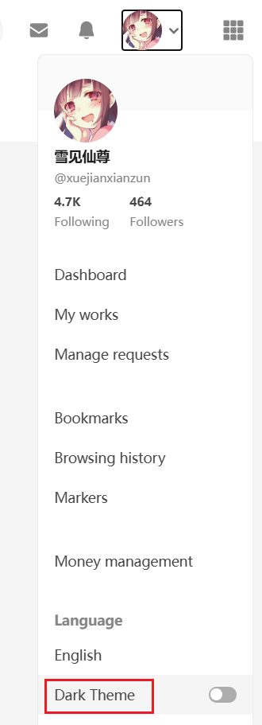
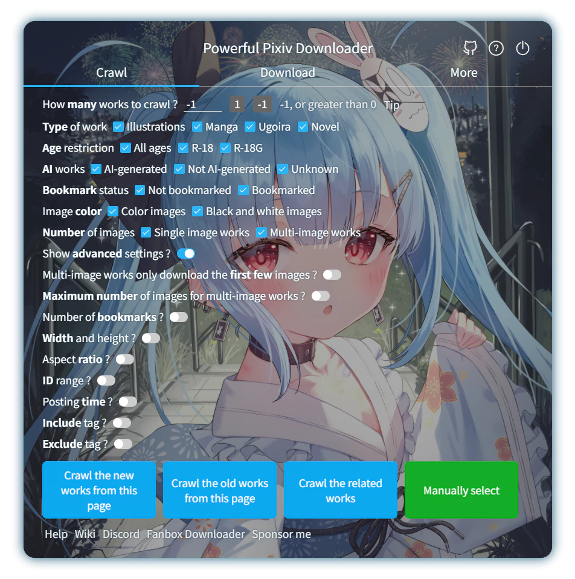
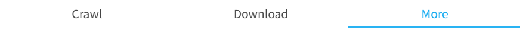
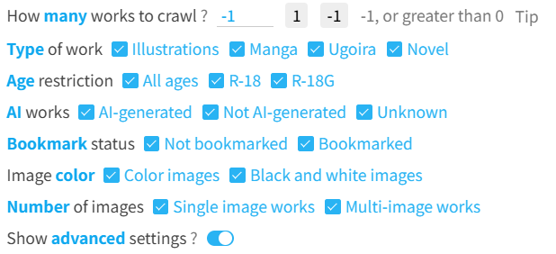
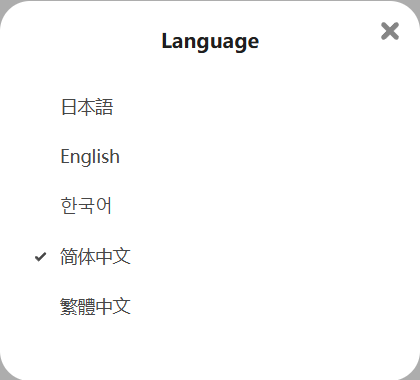

# Settings - More - Other

## Date and Time Format

    Date and time format
    <input type="text" name="dateFormat" class="setinput_style1 blue" style="width:250px;" value="YYYY-MM-DD">
    <button type="button" class="gray1 textButton showDateTip" data-xztext="_Tips">Tips</button>
    

The downloader's naming rules include markers that generate date and time strings:
- `{date}`
- `{upload_date}`
- `{task_date}`

Their default format is `YYYY-MM-DD` (e.g., `2021-04-30`), which includes only the date, not the time.

You can modify this setting to change their format.

For a time like `2021-04-30T06:40:08`, the available markers and their outputs are as follows (**case-sensitive**):

- `YYYY` 2021
- `YY` 21
- `MM` 04
- `MMM` Apr
- `MMMM` April
- `DD` 30
- `hh` 06
- `mm` 40
- `ss` 08

## Export Logs

    Export logs
    <input type="checkbox" name="exportLog" class="need_beautify checkbox_switch">
    
    
    Export timing
    <input type="radio" name="exportLogTiming" id="exportLogTiming1" class="need_beautify radio" value="crawlComplete">
    
    <label for="exportLogTiming1" data-xztext="_Crawl complete">Crawl complete</label>
    <input type="radio" name="exportLogTiming" id="exportLogTiming2" class="need_beautify radio" value="downloadComplete" checked="">
    
    <label for="exportLogTiming2" data-xztext="_Download complete" class="active">Download complete</label>
    
    Log type
    <input type="checkbox" name="exportLogNormal" id="exportLogNormal" class="need_beautify checkbox_common" checked="">
    
    <label for="exportLogNormal" data-xztext="_Normal">Normal</label>
    <input type="checkbox" name="exportLogError" id="exportLogError" class="need_beautify checkbox_common" checked="">
    
    <label for="exportLogError" data-xztext="_Error" class="active">Error</label>
    
    Exclude keywords&nbsp;
    <input type="text" name="exportLogExclude" class="setinput_style1 blue setinput_tag" value="404,429,500">
    
    

This feature exports the logs displayed at the top of the webpage to an HTML file.

?> HTML format is used because it supports colored text, preserving the log area's display effect.

?> This feature is a legacy addition. Previously, during a task (from crawling to download completion), if the downloader generated too many logs (e.g., over 300), it would clear earlier logs. Since users couldn't view cleared logs, this feature was added to back up logs, retaining the complete log. However, the downloader no longer clears logs during a task, so this feature is less necessary now.

Sub-options:

### Export Timing

- `Crawl complete`: Exports logs when crawling is complete. This includes only crawl-stage logs.
- `Download complete`: Exports logs when downloading is complete. This includes the full log.

### Log Type

- `Normal`: Exports normal-level logs (non-red logs).
- `Error`: Exports error-level logs (red logs).

Both options can be enabled simultaneously.

?> The downloader has four log levels, each with a different color. Only red logs are error logs.

### Exclude Keywords

You can specify multiple keywords to exclude.

If a log contains **any** of these keywords, the downloader will not export it, allowing you to filter out unwanted logs.

The default value `404,429,500` excludes some error messages.

## Color Theme

    Color theme
    <input type="radio" name="theme" id="theme1" class="need_beautify radio" value="auto" checked="">
    
    <label for="theme1" data-xztext="_Auto detect" class="active">Auto</label>
    <input type="radio" name="theme" id="theme2" class="need_beautify radio" value="white">
    
    <label for="theme2">White</label>
    <input type="radio" name="theme" id="theme3" class="need_beautify radio" value="dark">
    
    <label for="theme3" class="">Dark</label>
    

You can choose the downloader's color theme.

- `Auto`: Default. The downloader automatically detects Pixiv's color theme and uses the same.
- `White`: Light mode
- `Dark`: Dark mode

?> The downloader defaults to following Pixiv's color theme.

Pixiv's pages default to light mode. To use dark mode, click your Pixiv avatar and select "Dark mode" from the menu, as shown:

!> Some users may use [Dark Reader](https://chromewebstore.google.com/detail/dark-reader/eimadpbcbfnmbkopoojfekhnkhdbieeh), an extension that displays websites in dark mode. If you want dark mode on Pixiv, use Pixiv's built-in dark mode. If you keep Pixiv in its default light theme and use Dark Reader to display it in dark mode, the downloader's `Auto` option will still use light mode, which may not meet your expectations. You can manually set the downloader's color theme to `Dark`.

## Background Image

    
    Background image
     ? 
    
    <input type="checkbox" name="bgDisplay" class="need_beautify checkbox_switch">
    
    
    <button class="textButton gray1" type="button" id="selectBG" data-xztext="_Select file">Select file</button>
    <button class="textButton gray1" type="button" id="clearBG" data-xztext="_Clear">Clear</button>
    &nbsp;
    Alignment&nbsp;
    <input type="radio" name="bgPositionY" id="bgPosition1" class="need_beautify radio" value="center" checked="">
    
    <label for="bgPosition1" data-xztext="_Center" class="active">Center</label>
    <input type="radio" name="bgPositionY" id="bgPosition2" class="need_beautify radio" value="top">
    
    <label for="bgPosition2" data-xztext="_Top">Top</label>
    Opacity&nbsp;
    <input name="bgOpacity" type="range">
    
    

You can set a favorite image as the downloader's background image and adjust its transparency and alignment.

The effect is shown below:

?> The downloader does not include built-in background images, so you need to select one yourself. The background image in the example above is from [92215267](https://www.pixiv.net/artworks/92215267).

?> It's recommended to use a darker image as the background, as bright backgrounds can make text harder to read.

This setting includes buttons and options:

### Select File

Clicking this button opens a file selection dialog, allowing you to choose an image as the background.

?> Supported image formats: `.jpg, .jpeg, .png, .bmp, .webp`.

### Clear

Clicking this button removes the downloader's background image, restoring it to no background.

### Alignment

- `Center`: Aligns the center of the background image with the center of the settings panel. If the image's height exceeds the panel's height, the top and bottom may be cropped.
- `Top`: Default. Aligns the top of the background image with the top of the settings panel. If the image's height exceeds the panel's height, the bottom may be cropped.

You can adjust the alignment based on the specific image for a better display effect.

### Opacity

You can use this slider to adjust the background image's opacity. The default is `60%`.

?> There is a black background layer beneath the background image, and the image is semi-transparent by default, making it appear darker. This design ensures the text on the settings panel is readable. Adjusting opacity essentially controls how much the background image obscures the black background.

Increasing opacity makes the image closer to its original appearance; decreasing it darkens the image.

## Tab Switching Method

    
    Tab switching method
     ? 
    
    <input type="radio" name="switchTabBar" id="switchTabBar1" class="need_beautify radio" value="over" checked="">
    
    <label for="switchTabBar1" data-xztext="_Mouse hover" class="active">Mouse hover</label>
    <input type="radio" name="switchTabBar" id="switchTabBar2" class="need_beautify radio" value="click">
    
    <label for="switchTabBar2" data-xztext="_Mouse click">Mouse click</label>
    

"Tabs" refer to the three tabs at the top of the downloader: "Crawl," "Download," and "More":

- `Mouse hover`: Default. Moving the mouse pointer over a tab title immediately switches to that tab, which is convenient.
- `Mouse click`: Moving the mouse pointer over a tab title doesn't switch tabs; you need to click the title to switch. This is for users who find the hover method causes accidental switches.

## Highlight Keywords

    
    Highlight keywords
     ? 
    
    <input type="checkbox" name="boldKeywords" class="need_beautify checkbox_switch">
    
    

The downloader displays keywords in each setting item in blue and bold, for example:

This is because the downloader has many settings, and finding a specific one can take time. This feature improves efficiency.

## Language

    Language
    <input type="radio" name="userSetLang" id="userSetLang1" class="need_beautify radio" value="auto" checked="">
    
    <label for="userSetLang1" data-xztext="_Auto detect" class="active">Auto</label>
    <input type="radio" name="userSetLang" id="userSetLang2" class="need_beautify radio" value="zh-cn">
    
    <label for="userSetLang2">简体中文</label>
    <input type="radio" name="userSetLang" id="userSetLang3" class="need_beautify radio" value="zh-tw">
    
    <label for="userSetLang3">繁體中文</label>
    <input type="radio" name="userSetLang" id="userSetLang4" class="need_beautify radio" value="ja">
    
    <label for="userSetLang4">日本語</label>
    <input type="radio" name="userSetLang" id="userSetLang5" class="need_beautify radio" value="en">
    
    <label for="userSetLang5">English</label>
    <input type="radio" name="userSetLang" id="userSetLang6" class="need_beautify radio" value="ko">
    
    <label for="userSetLang6">한국어</label>
    <input type="radio" name="userSetLang" id="userSetLang7" class="need_beautify radio" value="ru">
    
    <label for="userSetLang7">Русский</label>
    

You can choose the language used by the downloader.

The default is `Auto`, where the downloader uses the same language as the Pixiv page. You can also manually select a language.

?> You can use a different language from the Pixiv page. This setting only affects the downloader, not Pixiv's pages.

--------

Tip: Pixiv offers multiple language options. Click your avatar and select Language settings to switch languages:

?> Pixiv previously offered a Russian language option, but it's no longer available. If you're a Russian user, you can manually select `Русский` in the downloader's Language settings to use Russian.

## Manage Settings

    
    Manage settings
     ? 
    
    <button class="textButton gray1" type="button" id="exportSettings" data-xztext="_Export settings">Export settings</button>
    <button class="textButton gray1" type="button" id="importSettings" data-xztext="_Import settings">Import settings</button>
    <button class="textButton gray1" type="button" id="resetSettings" data-xztext="_Reset settings">Reset settings</button>
    <button class="textButton gray1" type="button" id="resetHelpTip" data-xztext="_Show help again">Show help again</button>
    

This feature includes four buttons:

- `Export settings`: Exports the downloader's settings to a JSON file, saved to the browser's download directory.
- `Import settings`: Allows you to select a previously exported JSON file to restore settings.
- `Reset settings`: Restores all downloader options to their default values.
- `Show help again`: When using certain features (e.g., previewing images), the downloader shows one-time help messages. Click this button to view these help messages again.

Possible use cases:
- Save multiple presets. If you need different settings at different times, export them separately and load specific settings as needed.
- If you plan to remove and reinstall the extension, export settings to avoid losing them.
- Share exported settings with others.
- When submitting an issue, export settings and include them as an attachment.

?> The downloader's settings are stored in `browser.storage.local`. They are only cleared when the extension is removed. Clearing browser data does not affect the downloader's settings.