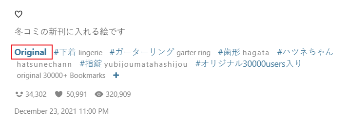
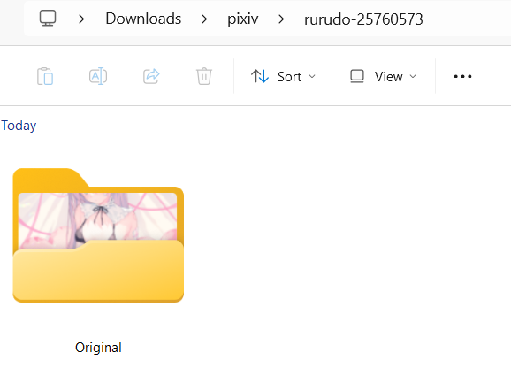

## Do not create folder

<div class="option settingsPanel_optionCard new" data-no="40" data-pin-bound="true" style="display: flex;">
  <a href="http://localhost:3000/#/en/Settings-Naming/Adjust-folders?flag=40" target="_blank" class="settingNameStyle" data-bind-click="true">
    <span data-xztext="_不创建文件夹">Do <span class="key">not create</span> folder</span>
  </a>
  <input type="checkbox" name="noFolderSwitch" class="need_beautify checkbox_switch">
  <span class="beautify_switch" tabindex="0"></span>
  <button type="button" class="gray1 textButton showMsgBtn" data-title="_不创建文件夹" data-msg="_不创建文件夹的帮助内容" data-xztext="_帮助">Help</button>
  <div class="subOptionWrap noGrow flexBasis100" data-show="noFolderSwitch" style="display: none;">
    <div class="optionLine">
      <input type="checkbox" name="noFolderWhenDownload1Image" id="noFolderWhenDownload1Image" class="need_beautify checkbox_common" checked="">
      <span class="beautify_checkbox" tabindex="0"></span>
      <label for="noFolderWhenDownload1Image" data-xztext="_从插画漫画里下载1张图片时" class="active">When downloading 1 image from an illustration or manga</label>
    </div>
    <div class="optionLine">
      <input type="checkbox" name="noFolderWhenDownloadMultipleImages" id="noFolderWhenDownloadMultipleImages" class="need_beautify checkbox_common">
      <span class="beautify_checkbox" tabindex="0"></span>
      <label for="noFolderWhenDownloadMultipleImages" data-xztext="_从插画漫画里下载多张图片时">When downloading multiple images from an illustration or manga</label>
    </div>
    <div class="optionLine">
      <input type="checkbox" name="noFolderWhenUgoira" id="noFolderWhenUgoira" class="need_beautify checkbox_common" checked="">
      <span class="beautify_checkbox" tabindex="0"></span>
      <label for="noFolderWhenUgoira" data-xztext="_动图" class="active">Ugoira</label>
    </div>
    <div class="optionLine">
      <input type="checkbox" name="noFolderWhenNovel" id="noFolderWhenNovel" class="need_beautify checkbox_common">
      <span class="beautify_checkbox" tabindex="0"></span>
      <label for="noFolderWhenNovel" data-xztext="_小说">Novels</label>
    </div>
  </div>
<span class="settingsPanel_newBadge" aria-hidden="true">
    <svg class="icon settingsPanel_newBadgeIcon" aria-hidden="true">
      <use xlink:href="#new"></use>
    </svg>
    </span></div>

## Add a folder layer for multi-image works

<div class="option settingsPanel_optionCard new" data-no="41" data-pin-bound="true" style="display: flex;">
  <a href="http://localhost:3000/#/en/Settings-Naming/Adjust-folders?flag=41" target="_blank" class="settingNameStyle" data-xztext="_为多图作品添加一层文件夹" data-bind-click="true">Add a folder layer for <span class="key">multi-image</span> works</a>
  <input type="checkbox" name="folderForMultiImageWorksSwitch" class="need_beautify checkbox_switch">
  <span class="beautify_switch" tabindex="0"></span>
  <button type="button" class="gray1 textButton showMsgBtn" data-title="_为多图作品添加一层文件夹" data-msg="_为多图作品添加一层文件夹的帮助" data-xztext="_帮助">Help</button>
  <div class="subOptionWrap flexBasis100" data-show="folderForMultiImageWorksSwitch" style="display: none;">
    <div class="optionLine">
      <label for="folderForMultiImageWorksImageNumber" class="pr0" data-xztext="_当作品里的图片大于指定数量时启用">Enable when the number of images in the work exceeds the specified number: </label>
      <input class="setinput_style blue w50 noGrow" type="text" name="folderForMultiImageWorksImageNumber" id="folderForMultiImageWorksImageNumber" value="1">
    </div>
    <div class="optionLine">
      <label for="folderForMultiImageWorksRule" class="pr0" data-xztext="_要添加的这层文件夹的规则">Rule for the folder layer to add: </label>
      <input class="setinput_style blue w150 grow" type="text" name="folderForMultiImageWorksRule" id="folderForMultiImageWorksRule" value="{pid}" style="min-width: 100px">
    </div>
  </div>
<span class="settingsPanel_newBadge" aria-hidden="true">
    <svg class="icon settingsPanel_newBadgeIcon" aria-hidden="true">
      <use xlink:href="#new"></use>
    </svg>
    </span></div>


        &gt;
        <input class="setinput_style1 blue w150 noGrow" type="text" name="folderForMultiImageWorksImageNumber" id="folderForMultiImageWorksImageNumber" value="1">
        <label for="folderForMultiImageWorksRule" data-xztext="_文件夹规则">Folder rule</label>
        <input class="setinput_style1 blue w150 grow" type="text" name="folderForMultiImageWorksRule" id="folderForMultiImageWorksRule" value="{pid}">
      </span>
    </div>

The downloader can add a separate folder layer for multi-image works. Click the `Help` button for this setting in the downloader panel to view the detailed explanation.

For example, work [79239641](https://www.pixiv.net/artworks/79239641 ':target=_blank') has 3 images. After enabling this feature, you can put those images into a folder named with the work ID, like this:

```
79239641/
  |---- 79239641_p0.jpg
  |---- 79239641_p1.jpg
  |---- 79239641_p2.jpg
```

**Sub-options:**

- `Image count`: The downloader adds the configured folder only when the number of images in the work is greater than this value. The default is 1, so it applies to all multi-image works. You can set other values if needed.
- `Folder rule`: The name of the folder added for multi-image works. Like the regular naming rule, you can use tags and custom text here, and you can also use `/` to create nested folders. The default value is `{pid}`, which uses the work ID without the page number.

After that, you also need to modify the `Naming rule for image works` setting and insert `/{multi_image_folder}/` where needed to add the folder layer. Example: `pixiv/{user}-{user_id}/{multi_image_folder}/{id}-{title}`

You need to insert this tag manually so you can decide where this folder layer should appear. Usually it is placed before the filename, but some users may want it in a higher-level folder or even inside the filename.

**Tips:**

- If you want to use the work ID in the folder name, do not use `{id}`. Use `{pid}` instead. In a multi-image work, each image has a different `{id}`, so using `{id}` would create a separate folder for each image.
- Although the setting name says `add one folder layer`, you can actually configure multiple nested folders here.
- `{multi_image_folder}` itself does not create a folder unless your folder rule already ends with a slash `/`. So in most cases you need to add `/` after it. But this can also be useful: if you do not want to create a folder and only want to mark multi-image works in the filename, you can use it in the filename directly. For example, if the folder rule is `multi-image` and you add it to the filename like `pixiv/{user}-{user_id}/{id}-{multi_image_folder}`, the filename will include the `multi-image` marker.

## Add a folder layer for R-18(G) works

<div class="option settingsPanel_optionCard" data-no="42" data-pin-bound="true" style="display: flex;">
  <a href="http://localhost:3000/#/en/Settings-Naming/Adjust-folders?flag=42" target="_blank" class="settingNameStyle" data-xztext="_为r18作品添加一层文件夹" data-bind-click="true">Add a folder layer for <span class="key">R-18(G)</span> works</a>
  <input type="checkbox" name="r18Folder" class="need_beautify checkbox_switch">
  <span class="beautify_switch" tabindex="0"></span>
  <button type="button" class="gray1 textButton showMsgBtn" data-title="_为r18作品添加一层文件夹" data-msg="_为r18作品添加一层文件夹的帮助" data-xztext="_帮助">Help</button>
  <div class="subOptionWrap flexBasis100" data-show="r18Folder" style="display: none;">
    <label for="r18FolderName" class="pr0" data-xztext="_要添加的这层文件夹的规则">Rule for the folder layer to add: </label>
    <input type="text" name="r18FolderName" id="r18FolderName" class="setinput_style blue grow" value="[R-18&amp;R-18G]" style="min-width: 100px">
  </div>
</div>


If you want to put R-18(G) works into a separate folder layer, you can enable this setting. Click the `Help` button for this setting in the downloader panel to view the detailed explanation.

To make this setting take effect, you also need to modify the naming rule and use `{r18_g_folder}` to represent the folder rule configured here. When downloading an R-18(G) work, the downloader replaces `{r18_g_folder}` with the folder rule set here.

## Create a folder with the first matched tag

<div class="option settingsPanel_optionCard" data-no="43" data-pin-bound="true" style="display: flex;">
  <a href="http://localhost:3000/#/en/Settings-Naming/Adjust-folders?flag=43" target="_blank" class="settingNameStyle" data-bind-click="true">
    <span data-xztext="_使用第一个匹配的标签建立文件夹">Create a folder with the first matched <span class="key">tag</span></span>
  </a>
  <input type="checkbox" name="createFolderByTag" class="need_beautify checkbox_switch">
  <span class="beautify_switch" tabindex="0"></span>
  <button type="button" class="gray1 textButton showMsgBtn" data-title="_使用第一个匹配的标签建立文件夹" data-msg="_使用第一个匹配的标签建立文件夹的说明" data-xztext="_帮助">Help</button>
  <div class="subOptionWrap namingTipArea flexBasis100" data-show="createFolderByTag" style="display: none;">
    <span class="name" data-bind-copy="true">{match_tag_folder1}</span>
    <textarea class="centerPanelTextArea beautify_scrollbar" name="createFolderTagList" rows="1" placeholder="tag1,tag2,tag3"></textarea>
    <span class="name" data-bind-copy="true">{match_tag_folder2}</span>
    <textarea class="centerPanelTextArea beautify_scrollbar" name="createFolderTagList2" rows="1" placeholder="tag1,tag2,tag3"></textarea>
  </div>
</div>


If you want to create a special folder layer when a work contains certain tags, you can enable this setting. Click the `Help` button for this setting in the downloader panel to view the detailed explanation.

For example, work [94964157](https://www.pixiv.net/artworks/94964157 ':target=_blank') contains the `Original` tag:



If you include `Original` in this setting, the downloader will create an `Original` folder for this work:



----------

After enabling this setting, you can configure two tag lists.

When downloading each file, the downloader checks whether the work's tags contain **any** of the tags you configured here. Once it finds a matching tag, it uses that tag to create a folder.

This setting lets you categorize files with specific tags separately.


