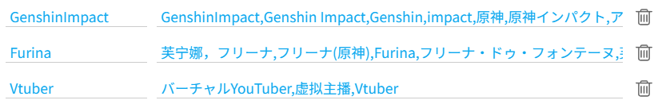
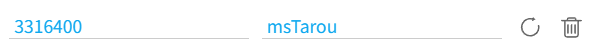

## Tag alias

  <a href="http://localhost:3000/#/en/Settings-Naming/Aliases?flag=44" target="_blank" class="settingNameStyle" data-bind-click="true">
    Tag alias
  </a>
  <label for="useTagAliasForTagsNamingRule" data-xztext="_应用到文件名里的tags系列标记">{tags} series tokens applied to the file name</label>
  <input type="checkbox" name="useTagAliasForTagsNamingRule" id="useTagAliasForTagsNamingRule" class="need_beautify checkbox_switch">
  
  <button type="button" class="gray1 textButton showMsgBtn" data-title="_标签别名" data-msg="_标签别名的帮助" data-xztext="_帮助">Help</button>
  <slot data-name="setTagAliasSlot">
    
    0
      <button type="button" class="textButton expand" data-xztext="_收起">Collapse</button>
      <button type="button" class="textButton showAdd" data-xztext="_添加">Add</button>
    
    

      

        

          Alias
          <input type="text" class="setinput_style blue addUidInput w100">
        

        

          Tag list
          <input type="text" class="setinput_style blue addNameInput w100" placeholder="tag1,tag2,tag3">
        

        

          <button type="button" class="textButton add" data-xztitle="_添加" title="Add">
            <svg class="icon" aria-hidden="true">
              <use xlink:href="#yes_submit"></use>
            </svg>
          </button>
          <button type="button" class="textButton cancel" data-xztitle="_取消" title="Cancel">
            <svg class="icon" aria-hidden="true">
              <use xlink:href="#close_cancel"></use>
            </svg>
          </button>
        

      

    

    

  </slot>

If a tag has multiple variants, you can set a custom alias for them. Example:

This alias can be used both for `Create a folder with the first matched tag` and for the `{tags}`-related naming tags.

There is a `Help` button on the right side of this setting. Click it to view the detailed instructions. In the Wiki it has no effect.

## Customize username

  <a href="http://localhost:3000/#/en/Settings-Naming/Aliases?flag=45" target="_blank" class="has_tip settingNameStyle" data-xztip="_自定义用户名的说明" data-tip="Some users may change their name. If you want to use his original name, you can manually set his name here. &lt;br&gt;
    You can also set aliases for users. &lt;br&gt;
    When you use the {user} tag in the naming rule, the downloader will give priority to the name you set." data-bind-click="true">
    Customize username
     ? 
  </a>
  <slot data-name="setUserNameSlot">
    
    0
      <button type="button" class="textButton expand" data-xztext="_收起">Collapse</button>
      <button type="button" class="textButton showAdd" data-xztext="_添加">Add</button>
    
    

      

        

          User ID (Number)
          <input type="text" class="setinput_style blue addUidInput" data-xzplaceholder="_必须是数字" placeholder="Number">
        

        

          User name
          <input type="text" class="setinput_style blue addNameInput">
        

        

          <button type="button" class="textButton add" data-xztitle="_添加" title="Add">
            <svg class="icon" aria-hidden="true">
              <use xlink:href="#yes_submit"></use>
            </svg>
          </button>
          <button type="button" class="textButton cancel" data-xztitle="_取消" title="Cancel">
            <svg class="icon" aria-hidden="true">
              <use xlink:href="#close_cancel"></use>
            </svg>
          </button>
        

      

    

    

  </slot>

You can add a user's ID and set a custom name for them here. This affects the `{user}` naming tag.

For example, the username for https://www.pixiv.net/users/3316400 is `MだSたろう`. If you want to set a custom name, you can enter the user ID as `3316400` and the username as `msTarou`, then save.

When downloading their works, the `{user}` tag will ignore the original name and output the custom name `msTarou`.

After adding a rule, the downloader will display it like this:

If needed, you can modify the settings here (e.g., change the username) and click the refresh button on the right to update the rule. You can also delete the rule.

---

**Use Case 1:** Prevent issues with users changing names.

Some users may frequently change their names. If you want to use their original name, you can set it manually here.

A common case is usernames with an @ symbol, such as:

- Anmi@画集発売中
- 奥馬@skeb募集中
- さしみなす@依頼募集中

While the [Remove @ and subsequent characters from username](/en/Settings-More-Naming?id=remove-and-subsequent-characters-in-username) feature can address this, some users' names may not use @, for example:

- いの字/inoji
- 焔すばる★２日目 東C17a
- 送り萬都 🔞仕事募集中
- しりー＊C99木曜東A21b
- ショーンC99木東ユ40b
- オムレットマト西ぬ31b

You can set a fixed name for them here.

---

**Use Case 2:** Set aliases or nicknames for users.

For example, if a user's name is in Japanese but you don't input Japanese and it's inconvenient to search on your device, you can set a English alias (or another language you can use) for easier searching.

If a user's name is hard to remember, you can also set an easy-to-remember alias.

