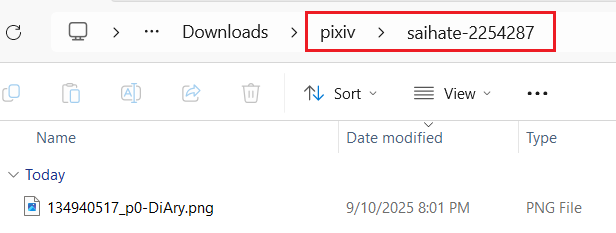
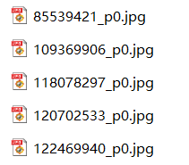
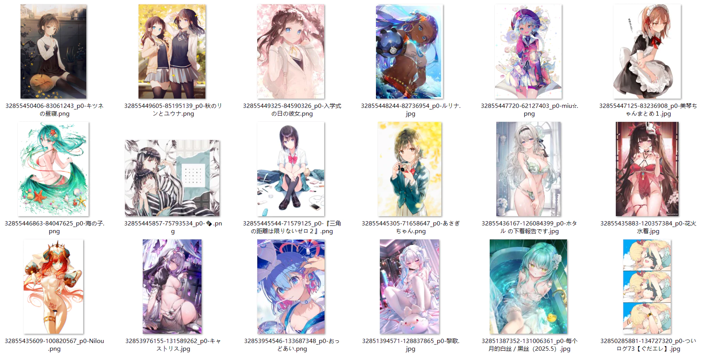
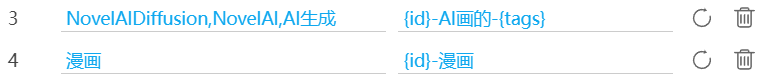

## Naming rule for image works

<div class="option settingsPanel_optionCard" data-no="32" data-pin-bound="true" style="display: flex;">
  <span class="fileNameRuleLine1">
    <a href="/#/en/Settings-Naming/Folder-and-file-names?flag=32" target="_blank" class="settingNameStyle optionName" data-xztext="_图像作品的命名规则" data-bind-click="true"><span class="key">Naming</span> rule for image works</a>
    <span class="fileNameRuleBtnsArea">
      <slot data-name="saveNamingRuleForArtwork"><div class="saveNamingRuleWrap theme-white">
    <button class="nameSave textButton has_tip" type="button" data-xztip="_保存命名规则提示" data-xztext="_保存" data-tip="Save naming rule, up to 20">Save</button>
    <button class="nameLoad textButton" type="button" data-xztext="_加载">Load</button>
  </div></slot>
      <button type="button" class="showFileNameTip textButton toggleArea" data-toggle-target="#fileNameTip" data-for-no="32" data-xztext="_提示">Tip</button>
      &nbsp;
      <select name="fileNameSelect" class="beautify_scrollbar">
        <option value="default">…</option>
        <option value="{id}">{id}</option>
<option value="{pid}">{pid}</option>
<option value="{p}">{p}</option>
<option value="{user}">{user}</option>
<option value="{user_id}">{user_id}</option>
<option value="{title}">{title}</option>
<option value="{page_title}">{page_title}</option>
<option value="{tags}">{tags}</option>
<option value="{tags_translate}">{tags_translate}</option>
<option value="{tags_transl_only}">{tags_transl_only}</option>
<option value="{page_tag}">{page_tag}</option>
<option value="{type}">{type}</option>
<option value="{type_illust}">{type_illust}</option>
<option value="{type_manga}">{type_manga}</option>
<option value="{type_ugoira}">{type_ugoira}</option>
<option value="{type_novel}">{type_novel}</option>
<option value="{AI}">{AI}</option>
<option value="{age}">{age}</option>
<option value="{age_r}">{age_r}</option>
<option value="{like}">{like}</option>
<option value="{bmk}">{bmk}</option>
<option value="{bmk_1000}">{bmk_1000}</option>
<option value="{bmk_id}">{bmk_id}</option>
<option value="{view}">{view}</option>
<option value="{rank}">{rank}</option>
<option value="{date}">{date}</option>
<option value="{upload_date}">{upload_date}</option>
<option value="{task_date}">{task_date}</option>
<option value="{px}">{px}</option>
<option value="{char_count}">{char_count}</option>
<option value="{series_title}">{series_title}</option>
<option value="{series_order}">{series_order}</option>
<option value="{series_id}">{series_id}</option>
<option value="{sl}">{sl}</option>
<option value="{multi_image_folder}">{multi_image_folder}</option>
<option value="{r18_g_folder}">{r18_g_folder}</option>
<option value="{match_tag_folder1}">{match_tag_folder1}</option>
<option value="{match_tag_folder2}">{match_tag_folder2}</option>
      </select>
    </span>
  </span>
  <ul class="namingRuleList artwork"><li>
      <span class="rule">pixiv/{user}-{user_id}/{id}-{title}</span>
      <button class="delete textButton" type="button" data-index="0">×</button>
    </li><li>
      <span class="rule">pixiv/书签-{task_date}/{bmk_id}-{id}-{title}</span>
      <button class="delete textButton" type="button" data-index="1">×</button>
    </li></ul>
  <textarea class="centerPanelTextArea beautify_scrollbar grow fileNameRule" name="userSetName" rows="1" placeholder="pixiv/{user}-{user_id}/{id}-{title}">pixiv/{user}-{user_id}/{id}-{title}</textarea>
  <p class="tip fileNameTip namingTipArea" id="fileNameTip">
    <span data-xztext="_命名标记的提示">The naming rule sets the names of folders and files. A naming rule can consist of 3 parts:<br>
- Special tokens, such as <span class="blue name" data-bind-copy="true">{id}</span>, <span class="blue name" data-bind-copy="true">{user}</span>, <span class="blue name" data-bind-copy="true">{title}</span>, etc. Each token may output some characters. The meaning of each token is described below.<br>
- A slash <span class="blue name" data-bind-copy="true">/</span> is used to create folders. The content before each slash is the folder name, and the part after the last slash is the file name. You can add multiple levels of folders and organize the folder structure freely.<br>
- Regular characters and symbols. You can add regular characters between tokens, for example: <span class="blue">pixiv/{id}-title {title}-user {user}</span><br>
<br>
Notes on creating folders:<br>
- If you want to create a folder for each work, add a folder level before the file name. Using the work ID <span class="blue name" data-bind-copy="true">{pid}</span> as the folder name is a common choice, for example: <span class="blue">pixiv/{user}/{pid}/{id}</span>. Of course, you can use other tokens based on your needs.<br>
- If you want to put AI-generated works in a separate folder, use the <span class="blue name" data-bind-copy="true">{AI}</span> token, for example: <span class="blue">pixiv/{user}/{AI}/{id}</span><br>
- If you want to create folders by work type, use the <span class="blue name" data-bind-copy="true">{type}</span> token, for example: <span class="blue">pixiv/{user}/{type}/{id}</span><br>
<br>
Tips:<br>
- * Some tokens are not always available and may be empty strings — the downloader will ignore them.<br>
- If you want to use the work's ID in a folder name, use <span class="blue name" data-bind-copy="true">{pid}</span> instead of <span class="blue name" data-bind-copy="true">{id}</span>. Since each image has a different ID, using <span class="blue name" data-bind-copy="true">{id}</span> would create a separate folder for each image.<br>
- To prevent duplicate file names, the file name must contain <span class="blue name" data-bind-copy="true">{id}</span>. If you don't want to use <span class="blue name" data-bind-copy="true">{id}</span>, you must include both <span class="blue name" data-bind-copy="true">{pid}</span> and <span class="blue name" data-bind-copy="true">{p}</span>.<br>
<br>
List of naming tokens:<br>
Tip: Click a token name to copy it.<br></span>
    <span class="blue name" data-bind-copy="true">{id}</span>
      <span data-xztext="_命名标记id">The ID of each file. Image files include a sequence number, such as <span class="blue">85633671_p0</span>; novel files do not have a sequence number. Note: this is not the work ID, but the file ID. If a work contains multiple images, the {id} for each image is different, for example <span class="blue">85633671_p1</span> and <span class="blue">85633671_p2</span>.</span>
      <br>
<span class="blue name" data-bind-copy="true">{pid}</span>
      <span data-xztext="_命名标记pid">The numeric ID of the work, excluding the sequence number, for example <span class="blue">85633671</span>.</span>
      <br>
* <span class="blue name" data-bind-copy="true">{p}</span>
      <span data-xztext="_命名标记p">The sequence number of the image within the work, for example <span class="blue">0</span>, <span class="blue">1</span>, <span class="blue">2</span> ... Each work will recount. Novel works do not have this property, and the downloader will ignore it.</span>
      <br>
<span class="blue name" data-bind-copy="true">{user}</span>
      <span data-xztext="_命名标记user">User name</span>
      <br>
<span class="blue name" data-bind-copy="true">{user_id}</span>
      <span data-xztext="_用户id">User ID (Number)</span>
      <br>
<span class="blue name" data-bind-copy="true">{title}</span>
      <span data-xztext="_命名标记title">Works title</span>
      <br>
<span class="blue name" data-bind-copy="true">{page_title}</span>
      <span data-xztext="_命名标记page_title">Page title when starting the scrape</span>
      <br>
<span class="blue name" data-bind-copy="true">{tags}</span>
      <span data-xztext="_命名标记tags">The tags of the work</span>
      <br>
<span class="blue name" data-bind-copy="true">{tags_translate}</span>
      <span data-xztext="_命名标记tags_trans">The tag list of the work, without translated tags</span>
      <br>
<span class="blue name" data-bind-copy="true">{tags_transl_only}</span>
      <span data-xztext="_命名标记tags_transl_only">Translated tags</span>
      <br>
* <span class="blue name" data-bind-copy="true">{page_tag}</span>
      <span data-xztext="_文件夹标记page_tag">If the works on the page belong to the same tag, the downloader will output this tag; otherwise, ignore it. It usually has a value when you are on these pages: searching for a certain tag, viewing works under a certain tag category on the user page, viewing works under a certain tag category in your own bookmarks.</span>
      <br>
<span class="blue name" data-bind-copy="true">{type}</span>
      <span data-xztext="_命名标记type">Output the work type. Illustration outputs <span class="blue">Illustration</span>, manga outputs <span class="blue">Manga</span>, Ugoira outputs <span class="blue">Ugoira</span>, novel outputs <span class="blue">Novel</span>.</span>
      <br>
* <span class="blue name" data-bind-copy="true">{type_illust}</span>
      <span data-xztext="_命名标记type_illust">Output <span class="blue">Illustration</span> only when the work is an illustration.</span>
      <br>
* <span class="blue name" data-bind-copy="true">{type_manga}</span>
      <span data-xztext="_命名标记type_manga">Output <span class="blue">Manga</span> only when the work is a manga.</span>
      <br>
* <span class="blue name" data-bind-copy="true">{type_ugoira}</span>
      <span data-xztext="_命名标记type_ugoira">Output <span class="blue">Ugoira</span> only when the work is a Ugoira.</span>
      <br>
* <span class="blue name" data-bind-copy="true">{type_novel}</span>
      <span data-xztext="_命名标记type_novel">Output <span class="blue">Novel</span> only when the work is a novel.</span>
      <br>
* <span class="blue name" data-bind-copy="true">{AI}</span>
      <span data-xztext="_命名标记AI">If the work is AI-generated, output <span class="blue">AI</span>; otherwise, ignore it.</span>
      <br>
<span class="blue name" data-bind-copy="true">{age}</span>
      <span data-xztext="_命名标记age">The age restriction of the work is divided into: <span class="blue">All Ages</span>, <span class="blue">R-18</span>, <span class="blue">R-18G</span></span>
      <br>
* <span class="blue name" data-bind-copy="true">{age_r}</span>
      <span data-xztext="_命名标记age_r">Output its age restriction only when the work is restricted, divided into: <span class="blue">R-18</span>, <span class="blue">R-18G</span>; otherwise, ignore it.</span>
      <br>
<span class="blue name" data-bind-copy="true">{like}</span>
      <span data-xztext="_命名标记like">Like count.</span>
      <br>
<span class="blue name" data-bind-copy="true">{bmk}</span>
      <span data-xztext="_命名标记bmk">Bookmark count, bookmarks number of works.</span>
      <br>
<span class="blue name" data-bind-copy="true">{bmk_1000}</span>
      <span data-xztext="_命名标记bmk_1000">Simplified number of bookmark, e.g. <span class="blue">0+</span>、<span class="blue">1000+</span>、<span class="blue">2000+</span>、<span class="blue">3000+</span> ……</span>
      <br>
<span class="blue name" data-bind-copy="true">{bmk_id}</span>
      <span data-xztext="_命名标记bmk_id">Bookmark ID. Every work in your bookmarks will have a Bookmark ID. The later the bookmark is added, the larger the Bookmark ID. When you download your bookmarks, you can use {bmk_id} as a sorting basis.</span>
      <br>
<span class="blue name" data-bind-copy="true">{view}</span>
      <span data-xztext="_命名标记view">View count.</span>
      <br>
* <span class="blue name" data-bind-copy="true">{rank}</span>
      <span data-xztext="_命名标记rank">The ranking of the work in the leaderboard. Such as <span class="blue">#1</span>, <span class="blue">#2</span> ... Can only be used on the leaderboard page, and will be ignored on other pages.</span>
      <br>
<span class="blue name" data-bind-copy="true">{date}</span>
      <span data-xztext="_命名标记date">The time the creation of the work. Such as <span class="blue">2019-08-29</span></span>
      <br>
<span class="blue name" data-bind-copy="true">{upload_date}</span>
      <span data-xztext="_命名标记upload_date">The time when the content of the work was last modified. Such as <span class="blue">2019-08-30</span>.</span>
      <br>
<span class="blue name" data-bind-copy="true">{task_date}</span>
      <span data-xztext="_命名标记taskDate">The time when the task was crawl completed. For example: <span class="blue">2020-10-21</span></span>
      <br>
* <span class="blue name" data-bind-copy="true">{px}</span>
      <span data-xztext="_命名标记px">The width and height of the original image. For example: <span class="blue">600x900</span>. Novel works do not have this property, and the downloader will ignore it.</span>
      <br>
* <span class="blue name" data-bind-copy="true">{char_count}</span>
      <span data-xztext="_命名标记char_count">The number of characters or words in the novel (depending on the language of the novel), it is a number. It will be ignored when the work is not a novel.</span>
      <br>
* <span class="blue name" data-bind-copy="true">{series_title}</span>
      <span data-xztext="_命名标记seriesTitle">Series title. Available when the work belongs to a series.</span>
      <br>
* <span class="blue name" data-bind-copy="true">{series_order}</span>
      <span data-xztext="_命名标记seriesOrder">The number of the work in the series, such as <span class="blue">#1</span> <span class="blue">#2</span>. Available when the work belongs to a series.</span>
      <br>
* <span class="blue name" data-bind-copy="true">{series_id}</span>
      <span data-xztext="_命名标记seriesId">Series ID, it is a number. Available when the work belongs to a series.</span>
      <br>
* <span class="blue name" data-bind-copy="true">{sl}</span>
      <span data-xztext="_命名标记_sl">The sanity_level property of image works has a value of one of the following numbers: <span class="blue">0</span>, <span class="blue">2</span>, <span class="blue">4</span>, <span class="blue">6</span>. Novel works do not have this property and will ignore this marker.</span>
      <br>
* <span class="blue name" data-bind-copy="true">{multi_image_folder}</span>
      <span data-xztext="_命名标记_multi_image_folder">It represents the folder rule set in "Add a folder layer for multi-image works". If you have enabled this setting, the downloader will replace it with the folder rule you set when creating the filename for multi-image works. Non-multi-image works will ignore this marker.</span>
      <br>
* <span class="blue name" data-bind-copy="true">{r18_g_folder}</span>
      <span data-xztext="_命名标记_r18_g_folder">It represents the folder rule set in "Add a folder layer for R-18(G) works". If you have enabled this setting, the downloader will replace it with the folder rule you set when generating the filename for R-18(G) works. Non R-18(G) works will ignore this marker.</span>
      <br>
* <span class="blue name" data-bind-copy="true">{match_tag_folder1}</span>
      <span data-xztext="_命名标记_match_tag_folder1">This is the match result of the first tag list in "Create folder using the first matching tag". If you have enabled this setting and a matching tag is found, it will output that tag; otherwise it will be ignored.</span>
      <br>
* <span class="blue name" data-bind-copy="true">{match_tag_folder2}</span>
      <span data-xztext="_命名标记_match_tag_folder2">This is the match result of the second tag list in "Create folder using the first matching tag". If you have enabled this setting and a matching tag is found, it will output that tag; otherwise it will be ignored.</span>
      <br>
  </p>
</div>

This is a very important feature, allowing you to set the **filename** saved by the downloader and **create folders** for organization.

When saving files, the downloader replaces tags in the naming rule to generate filenames. For example, `{id}` is replaced with the work ID, such as `75863159_p0`.

?> You can modify the naming rule as needed. Only `{id}` is mandatory, as it is the unique identifier for each file.

**Some function buttons:**

The `Save` button saves the current naming rule, and the `Load` button displays previously saved naming rules. With these two buttons, you can save multiple commonly used naming rules and switch between them conveniently.

The `Tip` button lets you view all tags and their descriptions. However, this is a Wiki, so it has no effect here.

The dropdown list displays all tags. Clicking one inserts it at the cursor position. However, this is a Wiki, so it has no effect here.

### Creating Folders

You can use a slash `/` to create folders. If needed, you can use multiple slashes `/` to create nested folders.

The default naming rule `pixiv/{user}-{user_id}/{id}-{title}` creates two levels of folders:
- First, a `pixiv` folder is created.
- Inside it, a folder with the username and user ID is created.
- Inside that, the work is saved with a filename consisting of the work ID and title.

Example effect:



?> The `/` is not mandatory. If you don't want to create folders, you can omit the `/`. For example, setting the naming rule to `{id}` saves files directly to the browser's download directory without creating subfolders.

### Additional Notes

- You can use multiple tags; it's recommended to add separators between tags, such as `{id}-{tags}-{user}`, to avoid tag content blending together. There's no fixed requirement for separators; use what you prefer.
- Besides preset tags, you can input custom text, e.g., `Title {title} Tags {tags}`. Non-preset text will be retained as is.
- There's no suffix tag because the downloader automatically adds the file extension.
- If the generated filename contains special characters invalid for filenames, they are replaced with similar full-width symbols. For example, a tag containing a slash `/` cannot be used in filenames, so the downloader replaces it with a full-width `／`.
- If you use `{tags_translate}`, there's no need to use `{tags}`, as the former includes the latter. Translated content depends on your Pixiv language settings. For example, if your Pixiv interface is in Chinese, tag translations are typically in Chinese.
- `{tags_transl_only}` saves only translated tags, not original Japanese tags. If a tag has no translation, the original Japanese tag is saved.
- Filenames must include a **unique identifier** to prevent duplicates, which could cause files to overwrite each other or trigger a save-as dialog.
- The default naming rule's `{id}` is the unique identifier. Some users may want to replace `{id}` with `{pid}` and `{p}`. This is possible, but both must be used together, not individually. This is because multi-image works have multiple images with the same `{pid}`, and `{p}` is needed to differentiate them.
- `{bmk_1000}` doesn't show the exact bookmark count but displays an integer in units of 1000 with a `+` (below 1000 displays as `0+`). This makes bookmark counts less cluttered.
- When saving files, if a file with the same name exists, the downloader will overwrite it rather than appending a number. Most PC browsers do this, but Edge Canary on Android may append a number instead.
- Filenames may exceed the operating system's length limit, often due to tags like `{tags}`. If a filename is too long, the file may not save automatically, and the browser may show a save-as dialog. To address this, enable the "Filename Length Limit" option under the "More" tab in the "Naming" category.
- When a filename is too long, some browsers may truncate the excess to save the file. This varies by case. Chrome on Windows does this, but browsers on Linux or Android may not. Saving to remote locations (e.g., network drives) may also prevent truncation, even in Chrome.

### Some Examples

#### Remove the p tag in {id}

`{id}` includes the page number, for example `44920385_p0`. If you want to remove `_p`, you can replace `{id}` with `{pid} {p}`, which will generate `44920385 0`.

?>Note: If you want to replace `{id}`, the naming rule must include both `{pid}` and `{p}` to prevent duplicate filenames.

#### Remove the sequence number from the first image of each work

If you think the first image doesn't need a sequence number and want to change `44920385_p0` to `44920385`, you can enable the [The first image without a serial number](/en/Settings-More-Naming?id=the-first-image-without-a-serial-number) option.

#### Naming rules used by others

Here are some naming rules used by users, you can refer to:

```
{user}/{title}{id}
{user}/{title}{date}/{id}
{user_id}_{user}/{type}/{date} {title}/{id}
{user_id}-{user}/{title}-{id}
{user} (id={user_id})/{id}
{user} {user_id}/{id} {title} {upload_date}
{user}_{date}_{title}_{id}
{id}_{title}_{user_id}_{user}
{id}{user}-{user_id}-{title}{tags}{tags_translate}{page_tag}-{like}-{bmk}-{upload_date}
```

**Note:** The last naming rule is not a good idea because it easily generates filenames that are too long (more than 256 characters), leading to truncation, so the actual filename may only have the first half.

Some works have a large number of tags, so using `{tags}`, `{tags_translate}`, `{tags_transl_only}` in the filename may lead to the filename being too long. If you want to use these naming tags, it is recommended to place them at the end of the filename to avoid truncation of content from other naming tags.

### Sorting with Naming Tags

Some tags have predictable patterns. Using them as the **first part** of the filename allows sorting in the file explorer.

#### Tags Reflecting Time Order

On most pages, works are sorted by work ID in descending order. Later-posted works have larger IDs and appear first.

`{id}` (work ID) is incremental. Using `{id}` at the start of the filename and sorting files by ID in descending order aligns with the webpage's order. For example:



`{date}` (posting time) has a similar effect.

--------

`{bmk_id}` reflects the order in which you bookmarked works. Using it at the start, e.g., `{bmk_id}-{id}`, and sorting in descending order aligns files with your bookmark order.

For example, this is the webpage order:


This is the effect of sorting with `{bmk_id}`:



#### Tags Reflecting Quantity

Some tags are numeric, e.g., `{like}`, `{view}`, `{bmk}`, `{bmk_1000}`, `{rank}`.

Example: Sorting works by `{bmk}` (bookmark count) in descending order prioritizes high-quality works:


Example: When downloading from a leaderboard page, sort by `{rank}`:


## Naming rule for novels

<div class="option settingsPanel_optionCard new" data-no="33" data-pin-bound="true" style="display: flex;">
  <span class="fileNameRuleLine1">
    <a href="/#/en/Settings-Naming/Folder-and-file-names?flag=33" target="_blank" class="settingNameStyle optionName" data-xztext="_小说的命名规则" data-bind-click="true"><span class="key">Naming</span> rule for novels</a>
    <span class="fileNameRuleBtnsArea">
      <slot data-name="saveNamingRuleForNovel"><div class="saveNamingRuleWrap theme-white">
    <button class="nameSave textButton has_tip" type="button" data-xztip="_保存命名规则提示" data-xztext="_保存" data-tip="Save naming rule, up to 20">Save</button>
    <button class="nameLoad textButton" type="button" data-xztext="_加载">Load</button>
  </div></slot>
      <button type="button" class="showFileNameTip textButton toggleArea" data-toggle-target="#fileNameTipForNovel" data-for-no="33" data-xztext="_提示">Tip</button>
      &nbsp;
      <select name="fileNameSelectForNovel" class="beautify_scrollbar">
        <option value="default">…</option>
        <option value="{id}">{id}</option>
<option value="{pid}">{pid}</option>
<option value="{p}">{p}</option>
<option value="{user}">{user}</option>
<option value="{user_id}">{user_id}</option>
<option value="{title}">{title}</option>
<option value="{page_title}">{page_title}</option>
<option value="{tags}">{tags}</option>
<option value="{tags_translate}">{tags_translate}</option>
<option value="{tags_transl_only}">{tags_transl_only}</option>
<option value="{page_tag}">{page_tag}</option>
<option value="{type}">{type}</option>
<option value="{type_illust}">{type_illust}</option>
<option value="{type_manga}">{type_manga}</option>
<option value="{type_ugoira}">{type_ugoira}</option>
<option value="{type_novel}">{type_novel}</option>
<option value="{AI}">{AI}</option>
<option value="{age}">{age}</option>
<option value="{age_r}">{age_r}</option>
<option value="{like}">{like}</option>
<option value="{bmk}">{bmk}</option>
<option value="{bmk_1000}">{bmk_1000}</option>
<option value="{bmk_id}">{bmk_id}</option>
<option value="{view}">{view}</option>
<option value="{rank}">{rank}</option>
<option value="{date}">{date}</option>
<option value="{upload_date}">{upload_date}</option>
<option value="{task_date}">{task_date}</option>
<option value="{px}">{px}</option>
<option value="{char_count}">{char_count}</option>
<option value="{series_title}">{series_title}</option>
<option value="{series_order}">{series_order}</option>
<option value="{series_id}">{series_id}</option>
<option value="{sl}">{sl}</option>
<option value="{multi_image_folder}">{multi_image_folder}</option>
<option value="{r18_g_folder}">{r18_g_folder}</option>
<option value="{match_tag_folder1}">{match_tag_folder1}</option>
<option value="{match_tag_folder2}">{match_tag_folder2}</option>
        <option value="{follow_artwork}">{follow_artwork}</option>
      </select>
    </span>
  </span>
  <ul class="namingRuleList novel"><li>
      <span class="rule">{follow_artwork}</span>
      <button class="delete textButton" type="button" data-index="0">×</button>
    </li></ul>
  <textarea class="centerPanelTextArea beautify_scrollbar grow fileNameRule" name="userSetNameForNovel" rows="1" placeholder="{follow_artwork}">{follow_artwork}</textarea>
  <p class="tip fileNameTip namingTipArea" id="fileNameTipForNovel">
    <span data-xztext="_小说的命名标记的提示">Novels can use the same naming tokens as image works, and there is one special token:<br>
<span class="blue name" data-bind-copy="true">{follow_artwork}</span> follows the naming rule of image works. It is also the default value, meaning novels use the same naming rule as image works. If you want to set a separate naming rule for novels, remove this token and configure the rule as you like.</span>
  </p>
<span class="settingsPanel_newBadge" aria-hidden="true">
    <svg class="icon settingsPanel_newBadgeIcon" aria-hidden="true">
      <use xlink:href="#new"></use>
    </svg>
    </span></div>

Novels can use the same naming tags as image works, and they also have one special tag:

`{follow_artwork}` follows the naming rule for image works. It is also the default value, meaning novels use the same naming rule as image works. If you want to set an independent naming rule for novels, remove this tag and configure the naming rule as needed.

PS: This setting affects only the filenames of individual novels. It does not affect the filename of the merged collection file generated for a novel series. That has a separate naming setting.

## Use different naming rules in different page types

<div class="option settingsPanel_optionCard" data-no="34" data-pin-bound="true" style="display: flex;">
  <a href="/#/en/Settings-Naming/Folder-and-file-names?flag=34" target="_blank" class="settingNameStyle" data-xztext="_在不同的页面类型中使用不同的命名规则" data-bind-click="true">Use <span class="key">different</span> naming rules in different page types</a>
  <input type="checkbox" name="setNameRuleForEachPageType" class="need_beautify checkbox_switch">
  <span class="beautify_switch" tabindex="0"></span>
  <button type="button" class="gray1 textButton showMsgBtn" data-title="_在不同的页面类型中使用不同的命名规则" data-msg="_在不同的页面类型中使用不同的命名规则的帮助" data-xztext="_帮助">Help</button>
</div>

The "Naming Rule" setting above applies to all pages, meaning the same naming rule is used for all page types.

If you want to set independent naming rules for each page type, enable this setting.

**Example Use Cases:**

- On a user's homepage, set to `{user}/{id}` to create folders by username.
- On a search page, set to `{page_tag}/{id}` to create folders by the page's tag.
- On a leaderboard page, set to `{rank}-{id}` to save the work's ranking.

**Notes:**
- After enabling this setting, the downloader uses the preset rule for the page type, overriding the current naming rule. You can modify these rules as needed.
- If you switch page types during downloading after enabling this setting, the naming rule may change, which may cause the file name or folder name to change. This may not be desired, so avoid switching to a different page type during downloading (though switching within the same page type is fine).

For example, if downloading from a user's homepage, don't switch to a search page. If downloading from a work page, don't switch to a user's homepage or search page.

## Use a different naming rule for the work if it has certain tags

<div class="option settingsPanel_optionCard" data-no="35" data-pin-bound="true">
  <a href="/#/en/Settings-Naming/Folder-and-file-names?flag=35" target="_blank" class="settingNameStyle" data-xztext="_如果作品含有某些标签则对这个作品使用另一种命名规则" data-bind-click="true">Use a different naming rule for the work if it has certain <span class="key">tags</span></a>
  <input type="checkbox" name="UseDifferentNameRuleIfWorkHasTagSwitch" class="need_beautify checkbox_switch">
  <span class="beautify_switch" tabindex="0"></span>
  <div class="subOptionWrap flexBasis100" data-show="UseDifferentNameRuleIfWorkHasTagSwitch" style="display: none;">
    <slot data-name="UseDifferentNameRuleIfWorkHasTagSlot"><div class="UseDifferentNameRuleIfWorkHasTagWarp theme-white">
    <span class="controlBar">
    <span class="total">0</span>
      <button type="button" class="textButton expand" data-xztext="_收起">Collapse</button>
      <button type="button" class="textButton showAdd" data-xztext="_添加">Add</button>
    </span>
    <div class="addWrap">
      <div class="settingItem addInputWrap">
        <div class="inputItem tags">
          <span class="label uidLabel">Tags</span>
          <input type="text" class="setinput_style blue addTagsInput" data-xzplaceholder="_tag用逗号分割" placeholder="Multiple tags use comma (,) split">
        </div>
        <div class="inputItem rule">
          <span class="label nameLabel" data-xztext="_命名规则">Naming rule</span>
          <input type="text" class="setinput_style blue addRuleInput">
        </div>
        <div class="btns">
          <button type="button" class="textButton add" data-xztitle="_添加" title="Add">
            <svg class="icon" aria-hidden="true">
              <use xlink:href="#yes_submit"></use>
            </svg>
          </button>
          <button type="button" class="textButton cancel" data-xztitle="_取消" title="Cancel">
            <svg class="icon" aria-hidden="true">
              <use xlink:href="#close_cancel"></use>
            </svg>
          </button>
        </div>
      </div>
    </div>
    <div class="listWrap" style="display: flex;"></div>
  </div></slot>
  </div>
</div>

This is a hidden setting.

You can add custom rules, for example:



If a work contains the specified tags, the downloader uses the folder part from the default naming rule combined with the filename part specified here to create a new naming rule.

Since this setting was designed for a specific user, it has special rules:

1. The "naming rule" here should only include the **filename** rule. It should not include folders (i.e., no slashes `/`), as this may cause unexpected results.
2. The "naming rule" must start with `{id}`. Regardless of whether you include `{id}`, the downloader internally adds `{id}` to the beginning.

## Naming rule when merging novel series

<div class="option settingsPanel_optionCard" data-no="36" data-pin-bound="true" style="display: flex;">
  <a href="/#/en/Settings-Naming/Folder-and-file-names?flag=36" target="_blank" class="settingNameStyle" data-xztext="_合并系列小说时的命名规则" data-bind-click="true"><span class="key">Naming</span> rule when merging novel series</a>
  <button type="button" class="showFileNameTip textButton toggleArea" data-toggle-target="#seriesNovelNameTip" data-for-no="36" data-xztext="_提示">Tip</button>
  <div class="optionLine">
    <textarea class="centerPanelTextArea beautify_scrollbar" name="seriesNovelNameRule" rows="1">novel series/{page_tag}/{series_title}-{series_id}-{user}-{part}-{tags}.{ext}</textarea>
  </div>
  <p class="tip fileNameTip namingTipArea" id="seriesNovelNameTip">
    <span data-xztext="_系列小说的命名标记提醒">This naming rule is used to set the name of the collection file, not the name of individual novels.<br>
You can use <span class="key">/</span> to create folders.<br>
You can use multiple tags and add custom text. For example: novel series/title {series_title} id {series_id}<br>
To prevent duplicate filenames, it is recommended to always add {series_id}.</span>
    <br>
    <span class="blue name" data-bind-copy="true">{series_title}</span>
    <span data-xztext="_系列小说的命名标记_series_title">Series title</span>
    <br>
    <span class="blue name" data-bind-copy="true">{series_id}</span>
    <span data-xztext="_系列小说的命名标记_series_id">Series ID, it is a number.</span>
    <br>
    <span class="blue name" data-bind-copy="true">{user}</span>
    <span data-xztext="_系列小说的命名标记_user">Username (author's name)</span>
    <br>
    <span class="blue name" data-bind-copy="true">{user_id}</span>
    <span data-xztext="_系列小说的命名标记_user_id">User (Author) ID, Numeric</span>
    <br>
    * <span class="blue name" data-bind-copy="true">{part}</span>
    <span data-xztext="_系列小说的命名标记_part">If the novel's size is relatively large, the downloader may split it into multiple files. In this case, {part} is the number of this file, such as <span class="blue">1</span>, <span class="blue">2</span>, <span class="blue">3</span>... If this novel is not split, {part} will be ignored.</span>
    <br>
    <span class="blue name" data-bind-copy="true">{ext}</span>
    <span data-xztext="_系列小说的命名标记_ext">The save format for novels may be <span class="blue">txt</span> or <span class="blue">epub</span></span>
    <br>
    <span class="blue name" data-bind-copy="true">{age}</span>
    <span data-xztext="_系列小说的命名标记_age">The age restriction of this series is divided into: <span class="blue">All Ages</span>, <span class="blue">R-18</span>, <span class="blue">R-18G</span></span>
    <br>
    * <span class="blue name" data-bind-copy="true">{age_r}</span>
    <span data-xztext="_系列小说的命名标记_age_r">If this series is restricted, output its age restriction, divided into: <span class="blue">R-18</span>, <span class="blue">R-18G</span>; otherwise, ignore this tag.</span>
    <br>
    * <span class="blue name" data-bind-copy="true">{AI}</span>
    <span data-xztext="_系列小说的命名标记_AI">If this series is AI-generated, output <span class="blue">AI</span>; otherwise, ignore this tag.</span>
    <br>
    <span class="blue name" data-bind-copy="true">{lang}</span>
    <span data-xztext="_系列小说的命名标记_lang">The language code of this series, for example <span class="blue">zh-cn</span>, <span class="blue">ja</span>, <span class="blue">en</span>, etc. Note: This is not always accurate, because some authors have not set the correct language.</span>
    <br>
    <span class="blue name" data-bind-copy="true">{total}</span>
    <span data-xztext="_系列小说的命名标记_total">How many novels this series contains in total, it is a number.</span>
    <br>
    <span class="blue name" data-bind-copy="true">{char_count}</span>
    <span data-xztext="_系列小说的命名标记_char_count">The total word count of all novels in this series, it is a number.</span>
    <br>
    <span class="blue name" data-bind-copy="true">{create_date}</span>
    <span data-xztext="_系列小说的命名标记_create_date">The creation time of this series, for example <span class="blue">2025-01-01</span>.</span>
    <br>
    <span class="blue name" data-bind-copy="true">{last_date}</span>
    <span data-xztext="_系列小说的命名标记_last_date">The date when the latest novel in this series was added, for example <span class="blue">2025-10-01</span>.</span>
    <br>
    <span class="blue name" data-bind-copy="true">{task_date}</span>
    <span data-xztext="_系列小说的命名标记_task_date">The time when the downloader starts merging this novel series, for example <span class="blue">2025-11-25</span>.</span>
    <br>
    <span class="blue name" data-bind-copy="true">{first_id}</span>
    <span data-xztext="_系列小说的命名标记_first_id">The ID of the first novel in this series, it is a number.</span>
    <br>
    <span class="blue name" data-bind-copy="true">{latest_id}</span>
    <span data-xztext="_系列小说的命名标记_latest_id">The ID of the last novel in this series, it is a number.</span>
    <br>
    <span class="blue name" data-bind-copy="true">{tags}</span>
    <span data-xztext="_系列小说的命名标记_tags">The tag list of this novel series. Note that these are the series' tags, not the tags of each novel in the series.</span>
    <br>
    * <span class="blue name" data-bind-copy="true">{page_tag}</span>
    <span data-xztext="_文件夹标记page_tag">If the works on the page belong to the same tag, the downloader will output this tag; otherwise, ignore it. It usually has a value when you are on these pages: searching for a certain tag, viewing works under a certain tag category on the user page, viewing works under a certain tag category in your own bookmarks.</span>
    <br>
    <span class="blue name" data-bind-copy="true">{page_title}</span>
    <span data-xztext="_系列小说的命名标记_page_title">Title of the current page</span>
  </p>
</div>

You can set the filename of the merged collection file generated when the downloader merges a novel series.

You can click the `Tip` button for this setting in the downloader panel to view the detailed explanation, so it will not be repeated here.

**Notes:**
- This setting affects only the name of the merged collection file. It does not affect the filenames of individual novels.
- If the merged collection includes images, the image filenames will also use this setting so that they stay consistent with the merged collection filename.

For example, if the merged collection file is named `abcd.epub` and the cover image is also saved separately, the image file may be named `abcd.png`.

## Tag separation symbol

<div class="option settingsPanel_optionCard" data-no="37" data-pin-bound="true" style="display: flex;">
  <a href="/#/en/Settings-Naming/Folder-and-file-names?flag=37" target="_blank" class="settingNameStyle" data-xztext="_标签分隔符号" data-bind-click="true">Tag <span class="key">separation</span> symbol</a>
  <input type="text" name="tagsSeparator" class="setinput_style blue" value=",">
  <button type="button" class="gray1 textButton toggleArea" data-toggle-target="#tagsSeparatorTip" data-for-no="37" data-xztext="_提示">Tip</button>
  <p class="tip" id="tagsSeparatorTip">
    <span data-xztext="_标签分隔符号提示">Only affects results for these named tags: <span class="blue">{tags}</span>, <span class="blue">{tags_translate}</span>, <span class="blue">{ tags_transl_only}</span>. <br>Recommended symbols <span class="blue"> , # ^ &amp; _</span></span>
  </p>
</div>


This affects only the results of these naming tags: `{tags}`, `{tags_translate}`, `{tags_transl_only}`.

By default, the downloader uses `,` to separate tags, so the output of these tags looks like: `tag1,tag2,tag3`. If you want to use a different symbol, you can change it here.

For example, if you set it to `#`, the tag list output will be `tag1#tag2#tag3`.

Here are some commonly used separators:

```
,
#
&
_
-
```

?> The separator can be a single character or multiple characters (if needed).

## Date and time format

<div class="option settingsPanel_optionCard" data-no="38" data-pin-bound="true" style="display: flex;">
  <a href="/#/en/Settings-Naming/Folder-and-file-names?flag=38" target="_blank" class="settingNameStyle" data-xztext="_日期格式" data-bind-click="true">Date and time <span class="key">format</span></a>
  <input type="text" name="dateFormat" class="setinput_style blue" value="YYYY-MM-DD">
  <button type="button" class="gray1 textButton toggleArea" data-toggle-target="#dateFormatTip" data-for-no="38" data-xztext="_提示">Tip</button>
  <p class="tip" id="dateFormatTip">
    <span data-xztext="_日期格式提示">You can use the following notation to set the date and time format. This will affect <span class="blue">{date}</span> and <span class="blue">{upload_date}</span> and <span class="blue">{task_date}</span> in the naming rules. <br>For time such as 2021-04-30T06:40:08</span>
    <br>
    <span class="blue">YYYY</span> <span>2021</span>
    <br>
    <span class="blue">YY</span> <span>21</span>
    <br>
    <span class="blue">MM</span> <span>04</span>
    <br>
    <span class="blue">MMM</span> <span>Apr</span>
    <br>
    <span class="blue">MMMM</span> <span>April</span>
    <br>
    <span class="blue">DD</span> <span>30</span>
    <br>
    <span class="blue">hh</span> <span>06</span>
    <br>
    <span class="blue">mm</span> <span>40</span>
    <br>
    <span class="blue">ss</span> <span>08</span>
    <br>
  </p>
</div>


Some naming tags in the downloader generate date and time strings:
- `{date}`
- `{upload_date}`
- `{task_date}`

Their default format is `YYYY-MM-DD` (for example `2021-04-30`), which includes only the date and not the time.

If you want to change the format, modify this setting.

For a time such as `2021-04-30T06:40:08`, the available tags and their outputs are as follows (**case-sensitive**):

- `YYYY` 2021
- `YY` 21
- `MM` 04
- `MMM` Apr
- `MMMM` April
- `DD` 30
- `hh` 06
- `mm` 40
- `ss` 08

## File name length limit

<div class="option settingsPanel_optionCard" data-no="39" data-pin-bound="true" style="display: flex;">
  <a href="/#/en/Settings-Naming/Folder-and-file-names?flag=39" target="_blank" class="settingNameStyle" data-bind-click="true">
    <span data-xztext="_文件名长度限制">File name <span class="key">length</span> limit</span>
  </a>
  <input type="checkbox" name="fullNameLengthLimitSwitch" class="need_beautify checkbox_switch" checked="">
  <span class="beautify_switch" tabindex="0"></span>
  <div class="subOptionWrap" data-show="fullNameLengthLimitSwitch" style="display: inline-flex;">
    <input type="text" name="fullNameLengthLimit" class="setinput_style blue" value="210">
    <button type="button" class="gray1 textButton showMsgBtn" data-title="_文件名长度限制" data-msg="_文件名长度限制的说明" data-xztext="_帮助">Help</button>
  </div>
</div>

You can set a character limit for the full filename. The full filename includes: the folder name, path separators, the filename itself, and the extension.

The default value is `210`. If the total number of characters in the full filename exceeds this limit, the downloader will prioritize truncating the filename to keep the character count below the limit. If necessary, it will also truncate folder names.

**Why might filenames become too long?**

Some tags in the naming rule can output a large amount of text, which may cause the filename length to exceed the limit allowed by the operating system (usually no more than 256 characters).

Two types of tags are particularly likely to cause this issue:
- Titles, including `{title}` and `{page_title}`, because some novel titles are very long.
- Tag lists, including `{tags}`, `{tags_translate}`, `{tags_transl_only}`, and `{page_tag}`, because some tags contain a large number of characters.

