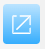
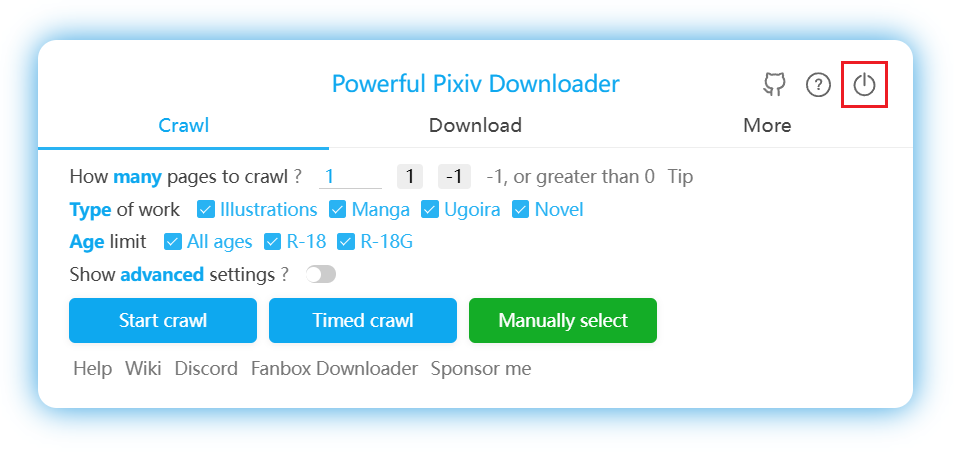
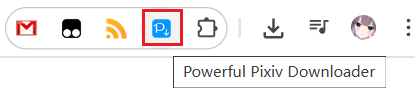
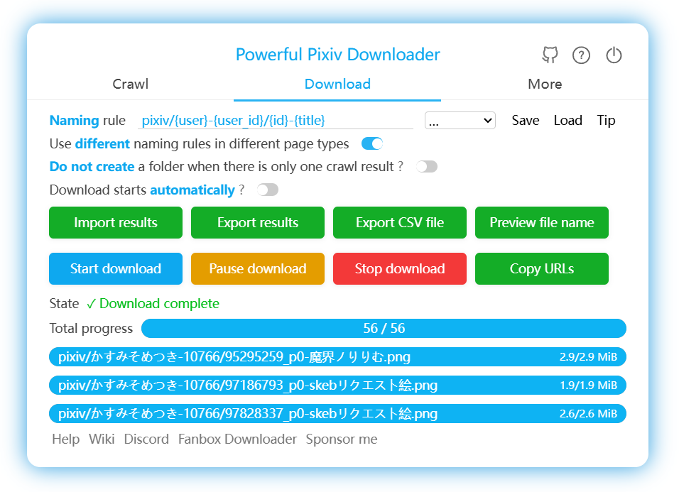
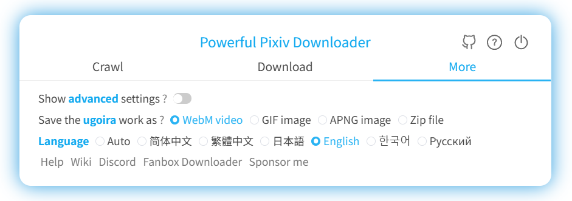
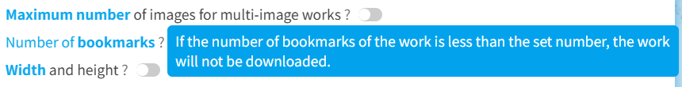
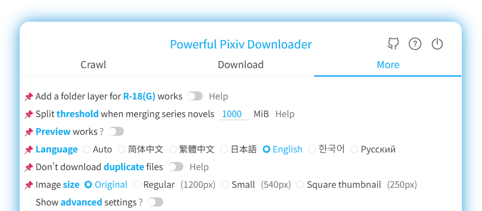

# Understanding the Settings Panel

After installing this extension, open a Pixiv web page, and you will see a blue button on the right:

Click the button to open the settings panel and start crawling and downloading.

## Opening and Closing the Settings Panel

There are multiple ways to open and close the settings panel.

1. Click the button on the right side of the web page to open the settings panel:

Click the close button in the top-right corner to close the settings panel:

Alternatively, when the settings panel is displayed, you can click a blank area on the page to close it.

2. Click the extension's icon to toggle the settings panel's open/closed state:

!> If the current tab is not a pixiv.net web page, clicking the extension icon will have no effect, as this extension only works on pixiv.net.

3. The shortcut key `Alt` + `x` can toggle the settings panel's open/closed state.

## Tabs

The settings panel has three tabs:

### Crawl

You can set the crawling range and filtering conditions, then start crawling.

To view the descriptions of settings and buttons in this tab, click the links below:
- [Settings - Crawl](/en/Settings-Crawl)
- [Buttons - Crawl](/en/Buttons-Crawl)

### Download

You can set file names here. When downloads are ready, you can also view the download status.

To view the descriptions of settings and buttons in this tab, click the links below:
- [Settings - Download](/en/Settings-Download)
- [Buttons - Download](/en/Buttons-Download)

### More

This tab contains many settings, categorized into: crawling, naming, downloading, enhancements, and others.

Since the downloader has numerous settings, only essential ones are placed in the first two commonly used tabs, with the remaining settings included here.

Additionally, when you are on certain pages, this tab may display some functional buttons.

To view the descriptions of settings and buttons in this tab, click the links below:
- [Settings - More](/en/Settings-More)
- [Buttons - More](/en/Buttons-More)

## Get Help

Some settings have a question mark after their names. Hovering the mouse over the name will display a simple tooltip, for example:

If you want to view more detailed instructions, you can click on the name of the setting item, or long press on the solid color button, and the downloader will open the corresponding Wiki page.

## Pin Settings

The downloader has nearly 100 settings, so it often takes some time to find a specific one. To improve efficiency, I added a feature that lets you pin settings to the top.

You can pin the settings you use most often, and they will always stay at the top (they will still be shown even if you have not enabled "Show Advanced Settings"). This not only helps you quickly find the settings you need, but also lets you keep advanced settings hidden most of the time, making the interface cleaner.

There are 2 ways to pin a setting:
1. Move the mouse pointer over a setting, then click the pin icon on the left.
2. Press and hold the setting name for 0.5 seconds.

Repeat the same action to unpin it.

The effect of pinned settings is shown below:

## How Settings Work

**Load Settings When Opening a Tab:**

Every time you open a Pixiv.net tab, the downloader reads the last saved settings and uses them.

**Settings in Each Tab Are Independent:**

If you make changes in Tab A, it will not affect the settings in Tab B. Similarly, changes made in Tab B will not affect Tab A.

This is sometimes useful, for example:
- Sometimes users may want to use different crawl conditions or download options in different tabs, so settings in each tab do not affect each other.
- Some tabs may have already started crawling or downloading, and they should not be affected by changes made in other tabs.

**Only One Set of Settings Is Saved:**

The downloader only saves one persistent set of settings data.

Although you can open multiple tabs and modify them to different settings, the downloader will not save a separate set of settings for each tab. It only stores one set of settings.

PS: Persistent settings are saved in the browser extension's dedicated local storage area (`browser.storage.local`). When you remove this extension, the browser will delete the data it saved.

**Save Settings from the Last Modified Tab:**

Every time you modify settings in a tab, the downloader saves the settings from that tab as the latest settings data.

If you have multiple tabs open and modify settings in each, the downloader will save the settings from whichever tab was modified last.

Note: The downloader saves settings on a per-tab basis. As mentioned earlier, "settings in each tab are independent", so when saving, it only saves the settings from the current tab and does not consider settings from other tabs.

**Old Settings Will Be Overwritten:**

Every time the downloader saves persistent settings, it overwrites the previous settings. This can sometimes confuse users. For example:

Now there are two open tabs A and B, both using the same initial settings. Then you modify Option A in Tab A, and later modify Option B in Tab B. The downloader will first save the settings from Tab A, then save the settings from Tab B.

In the latest settings, the modification to Option A is not saved — only the modification to Option B is saved. This is because the latest settings are those from Tab B; the changes made in Tab A have been overwritten.

**When New Settings Take Effect:**

After you modify settings in one tab, other tabs will not be affected. The new settings will only take effect when you open a new tab or refresh an existing tab:
- When opening a new tab, the downloader will use the latest settings.
- When refreshing an already open tab, it will also use the latest settings.

**Export Settings:**

The downloader provides export and import settings functions in the "More" → "Others" category: [Manage Settings](/en/Settings-More-Other?id=manage-settings).

You can export settings as a backup, or export separate configuration files for different usage scenarios and import them when needed.

The exported settings will be saved to a JSON file. You can modify its filename.

Note: When you export settings, it exports the settings from the current tab, not the single persistent set stored by the downloader. This means that regardless of whether the latest settings have changed, the settings you export are exactly what you see in the current tab.

**Import Settings:**

You can import a settings file exported by the downloader. After importing:
- The settings in the current tab will become the imported settings; other tabs remain unchanged.
- The downloader will immediately save the imported settings as the latest persistent settings data. Tabs opened or refreshed afterward will use this new settings data.
