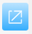

# Understanding the Settings Panel

After installing this extension, open a Pixiv web page, and you will see a blue button on the right:

Click the button to open the settings panel and start crawling and downloading.

## Tabs

The settings panel has three tabs:

### Crawl

You can set the crawling range and filtering conditions, then start crawling.

To view the descriptions of settings and buttons in this tab, click the links below:
- [Settings - Crawl](/en/Settings-Crawl)
- [Buttons - Crawl](/en/Buttons-Crawl)

### Download

You can set file names here. When downloads are ready, you can also view the download status.

To view the descriptions of settings and buttons in this tab, click the links below:
- [Settings - Download](/en/Settings-Download)
- [Buttons - Download](/en/Buttons-Download)

### More

This tab contains many settings, categorized into: crawling, naming, downloading, enhancements, and others.

Since the downloader has numerous settings, only essential ones are placed in the first two commonly used tabs, with the remaining settings included here.

Additionally, when you are on certain pages, this tab may display some functional buttons.

To view the descriptions of settings and buttons in this tab, click the links below:
- [Settings - More](/en/Settings-More)
- [Buttons - More](/en/Buttons-More)

## Opening and Closing the Settings Panel

There are multiple ways to open and close the settings panel.

1. Click the button on the right side of the web page to open the settings panel:

Click the close button in the top-right corner to close the settings panel:

Alternatively, when the settings panel is displayed, you can click a blank area on the page to close it.

2. Click the extension's icon to toggle the settings panel's open/closed state:

!> If the current tab is not a pixiv.net web page, clicking the extension icon will have no effect, as this extension only works on pixiv.net.

3. The shortcut key `Alt` + `x` can toggle the settings panel's open/closed state.