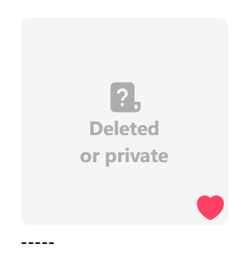
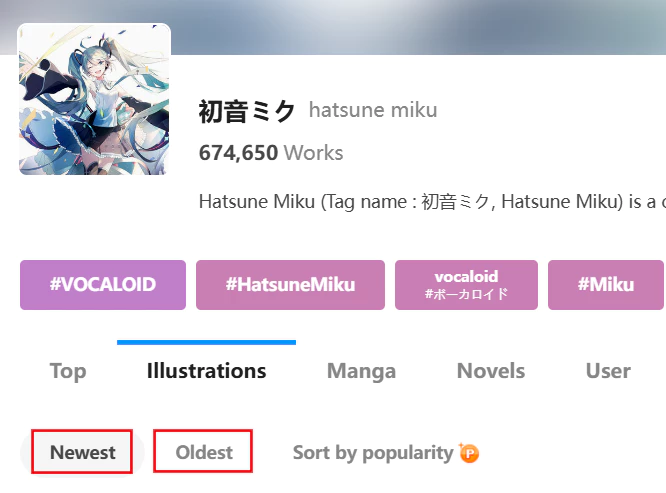
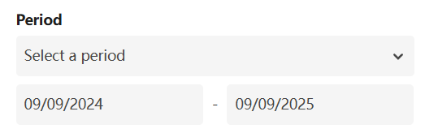
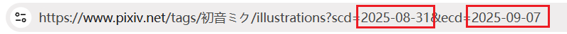
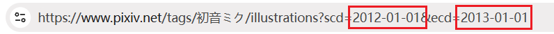

# Usage Tips

## Naming Tags

Using naming tags effectively can help you organize and sort files. Below are some simple guidelines:

- Use a forward slash `/` to create folders, e.g., `pixiv/{user}/{id}`.
- `{page_title}` represents the work's title and can be used on all pages.
- On user profile pages, it's recommended to use `{user}` as the folder name.
- On tag list and search pages, use `{page_tag}` as the folder name.
- On ranking pages, place the `{rank}` tag at the start of the file name to include the ranking in the downloaded files.
- Place the `{bmk}` tag at the start of the file name to sort downloaded files by bookmark count.
- When downloading your bookmarks, use `{bmk_id}` at the start of the file name to sort files in the order you bookmarked them.

See detailed explanation: [Naming rule](/en/Settings-Download?id=naming-rule).

## Timed Crawl

The downloader has a "Timed Crawl" function, allowing you to crawl and download new works at regular intervals on certain pages.

See detailed explanation: [Timed crawl](/en/Buttons-Crawl?id=timed-crawl).

## Incremental Updates

If you previously downloaded works from a user or page and want to download new works added later, follow the guidelines below.

First, I recommend enabling the [Don't download duplicate files](/en/Settings-More-Download?id=don39t-download-duplicate-files) function in the "More" tab to avoid unnecessary duplicate downloads.

Below are methods to help crawl new works, which you can use as needed.

### Set ID Range

On some pages, works are sorted from newest to oldest, with recently posted works at the front and older ones at the back.

Work IDs correlate with posting time: newer works have larger IDs. You can set the [ID range](/en/Settings-Crawl?id=id-range) in the downloader's "Crawl" tab.

For example, if you previously downloaded works from a user's profile and the largest ID in the file names was 65000000, you can set the ID range to greater than 65000000 to crawl works posted afterward.

### Set Posting Time

In addition to setting an ID range, you can set the [Posting time](/en/Settings-Crawl?id=posting-time) to crawl newly posted works.

Both settings work similarly but use different filtering criteria.

### Set Number of Pages to Crawl

You can use this method on many paginated pages. Below is one scenario.

If you want to crawl newly bookmarked works on the bookmark page, the previous two settings are unsuitable because works are sorted by bookmarking time, not work ID or posting time, with recently bookmarked works at the front and older ones at the back.

You can manually set the number of pages to crawl. For example:

Flip through pages starting from page 1 to check which page you last downloaded. If you last downloaded up to page 5, the works from pages 1 to 5 are the newly bookmarked works.

Return to page 1, set the [How many pages to crawl](/en/Settings-Crawl?id=how-many-pages-to-crawl) to 5, and start crawling. This downloads only the newly bookmarked works.

?> If you frequently need incremental updates on the bookmark page, consider adding the `{bmk_id}` tag at the start of file names to align the file order with the page's display order. This helps you see where you last downloaded. See detailed explanation: [Tags Reflecting Time Order](/en/Settings-Download?id=tags-reflecting-time-order).

### Manually Select Works

If there are few new works, you can use the [Manually select](/en/Buttons-Crawl?id=manually-select) function to download them.

For example, if a user's profile has only the latest 10 works that you haven't downloaded, manually select those 10 works and download them.

### Incremental Updates on Ranking Pages

To download daily rankings, do the following:

1. Download all works from today's ranking.
2. On subsequent days, use the [Crawl the debut works](/en/Buttons-Crawl?id=crawl-the-debut-works) button to crawl only the works newly added that day.

## Batch Bookmarking Works

If you need to batch bookmark multiple works, you can do the following:

1. Enable the downloader's [Bookmark works after downloading](/en/Settings-Download?id=bookmark-works-after-downloading) function.
2. Optional: If you do not need to download the original images of these works, you can set the [Image size](/en/Settings-More-Download?id=image-size) during download to `Small` to speed up the download process.
3. Crawl and download these works. The downloader will bookmark them.

On certain pages (e.g., the new works page of followed users), if you want to bookmark newly appeared works at regular intervals, you can use the [Timed crawl](/en/Buttons-Crawl?id=timed-crawl) function in combination with the method above.

## Getting IDs of Expired Bookmarked Works

Your bookmarks may contain some works that have already expired, and you cannot view or download them. For example:

If you want to get their IDs, please refer to the description of this feature: [Unbookmark all deleted works](/en/Buttons-More?id=unbookmark-all-deleted-works).

## Batch Crawling and Downloading

If you need to crawl many pages, consider batch crawling, i.e., crawling only a portion of pages at a time.

This is because crawling many works takes a long time, and accidentally closing the page during crawling loses progress.

Another reason is that too many crawl results (e.g., hundreds of thousands) increase the downloader's memory usage.

See detailed explanation: [Tip: Split Tasks](/en/Settings-Crawl?id=tip-split-tasks).

## Filter/Modify Crawl Results

Sometimes, after crawling, you may want to change filter conditions, but since crawling is complete, changes won't affect the results.

In this case, do the following:

1. Set the filter conditions.
2. Export crawl results.
3. Import crawl results.

When importing crawl results, the downloader applies filter conditions, removing results that don't meet the criteria.

See detailed explanation: [Import results](/en/Buttons-Download?id=import-results).

## What to Do If Tag Search Can Only Crawl 1000 Pages?

When crawling on a search page, you may not be able to crawl all works because the downloader can only crawl 1000 pages or 5000 pages.

**Reason for the issue:**
- On search pages, regular Pixiv users can view up to 1000 pages of works. Premium members can view up to 5000 pages.
- The downloader can only crawl as many pages as you can view.
- This is a Pixiv limitation, and the downloader cannot bypass it.

If a tag has 3000 pages of works but you can only view 1000 pages, you will not be able to crawl all of them.

**How to solve this?**

Here are some feasible methods:

**Purchase a Pixiv Premium Membership**

Pixiv Premium members can view 5000 pages, so they are less likely to encounter this issue. Regular users, limited to 1000 pages, are more likely to face this problem.

?> On other pages, Pixiv Premium members also have access to more content. For example, on the [Latest Works from Followed Users](https://www.pixiv.net/bookmark_new_illust.php) page, regular users can view up to 34 pages, but Premium members can view up to 100 pages.

**Change Sorting to Crawl Double the Works**

Search pages have two sorting options:

The default sorting is from newest to oldest. You can crawl and download 1000 or 5000 pages of works, then return to the first page, click "Sort by oldest," and view or download earlier works.

Using this method, you can download up to 2000 or 10000 pages of works. If this still does not cover all works, consider other methods.

**Filter All Works by Posting Date**

On the search page, click "Search conditions" and set the "Posting period." For example, you can view works posted in a specific year:

Download the works from that year, then set the posting period to the previous year and download those works.

By repeating this process, you can theoretically crawl all works, but it is quite cumbersome.

**Tip:**
- The maximum time range here is 1 year. If the works in a year exceed 1000 pages, you can shorten the time range, e.g., to 6 months, to reduce the number of pages.
- Since Pixiv's built-in date picker is inefficient, you can modify the URL's date to improve efficiency (especially for very old works).

Set a random time range first, and the URL in the address bar will include the date:

Modify the date to your desired time range, for example:

Then press Enter. Pixiv will display the works from that year.

?> Although you can set a time range longer than 1 year in the URL, it is invalid, and Pixiv will still only show works from within 1 year.
