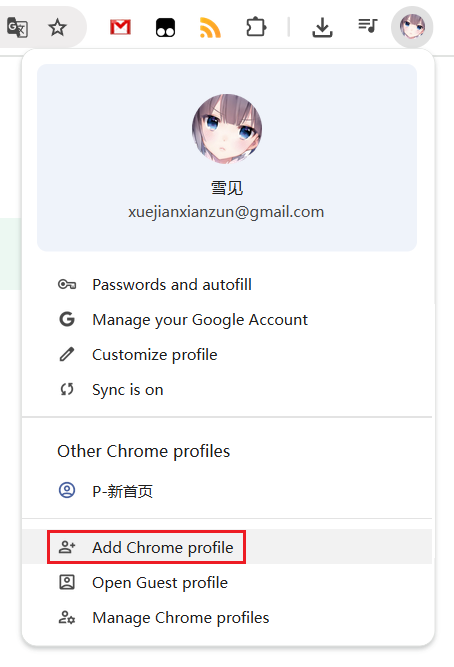
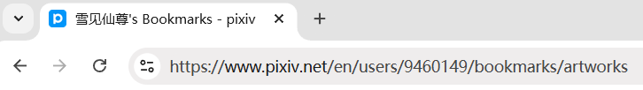

# Using Secondary Account for Downloading

If you frequently crawl and download a large number of works (e.g., thousands per day on average), your Pixiv account may risk being banned. If you have such needs, it's recommended to use a secondary account for crawling.

?> A secondary account can also crawl your primary account's public bookmarks and followed users by accessing the corresponding URLs. Thus, you can use your primary account for following users and bookmarking works as usual, and use the secondary account for downloading when needed.

## Registering a Secondary Account

You can register multiple accounts using different email addresses.

## Using a Secondary Account in a Separate Environment

You can use multiple browsers, such as Chrome for the primary account and Edge for the secondary account.

However, I recommend using a single browser for convenience.

Click the profile icon in the top-right corner of the browser to create a new profile (local browser user). For example, in Chrome, you can add a new profile from here:

When using the newly added browser profile, Chrome opens a separate browser window where you can log in to the secondary account and install this extension for use.

## Best Practices

When you need to crawl and download thousands of works, here are some helpful tips:

**Slow Down:**

The downloader has settings to reduce the likelihood of warnings:
- By default, the downloader [Slow down crawl](/en/Settings-More-Crawl?id=slow-down-crawl). When crawling many works, it sends requests at intervals. This feature is enabled by default.
- When downloading many files, you can set the [Download interval](/en/Settings-More-Download?id=download-interval) to reduce download frequency. This feature is not enabled by default; you need to set an interval (e.g., 1 second).

**Batch Downloading:**

If you want to download all your bookmarks, which may span hundreds of pages or more, you can split the task into multiple sessions, crawling 50 or 100 pages at a time.

See details: [Tip: Split Tasks](/en/Settings-Crawl?id=tip-split-tasks).

**Using a Secondary Account:**

If you frequently download large numbers of files, the above settings may not fully ensure safety. Use a secondary account for large-scale downloads, keeping the primary account for casual browsing and minimal downloads, while combining the above methods with the secondary account.

## How to Download Primary Account Data

To download your primary account's followed users or bookmarks, first use the primary account to navigate to the corresponding page, then copy the URL from the address bar, e.g.:

In the secondary account's browser, paste the URL and press Enter to access the primary account's page for crawling and downloading.

However, this method only works for the primary account's **public** followed users and bookmarks. Ensure these are set to public if you plan to use a secondary account to download them.

## What to Do If the Secondary Account Is Banned During Downloading

If your secondary account is banned during downloading and some files remain undownloaded, follow these steps:

First, do not click the "Stop Download" button. This allows you to resume download progress using the downloader's resume function. Follow these steps in order:

- Copy the current page's URL from the browser's address bar.
- Log in to another Pixiv account in the **same** browser window.
- Refresh the page being downloaded or paste the URL in the address bar to open it.
- The downloader should restore the task progress, allowing you to continue downloading.

This works because the downloader has a [Resume Download Function](/en/FAQ?id=does-it-support-resumable-downloads), which can recover incomplete download tasks on the same URL.

----------

If you already clicked the "Stop Download" button, click the "Export Crawl Results" button to export the crawl results (JSON file) for this task.

After logging in to a new Pixiv account, you can import the crawl results to resume downloading those files.

See details: [Export results](/en/Buttons-Download?id=export-results)