# 在 Microsoft Edge Canary 浏览器上安装

?>你可以在 Bilibili 查看视频：[Microsoft Edge Canary 浏览器安装扩展程序-Android](https://www.bilibili.com/video/BV1yweDzXEXJ)

## 安装步骤

从 Google Play 安装 Microsoft Edge Canary 浏览器：

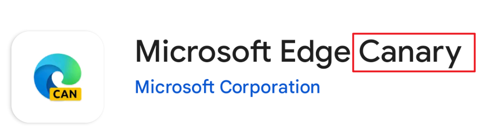

?>现在 Microsoft Edge 的正式版不能安装扩展程序，所以需要安装 Canary 版本。

安装之后打开它的菜单，进入 **设置** 里的 **关于 Microsoft Edge**，再连续点击版本号数次，以启用开发者选项：

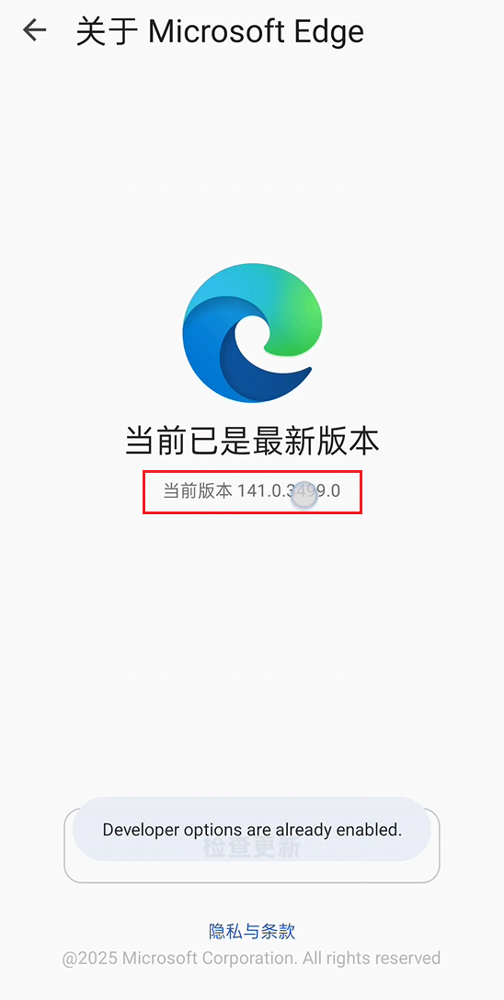

之后返回菜单，点击最底部的 **开发人员选项**：

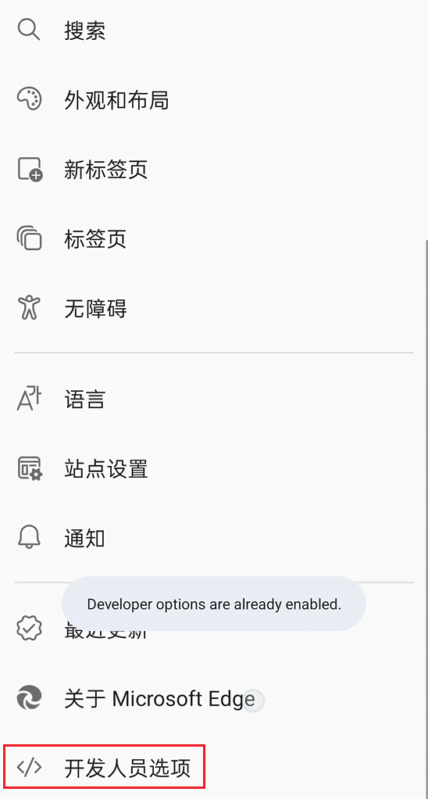

这里面有很多功能，点击 **Extension install by crx**：

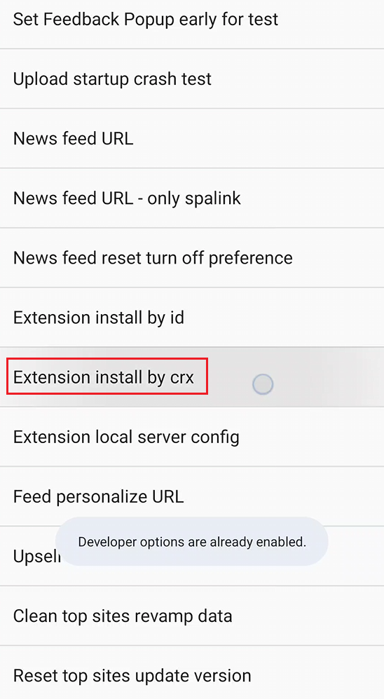

点击 **Choose .crx file**：

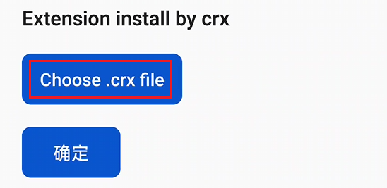

从文件管理器里选择下载器的 crx 文件，并点击 **确定**：

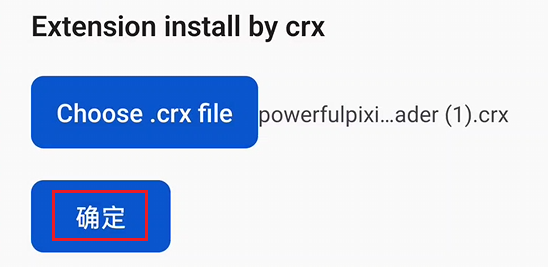

!>必须使用 crx 文件，而非 zip 文件。

----------

**如何获得 crx 文件：**

你可以从 [releases 页面](https://github.com/xuejianxianzun/PixivBatchDownloader/releases) 下载 crx 文件，并发送到 Android 设备上：

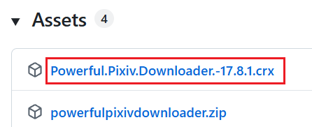

如果这里没有 crx 文件，你可以自行打包。下载 zip 文件并解压到文件夹，然后在 PC 上的浏览器的扩展管理页面里选择这个文件夹，打包为 crx 文件。例如：

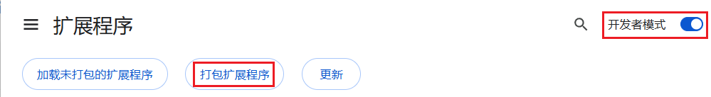

----------

然后同意添加此扩展：

之后从 Edge Canary 浏览器的菜单里点击 **扩展**，应该可以看到这个扩展：

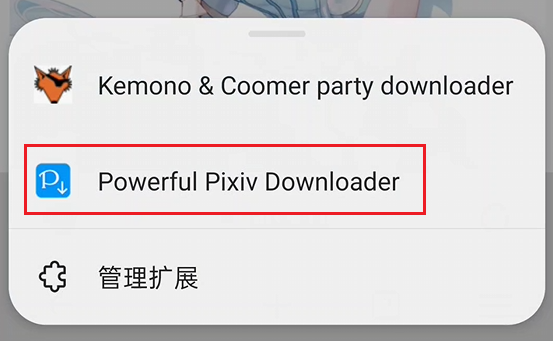

打开或刷新 pixiv.net 的页面，可以在右侧看到下载器的按钮：

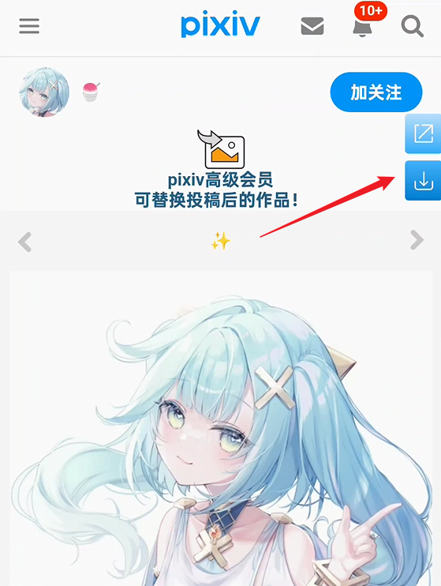

这样就可以使用下载器了，它的大部分功能和在 PC 上一样，可以在多种页面里进行批量下载。

## 注意事项

- 下载的文件保存在手机存储里的 **Download** （下载）文件夹里。Edge Canary 浏览器似乎不支持修改下载目录，所以只能保存到这里。
- 下载器在 PC 上可以让浏览器建立子文件夹保存文件，但在 Android 上不行，Edge Canary 浏览器不会建立子文件夹（这可能是系统的限制），所以文件会直接保存在下载文件夹里。
- 由于浏览器不会建立文件夹，所以下载器的命名规则只有最后一段会生效。例如默认的命名规则是 `pixiv/{user}-{user_id}/{id}-{title}`，实际上只有 `{id}-{title}` 会生效。如果你修改命名规则的话，需要注意让最后一段里包含 `{id}`，这是 pixiv 上每个文件的唯一标记，可以避免不同 ID 的作品产生相同的文件名。
- 在 PC 上，下载器重复保存同一个文件时会覆盖旧文件，但 Edge Canary 会保存同名文件并添加序号，例如：

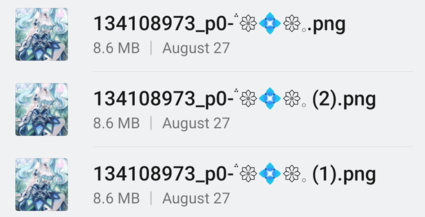

- 在移动端网页里，下载器的一些增强功能不可用或者会受到影响，例如预览作品。
- 如果你的设备是横屏的（例如平板设备），可以尝试在浏览器的菜单里启用桌面模式，也许可以改善下载器的使用体验：

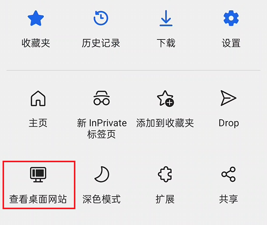

手机上的横屏效果：

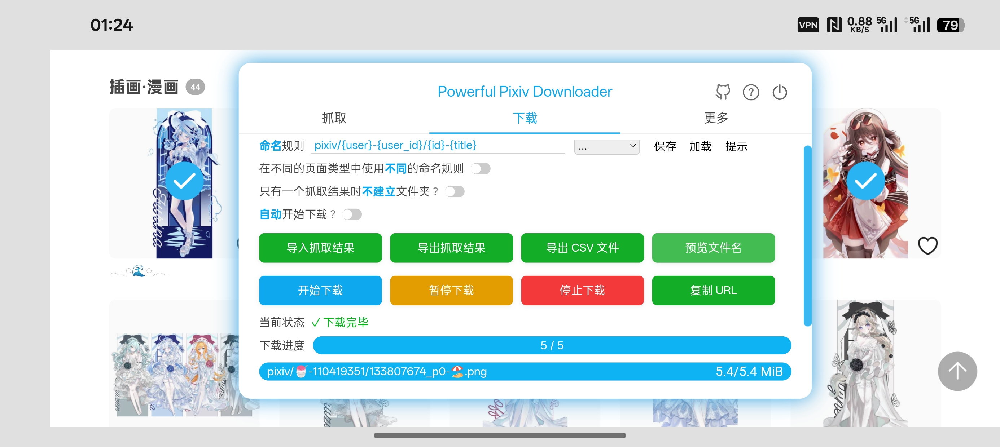

## 转换动图时让浏览器保持可见

由于 Android 系统的特性，当浏览器被切换到后台，或者设备熄屏时，它的功耗会被限制。

通常这对下载器没有太大影响，下载器依然可以正常抓取和下载文件。但是如果下载的文件里有动图，就可能会受到严重的影响。

下载器可以把 Pixiv 上的动图转换成其他格式（例如 WebM、Gif，APNG），但是转换时的 CPU 使用率会比较高。如果浏览器处于后台，或者设备熄屏，那么最差的情况是动图转换完全停止。这可能会导致下载进度卡住，无法继续下载。

在必要的时候，你应该让浏览器保持在前台，或者将其视图变为小窗模式（使其保持可见状态），以避免这个问题。