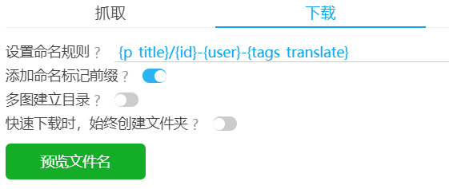
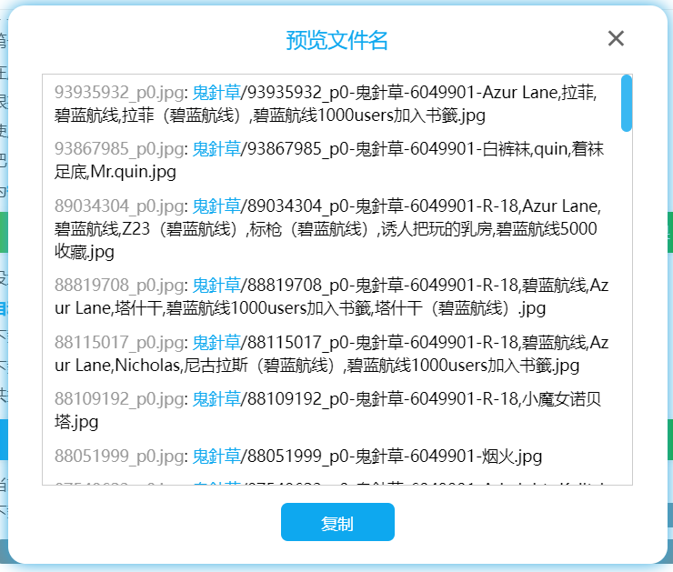
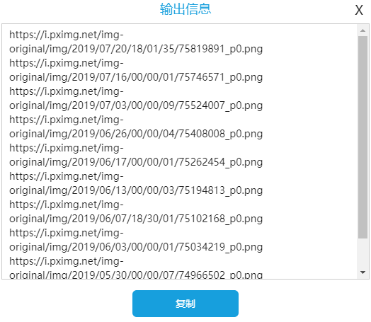

# 下载按钮

下载按钮指的是“下载”选项卡中的按钮，用来对抓取结果进行操作，以及下载文件。


## 预览文件名



预览生成的文件名。



对于要下载的每一个文件，都会以以下格式输出一条结果：

`（默认的文件名 ｛id｝的生成结果）` + `（: ）` + `（命名规则生成的文件名）`

蓝色文字表示这是一个文件夹路径。

你可以点击复制按钮，复制输出的内容。

这个功能对于预览文件名、编写重命名脚本都很有用。

------

举个例子，在 windows 上，你可以这样编写重命名的命令。首先复制预览的一条结果，如下：

```
79992391_p0.jpg: #VOCALOID 392020 - ginklaga的插画 - pixiv/79992391_p0-user_ginklaga.jpg
```

把格式修改为 `ren` + 空格 + 原文件名 + 空格 + 新的文件名（去掉文件夹的路径，文件名可以加上双引号）：

```
ren 79992391_p0.jpg "79992391_p0-user_ginklaga.jpg"
```

把 CMD 定位到要重命名的文件的目录，执行这个重命名命令。

你可以使用一些代码编辑器，批量编辑多行文本。

------

假如你第一次下载文件时，使用了命名规则 A，下载完了之后发现不对，想要改成命名规则 B。你可以使用命名规则 A 和 B 预览生成的结果，并且分别复制结果，保存起来。之后参考上面编写重命名规则的例子，把命名规则 A 的文件名（不含路径）作为原文件名，把命名规则 B 的文件名（不含路径）作为新文件名，编写重命名脚本。

如果你觉得不容易操作，可以使用命名规则 B 重新下载一次。

## 导出 CSV 文件


当你抓取了作品之后，可以将作品的一些数据导出到 csv 文件里。

效果如图：


这个 csv 文件保存了每个作品的一些信息。

一个多图作品在下载时可能产生多个文件，但是 csv 文件里只会保存一份信息。（第一张图的信息）

导出的 csv 文件不能用于恢复下载。如果你有需要，可以复制 `id` 列的数据，然后到首页使用“输入 id 进行抓取”，这样可以再次抓取这些文件。

注意：如果抓取结果很多（例如有数十万个），那么导出时页面可能会卡顿一会儿，期间无法进行操作。

## 导出抓取结果


这个按钮可以导出下载器内部保存的抓取结果，保存为 json 文件。

**导出的抓取结果可以用来恢复下载。**此外，这也便于保存作品数据，或者供其他程序使用。

注意：如果抓取结果很多（例如有数十万个），那么导出时页面可能会卡顿一会儿，期间无法进行操作。

## 导入抓取结果

下载器导出的抓取结果可以被导入，用来建立下载任务。

你的抓取结果可以分享给其他人进行下载；你也可以导出抓取结果留待以后随时下载；或者用一台设备抓取，之后在另一台设备上进行下载。

**注意**：
1. 抓取结果里不包含这些命名数据：`{p_title}`, `{p_tag}`, `{task_date}`。导入抓取结果之后，这些标记依然可以使用，但它们可能和你导出抓取结果时的数据不同，需要注意。
2. 抓取结果里不包含进度信息，所以导入之后下载器会重新开始下载，不能从中间开始下载。
3. 抓取结果里的数据是不会更新的。某些作品可能在导出抓取结果之后发生了更改。下载器不会自动获取最新的数据。
4. 导入抓取结果时，会根据过滤条件进行过滤。

导入抓取结果时，下载器可以应用大部分过滤条件，剔除不符合要求的作品（或文件）。但是以下这些设置不会被应用：
1. 设置页面数量/作品数量
2. 彩色图片/黑白图片
3. 文件体积限制

注意：如果导入的抓取结果很多（例如有数十万个），那么导入可能需要比较长的时间，请耐心等待。

## 开始下载

当抓取完作品时，你可以点击“开始下载”按钮，进行下载。

?>如果“自动开始下载”已启用，那么用户不需要手动点击此按钮。下载会自动开始。

## 暂停下载

暂停下载任务，下载进度不会清空。

之后点击“开始下载”按钮可以继续下载。

## 停止下载

停止下载任务，**这会清空下载进度**。

之后点击“开始下载”按钮将会重新开始下载。

?>停止下载也会清除保存这次任务的断点续传数据。

## 复制 url

这个按钮可以输出要下载的图片的 url。



每行显示一个图片的 url。你可以点击复制按钮，复制输出的内容。

?>有时候，你可能想用其他软件下载，如迅雷、IDM 之类。这时这个功能就很有用。
